<html>

<head>
  <meta content="text/html; charset=UTF-8" http-equiv="content-type" />
  <style type="text/css">
    @import url("https://themes.googleusercontent.com/fonts/css?kit=mXuMX4O_hntQbUUa6eMrYonRLyy4tx9AT73C-8qXHenO-mWfD6ie1jiqspyyPfsa");

    .lst-kix_list_33-5>li {
      counter-increment: lst-ctn-kix_list_33-5;
    }

    ol.lst-kix_list_7-0 {
      list-style-type: none;
    }

    .lst-kix_list_2-1>li {
      counter-increment: lst-ctn-kix_list_2-1;
    }

    .lst-kix_list_21-8>li {
      counter-increment: lst-ctn-kix_list_21-8;
    }

    ol.lst-kix_list_33-5.start {
      counter-reset: lst-ctn-kix_list_33-5 0;
    }

    ol.lst-kix_list_9-0.start {
      counter-reset: lst-ctn-kix_list_9-0 0;
    }

    ol.lst-kix_list_2-3.start {
      counter-reset: lst-ctn-kix_list_2-3 0;
    }

    ol.lst-kix_list_7-5 {
      list-style-type: none;
    }

    ol.lst-kix_list_7-6 {
      list-style-type: none;
    }

    ol.lst-kix_list_7-7 {
      list-style-type: none;
    }

    ol.lst-kix_list_7-8 {
      list-style-type: none;
    }

    ol.lst-kix_list_7-1 {
      list-style-type: none;
    }

    ol.lst-kix_list_7-2 {
      list-style-type: none;
    }

    ol.lst-kix_list_7-3 {
      list-style-type: none;
    }

    ol.lst-kix_list_7-4 {
      list-style-type: none;
    }

    .lst-kix_list_4-3>li {
      counter-increment: lst-ctn-kix_list_4-3;
    }

    .lst-kix_list_35-7>li {
      counter-increment: lst-ctn-kix_list_35-7;
    }

    .lst-kix_list_29-8>li {
      counter-increment: lst-ctn-kix_list_29-8;
    }

    .lst-kix_list_24-7>li {
      counter-increment: lst-ctn-kix_list_24-7;
    }

    .lst-kix_list_18-8>li {
      counter-increment: lst-ctn-kix_list_18-8;
    }

    ol.lst-kix_list_8-8.start {
      counter-reset: lst-ctn-kix_list_8-8 0;
    }

    ol.lst-kix_list_26-7.start {
      counter-reset: lst-ctn-kix_list_26-7 0;
    }

    .lst-kix_list_7-2>li {
      counter-increment: lst-ctn-kix_list_7-2;
    }

    ol.lst-kix_list_10-4.start {
      counter-reset: lst-ctn-kix_list_10-4 0;
    }

    .lst-kix_list_24-7>li:before {
      content: ""counter(lst-ctn-kix_list_24-7, lower-roman) ". ";
    }

    .lst-kix_list_1-4>li {
      counter-increment: lst-ctn-kix_list_1-4;
    }

    .lst-kix_list_24-8>li:before {
      content: ""counter(lst-ctn-kix_list_24-8, decimal) ". ";
    }

    ol.lst-kix_list_1-6.start {
      counter-reset: lst-ctn-kix_list_1-6 0;
    }

    ol.lst-kix_list_9-5.start {
      counter-reset: lst-ctn-kix_list_9-5 0;
    }

    .lst-kix_list_24-2>li:before {
      content: ""counter(lst-ctn-kix_list_24-2, decimal) ". ";
    }

    .lst-kix_list_24-3>li:before {
      content: ""counter(lst-ctn-kix_list_24-3, lower-latin) ". ";
    }

    .lst-kix_list_24-4>li:before {
      content: ""counter(lst-ctn-kix_list_24-4, lower-roman) ". ";
    }

    ol.lst-kix_list_34-2.start {
      counter-reset: lst-ctn-kix_list_34-2 0;
    }

    .lst-kix_list_9-4>li {
      counter-increment: lst-ctn-kix_list_9-4;
    }

    .lst-kix_list_24-5>li:before {
      content: ""counter(lst-ctn-kix_list_24-5, decimal) ". ";
    }

    .lst-kix_list_24-6>li:before {
      content: ""counter(lst-ctn-kix_list_24-6, lower-latin) ". ";
    }

    .lst-kix_list_23-6>li:before {
      content: "\0025cf  ";
    }

    ol.lst-kix_list_27-6 {
      list-style-type: none;
    }

    ol.lst-kix_list_27-5 {
      list-style-type: none;
    }

    ol.lst-kix_list_27-8 {
      list-style-type: none;
    }

    .lst-kix_list_23-3>li:before {
      content: "\0025cf  ";
    }

    .lst-kix_list_23-7>li:before {
      content: "\0025cb  ";
    }

    ol.lst-kix_list_27-7 {
      list-style-type: none;
    }

    ol.lst-kix_list_27-2 {
      list-style-type: none;
    }

    .lst-kix_list_23-2>li:before {
      content: "\0025a0  ";
    }

    ul.lst-kix_list_16-2 {
      list-style-type: none;
    }

    ol.lst-kix_list_27-1 {
      list-style-type: none;
    }

    ul.lst-kix_list_16-1 {
      list-style-type: none;
    }

    ol.lst-kix_list_27-4 {
      list-style-type: none;
    }

    ul.lst-kix_list_16-0 {
      list-style-type: none;
    }

    ol.lst-kix_list_27-3 {
      list-style-type: none;
    }

    .lst-kix_list_23-0>li:before {
      content: "\0025cf  ";
    }

    .lst-kix_list_23-8>li:before {
      content: "\0025a0  ";
    }

    ol.lst-kix_list_27-0 {
      list-style-type: none;
    }

    .lst-kix_list_23-1>li:before {
      content: "\0025cb  ";
    }

    .lst-kix_list_24-1>li:before {
      content: ""counter(lst-ctn-kix_list_24-1, lower-roman) ". ";
    }

    ul.lst-kix_list_16-8 {
      list-style-type: none;
    }

    ul.lst-kix_list_16-7 {
      list-style-type: none;
    }

    ul.lst-kix_list_16-6 {
      list-style-type: none;
    }

    .lst-kix_list_2-8>li {
      counter-increment: lst-ctn-kix_list_2-8;
    }

    ul.lst-kix_list_16-5 {
      list-style-type: none;
    }

    .lst-kix_list_24-0>li:before {
      content: ""counter(lst-ctn-kix_list_24-0, lower-latin) ". ";
    }

    ul.lst-kix_list_16-4 {
      list-style-type: none;
    }

    ul.lst-kix_list_16-3 {
      list-style-type: none;
    }

    ol.lst-kix_list_26-2.start {
      counter-reset: lst-ctn-kix_list_26-2 0;
    }

    .lst-kix_list_23-4>li:before {
      content: "\0025cb  ";
    }

    .lst-kix_list_23-5>li:before {
      content: "\0025a0  ";
    }

    ol.lst-kix_list_31-2.start {
      counter-reset: lst-ctn-kix_list_31-2 0;
    }

    .lst-kix_list_22-2>li:before {
      content: ""counter(lst-ctn-kix_list_22-2, lower-roman) ") ";
    }

    .lst-kix_list_22-6>li:before {
      content: ""counter(lst-ctn-kix_list_22-6, decimal) ". ";
    }

    .lst-kix_list_8-6>li {
      counter-increment: lst-ctn-kix_list_8-6;
    }

    .lst-kix_list_22-0>li:before {
      content: ""counter(lst-ctn-kix_list_22-0, decimal) ") ";
    }

    .lst-kix_list_22-8>li:before {
      content: ""counter(lst-ctn-kix_list_22-8, lower-roman) ". ";
    }

    ol.lst-kix_list_4-6.start {
      counter-reset: lst-ctn-kix_list_4-6 0;
    }

    ol.lst-kix_list_9-7 {
      list-style-type: none;
    }

    ol.lst-kix_list_9-8 {
      list-style-type: none;
    }

    ol.lst-kix_list_22-5.start {
      counter-reset: lst-ctn-kix_list_22-5 0;
    }

    ol.lst-kix_list_9-3 {
      list-style-type: none;
    }

    ol.lst-kix_list_9-4 {
      list-style-type: none;
    }

    ol.lst-kix_list_9-5 {
      list-style-type: none;
    }

    ol.lst-kix_list_34-7.start {
      counter-reset: lst-ctn-kix_list_34-7 0;
    }

    ol.lst-kix_list_9-6 {
      list-style-type: none;
    }

    ol.lst-kix_list_9-0 {
      list-style-type: none;
    }

    ol.lst-kix_list_9-1 {
      list-style-type: none;
    }

    ol.lst-kix_list_9-2 {
      list-style-type: none;
    }

    .lst-kix_list_22-4>li:before {
      content: "("counter(lst-ctn-kix_list_22-4, lower-latin) ") ";
    }

    ol.lst-kix_list_25-5.start {
      counter-reset: lst-ctn-kix_list_25-5 0;
    }

    ol.lst-kix_list_29-2.start {
      counter-reset: lst-ctn-kix_list_29-2 0;
    }

    .lst-kix_list_25-5>li:before {
      content: "("counter(lst-ctn-kix_list_25-5, lower-roman) ") ";
    }

    .lst-kix_list_25-7>li:before {
      content: ""counter(lst-ctn-kix_list_25-7, lower-latin) ". ";
    }

    ol.lst-kix_list_1-1.start {
      counter-reset: lst-ctn-kix_list_1-1 0;
    }

    ol.lst-kix_list_18-3.start {
      counter-reset: lst-ctn-kix_list_18-3 0;
    }

    ol.lst-kix_list_24-4.start {
      counter-reset: lst-ctn-kix_list_24-4 0;
    }

    ol.lst-kix_list_18-7 {
      list-style-type: none;
    }

    ol.lst-kix_list_18-8 {
      list-style-type: none;
    }

    ol.lst-kix_list_33-0.start {
      counter-reset: lst-ctn-kix_list_33-0 0;
    }

    ol.lst-kix_list_18-3 {
      list-style-type: none;
    }

    ol.lst-kix_list_18-4 {
      list-style-type: none;
    }

    ol.lst-kix_list_18-5 {
      list-style-type: none;
    }

    ol.lst-kix_list_18-6 {
      list-style-type: none;
    }

    ol.lst-kix_list_27-4.start {
      counter-reset: lst-ctn-kix_list_27-4 0;
    }

    ol.lst-kix_list_18-0 {
      list-style-type: none;
    }

    ol.lst-kix_list_18-1 {
      list-style-type: none;
    }

    .lst-kix_list_9-3>li {
      counter-increment: lst-ctn-kix_list_9-3;
    }

    ol.lst-kix_list_18-2 {
      list-style-type: none;
    }

    ol.lst-kix_list_15-2.start {
      counter-reset: lst-ctn-kix_list_15-2 0;
    }

    ol.lst-kix_list_2-8.start {
      counter-reset: lst-ctn-kix_list_2-8 0;
    }

    ol.lst-kix_list_7-6.start {
      counter-reset: lst-ctn-kix_list_7-6 0;
    }

    ol.lst-kix_list_29-8 {
      list-style-type: none;
    }

    ol.lst-kix_list_29-7 {
      list-style-type: none;
    }

    ol.lst-kix_list_15-3.start {
      counter-reset: lst-ctn-kix_list_15-3 0;
    }

    ol.lst-kix_list_29-4 {
      list-style-type: none;
    }

    ol.lst-kix_list_29-3 {
      list-style-type: none;
    }

    ol.lst-kix_list_29-6 {
      list-style-type: none;
    }

    ol.lst-kix_list_29-5 {
      list-style-type: none;
    }

    ol.lst-kix_list_29-0 {
      list-style-type: none;
    }

    ol.lst-kix_list_29-2 {
      list-style-type: none;
    }

    ol.lst-kix_list_29-1 {
      list-style-type: none;
    }

    .lst-kix_list_1-3>li {
      counter-increment: lst-ctn-kix_list_1-3;
    }

    .lst-kix_list_4-2>li {
      counter-increment: lst-ctn-kix_list_4-2;
    }

    .lst-kix_list_24-8>li {
      counter-increment: lst-ctn-kix_list_24-8;
    }

    ol.lst-kix_list_19-0.start {
      counter-reset: lst-ctn-kix_list_19-0 0;
    }

    ol.lst-kix_list_21-3.start {
      counter-reset: lst-ctn-kix_list_21-3 0;
    }

    ol.lst-kix_list_34-6 {
      list-style-type: none;
    }

    ol.lst-kix_list_34-5 {
      list-style-type: none;
    }

    ol.lst-kix_list_34-8 {
      list-style-type: none;
    }

    .lst-kix_list_7-1>li {
      counter-increment: lst-ctn-kix_list_7-1;
    }

    ol.lst-kix_list_34-7 {
      list-style-type: none;
    }

    ol.lst-kix_list_34-2 {
      list-style-type: none;
    }

    ol.lst-kix_list_34-1 {
      list-style-type: none;
    }

    ol.lst-kix_list_25-6.start {
      counter-reset: lst-ctn-kix_list_25-6 0;
    }

    ol.lst-kix_list_34-4 {
      list-style-type: none;
    }

    ol.lst-kix_list_34-3 {
      list-style-type: none;
    }

    ul.lst-kix_list_5-7 {
      list-style-type: none;
    }

    ul.lst-kix_list_5-8 {
      list-style-type: none;
    }

    ul.lst-kix_list_5-5 {
      list-style-type: none;
    }

    ol.lst-kix_list_34-0 {
      list-style-type: none;
    }

    ul.lst-kix_list_5-6 {
      list-style-type: none;
    }

    .lst-kix_list_21-8>li:before {
      content: ""counter(lst-ctn-kix_list_21-8, lower-roman) ". ";
    }

    .lst-kix_list_26-5>li:before {
      content: ""counter(lst-ctn-kix_list_26-5, lower-roman) ". ";
    }

    .lst-kix_list_8-0>li {
      counter-increment: lst-ctn-kix_list_8-0;
    }

    ul.lst-kix_list_5-0 {
      list-style-type: none;
    }

    .lst-kix_list_10-0>li {
      counter-increment: lst-ctn-kix_list_10-0;
    }

    ol.lst-kix_list_18-2.start {
      counter-reset: lst-ctn-kix_list_18-2 0;
    }

    ul.lst-kix_list_5-3 {
      list-style-type: none;
    }

    ul.lst-kix_list_5-4 {
      list-style-type: none;
    }

    .lst-kix_list_26-8>li:before {
      content: ""counter(lst-ctn-kix_list_26-8, lower-roman) ". ";
    }

    ul.lst-kix_list_5-1 {
      list-style-type: none;
    }

    ul.lst-kix_list_5-2 {
      list-style-type: none;
    }

    ul.lst-kix_list_36-0 {
      list-style-type: none;
    }

    .lst-kix_list_21-0>li:before {
      content: ""counter(lst-ctn-kix_list_21-0, decimal) ". ";
    }

    ul.lst-kix_list_36-1 {
      list-style-type: none;
    }

    ul.lst-kix_list_36-2 {
      list-style-type: none;
    }

    .lst-kix_list_26-1>li:before {
      content: ""counter(lst-ctn-kix_list_26-1, lower-latin) ". ";
    }

    ul.lst-kix_list_36-3 {
      list-style-type: none;
    }

    ul.lst-kix_list_36-4 {
      list-style-type: none;
    }

    .lst-kix_list_21-1>li:before {
      content: ""counter(lst-ctn-kix_list_21-1, lower-latin) ". ";
    }

    ol.lst-kix_list_15-8.start {
      counter-reset: lst-ctn-kix_list_15-8 0;
    }

    .lst-kix_list_34-3>li {
      counter-increment: lst-ctn-kix_list_34-3;
    }

    .lst-kix_list_26-4>li:before {
      content: ""counter(lst-ctn-kix_list_26-4, lower-latin) ". ";
    }

    .lst-kix_list_10-2>li {
      counter-increment: lst-ctn-kix_list_10-2;
    }

    .lst-kix_list_21-5>li:before {
      content: ""counter(lst-ctn-kix_list_21-5, lower-roman) ". ";
    }

    ul.lst-kix_list_36-5 {
      list-style-type: none;
    }

    ul.lst-kix_list_36-6 {
      list-style-type: none;
    }

    ul.lst-kix_list_36-7 {
      list-style-type: none;
    }

    ul.lst-kix_list_36-8 {
      list-style-type: none;
    }

    .lst-kix_list_21-4>li:before {
      content: ""counter(lst-ctn-kix_list_21-4, lower-latin) ". ";
    }

    .lst-kix_list_26-0>li:before {
      content: ""counter(lst-ctn-kix_list_26-0, decimal) ". ";
    }

    .lst-kix_list_31-4>li {
      counter-increment: lst-ctn-kix_list_31-4;
    }

    ul.lst-kix_list_23-0 {
      list-style-type: none;
    }

    ul.lst-kix_list_23-1 {
      list-style-type: none;
    }

    ol.lst-kix_list_7-2.start {
      counter-reset: lst-ctn-kix_list_7-2 0;
    }

    ul.lst-kix_list_23-2 {
      list-style-type: none;
    }

    ul.lst-kix_list_23-3 {
      list-style-type: none;
    }

    ul.lst-kix_list_23-4 {
      list-style-type: none;
    }

    .lst-kix_list_31-2>li {
      counter-increment: lst-ctn-kix_list_31-2;
    }

    ul.lst-kix_list_23-5 {
      list-style-type: none;
    }

    ul.lst-kix_list_23-6 {
      list-style-type: none;
    }

    ol.lst-kix_list_19-5.start {
      counter-reset: lst-ctn-kix_list_19-5 0;
    }

    .lst-kix_list_35-8>li {
      counter-increment: lst-ctn-kix_list_35-8;
    }

    ol.lst-kix_list_26-3.start {
      counter-reset: lst-ctn-kix_list_26-3 0;
    }

    ol.lst-kix_list_27-8.start {
      counter-reset: lst-ctn-kix_list_27-8 0;
    }

    .lst-kix_list_21-0>li {
      counter-increment: lst-ctn-kix_list_21-0;
    }

    .lst-kix_list_25-1>li:before {
      content: ""counter(lst-ctn-kix_list_25-1, lower-latin) ") ";
    }

    ul.lst-kix_list_23-7 {
      list-style-type: none;
    }

    .lst-kix_list_25-0>li:before {
      content: ""counter(lst-ctn-kix_list_25-0, decimal) ") ";
    }

    ul.lst-kix_list_23-8 {
      list-style-type: none;
    }

    ol.lst-kix_list_10-8.start {
      counter-reset: lst-ctn-kix_list_10-8 0;
    }

    ol.lst-kix_list_31-1.start {
      counter-reset: lst-ctn-kix_list_31-1 0;
    }

    ol.lst-kix_list_7-1.start {
      counter-reset: lst-ctn-kix_list_7-1 0;
    }

    ul.lst-kix_list_12-6 {
      list-style-type: none;
    }

    ul.lst-kix_list_12-5 {
      list-style-type: none;
    }

    ul.lst-kix_list_12-4 {
      list-style-type: none;
    }

    ul.lst-kix_list_12-3 {
      list-style-type: none;
    }

    ul.lst-kix_list_12-2 {
      list-style-type: none;
    }

    ul.lst-kix_list_12-1 {
      list-style-type: none;
    }

    ol.lst-kix_list_21-4.start {
      counter-reset: lst-ctn-kix_list_21-4 0;
    }

    ul.lst-kix_list_12-0 {
      list-style-type: none;
    }

    .lst-kix_list_27-7>li {
      counter-increment: lst-ctn-kix_list_27-7;
    }

    ul.lst-kix_list_12-8 {
      list-style-type: none;
    }

    ul.lst-kix_list_12-7 {
      list-style-type: none;
    }

    .lst-kix_list_34-1>li {
      counter-increment: lst-ctn-kix_list_34-1;
    }

    .lst-kix_list_2-2>li {
      counter-increment: lst-ctn-kix_list_2-2;
    }

    ol.lst-kix_list_4-7.start {
      counter-reset: lst-ctn-kix_list_4-7 0;
    }

    .lst-kix_list_26-2>li {
      counter-increment: lst-ctn-kix_list_26-2;
    }

    .lst-kix_list_22-5>li:before {
      content: "("counter(lst-ctn-kix_list_22-5, lower-roman) ") ";
    }

    .lst-kix_list_21-2>li {
      counter-increment: lst-ctn-kix_list_21-2;
    }

    .lst-kix_list_22-1>li:before {
      content: ""counter(lst-ctn-kix_list_22-1, lower-latin) ") ";
    }

    .lst-kix_list_27-4>li:before {
      content: "("counter(lst-ctn-kix_list_27-4, lower-latin) ") ";
    }

    ol.lst-kix_list_15-7.start {
      counter-reset: lst-ctn-kix_list_15-7 0;
    }

    ol.lst-kix_list_26-8.start {
      counter-reset: lst-ctn-kix_list_26-8 0;
    }

    .lst-kix_list_8-7>li {
      counter-increment: lst-ctn-kix_list_8-7;
    }

    .lst-kix_list_19-6>li {
      counter-increment: lst-ctn-kix_list_19-6;
    }

    .lst-kix_list_27-0>li:before {
      content: ""counter(lst-ctn-kix_list_27-0, decimal) ") ";
    }

    .lst-kix_list_9-5>li {
      counter-increment: lst-ctn-kix_list_9-5;
    }

    .lst-kix_list_27-0>li {
      counter-increment: lst-ctn-kix_list_27-0;
    }

    li.li-bullet-3:before {
      margin-left: -18pt;
      white-space: nowrap;
      display: inline-block;
      min-width: 18pt;
    }

    ol.lst-kix_list_19-4.start {
      counter-reset: lst-ctn-kix_list_19-4 0;
    }

    ol.lst-kix_list_33-6.start {
      counter-reset: lst-ctn-kix_list_33-6 0;
    }

    ol.lst-kix_list_2-2.start {
      counter-reset: lst-ctn-kix_list_2-2 0;
    }

    .lst-kix_list_25-4>li:before {
      content: "("counter(lst-ctn-kix_list_25-4, lower-latin) ") ";
    }

    .lst-kix_list_19-4>li {
      counter-increment: lst-ctn-kix_list_19-4;
    }

    .lst-kix_list_35-1>li {
      counter-increment: lst-ctn-kix_list_35-1;
    }

    .lst-kix_list_24-1>li {
      counter-increment: lst-ctn-kix_list_24-1;
    }

    .lst-kix_list_25-8>li:before {
      content: ""counter(lst-ctn-kix_list_25-8, lower-roman) ". ";
    }

    ol.lst-kix_list_25-1.start {
      counter-reset: lst-ctn-kix_list_25-1 0;
    }

    ol.lst-kix_list_26-6.start {
      counter-reset: lst-ctn-kix_list_26-6 0;
    }

    ol.lst-kix_list_21-8.start {
      counter-reset: lst-ctn-kix_list_21-8 0;
    }

    li.li-bullet-8:before {
      margin-left: -18pt;
      white-space: nowrap;
      display: inline-block;
      min-width: 18pt;
    }

    .lst-kix_list_34-8>li {
      counter-increment: lst-ctn-kix_list_34-8;
    }

    .lst-kix_list_15-2>li {
      counter-increment: lst-ctn-kix_list_15-2;
    }

    .lst-kix_list_22-5>li {
      counter-increment: lst-ctn-kix_list_22-5;
    }

    .lst-kix_list_27-5>li {
      counter-increment: lst-ctn-kix_list_27-5;
    }

    .lst-kix_list_20-5>li:before {
      content: "\0025a0  ";
    }

    .lst-kix_list_28-8>li:before {
      content: "\0025a0  ";
    }

    .lst-kix_list_20-1>li:before {
      content: "\0025cb  ";
    }

    .lst-kix_list_24-6>li {
      counter-increment: lst-ctn-kix_list_24-6;
    }

    ol.lst-kix_list_8-4.start {
      counter-reset: lst-ctn-kix_list_8-4 0;
    }

    .lst-kix_list_28-4>li:before {
      content: "\0025cb  ";
    }

    .lst-kix_list_21-7>li {
      counter-increment: lst-ctn-kix_list_21-7;
    }

    ol.lst-kix_list_25-0.start {
      counter-reset: lst-ctn-kix_list_25-0 0;
    }

    ol.lst-kix_list_25-8 {
      list-style-type: none;
    }

    ol.lst-kix_list_25-7 {
      list-style-type: none;
    }

    .lst-kix_list_35-6>li {
      counter-increment: lst-ctn-kix_list_35-6;
    }

    ul.lst-kix_list_14-4 {
      list-style-type: none;
    }

    ol.lst-kix_list_25-4 {
      list-style-type: none;
    }

    ul.lst-kix_list_14-3 {
      list-style-type: none;
    }

    ol.lst-kix_list_25-3 {
      list-style-type: none;
    }

    ul.lst-kix_list_14-2 {
      list-style-type: none;
    }

    ol.lst-kix_list_25-6 {
      list-style-type: none;
    }

    ul.lst-kix_list_14-1 {
      list-style-type: none;
    }

    ol.lst-kix_list_25-5 {
      list-style-type: none;
    }

    ul.lst-kix_list_14-0 {
      list-style-type: none;
    }

    ol.lst-kix_list_25-0 {
      list-style-type: none;
    }

    ol.lst-kix_list_25-2 {
      list-style-type: none;
    }

    .lst-kix_list_10-7>li {
      counter-increment: lst-ctn-kix_list_10-7;
    }

    ol.lst-kix_list_25-1 {
      list-style-type: none;
    }

    ul.lst-kix_list_14-8 {
      list-style-type: none;
    }

    ul.lst-kix_list_14-7 {
      list-style-type: none;
    }

    .lst-kix_list_25-4>li {
      counter-increment: lst-ctn-kix_list_25-4;
    }

    .lst-kix_list_18-1>li {
      counter-increment: lst-ctn-kix_list_18-1;
    }

    ol.lst-kix_list_8-3.start {
      counter-reset: lst-ctn-kix_list_8-3 0;
    }

    ul.lst-kix_list_14-6 {
      list-style-type: none;
    }

    .lst-kix_list_11-5>li {
      counter-increment: lst-ctn-kix_list_11-5;
    }

    ul.lst-kix_list_14-5 {
      list-style-type: none;
    }

    .lst-kix_list_28-0>li:before {
      content: "\0025cf  ";
    }

    .lst-kix_list_27-8>li:before {
      content: ""counter(lst-ctn-kix_list_27-8, lower-roman) ". ";
    }

    .lst-kix_list_29-1>li {
      counter-increment: lst-ctn-kix_list_29-1;
    }

    .lst-kix_list_4-1>li {
      counter-increment: lst-ctn-kix_list_4-1;
    }

    .lst-kix_list_19-1>li:before {
      content: ""counter(lst-ctn-kix_list_19-1, lower-latin) ". ";
    }

    .lst-kix_list_27-8>li {
      counter-increment: lst-ctn-kix_list_27-8;
    }

    .lst-kix_list_19-4>li:before {
      content: ""counter(lst-ctn-kix_list_19-4, lower-latin) ". ";
    }

    .lst-kix_list_31-5>li {
      counter-increment: lst-ctn-kix_list_31-5;
    }

    .lst-kix_list_19-3>li:before {
      content: ""counter(lst-ctn-kix_list_19-3, decimal) ". ";
    }

    .lst-kix_list_15-0>li {
      counter-increment: lst-ctn-kix_list_15-0;
    }

    ol.lst-kix_list_24-5.start {
      counter-reset: lst-ctn-kix_list_24-5 0;
    }

    ol.lst-kix_list_29-6.start {
      counter-reset: lst-ctn-kix_list_29-6 0;
    }

    .lst-kix_list_11-0>li {
      counter-increment: lst-ctn-kix_list_11-0;
    }

    ol.lst-kix_list_1-5.start {
      counter-reset: lst-ctn-kix_list_1-5 0;
    }

    ul.lst-kix_list_32-1 {
      list-style-type: none;
    }

    ul.lst-kix_list_32-2 {
      list-style-type: none;
    }

    ul.lst-kix_list_32-3 {
      list-style-type: none;
    }

    ul.lst-kix_list_32-4 {
      list-style-type: none;
    }

    ol.lst-kix_list_9-6.start {
      counter-reset: lst-ctn-kix_list_9-6 0;
    }

    ul.lst-kix_list_32-5 {
      list-style-type: none;
    }

    ul.lst-kix_list_32-6 {
      list-style-type: none;
    }

    ol.lst-kix_list_27-5.start {
      counter-reset: lst-ctn-kix_list_27-5 0;
    }

    ul.lst-kix_list_32-7 {
      list-style-type: none;
    }

    ul.lst-kix_list_32-8 {
      list-style-type: none;
    }

    ol.lst-kix_list_22-4.start {
      counter-reset: lst-ctn-kix_list_22-4 0;
    }

    .lst-kix_list_22-7>li {
      counter-increment: lst-ctn-kix_list_22-7;
    }

    ol.lst-kix_list_4-5.start {
      counter-reset: lst-ctn-kix_list_4-5 0;
    }

    ul.lst-kix_list_32-0 {
      list-style-type: none;
    }

    .lst-kix_list_26-7>li {
      counter-increment: lst-ctn-kix_list_26-7;
    }

    .lst-kix_list_33-7>li {
      counter-increment: lst-ctn-kix_list_33-7;
    }

    ol.lst-kix_list_11-2.start {
      counter-reset: lst-ctn-kix_list_11-2 0;
    }

    .lst-kix_list_19-6>li:before {
      content: ""counter(lst-ctn-kix_list_19-6, decimal) ". ";
    }

    ol.lst-kix_list_8-7.start {
      counter-reset: lst-ctn-kix_list_8-7 0;
    }

    ol.lst-kix_list_31-8 {
      list-style-type: none;
    }

    ol.lst-kix_list_31-5 {
      list-style-type: none;
    }

    ol.lst-kix_list_31-4 {
      list-style-type: none;
    }

    ol.lst-kix_list_31-7 {
      list-style-type: none;
    }

    ol.lst-kix_list_35-0.start {
      counter-reset: lst-ctn-kix_list_35-0 0;
    }

    ol.lst-kix_list_31-6 {
      list-style-type: none;
    }

    ol.lst-kix_list_31-1 {
      list-style-type: none;
    }

    ol.lst-kix_list_31-0 {
      list-style-type: none;
    }

    ol.lst-kix_list_31-3 {
      list-style-type: none;
    }

    ol.lst-kix_list_31-2 {
      list-style-type: none;
    }

    .lst-kix_list_22-0>li {
      counter-increment: lst-ctn-kix_list_22-0;
    }

    ol.lst-kix_list_24-0.start {
      counter-reset: lst-ctn-kix_list_24-0 0;
    }

    .lst-kix_list_18-3>li {
      counter-increment: lst-ctn-kix_list_18-3;
    }

    ol.lst-kix_list_33-4.start {
      counter-reset: lst-ctn-kix_list_33-4 0;
    }

    ol.lst-kix_list_35-7.start {
      counter-reset: lst-ctn-kix_list_35-7 0;
    }

    .lst-kix_list_21-6>li {
      counter-increment: lst-ctn-kix_list_21-6;
    }

    .lst-kix_list_10-3>li {
      counter-increment: lst-ctn-kix_list_10-3;
    }

    ol.lst-kix_list_1-0.start {
      counter-reset: lst-ctn-kix_list_1-0 0;
    }

    .lst-kix_list_18-0>li:before {
      content: ""counter(lst-ctn-kix_list_18-0, decimal) ") ";
    }

    .lst-kix_list_18-2>li:before {
      content: ""counter(lst-ctn-kix_list_18-2, lower-roman) ") ";
    }

    .lst-kix_list_26-0>li {
      counter-increment: lst-ctn-kix_list_26-0;
    }

    ol.lst-kix_list_4-0.start {
      counter-reset: lst-ctn-kix_list_4-0 0;
    }

    li.li-bullet-2:before {
      margin-left: -34.9pt;
      white-space: nowrap;
      display: inline-block;
      min-width: 34.9pt;
    }

    ol.lst-kix_list_27-0.start {
      counter-reset: lst-ctn-kix_list_27-0 0;
    }

    .lst-kix_list_27-4>li {
      counter-increment: lst-ctn-kix_list_27-4;
    }

    ol.lst-kix_list_11-7.start {
      counter-reset: lst-ctn-kix_list_11-7 0;
    }

    .lst-kix_list_27-1>li {
      counter-increment: lst-ctn-kix_list_27-1;
    }

    .lst-kix_list_25-2>li {
      counter-increment: lst-ctn-kix_list_25-2;
    }

    .lst-kix_list_27-1>li:before {
      content: ""counter(lst-ctn-kix_list_27-1, lower-latin) ") ";
    }

    .lst-kix_list_27-3>li:before {
      content: "("counter(lst-ctn-kix_list_27-3, decimal) ") ";
    }

    ol.lst-kix_list_9-4.start {
      counter-reset: lst-ctn-kix_list_9-4 0;
    }

    ul.lst-kix_list_3-7 {
      list-style-type: none;
    }

    ul.lst-kix_list_3-8 {
      list-style-type: none;
    }

    .lst-kix_list_21-3>li {
      counter-increment: lst-ctn-kix_list_21-3;
    }

    .lst-kix_list_18-8>li:before {
      content: ""counter(lst-ctn-kix_list_18-8, lower-roman) ". ";
    }

    ol.lst-kix_list_27-3.start {
      counter-reset: lst-ctn-kix_list_27-3 0;
    }

    ul.lst-kix_list_3-1 {
      list-style-type: none;
    }

    ul.lst-kix_list_3-2 {
      list-style-type: none;
    }

    ul.lst-kix_list_3-0 {
      list-style-type: none;
    }

    ol.lst-kix_list_4-3.start {
      counter-reset: lst-ctn-kix_list_4-3 0;
    }

    ul.lst-kix_list_3-5 {
      list-style-type: none;
    }

    ul.lst-kix_list_3-6 {
      list-style-type: none;
    }

    ul.lst-kix_list_3-3 {
      list-style-type: none;
    }

    ul.lst-kix_list_3-4 {
      list-style-type: none;
    }

    .lst-kix_list_7-8>li {
      counter-increment: lst-ctn-kix_list_7-8;
    }

    .lst-kix_list_10-7>li:before {
      content: ""counter(lst-ctn-kix_list_10-7, lower-latin) ". ";
    }

    .lst-kix_list_36-4>li:before {
      content: "\0025cb  ";
    }

    .lst-kix_list_10-5>li:before {
      content: ""counter(lst-ctn-kix_list_10-5, lower-roman) ". ";
    }

    ol.lst-kix_list_18-6.start {
      counter-reset: lst-ctn-kix_list_18-6 0;
    }

    .lst-kix_list_29-3>li {
      counter-increment: lst-ctn-kix_list_29-3;
    }

    .lst-kix_list_11-7>li {
      counter-increment: lst-ctn-kix_list_11-7;
    }

    .lst-kix_list_9-2>li:before {
      content: ""counter(lst-ctn-kix_list_9-2, lower-roman) ". ";
    }

    .lst-kix_list_36-2>li:before {
      content: "\0025a0  ";
    }

    .lst-kix_list_31-1>li {
      counter-increment: lst-ctn-kix_list_31-1;
    }

    .lst-kix_list_9-0>li:before {
      content: ""counter(lst-ctn-kix_list_9-0, decimal) ". ";
    }

    ol.lst-kix_list_33-7 {
      list-style-type: none;
    }

    ol.lst-kix_list_24-3.start {
      counter-reset: lst-ctn-kix_list_24-3 0;
    }

    ol.lst-kix_list_33-6 {
      list-style-type: none;
    }

    ol.lst-kix_list_33-8 {
      list-style-type: none;
    }

    ol.lst-kix_list_33-3 {
      list-style-type: none;
    }

    ol.lst-kix_list_33-2 {
      list-style-type: none;
    }

    ol.lst-kix_list_33-5 {
      list-style-type: none;
    }

    .lst-kix_list_11-3>li:before {
      content: ""counter(lst-ctn-kix_list_11-3, decimal) ". ";
    }

    ol.lst-kix_list_33-4 {
      list-style-type: none;
    }

    ol.lst-kix_list_18-4.start {
      counter-reset: lst-ctn-kix_list_18-4 0;
    }

    ol.lst-kix_list_33-1 {
      list-style-type: none;
    }

    ol.lst-kix_list_1-3.start {
      counter-reset: lst-ctn-kix_list_1-3 0;
    }

    ol.lst-kix_list_33-0 {
      list-style-type: none;
    }

    ol.lst-kix_list_29-1.start {
      counter-reset: lst-ctn-kix_list_29-1 0;
    }

    ol.lst-kix_list_1-2.start {
      counter-reset: lst-ctn-kix_list_1-2 0;
    }

    .lst-kix_list_29-1>li:before {
      content: ""counter(lst-ctn-kix_list_29-1, lower-latin) ") ";
    }

    .lst-kix_list_20-4>li:before {
      content: "\0025cb  ";
    }

    ol.lst-kix_list_22-7.start {
      counter-reset: lst-ctn-kix_list_22-7 0;
    }

    .lst-kix_list_29-3>li:before {
      content: "("counter(lst-ctn-kix_list_29-3, decimal) ") ";
    }

    .lst-kix_list_20-2>li:before {
      content: "\0025a0  ";
    }

    .lst-kix_list_9-8>li:before {
      content: ""counter(lst-ctn-kix_list_9-8, lower-roman) ". ";
    }

    ol.lst-kix_list_33-1.start {
      counter-reset: lst-ctn-kix_list_33-1 0;
    }

    .lst-kix_list_28-7>li:before {
      content: "\0025cb  ";
    }

    .lst-kix_list_4-8>li {
      counter-increment: lst-ctn-kix_list_4-8;
    }

    .lst-kix_list_1-7>li:before {
      content: ""counter(lst-ctn-kix_list_1-0, decimal) "."
        counter(lst-ctn-kix_list_1-1, decimal) "."
        counter(lst-ctn-kix_list_1-2, decimal) "."
        counter(lst-ctn-kix_list_1-3, decimal) "."
        counter(lst-ctn-kix_list_1-4, decimal) "."
        counter(lst-ctn-kix_list_1-5, decimal) "."
        counter(lst-ctn-kix_list_1-6, decimal) "."
        counter(lst-ctn-kix_list_1-7, decimal) ". ";
    }

    .lst-kix_list_1-5>li:before {
      content: ""counter(lst-ctn-kix_list_1-0, decimal) "."
        counter(lst-ctn-kix_list_1-1, decimal) "."
        counter(lst-ctn-kix_list_1-2, decimal) "."
        counter(lst-ctn-kix_list_1-3, decimal) "."
        counter(lst-ctn-kix_list_1-4, decimal) "."
        counter(lst-ctn-kix_list_1-5, decimal) ". ";
    }

    .lst-kix_list_28-5>li:before {
      content: "\0025a0  ";
    }

    ol.lst-kix_list_9-1.start {
      counter-reset: lst-ctn-kix_list_9-1 0;
    }

    ol.lst-kix_list_24-2.start {
      counter-reset: lst-ctn-kix_list_24-2 0;
    }

    ol.lst-kix_list_22-6.start {
      counter-reset: lst-ctn-kix_list_22-6 0;
    }

    .lst-kix_list_2-1>li:before {
      content: ""counter(lst-ctn-kix_list_2-1, lower-latin) ") ";
    }

    .lst-kix_list_19-8>li {
      counter-increment: lst-ctn-kix_list_19-8;
    }

    .lst-kix_list_2-3>li:before {
      content: "("counter(lst-ctn-kix_list_2-3, decimal) ") ";
    }

    .lst-kix_list_11-8>li {
      counter-increment: lst-ctn-kix_list_11-8;
    }

    .lst-kix_list_35-3>li:before {
      content: ""counter(lst-ctn-kix_list_35-3, decimal) ". ";
    }

    ol.lst-kix_list_24-8.start {
      counter-reset: lst-ctn-kix_list_24-8 0;
    }

    .lst-kix_list_30-4>li:before {
      content: "\0025cb  ";
    }

    .lst-kix_list_35-6>li:before {
      content: ""counter(lst-ctn-kix_list_35-6, decimal) ". ";
    }

    .lst-kix_list_9-1>li {
      counter-increment: lst-ctn-kix_list_9-1;
    }

    .lst-kix_list_3-2>li:before {
      content: "\0025a0  ";
    }

    .lst-kix_list_26-7>li:before {
      content: ""counter(lst-ctn-kix_list_26-7, lower-latin) ". ";
    }

    .lst-kix_list_8-1>li:before {
      content: ""counter(lst-ctn-kix_list_8-1, lower-latin) ". ";
    }

    ol.lst-kix_list_1-8.start {
      counter-reset: lst-ctn-kix_list_1-8 0;
    }

    .lst-kix_list_3-5>li:before {
      content: "\0025a0  ";
    }

    .lst-kix_list_18-0>li {
      counter-increment: lst-ctn-kix_list_18-0;
    }

    .lst-kix_list_30-7>li:before {
      content: "\0025cb  ";
    }

    ol.lst-kix_list_11-5.start {
      counter-reset: lst-ctn-kix_list_11-5 0;
    }

    .lst-kix_list_8-6>li:before {
      content: ""counter(lst-ctn-kix_list_8-6, decimal) ". ";
    }

    .lst-kix_list_26-2>li:before {
      content: ""counter(lst-ctn-kix_list_26-2, lower-roman) ". ";
    }

    .lst-kix_list_21-6>li:before {
      content: ""counter(lst-ctn-kix_list_21-6, decimal) ". ";
    }

    ol.lst-kix_list_22-1.start {
      counter-reset: lst-ctn-kix_list_22-1 0;
    }

    ol.lst-kix_list_35-3.start {
      counter-reset: lst-ctn-kix_list_35-3 0;
    }

    ol.lst-kix_list_4-2.start {
      counter-reset: lst-ctn-kix_list_4-2 0;
    }

    .lst-kix_list_33-4>li {
      counter-increment: lst-ctn-kix_list_33-4;
    }

    ol.lst-kix_list_27-2.start {
      counter-reset: lst-ctn-kix_list_27-2 0;
    }

    .lst-kix_list_21-3>li:before {
      content: ""counter(lst-ctn-kix_list_21-3, decimal) ". ";
    }

    ol.lst-kix_list_18-7.start {
      counter-reset: lst-ctn-kix_list_18-7 0;
    }

    .lst-kix_list_25-5>li {
      counter-increment: lst-ctn-kix_list_25-5;
    }

    ol.lst-kix_list_11-6.start {
      counter-reset: lst-ctn-kix_list_11-6 0;
    }

    .lst-kix_list_4-4>li {
      counter-increment: lst-ctn-kix_list_4-4;
    }

    ol.lst-kix_list_29-4.start {
      counter-reset: lst-ctn-kix_list_29-4 0;
    }

    .lst-kix_list_17-1>li:before {
      content: "\0025cb  ";
    }

    .lst-kix_list_31-8>li {
      counter-increment: lst-ctn-kix_list_31-8;
    }

    .lst-kix_list_25-3>li:before {
      content: "("counter(lst-ctn-kix_list_25-3, decimal) ") ";
    }

    ol.lst-kix_list_4-1.start {
      counter-reset: lst-ctn-kix_list_4-1 0;
    }

    li.li-bullet-10:before {
      margin-left: -40.7pt;
      white-space: nowrap;
      display: inline-block;
      min-width: 40.7pt;
    }

    .lst-kix_list_16-2>li:before {
      content: "\0025a0  ";
    }

    ol.lst-kix_list_27-1.start {
      counter-reset: lst-ctn-kix_list_27-1 0;
    }

    .lst-kix_list_26-6>li {
      counter-increment: lst-ctn-kix_list_26-6;
    }

    .lst-kix_list_16-5>li:before {
      content: "\0025a0  ";
    }

    .lst-kix_list_15-3>li {
      counter-increment: lst-ctn-kix_list_15-3;
    }

    ol.lst-kix_list_22-2.start {
      counter-reset: lst-ctn-kix_list_22-2 0;
    }

    ol.lst-kix_list_11-0.start {
      counter-reset: lst-ctn-kix_list_11-0 0;
    }

    ol.lst-kix_list_18-8.start {
      counter-reset: lst-ctn-kix_list_18-8 0;
    }

    ol.lst-kix_list_29-3.start {
      counter-reset: lst-ctn-kix_list_29-3 0;
    }

    ol.lst-kix_list_35-8.start {
      counter-reset: lst-ctn-kix_list_35-8 0;
    }

    .lst-kix_list_17-6>li:before {
      content: "\0025cf  ";
    }

    ol.lst-kix_list_35-5.start {
      counter-reset: lst-ctn-kix_list_35-5 0;
    }

    .lst-kix_list_2-6>li:before {
      content: ""counter(lst-ctn-kix_list_2-6, decimal) ". ";
    }

    .lst-kix_list_7-5>li:before {
      content: ""counter(lst-ctn-kix_list_7-5, lower-roman) ". ";
    }

    .lst-kix_list_27-6>li:before {
      content: ""counter(lst-ctn-kix_list_27-6, decimal) ". ";
    }

    .lst-kix_list_19-5>li {
      counter-increment: lst-ctn-kix_list_19-5;
    }

    .lst-kix_list_22-7>li:before {
      content: ""counter(lst-ctn-kix_list_22-7, lower-latin) ". ";
    }

    ol.lst-kix_list_35-2.start {
      counter-reset: lst-ctn-kix_list_35-2 0;
    }

    .lst-kix_list_34-7>li:before {
      content: ""counter(lst-ctn-kix_list_34-7, lower-latin) ". ";
    }

    .lst-kix_list_18-5>li:before {
      content: "("counter(lst-ctn-kix_list_18-5, lower-roman) ") ";
    }

    .lst-kix_list_13-6>li:before {
      content: "\0025cf  ";
    }

    .lst-kix_list_26-3>li {
      counter-increment: lst-ctn-kix_list_26-3;
    }

    .lst-kix_list_10-6>li {
      counter-increment: lst-ctn-kix_list_10-6;
    }

    .lst-kix_list_1-7>li {
      counter-increment: lst-ctn-kix_list_1-7;
    }

    ul.lst-kix_list_30-3 {
      list-style-type: none;
    }

    ul.lst-kix_list_30-4 {
      list-style-type: none;
    }

    ul.lst-kix_list_30-5 {
      list-style-type: none;
    }

    .lst-kix_list_7-5>li {
      counter-increment: lst-ctn-kix_list_7-5;
    }

    .lst-kix_list_15-6>li:before {
      content: ""counter(lst-ctn-kix_list_15-6, decimal) ". ";
    }

    ul.lst-kix_list_30-6 {
      list-style-type: none;
    }

    .lst-kix_list_29-0>li {
      counter-increment: lst-ctn-kix_list_29-0;
    }

    .lst-kix_list_11-4>li {
      counter-increment: lst-ctn-kix_list_11-4;
    }

    ol.lst-kix_list_24-7.start {
      counter-reset: lst-ctn-kix_list_24-7 0;
    }

    ul.lst-kix_list_30-7 {
      list-style-type: none;
    }

    ul.lst-kix_list_30-8 {
      list-style-type: none;
    }

    .lst-kix_list_22-4>li {
      counter-increment: lst-ctn-kix_list_22-4;
    }

    .lst-kix_list_31-3>li:before {
      content: "("counter(lst-ctn-kix_list_31-3, decimal) ") ";
    }

    .lst-kix_list_36-7>li:before {
      content: "\0025cb  ";
    }

    ul.lst-kix_list_30-0 {
      list-style-type: none;
    }

    .lst-kix_list_10-2>li:before {
      content: ""counter(lst-ctn-kix_list_10-2, lower-roman) ". ";
    }

    ul.lst-kix_list_30-1 {
      list-style-type: none;
    }

    ul.lst-kix_list_30-2 {
      list-style-type: none;
    }

    ol.lst-kix_list_1-7.start {
      counter-reset: lst-ctn-kix_list_1-7 0;
    }

    .lst-kix_list_20-7>li:before {
      content: "\0025cb  ";
    }

    .lst-kix_list_4-6>li:before {
      content: ""counter(lst-ctn-kix_list_4-6, decimal) ". ";
    }

    ol.lst-kix_list_29-8.start {
      counter-reset: lst-ctn-kix_list_29-8 0;
    }

    .lst-kix_list_25-6>li:before {
      content: ""counter(lst-ctn-kix_list_25-6, decimal) ". ";
    }

    ol.lst-kix_list_29-5.start {
      counter-reset: lst-ctn-kix_list_29-5 0;
    }

    .lst-kix_list_34-2>li {
      counter-increment: lst-ctn-kix_list_34-2;
    }

    .lst-kix_list_9-5>li:before {
      content: ""counter(lst-ctn-kix_list_9-5, lower-roman) ". ";
    }

    .lst-kix_list_29-6>li:before {
      content: ""counter(lst-ctn-kix_list_29-6, decimal) ". ";
    }

    li.li-bullet-5:before {
      margin-left: -18pt;
      white-space: nowrap;
      display: inline-block;
      min-width: 18pt;
    }

    ol.lst-kix_list_22-0.start {
      counter-reset: lst-ctn-kix_list_22-0 0;
    }

    .lst-kix_list_24-0>li {
      counter-increment: lst-ctn-kix_list_24-0;
    }

    .lst-kix_list_33-3>li:before {
      content: ""counter(lst-ctn-kix_list_33-3, lower-latin) ". ";
    }

    .lst-kix_list_12-2>li:before {
      content: "\0025a0  ";
    }

    .lst-kix_list_11-6>li:before {
      content: ""counter(lst-ctn-kix_list_11-6, decimal) ". ";
    }

    .lst-kix_list_32-7>li:before {
      content: "\0025cb  ";
    }

    .lst-kix_list_1-2>li:before {
      content: ""counter(lst-ctn-kix_list_1-0, decimal) "."
        counter(lst-ctn-kix_list_1-1, decimal) "."
        counter(lst-ctn-kix_list_1-2, decimal) ". ";
    }

    ol.lst-kix_list_11-3.start {
      counter-reset: lst-ctn-kix_list_11-3 0;
    }

    .lst-kix_list_1-0>li {
      counter-increment: lst-ctn-kix_list_1-0;
    }

    ol.lst-kix_list_35-4.start {
      counter-reset: lst-ctn-kix_list_35-4 0;
    }

    li.li-bullet-0:before {
      margin-left: -28.4pt;
      white-space: nowrap;
      display: inline-block;
      min-width: 28.4pt;
    }

    ol.lst-kix_list_29-7.start {
      counter-reset: lst-ctn-kix_list_29-7 0;
    }

    .lst-kix_list_35-0>li {
      counter-increment: lst-ctn-kix_list_35-0;
    }

    .lst-kix_list_18-7>li {
      counter-increment: lst-ctn-kix_list_18-7;
    }

    .lst-kix_list_29-7>li {
      counter-increment: lst-ctn-kix_list_29-7;
    }

    ol.lst-kix_list_11-4.start {
      counter-reset: lst-ctn-kix_list_11-4 0;
    }

    .lst-kix_list_28-2>li:before {
      content: "\0025a0  ";
    }

    .lst-kix_list_14-1>li:before {
      content: "\0025cb  ";
    }

    .lst-kix_list_14-3>li:before {
      content: "\0025cf  ";
    }

    ol.lst-kix_list_15-6 {
      list-style-type: none;
    }

    .lst-kix_list_25-8>li {
      counter-increment: lst-ctn-kix_list_25-8;
    }

    ol.lst-kix_list_15-7 {
      list-style-type: none;
    }

    ul.lst-kix_list_28-0 {
      list-style-type: none;
    }

    ol.lst-kix_list_15-8 {
      list-style-type: none;
    }

    ul.lst-kix_list_28-1 {
      list-style-type: none;
    }

    .lst-kix_list_14-0>li:before {
      content: "\0025cf  ";
    }

    .lst-kix_list_14-4>li:before {
      content: "\0025cb  ";
    }

    ol.lst-kix_list_15-2 {
      list-style-type: none;
    }

    ol.lst-kix_list_15-3 {
      list-style-type: none;
    }

    ol.lst-kix_list_15-4 {
      list-style-type: none;
    }

    ol.lst-kix_list_18-5.start {
      counter-reset: lst-ctn-kix_list_18-5 0;
    }

    .lst-kix_list_14-5>li:before {
      content: "\0025a0  ";
    }

    .lst-kix_list_14-7>li:before {
      content: "\0025cb  ";
    }

    ol.lst-kix_list_15-5 {
      list-style-type: none;
    }

    ol.lst-kix_list_15-0 {
      list-style-type: none;
    }

    .lst-kix_list_14-6>li:before {
      content: "\0025cf  ";
    }

    ol.lst-kix_list_15-1 {
      list-style-type: none;
    }

    ol.lst-kix_list_7-4.start {
      counter-reset: lst-ctn-kix_list_7-4 0;
    }

    .lst-kix_list_9-0>li {
      counter-increment: lst-ctn-kix_list_9-0;
    }

    .lst-kix_list_34-6>li {
      counter-increment: lst-ctn-kix_list_34-6;
    }

    ul.lst-kix_list_28-2 {
      list-style-type: none;
    }

    ul.lst-kix_list_28-3 {
      list-style-type: none;
    }

    ul.lst-kix_list_28-4 {
      list-style-type: none;
    }

    ul.lst-kix_list_28-5 {
      list-style-type: none;
    }

    ol.lst-kix_list_25-3.start {
      counter-reset: lst-ctn-kix_list_25-3 0;
    }

    ul.lst-kix_list_28-6 {
      list-style-type: none;
    }

    ul.lst-kix_list_28-7 {
      list-style-type: none;
    }

    ol.lst-kix_list_11-8.start {
      counter-reset: lst-ctn-kix_list_11-8 0;
    }

    ul.lst-kix_list_28-8 {
      list-style-type: none;
    }

    .lst-kix_list_14-2>li:before {
      content: "\0025a0  ";
    }

    ol.lst-kix_list_26-7 {
      list-style-type: none;
    }

    ol.lst-kix_list_35-6.start {
      counter-reset: lst-ctn-kix_list_35-6 0;
    }

    ol.lst-kix_list_26-6 {
      list-style-type: none;
    }

    ol.lst-kix_list_26-8 {
      list-style-type: none;
    }

    ol.lst-kix_list_26-3 {
      list-style-type: none;
    }

    ul.lst-kix_list_17-1 {
      list-style-type: none;
    }

    ol.lst-kix_list_26-2 {
      list-style-type: none;
    }

    ul.lst-kix_list_17-0 {
      list-style-type: none;
    }

    ol.lst-kix_list_26-5 {
      list-style-type: none;
    }

    ol.lst-kix_list_26-4 {
      list-style-type: none;
    }

    ol.lst-kix_list_26-1 {
      list-style-type: none;
    }

    ol.lst-kix_list_26-0 {
      list-style-type: none;
    }

    .lst-kix_list_32-2>li:before {
      content: "\0025a0  ";
    }

    ul.lst-kix_list_17-8 {
      list-style-type: none;
    }

    .lst-kix_list_32-1>li:before {
      content: "\0025cb  ";
    }

    .lst-kix_list_32-3>li:before {
      content: "\0025cf  ";
    }

    ul.lst-kix_list_17-7 {
      list-style-type: none;
    }

    ol.lst-kix_list_21-6.start {
      counter-reset: lst-ctn-kix_list_21-6 0;
    }

    ul.lst-kix_list_17-6 {
      list-style-type: none;
    }

    ul.lst-kix_list_17-5 {
      list-style-type: none;
    }

    ul.lst-kix_list_17-4 {
      list-style-type: none;
    }

    ul.lst-kix_list_17-3 {
      list-style-type: none;
    }

    .lst-kix_list_14-8>li:before {
      content: "\0025a0  ";
    }

    ul.lst-kix_list_17-2 {
      list-style-type: none;
    }

    .lst-kix_list_31-7>li {
      counter-increment: lst-ctn-kix_list_31-7;
    }

    .lst-kix_list_32-0>li:before {
      content: "\0025cf  ";
    }

    ol.lst-kix_list_15-5.start {
      counter-reset: lst-ctn-kix_list_15-5 0;
    }

    .lst-kix_list_5-0>li:before {
      content: "\0025cf  ";
    }

    ol.lst-kix_list_22-3.start {
      counter-reset: lst-ctn-kix_list_22-3 0;
    }

    .lst-kix_list_5-3>li:before {
      content: "\0025cf  ";
    }

    ol.lst-kix_list_24-6.start {
      counter-reset: lst-ctn-kix_list_24-6 0;
    }

    .lst-kix_list_5-2>li:before {
      content: "\0025a0  ";
    }

    .lst-kix_list_8-3>li {
      counter-increment: lst-ctn-kix_list_8-3;
    }

    .lst-kix_list_5-1>li:before {
      content: "\0025cb  ";
    }

    ol.lst-kix_list_18-0.start {
      counter-reset: lst-ctn-kix_list_18-0 0;
    }

    .lst-kix_list_5-7>li:before {
      content: "\0025cb  ";
    }

    .lst-kix_list_5-6>li:before {
      content: "\0025cf  ";
    }

    .lst-kix_list_5-8>li:before {
      content: "\0025a0  ";
    }

    .lst-kix_list_5-4>li:before {
      content: "\0025cb  ";
    }

    .lst-kix_list_5-5>li:before {
      content: "\0025a0  ";
    }

    .lst-kix_list_6-1>li:before {
      content: "\0025cb  ";
    }

    .lst-kix_list_6-3>li:before {
      content: "\0025cf  ";
    }

    .lst-kix_list_6-0>li:before {
      content: "\0025cf  ";
    }

    .lst-kix_list_6-4>li:before {
      content: "\0025cb  ";
    }

    .lst-kix_list_6-2>li:before {
      content: "\0025a0  ";
    }

    ol.lst-kix_list_15-0.start {
      counter-reset: lst-ctn-kix_list_15-0 0;
    }

    ol.lst-kix_list_35-1.start {
      counter-reset: lst-ctn-kix_list_35-1 0;
    }

    .lst-kix_list_2-5>li {
      counter-increment: lst-ctn-kix_list_2-5;
    }

    .lst-kix_list_6-8>li:before {
      content: "\0025a0  ";
    }

    .lst-kix_list_6-5>li:before {
      content: "\0025a0  ";
    }

    .lst-kix_list_6-7>li:before {
      content: "\0025cb  ";
    }

    .lst-kix_list_6-6>li:before {
      content: "\0025cf  ";
    }

    ol.lst-kix_list_10-6.start {
      counter-reset: lst-ctn-kix_list_10-6 0;
    }

    ol.lst-kix_list_27-6.start {
      counter-reset: lst-ctn-kix_list_27-6 0;
    }

    .lst-kix_list_7-4>li:before {
      content: ""counter(lst-ctn-kix_list_7-4, lower-latin) ". ";
    }

    .lst-kix_list_7-6>li:before {
      content: ""counter(lst-ctn-kix_list_7-6, decimal) ". ";
    }

    .lst-kix_list_18-5>li {
      counter-increment: lst-ctn-kix_list_18-5;
    }

    ol.lst-kix_list_19-7.start {
      counter-reset: lst-ctn-kix_list_19-7 0;
    }

    .lst-kix_list_15-5>li {
      counter-increment: lst-ctn-kix_list_15-5;
    }

    ol.lst-kix_list_24-1.start {
      counter-reset: lst-ctn-kix_list_24-1 0;
    }

    .lst-kix_list_22-2>li {
      counter-increment: lst-ctn-kix_list_22-2;
    }

    .lst-kix_list_7-2>li:before {
      content: ""counter(lst-ctn-kix_list_7-2, lower-roman) ". ";
    }

    .lst-kix_list_7-6>li {
      counter-increment: lst-ctn-kix_list_7-6;
    }

    .lst-kix_list_27-2>li {
      counter-increment: lst-ctn-kix_list_27-2;
    }

    .lst-kix_list_31-0>li {
      counter-increment: lst-ctn-kix_list_31-0;
    }

    ol.lst-kix_list_22-8.start {
      counter-reset: lst-ctn-kix_list_22-8 0;
    }

    .lst-kix_list_34-8>li:before {
      content: ""counter(lst-ctn-kix_list_34-8, lower-roman) ". ";
    }

    .lst-kix_list_31-0>li:before {
      content: ""counter(lst-ctn-kix_list_31-0, decimal) ") ";
    }

    .lst-kix_list_24-3>li {
      counter-increment: lst-ctn-kix_list_24-3;
    }

    .lst-kix_list_13-7>li:before {
      content: "\0025cb  ";
    }

    ol.lst-kix_list_34-4.start {
      counter-reset: lst-ctn-kix_list_34-4 0;
    }

    .lst-kix_list_7-8>li:before {
      content: ""counter(lst-ctn-kix_list_7-8, lower-roman) ". ";
    }

    .lst-kix_list_15-6>li {
      counter-increment: lst-ctn-kix_list_15-6;
    }

    .lst-kix_list_4-7>li {
      counter-increment: lst-ctn-kix_list_4-7;
    }

    ol.lst-kix_list_2-5.start {
      counter-reset: lst-ctn-kix_list_2-5 0;
    }

    .lst-kix_list_15-5>li:before {
      content: "("counter(lst-ctn-kix_list_15-5, lower-roman) ") ";
    }

    .lst-kix_list_31-6>li:before {
      content: ""counter(lst-ctn-kix_list_31-6, decimal) ". ";
    }

    .lst-kix_list_31-8>li:before {
      content: ""counter(lst-ctn-kix_list_31-8, lower-roman) ". ";
    }

    ol.lst-kix_list_26-0.start {
      counter-reset: lst-ctn-kix_list_26-0 0;
    }

    .lst-kix_list_9-8>li {
      counter-increment: lst-ctn-kix_list_9-8;
    }

    .lst-kix_list_27-3>li {
      counter-increment: lst-ctn-kix_list_27-3;
    }

    .lst-kix_list_4-1>li:before {
      content: ""counter(lst-ctn-kix_list_4-1, lower-latin) ". ";
    }

    .lst-kix_list_31-2>li:before {
      content: ""counter(lst-ctn-kix_list_31-2, lower-roman) ") ";
    }

    .lst-kix_list_31-4>li:before {
      content: "("counter(lst-ctn-kix_list_31-4, lower-latin) ") ";
    }

    .lst-kix_list_15-7>li:before {
      content: ""counter(lst-ctn-kix_list_15-7, lower-latin) ". ";
    }

    ol.lst-kix_list_33-3.start {
      counter-reset: lst-ctn-kix_list_33-3 0;
    }

    .lst-kix_list_4-3>li:before {
      content: ""counter(lst-ctn-kix_list_4-3, decimal) ". ";
    }

    .lst-kix_list_4-5>li:before {
      content: ""counter(lst-ctn-kix_list_4-5, lower-roman) ". ";
    }

    .lst-kix_list_1-8>li {
      counter-increment: lst-ctn-kix_list_1-8;
    }

    .lst-kix_list_10-5>li {
      counter-increment: lst-ctn-kix_list_10-5;
    }

    .lst-kix_list_15-1>li:before {
      content: ""counter(lst-ctn-kix_list_15-1, lower-latin) ") ";
    }

    ol.lst-kix_list_1-4.start {
      counter-reset: lst-ctn-kix_list_1-4 0;
    }

    .lst-kix_list_24-4>li {
      counter-increment: lst-ctn-kix_list_24-4;
    }

    .lst-kix_list_33-1>li {
      counter-increment: lst-ctn-kix_list_33-1;
    }

    .lst-kix_list_15-3>li:before {
      content: "("counter(lst-ctn-kix_list_15-3, decimal) ") ";
    }

    .lst-kix_list_22-1>li {
      counter-increment: lst-ctn-kix_list_22-1;
    }

    ol.lst-kix_list_4-4.start {
      counter-reset: lst-ctn-kix_list_4-4 0;
    }

    .lst-kix_list_33-2>li {
      counter-increment: lst-ctn-kix_list_33-2;
    }

    ol.lst-kix_list_9-2.start {
      counter-reset: lst-ctn-kix_list_9-2 0;
    }

    .lst-kix_list_32-4>li:before {
      content: "\0025cb  ";
    }

    .lst-kix_list_11-2>li {
      counter-increment: lst-ctn-kix_list_11-2;
    }

    .lst-kix_list_26-5>li {
      counter-increment: lst-ctn-kix_list_26-5;
    }

    .lst-kix_list_19-2>li {
      counter-increment: lst-ctn-kix_list_19-2;
    }

    .lst-kix_list_33-8>li {
      counter-increment: lst-ctn-kix_list_33-8;
    }

    .lst-kix_list_33-4>li:before {
      content: ""counter(lst-ctn-kix_list_33-4, lower-roman) ". ";
    }

    ol.lst-kix_list_8-8 {
      list-style-type: none;
    }

    .lst-kix_list_12-3>li:before {
      content: "\0025cf  ";
    }

    ol.lst-kix_list_31-4.start {
      counter-reset: lst-ctn-kix_list_31-4 0;
    }

    .lst-kix_list_32-6>li:before {
      content: "\0025cf  ";
    }

    ol.lst-kix_list_8-4 {
      list-style-type: none;
    }

    .lst-kix_list_12-1>li:before {
      content: "\0025cb  ";
    }

    ol.lst-kix_list_8-5 {
      list-style-type: none;
    }

    .lst-kix_list_33-0>li:before {
      content: ""counter(lst-ctn-kix_list_33-0, lower-latin) ". ";
    }

    .lst-kix_list_33-2>li:before {
      content: ""counter(lst-ctn-kix_list_33-2, decimal) ". ";
    }

    ol.lst-kix_list_8-6 {
      list-style-type: none;
    }

    ol.lst-kix_list_8-7 {
      list-style-type: none;
    }

    .lst-kix_list_32-8>li:before {
      content: "\0025a0  ";
    }

    ol.lst-kix_list_8-0 {
      list-style-type: none;
    }

    ol.lst-kix_list_8-1 {
      list-style-type: none;
    }

    ol.lst-kix_list_8-2 {
      list-style-type: none;
    }

    ol.lst-kix_list_8-3 {
      list-style-type: none;
    }

    ol.lst-kix_list_25-8.start {
      counter-reset: lst-ctn-kix_list_25-8 0;
    }

    .lst-kix_list_34-0>li:before {
      content: ""counter(lst-ctn-kix_list_34-0, decimal) ". ";
    }

    .lst-kix_list_10-4>li {
      counter-increment: lst-ctn-kix_list_10-4;
    }

    .lst-kix_list_21-4>li {
      counter-increment: lst-ctn-kix_list_21-4;
    }

    .lst-kix_list_13-3>li:before {
      content: "\0025cf  ";
    }

    .lst-kix_list_34-4>li:before {
      content: ""counter(lst-ctn-kix_list_34-4, lower-latin) ". ";
    }

    .lst-kix_list_35-3>li {
      counter-increment: lst-ctn-kix_list_35-3;
    }

    .lst-kix_list_34-6>li:before {
      content: ""counter(lst-ctn-kix_list_34-6, decimal) ". ";
    }

    li.li-bullet-4:before {
      margin-left: -18pt;
      white-space: nowrap;
      display: inline-block;
      min-width: 18pt;
    }

    .lst-kix_list_13-5>li:before {
      content: "\0025a0  ";
    }

    .lst-kix_list_12-5>li:before {
      content: "\0025a0  ";
    }

    .lst-kix_list_18-4>li {
      counter-increment: lst-ctn-kix_list_18-4;
    }

    .lst-kix_list_29-4>li {
      counter-increment: lst-ctn-kix_list_29-4;
    }

    .lst-kix_list_12-7>li:before {
      content: "\0025cb  ";
    }

    .lst-kix_list_33-6>li:before {
      content: ""counter(lst-ctn-kix_list_33-6, lower-latin) ". ";
    }

    ol.lst-kix_list_21-1.start {
      counter-reset: lst-ctn-kix_list_21-1 0;
    }

    .lst-kix_list_33-8>li:before {
      content: ""counter(lst-ctn-kix_list_33-8, decimal) ". ";
    }

    ol.lst-kix_list_29-0.start {
      counter-reset: lst-ctn-kix_list_29-0 0;
    }

    .lst-kix_list_34-2>li:before {
      content: ""counter(lst-ctn-kix_list_34-2, lower-roman) ". ";
    }

    .lst-kix_list_25-1>li {
      counter-increment: lst-ctn-kix_list_25-1;
    }

    .lst-kix_list_13-1>li:before {
      content: "\0025cb  ";
    }

    .lst-kix_list_34-5>li {
      counter-increment: lst-ctn-kix_list_34-5;
    }

    .lst-kix_list_30-5>li:before {
      content: "\0025a0  ";
    }

    .lst-kix_list_22-8>li {
      counter-increment: lst-ctn-kix_list_22-8;
    }

    .lst-kix_list_35-0>li:before {
      content: ""counter(lst-ctn-kix_list_35-0, decimal) ". ";
    }

    .lst-kix_list_35-1>li:before {
      content: ""counter(lst-ctn-kix_list_35-1, lower-latin) ". ";
    }

    .lst-kix_list_35-4>li:before {
      content: ""counter(lst-ctn-kix_list_35-4, lower-latin) ". ";
    }

    .lst-kix_list_35-5>li:before {
      content: ""counter(lst-ctn-kix_list_35-5, lower-roman) ". ";
    }

    ol.lst-kix_list_11-6 {
      list-style-type: none;
    }

    ol.lst-kix_list_11-7 {
      list-style-type: none;
    }

    ol.lst-kix_list_33-2.start {
      counter-reset: lst-ctn-kix_list_33-2 0;
    }

    .lst-kix_list_1-1>li {
      counter-increment: lst-ctn-kix_list_1-1;
    }

    ol.lst-kix_list_11-8 {
      list-style-type: none;
    }

    .lst-kix_list_30-1>li:before {
      content: "\0025cb  ";
    }

    ol.lst-kix_list_11-2 {
      list-style-type: none;
    }

    ol.lst-kix_list_2-6.start {
      counter-reset: lst-ctn-kix_list_2-6 0;
    }

    .lst-kix_list_3-0>li:before {
      content: "\0025cf  ";
    }

    ol.lst-kix_list_11-3 {
      list-style-type: none;
    }

    ol.lst-kix_list_11-4 {
      list-style-type: none;
    }

    .lst-kix_list_30-2>li:before {
      content: "\0025a0  ";
    }

    ol.lst-kix_list_11-5 {
      list-style-type: none;
    }

    ol.lst-kix_list_11-0 {
      list-style-type: none;
    }

    .lst-kix_list_4-0>li {
      counter-increment: lst-ctn-kix_list_4-0;
    }

    .lst-kix_list_31-6>li {
      counter-increment: lst-ctn-kix_list_31-6;
    }

    .lst-kix_list_3-4>li:before {
      content: "\0025cb  ";
    }

    .lst-kix_list_3-3>li:before {
      content: "\0025cf  ";
    }

    .lst-kix_list_8-0>li:before {
      content: ""counter(lst-ctn-kix_list_8-0, decimal) ". ";
    }

    .lst-kix_list_30-6>li:before {
      content: "\0025cf  ";
    }

    .lst-kix_list_8-7>li:before {
      content: ""counter(lst-ctn-kix_list_8-7, lower-latin) ". ";
    }

    .lst-kix_list_3-8>li:before {
      content: "\0025a0  ";
    }

    ol.lst-kix_list_10-7.start {
      counter-reset: lst-ctn-kix_list_10-7 0;
    }

    .lst-kix_list_8-3>li:before {
      content: ""counter(lst-ctn-kix_list_8-3, decimal) ". ";
    }

    ul.lst-kix_list_13-5 {
      list-style-type: none;
    }

    ol.lst-kix_list_22-7 {
      list-style-type: none;
    }

    ul.lst-kix_list_13-4 {
      list-style-type: none;
    }

    ol.lst-kix_list_22-6 {
      list-style-type: none;
    }

    ul.lst-kix_list_13-3 {
      list-style-type: none;
    }

    ul.lst-kix_list_13-2 {
      list-style-type: none;
    }

    ol.lst-kix_list_22-8 {
      list-style-type: none;
    }

    .lst-kix_list_3-7>li:before {
      content: "\0025cb  ";
    }

    ul.lst-kix_list_13-1 {
      list-style-type: none;
    }

    ol.lst-kix_list_22-3 {
      list-style-type: none;
    }

    ul.lst-kix_list_13-0 {
      list-style-type: none;
    }

    ol.lst-kix_list_22-2 {
      list-style-type: none;
    }

    .lst-kix_list_8-4>li:before {
      content: ""counter(lst-ctn-kix_list_8-4, lower-latin) ". ";
    }

    ol.lst-kix_list_22-5 {
      list-style-type: none;
    }

    ol.lst-kix_list_22-4 {
      list-style-type: none;
    }

    .lst-kix_list_19-1>li {
      counter-increment: lst-ctn-kix_list_19-1;
    }

    ol.lst-kix_list_22-1 {
      list-style-type: none;
    }

    ol.lst-kix_list_22-0 {
      list-style-type: none;
    }

    ol.lst-kix_list_8-5.start {
      counter-reset: lst-ctn-kix_list_8-5 0;
    }

    ol.lst-kix_list_26-4.start {
      counter-reset: lst-ctn-kix_list_26-4 0;
    }

    .lst-kix_list_35-8>li:before {
      content: ""counter(lst-ctn-kix_list_35-8, lower-roman) ". ";
    }

    ul.lst-kix_list_13-8 {
      list-style-type: none;
    }

    .lst-kix_list_11-1>li:before {
      content: "\0025cb  ";
    }

    ul.lst-kix_list_13-7 {
      list-style-type: none;
    }

    ul.lst-kix_list_13-6 {
      list-style-type: none;
    }

    ol.lst-kix_list_31-0.start {
      counter-reset: lst-ctn-kix_list_31-0 0;
    }

    .lst-kix_list_11-0>li:before {
      content: ""counter(lst-ctn-kix_list_11-0, upper-latin) ". ";
    }

    ol.lst-kix_list_9-3.start {
      counter-reset: lst-ctn-kix_list_9-3 0;
    }

    .lst-kix_list_8-8>li:before {
      content: ""counter(lst-ctn-kix_list_8-8, lower-roman) ". ";
    }

    .lst-kix_list_35-4>li {
      counter-increment: lst-ctn-kix_list_35-4;
    }

    ol.lst-kix_list_2-2 {
      list-style-type: none;
    }

    .lst-kix_list_16-8>li:before {
      content: "\0025a0  ";
    }

    ol.lst-kix_list_2-3 {
      list-style-type: none;
    }

    ol.lst-kix_list_2-4 {
      list-style-type: none;
    }

    .lst-kix_list_16-7>li:before {
      content: "\0025cb  ";
    }

    ol.lst-kix_list_2-5 {
      list-style-type: none;
    }

    ol.lst-kix_list_35-8 {
      list-style-type: none;
    }

    ol.lst-kix_list_2-0 {
      list-style-type: none;
    }

    ol.lst-kix_list_2-1 {
      list-style-type: none;
    }

    .lst-kix_list_4-8>li:before {
      content: ""counter(lst-ctn-kix_list_4-8, lower-roman) ". ";
    }

    ol.lst-kix_list_35-5 {
      list-style-type: none;
    }

    ol.lst-kix_list_35-4 {
      list-style-type: none;
    }

    .lst-kix_list_21-5>li {
      counter-increment: lst-ctn-kix_list_21-5;
    }

    .lst-kix_list_4-7>li:before {
      content: ""counter(lst-ctn-kix_list_4-7, lower-latin) ". ";
    }

    ol.lst-kix_list_35-7 {
      list-style-type: none;
    }

    .lst-kix_list_17-0>li:before {
      content: "\0025cf  ";
    }

    ol.lst-kix_list_35-6 {
      list-style-type: none;
    }

    ol.lst-kix_list_35-1 {
      list-style-type: none;
    }

    li.li-bullet-7:before {
      margin-left: -40.7pt;
      white-space: nowrap;
      display: inline-block;
      min-width: 40.7pt;
    }

    ol.lst-kix_list_35-0 {
      list-style-type: none;
    }

    ol.lst-kix_list_35-3 {
      list-style-type: none;
    }

    ol.lst-kix_list_35-2 {
      list-style-type: none;
    }

    .lst-kix_list_16-0>li:before {
      content: "\0025cf  ";
    }

    ol.lst-kix_list_4-8.start {
      counter-reset: lst-ctn-kix_list_4-8 0;
    }

    .lst-kix_list_8-4>li {
      counter-increment: lst-ctn-kix_list_8-4;
    }

    .lst-kix_list_16-4>li:before {
      content: "\0025cb  ";
    }

    .lst-kix_list_16-3>li:before {
      content: "\0025cf  ";
    }

    ol.lst-kix_list_2-6 {
      list-style-type: none;
    }

    ol.lst-kix_list_2-7 {
      list-style-type: none;
    }

    ol.lst-kix_list_2-8 {
      list-style-type: none;
    }

    .lst-kix_list_11-3>li {
      counter-increment: lst-ctn-kix_list_11-3;
    }

    ol.lst-kix_list_18-1.start {
      counter-reset: lst-ctn-kix_list_18-1 0;
    }

    ol.lst-kix_list_8-6.start {
      counter-reset: lst-ctn-kix_list_8-6 0;
    }

    .lst-kix_list_17-7>li:before {
      content: "\0025cb  ";
    }

    .lst-kix_list_17-8>li:before {
      content: "\0025a0  ";
    }

    .lst-kix_list_33-0>li {
      counter-increment: lst-ctn-kix_list_33-0;
    }

    .lst-kix_list_17-3>li:before {
      content: "\0025cf  ";
    }

    .lst-kix_list_17-4>li:before {
      content: "\0025cb  ";
    }

    ol.lst-kix_list_8-0.start {
      counter-reset: lst-ctn-kix_list_8-0 0;
    }

    .lst-kix_list_7-0>li:before {
      content: ""counter(lst-ctn-kix_list_7-0, decimal) ". ";
    }

    ol.lst-kix_list_27-7.start {
      counter-reset: lst-ctn-kix_list_27-7 0;
    }

    ol.lst-kix_list_19-6.start {
      counter-reset: lst-ctn-kix_list_19-6 0;
    }

    ol.lst-kix_list_9-7.start {
      counter-reset: lst-ctn-kix_list_9-7 0;
    }

    .lst-kix_list_2-4>li:before {
      content: "("counter(lst-ctn-kix_list_2-4, lower-latin) ") ";
    }

    .lst-kix_list_2-8>li:before {
      content: ""counter(lst-ctn-kix_list_2-8, lower-roman) ". ";
    }

    .lst-kix_list_7-3>li:before {
      content: ""counter(lst-ctn-kix_list_7-3, decimal) ". ";
    }

    .lst-kix_list_10-0>li:before {
      content: ""counter(lst-ctn-kix_list_10-0, decimal) ". ";
    }

    .lst-kix_list_9-7>li {
      counter-increment: lst-ctn-kix_list_9-7;
    }

    ol.lst-kix_list_21-7.start {
      counter-reset: lst-ctn-kix_list_21-7 0;
    }

    .lst-kix_list_13-8>li:before {
      content: "\0025a0  ";
    }

    .lst-kix_list_31-1>li:before {
      content: ""counter(lst-ctn-kix_list_31-1, lower-latin) ") ";
    }

    .lst-kix_list_18-3>li:before {
      content: "("counter(lst-ctn-kix_list_18-3, decimal) ") ";
    }

    .lst-kix_list_18-7>li:before {
      content: ""counter(lst-ctn-kix_list_18-7, lower-latin) ". ";
    }

    .lst-kix_list_18-6>li {
      counter-increment: lst-ctn-kix_list_18-6;
    }

    .lst-kix_list_7-7>li:before {
      content: ""counter(lst-ctn-kix_list_7-7, lower-latin) ". ";
    }

    .lst-kix_list_36-5>li:before {
      content: "\0025a0  ";
    }

    ol.lst-kix_list_8-1.start {
      counter-reset: lst-ctn-kix_list_8-1 0;
    }

    .lst-kix_list_15-4>li:before {
      content: "("counter(lst-ctn-kix_list_15-4, lower-latin) ") ";
    }

    .lst-kix_list_31-5>li:before {
      content: "("counter(lst-ctn-kix_list_31-5, lower-roman) ") ";
    }

    ol.lst-kix_list_19-1.start {
      counter-reset: lst-ctn-kix_list_19-1 0;
    }

    ol.lst-kix_list_24-8 {
      list-style-type: none;
    }

    .lst-kix_list_10-4>li:before {
      content: ""counter(lst-ctn-kix_list_10-4, lower-latin) ". ";
    }

    .lst-kix_list_10-8>li:before {
      content: ""counter(lst-ctn-kix_list_10-8, lower-roman) ". ";
    }

    .lst-kix_list_4-0>li:before {
      content: ""counter(lst-ctn-kix_list_4-0, decimal) ". ";
    }

    .lst-kix_list_36-1>li:before {
      content: "\0025cb  ";
    }

    ol.lst-kix_list_24-5 {
      list-style-type: none;
    }

    ol.lst-kix_list_24-4 {
      list-style-type: none;
    }

    ol.lst-kix_list_24-7 {
      list-style-type: none;
    }

    ol.lst-kix_list_25-2.start {
      counter-reset: lst-ctn-kix_list_25-2 0;
    }

    .lst-kix_list_15-0>li:before {
      content: ""counter(lst-ctn-kix_list_15-0, decimal) ") ";
    }

    .lst-kix_list_15-8>li:before {
      content: ""counter(lst-ctn-kix_list_15-8, lower-roman) ". ";
    }

    ol.lst-kix_list_24-6 {
      list-style-type: none;
    }

    ol.lst-kix_list_24-1 {
      list-style-type: none;
    }

    ol.lst-kix_list_24-0 {
      list-style-type: none;
    }

    ol.lst-kix_list_24-3 {
      list-style-type: none;
    }

    .lst-kix_list_15-7>li {
      counter-increment: lst-ctn-kix_list_15-7;
    }

    ol.lst-kix_list_24-2 {
      list-style-type: none;
    }

    .lst-kix_list_4-4>li:before {
      content: ""counter(lst-ctn-kix_list_4-4, lower-latin) ". ";
    }

    .lst-kix_list_9-3>li:before {
      content: ""counter(lst-ctn-kix_list_9-3, decimal) ". ";
    }

    ol.lst-kix_list_7-0.start {
      counter-reset: lst-ctn-kix_list_7-0 0;
    }

    ol.lst-kix_list_4-0 {
      list-style-type: none;
    }

    ol.lst-kix_list_4-1 {
      list-style-type: none;
    }

    ol.lst-kix_list_4-2 {
      list-style-type: none;
    }

    ol.lst-kix_list_4-3 {
      list-style-type: none;
    }

    ol.lst-kix_list_33-7.start {
      counter-reset: lst-ctn-kix_list_33-7 0;
    }

    .lst-kix_list_9-7>li:before {
      content: ""counter(lst-ctn-kix_list_9-7, lower-latin) ". ";
    }

    .lst-kix_list_2-4>li {
      counter-increment: lst-ctn-kix_list_2-4;
    }

    .lst-kix_list_29-4>li:before {
      content: "("counter(lst-ctn-kix_list_29-4, lower-latin) ") ";
    }

    .lst-kix_list_29-8>li:before {
      content: ""counter(lst-ctn-kix_list_29-8, lower-roman) ". ";
    }

    .lst-kix_list_32-5>li:before {
      content: "\0025a0  ";
    }

    .lst-kix_list_11-4>li:before {
      content: ""counter(lst-ctn-kix_list_11-4, lower-latin) ". ";
    }

    .lst-kix_list_12-4>li:before {
      content: "\0025cb  ";
    }

    ul.lst-kix_list_6-6 {
      list-style-type: none;
    }

    ul.lst-kix_list_6-7 {
      list-style-type: none;
    }

    ul.lst-kix_list_6-4 {
      list-style-type: none;
    }

    ul.lst-kix_list_6-5 {
      list-style-type: none;
    }

    ul.lst-kix_list_6-8 {
      list-style-type: none;
    }

    .lst-kix_list_29-0>li:before {
      content: ""counter(lst-ctn-kix_list_29-0, decimal) ") ";
    }

    ol.lst-kix_list_4-8 {
      list-style-type: none;
    }

    .lst-kix_list_7-4>li {
      counter-increment: lst-ctn-kix_list_7-4;
    }

    .lst-kix_list_33-1>li:before {
      content: ""counter(lst-ctn-kix_list_33-1, lower-roman) ". ";
    }

    .lst-kix_list_1-0>li:before {
      content: ""counter(lst-ctn-kix_list_1-0, decimal) ". ";
    }

    ol.lst-kix_list_19-2.start {
      counter-reset: lst-ctn-kix_list_19-2 0;
    }

    ol.lst-kix_list_4-4 {
      list-style-type: none;
    }

    ul.lst-kix_list_6-2 {
      list-style-type: none;
    }

    .lst-kix_list_11-8>li:before {
      content: ""counter(lst-ctn-kix_list_11-8, lower-roman) ". ";
    }

    ol.lst-kix_list_4-5 {
      list-style-type: none;
    }

    ul.lst-kix_list_6-3 {
      list-style-type: none;
    }

    ol.lst-kix_list_2-0.start {
      counter-reset: lst-ctn-kix_list_2-0 0;
    }

    ol.lst-kix_list_4-6 {
      list-style-type: none;
    }

    ul.lst-kix_list_6-0 {
      list-style-type: none;
    }

    .lst-kix_list_12-0>li:before {
      content: "\0025cf  ";
    }

    ol.lst-kix_list_4-7 {
      list-style-type: none;
    }

    ul.lst-kix_list_6-1 {
      list-style-type: none;
    }

    .lst-kix_list_1-4>li:before {
      content: ""counter(lst-ctn-kix_list_1-0, decimal) "."
        counter(lst-ctn-kix_list_1-1, decimal) "."
        counter(lst-ctn-kix_list_1-2, decimal) "."
        counter(lst-ctn-kix_list_1-3, decimal) "."
        counter(lst-ctn-kix_list_1-4, decimal) ". ";
    }

    .lst-kix_list_13-0>li:before {
      content: "\0025cf  ";
    }

    .lst-kix_list_1-6>li {
      counter-increment: lst-ctn-kix_list_1-6;
    }

    .lst-kix_list_13-4>li:before {
      content: "\0025cb  ";
    }

    .lst-kix_list_34-5>li:before {
      content: ""counter(lst-ctn-kix_list_34-5, lower-roman) ". ";
    }

    ol.lst-kix_list_26-5.start {
      counter-reset: lst-ctn-kix_list_26-5 0;
    }

    .lst-kix_list_33-5>li:before {
      content: ""counter(lst-ctn-kix_list_33-5, decimal) ". ";
    }

    ol.lst-kix_list_19-3.start {
      counter-reset: lst-ctn-kix_list_19-3 0;
    }

    .lst-kix_list_2-0>li:before {
      content: ""counter(lst-ctn-kix_list_2-0, decimal) ") ";
    }

    ol.lst-kix_list_2-1.start {
      counter-reset: lst-ctn-kix_list_2-1 0;
    }

    .lst-kix_list_4-5>li {
      counter-increment: lst-ctn-kix_list_4-5;
    }

    ol.lst-kix_list_33-8.start {
      counter-reset: lst-ctn-kix_list_33-8 0;
    }

    ol.lst-kix_list_9-8.start {
      counter-reset: lst-ctn-kix_list_9-8 0;
    }

    .lst-kix_list_1-8>li:before {
      content: ""counter(lst-ctn-kix_list_1-0, decimal) "."
        counter(lst-ctn-kix_list_1-1, decimal) "."
        counter(lst-ctn-kix_list_1-2, decimal) "."
        counter(lst-ctn-kix_list_1-3, decimal) "."
        counter(lst-ctn-kix_list_1-4, decimal) "."
        counter(lst-ctn-kix_list_1-5, decimal) "."
        counter(lst-ctn-kix_list_1-6, decimal) "."
        counter(lst-ctn-kix_list_1-7, decimal) "."
        counter(lst-ctn-kix_list_1-8, decimal) ". ";
    }

    .lst-kix_list_34-1>li:before {
      content: ""counter(lst-ctn-kix_list_34-1, lower-latin) ". ";
    }

    .lst-kix_list_12-8>li:before {
      content: "\0025a0  ";
    }

    .lst-kix_list_8-2>li {
      counter-increment: lst-ctn-kix_list_8-2;
    }

    ul.lst-kix_list_20-2 {
      list-style-type: none;
    }

    ul.lst-kix_list_20-3 {
      list-style-type: none;
    }

    .lst-kix_list_19-0>li:before {
      content: ""counter(lst-ctn-kix_list_19-0, decimal) ". ";
    }

    ul.lst-kix_list_20-4 {
      list-style-type: none;
    }

    ul.lst-kix_list_20-5 {
      list-style-type: none;
    }

    ul.lst-kix_list_20-6 {
      list-style-type: none;
    }

    ul.lst-kix_list_20-7 {
      list-style-type: none;
    }

    ul.lst-kix_list_20-8 {
      list-style-type: none;
    }

    .lst-kix_list_8-1>li {
      counter-increment: lst-ctn-kix_list_8-1;
    }

    .lst-kix_list_35-5>li {
      counter-increment: lst-ctn-kix_list_35-5;
    }

    ol.lst-kix_list_8-2.start {
      counter-reset: lst-ctn-kix_list_8-2 0;
    }

    ol.lst-kix_list_26-1.start {
      counter-reset: lst-ctn-kix_list_26-1 0;
    }

    .lst-kix_list_19-2>li:before {
      content: ""counter(lst-ctn-kix_list_19-2, lower-roman) ". ";
    }

    ul.lst-kix_list_20-0 {
      list-style-type: none;
    }

    ol.lst-kix_list_21-0.start {
      counter-reset: lst-ctn-kix_list_21-0 0;
    }

    ul.lst-kix_list_20-1 {
      list-style-type: none;
    }

    .lst-kix_list_7-0>li {
      counter-increment: lst-ctn-kix_list_7-0;
    }

    .lst-kix_list_19-0>li {
      counter-increment: lst-ctn-kix_list_19-0;
    }

    .lst-kix_list_29-6>li {
      counter-increment: lst-ctn-kix_list_29-6;
    }

    ol.lst-kix_list_31-3.start {
      counter-reset: lst-ctn-kix_list_31-3 0;
    }

    .lst-kix_list_2-3>li {
      counter-increment: lst-ctn-kix_list_2-3;
    }

    ol.lst-kix_list_19-8.start {
      counter-reset: lst-ctn-kix_list_19-8 0;
    }

    .lst-kix_list_1-2>li {
      counter-increment: lst-ctn-kix_list_1-2;
    }

    .lst-kix_list_19-8>li:before {
      content: ""counter(lst-ctn-kix_list_19-8, lower-roman) ". ";
    }

    .lst-kix_list_19-5>li:before {
      content: ""counter(lst-ctn-kix_list_19-5, lower-roman) ". ";
    }

    ol.lst-kix_list_34-8.start {
      counter-reset: lst-ctn-kix_list_34-8 0;
    }

    .lst-kix_list_19-7>li:before {
      content: ""counter(lst-ctn-kix_list_19-7, lower-latin) ". ";
    }

    .lst-kix_list_9-2>li {
      counter-increment: lst-ctn-kix_list_9-2;
    }

    .lst-kix_list_24-5>li {
      counter-increment: lst-ctn-kix_list_24-5;
    }

    ol.lst-kix_list_21-5.start {
      counter-reset: lst-ctn-kix_list_21-5 0;
    }

    li.li-bullet-6:before {
      margin-left: -40.7pt;
      white-space: nowrap;
      display: inline-block;
      min-width: 40.7pt;
    }

    .lst-kix_list_19-7>li {
      counter-increment: lst-ctn-kix_list_19-7;
    }

    ol.lst-kix_list_15-6.start {
      counter-reset: lst-ctn-kix_list_15-6 0;
    }

    .lst-kix_list_25-6>li {
      counter-increment: lst-ctn-kix_list_25-6;
    }

    ol.lst-kix_list_31-8.start {
      counter-reset: lst-ctn-kix_list_31-8 0;
    }

    .lst-kix_list_18-1>li:before {
      content: ""counter(lst-ctn-kix_list_18-1, lower-latin) ") ";
    }

    .lst-kix_list_33-3>li {
      counter-increment: lst-ctn-kix_list_33-3;
    }

    ol.lst-kix_list_25-4.start {
      counter-reset: lst-ctn-kix_list_25-4 0;
    }

    ol.lst-kix_list_34-3.start {
      counter-reset: lst-ctn-kix_list_34-3 0;
    }

    ol.lst-kix_list_2-4.start {
      counter-reset: lst-ctn-kix_list_2-4 0;
    }

    .lst-kix_list_34-4>li {
      counter-increment: lst-ctn-kix_list_34-4;
    }

    ol.lst-kix_list_1-3 {
      list-style-type: none;
    }

    ol.lst-kix_list_1-4 {
      list-style-type: none;
    }

    .lst-kix_list_2-7>li:before {
      content: ""counter(lst-ctn-kix_list_2-7, lower-latin) ". ";
    }

    .lst-kix_list_2-7>li {
      counter-increment: lst-ctn-kix_list_2-7;
    }

    ol.lst-kix_list_1-5 {
      list-style-type: none;
    }

    .lst-kix_list_24-2>li {
      counter-increment: lst-ctn-kix_list_24-2;
    }

    ol.lst-kix_list_1-6 {
      list-style-type: none;
    }

    ol.lst-kix_list_1-0 {
      list-style-type: none;
    }

    .lst-kix_list_2-5>li:before {
      content: "("counter(lst-ctn-kix_list_2-5, lower-roman) ") ";
    }

    ol.lst-kix_list_1-1 {
      list-style-type: none;
    }

    ol.lst-kix_list_1-2 {
      list-style-type: none;
    }

    .lst-kix_list_27-5>li:before {
      content: "("counter(lst-ctn-kix_list_27-5, lower-roman) ") ";
    }

    ol.lst-kix_list_10-3.start {
      counter-reset: lst-ctn-kix_list_10-3 0;
    }

    .lst-kix_list_22-3>li {
      counter-increment: lst-ctn-kix_list_22-3;
    }

    .lst-kix_list_18-6>li:before {
      content: ""counter(lst-ctn-kix_list_18-6, decimal) ". ";
    }

    .lst-kix_list_10-1>li:before {
      content: ""counter(lst-ctn-kix_list_10-1, lower-latin) ". ";
    }

    .lst-kix_list_18-4>li:before {
      content: "("counter(lst-ctn-kix_list_18-4, lower-latin) ") ";
    }

    .lst-kix_list_7-7>li {
      counter-increment: lst-ctn-kix_list_7-7;
    }

    ol.lst-kix_list_15-1.start {
      counter-reset: lst-ctn-kix_list_15-1 0;
    }

    ol.lst-kix_list_15-4.start {
      counter-reset: lst-ctn-kix_list_15-4 0;
    }

    ol.lst-kix_list_1-7 {
      list-style-type: none;
    }

    ol.lst-kix_list_1-8 {
      list-style-type: none;
    }

    .lst-kix_list_36-6>li:before {
      content: "\0025cf  ";
    }

    li.li-bullet-1:before {
      margin-left: -34.9pt;
      white-space: nowrap;
      display: inline-block;
      min-width: 34.9pt;
    }

    .lst-kix_list_10-3>li:before {
      content: ""counter(lst-ctn-kix_list_10-3, decimal) ". ";
    }

    .lst-kix_list_15-4>li {
      counter-increment: lst-ctn-kix_list_15-4;
    }

    .lst-kix_list_2-6>li {
      counter-increment: lst-ctn-kix_list_2-6;
    }

    ol.lst-kix_list_7-3.start {
      counter-reset: lst-ctn-kix_list_7-3 0;
    }

    .lst-kix_list_36-0>li:before {
      content: "\0025cf  ";
    }

    .lst-kix_list_36-8>li:before {
      content: "\0025a0  ";
    }

    ul.lst-kix_list_11-1 {
      list-style-type: none;
    }

    .lst-kix_list_34-0>li {
      counter-increment: lst-ctn-kix_list_34-0;
    }

    .lst-kix_list_26-4>li {
      counter-increment: lst-ctn-kix_list_26-4;
    }

    .lst-kix_list_20-8>li:before {
      content: "\0025a0  ";
    }

    .lst-kix_list_29-7>li:before {
      content: ""counter(lst-ctn-kix_list_29-7, lower-latin) ". ";
    }

    .lst-kix_list_29-5>li:before {
      content: "("counter(lst-ctn-kix_list_29-5, lower-roman) ") ";
    }

    .lst-kix_list_20-0>li:before {
      content: "\0025cf  ";
    }

    .lst-kix_list_9-6>li:before {
      content: ""counter(lst-ctn-kix_list_9-6, decimal) ". ";
    }

    ol.lst-kix_list_10-7 {
      list-style-type: none;
    }

    li.li-bullet-9:before {
      margin-left: -40.7pt;
      white-space: nowrap;
      display: inline-block;
      min-width: 40.7pt;
    }

    ol.lst-kix_list_10-8 {
      list-style-type: none;
    }

    .lst-kix_list_9-4>li:before {
      content: ""counter(lst-ctn-kix_list_9-4, lower-latin) ". ";
    }

    ol.lst-kix_list_10-3 {
      list-style-type: none;
    }

    ol.lst-kix_list_34-5.start {
      counter-reset: lst-ctn-kix_list_34-5 0;
    }

    ol.lst-kix_list_10-4 {
      list-style-type: none;
    }

    ol.lst-kix_list_10-5 {
      list-style-type: none;
    }

    ol.lst-kix_list_10-6 {
      list-style-type: none;
    }

    .lst-kix_list_20-6>li:before {
      content: "\0025cf  ";
    }

    ol.lst-kix_list_10-0 {
      list-style-type: none;
    }

    ol.lst-kix_list_10-1 {
      list-style-type: none;
    }

    ol.lst-kix_list_10-2 {
      list-style-type: none;
    }

    li.li-bullet-11:before {
      margin-left: -40.7pt;
      white-space: nowrap;
      display: inline-block;
      min-width: 40.7pt;
    }

    .lst-kix_list_11-5>li:before {
      content: ""counter(lst-ctn-kix_list_11-5, lower-roman) ". ";
    }

    ol.lst-kix_list_21-2.start {
      counter-reset: lst-ctn-kix_list_21-2 0;
    }

    .lst-kix_list_1-1>li:before {
      content: ""counter(lst-ctn-kix_list_1-0, decimal) "."
        counter(lst-ctn-kix_list_1-1, decimal) ". ";
    }

    .lst-kix_list_11-7>li:before {
      content: ""counter(lst-ctn-kix_list_11-7, lower-latin) ". ";
    }

    .lst-kix_list_8-5>li {
      counter-increment: lst-ctn-kix_list_8-5;
    }

    ol.lst-kix_list_25-7.start {
      counter-reset: lst-ctn-kix_list_25-7 0;
    }

    .lst-kix_list_1-3>li:before {
      content: ""counter(lst-ctn-kix_list_1-0, decimal) "."
        counter(lst-ctn-kix_list_1-1, decimal) "."
        counter(lst-ctn-kix_list_1-2, decimal) "."
        counter(lst-ctn-kix_list_1-3, decimal) ". ";
    }

    ol.lst-kix_list_34-6.start {
      counter-reset: lst-ctn-kix_list_34-6 0;
    }

    .lst-kix_list_28-3>li:before {
      content: "\0025cf  ";
    }

    ol.lst-kix_list_10-5.start {
      counter-reset: lst-ctn-kix_list_10-5 0;
    }

    ol.lst-kix_list_21-8 {
      list-style-type: none;
    }

    ol.lst-kix_list_21-7 {
      list-style-type: none;
    }

    ol.lst-kix_list_2-7.start {
      counter-reset: lst-ctn-kix_list_2-7 0;
    }

    ol.lst-kix_list_21-4 {
      list-style-type: none;
    }

    ol.lst-kix_list_21-3 {
      list-style-type: none;
    }

    ol.lst-kix_list_21-6 {
      list-style-type: none;
    }

    ol.lst-kix_list_21-5 {
      list-style-type: none;
    }

    ol.lst-kix_list_21-0 {
      list-style-type: none;
    }

    ol.lst-kix_list_7-5.start {
      counter-reset: lst-ctn-kix_list_7-5 0;
    }

    ol.lst-kix_list_31-5.start {
      counter-reset: lst-ctn-kix_list_31-5 0;
    }

    ol.lst-kix_list_21-2 {
      list-style-type: none;
    }

    ol.lst-kix_list_21-1 {
      list-style-type: none;
    }

    .lst-kix_list_27-7>li:before {
      content: ""counter(lst-ctn-kix_list_27-7, lower-latin) ". ";
    }

    .lst-kix_list_25-7>li {
      counter-increment: lst-ctn-kix_list_25-7;
    }

    .lst-kix_list_28-1>li:before {
      content: "\0025cb  ";
    }

    ol.lst-kix_list_19-6 {
      list-style-type: none;
    }

    .lst-kix_list_35-2>li:before {
      content: ""counter(lst-ctn-kix_list_35-2, lower-roman) ". ";
    }

    ol.lst-kix_list_19-7 {
      list-style-type: none;
    }

    ol.lst-kix_list_19-8 {
      list-style-type: none;
    }

    .lst-kix_list_30-3>li:before {
      content: "\0025cf  ";
    }

    ol.lst-kix_list_19-2 {
      list-style-type: none;
    }

    ol.lst-kix_list_34-0.start {
      counter-reset: lst-ctn-kix_list_34-0 0;
    }

    .lst-kix_list_26-8>li {
      counter-increment: lst-ctn-kix_list_26-8;
    }

    ol.lst-kix_list_19-3 {
      list-style-type: none;
    }

    ol.lst-kix_list_19-4 {
      list-style-type: none;
    }

    .lst-kix_list_30-8>li:before {
      content: "\0025a0  ";
    }

    ol.lst-kix_list_19-5 {
      list-style-type: none;
    }

    .lst-kix_list_35-7>li:before {
      content: ""counter(lst-ctn-kix_list_35-7, lower-latin) ". ";
    }

    ol.lst-kix_list_19-0 {
      list-style-type: none;
    }

    ol.lst-kix_list_19-1 {
      list-style-type: none;
    }

    ol.lst-kix_list_7-7.start {
      counter-reset: lst-ctn-kix_list_7-7 0;
    }

    .lst-kix_list_3-1>li:before {
      content: "\0025cb  ";
    }

    .lst-kix_list_26-6>li:before {
      content: ""counter(lst-ctn-kix_list_26-6, decimal) ". ";
    }

    .lst-kix_list_33-6>li {
      counter-increment: lst-ctn-kix_list_33-6;
    }

    .lst-kix_list_8-2>li:before {
      content: ""counter(lst-ctn-kix_list_8-2, lower-roman) ". ";
    }

    ol.lst-kix_list_31-6.start {
      counter-reset: lst-ctn-kix_list_31-6 0;
    }

    .lst-kix_list_21-2>li:before {
      content: ""counter(lst-ctn-kix_list_21-2, lower-roman) ". ";
    }

    .lst-kix_list_8-5>li:before {
      content: ""counter(lst-ctn-kix_list_8-5, lower-roman) ". ";
    }

    .lst-kix_list_2-0>li {
      counter-increment: lst-ctn-kix_list_2-0;
    }

    .lst-kix_list_15-1>li {
      counter-increment: lst-ctn-kix_list_15-1;
    }

    .lst-kix_list_26-3>li:before {
      content: ""counter(lst-ctn-kix_list_26-3, decimal) ". ";
    }

    .lst-kix_list_3-6>li:before {
      content: "\0025cf  ";
    }

    .lst-kix_list_21-7>li:before {
      content: ""counter(lst-ctn-kix_list_21-7, lower-latin) ". ";
    }

    .lst-kix_list_11-2>li:before {
      content: ""counter(lst-ctn-kix_list_11-2, lower-roman) ". ";
    }

    ol.lst-kix_list_31-7.start {
      counter-reset: lst-ctn-kix_list_31-7 0;
    }

    .lst-kix_list_16-6>li:before {
      content: "\0025cf  ";
    }

    ol.lst-kix_list_10-1.start {
      counter-reset: lst-ctn-kix_list_10-1 0;
    }

    .lst-kix_list_35-2>li {
      counter-increment: lst-ctn-kix_list_35-2;
    }

    .lst-kix_list_25-2>li:before {
      content: ""counter(lst-ctn-kix_list_25-2, lower-roman) ") ";
    }

    .lst-kix_list_18-2>li {
      counter-increment: lst-ctn-kix_list_18-2;
    }

    .lst-kix_list_29-5>li {
      counter-increment: lst-ctn-kix_list_29-5;
    }

    .lst-kix_list_22-6>li {
      counter-increment: lst-ctn-kix_list_22-6;
    }

    .lst-kix_list_16-1>li:before {
      content: "\0025cb  ";
    }

    .lst-kix_list_7-3>li {
      counter-increment: lst-ctn-kix_list_7-3;
    }

    .lst-kix_list_25-0>li {
      counter-increment: lst-ctn-kix_list_25-0;
    }

    .lst-kix_list_19-3>li {
      counter-increment: lst-ctn-kix_list_19-3;
    }

    ol.lst-kix_list_7-8.start {
      counter-reset: lst-ctn-kix_list_7-8 0;
    }

    ol.lst-kix_list_10-2.start {
      counter-reset: lst-ctn-kix_list_10-2 0;
    }

    .lst-kix_list_34-7>li {
      counter-increment: lst-ctn-kix_list_34-7;
    }

    .lst-kix_list_17-2>li:before {
      content: "\0025a0  ";
    }

    .lst-kix_list_30-0>li:before {
      content: "\0025cf  ";
    }

    .lst-kix_list_17-5>li:before {
      content: "\0025a0  ";
    }

    .lst-kix_list_27-2>li:before {
      content: ""counter(lst-ctn-kix_list_27-2, lower-roman) ") ";
    }

    .lst-kix_list_22-3>li:before {
      content: "("counter(lst-ctn-kix_list_22-3, decimal) ") ";
    }

    .lst-kix_list_7-1>li:before {
      content: ""counter(lst-ctn-kix_list_7-1, lower-latin) ". ";
    }

    .lst-kix_list_9-6>li {
      counter-increment: lst-ctn-kix_list_9-6;
    }

    .lst-kix_list_29-2>li {
      counter-increment: lst-ctn-kix_list_29-2;
    }

    .lst-kix_list_25-3>li {
      counter-increment: lst-ctn-kix_list_25-3;
    }

    .lst-kix_list_11-6>li {
      counter-increment: lst-ctn-kix_list_11-6;
    }

    .lst-kix_list_31-7>li:before {
      content: ""counter(lst-ctn-kix_list_31-7, lower-latin) ". ";
    }

    ol.lst-kix_list_10-0.start {
      counter-reset: lst-ctn-kix_list_10-0 0;
    }

    ol.lst-kix_list_34-1.start {
      counter-reset: lst-ctn-kix_list_34-1 0;
    }

    .lst-kix_list_4-6>li {
      counter-increment: lst-ctn-kix_list_4-6;
    }

    .lst-kix_list_1-5>li {
      counter-increment: lst-ctn-kix_list_1-5;
    }

    .lst-kix_list_4-2>li:before {
      content: ""counter(lst-ctn-kix_list_4-2, lower-roman) ". ";
    }

    .lst-kix_list_15-2>li:before {
      content: ""counter(lst-ctn-kix_list_15-2, lower-roman) ") ";
    }

    .lst-kix_list_36-3>li:before {
      content: "\0025cf  ";
    }

    .lst-kix_list_26-1>li {
      counter-increment: lst-ctn-kix_list_26-1;
    }

    .lst-kix_list_10-8>li {
      counter-increment: lst-ctn-kix_list_10-8;
    }

    .lst-kix_list_9-1>li:before {
      content: ""counter(lst-ctn-kix_list_9-1, lower-latin) ". ";
    }

    .lst-kix_list_10-6>li:before {
      content: ""counter(lst-ctn-kix_list_10-6, decimal) ". ";
    }

    .lst-kix_list_15-8>li {
      counter-increment: lst-ctn-kix_list_15-8;
    }

    .lst-kix_list_31-3>li {
      counter-increment: lst-ctn-kix_list_31-3;
    }

    .lst-kix_list_20-3>li:before {
      content: "\0025cf  ";
    }

    .lst-kix_list_27-6>li {
      counter-increment: lst-ctn-kix_list_27-6;
    }

    .lst-kix_list_29-2>li:before {
      content: ""counter(lst-ctn-kix_list_29-2, lower-roman) ") ";
    }

    .lst-kix_list_21-1>li {
      counter-increment: lst-ctn-kix_list_21-1;
    }

    .lst-kix_list_10-1>li {
      counter-increment: lst-ctn-kix_list_10-1;
    }

    .lst-kix_list_8-8>li {
      counter-increment: lst-ctn-kix_list_8-8;
    }

    .lst-kix_list_28-6>li:before {
      content: "\0025cf  ";
    }

    .lst-kix_list_1-6>li:before {
      content: ""counter(lst-ctn-kix_list_1-0, decimal) "."
        counter(lst-ctn-kix_list_1-1, decimal) "."
        counter(lst-ctn-kix_list_1-2, decimal) "."
        counter(lst-ctn-kix_list_1-3, decimal) "."
        counter(lst-ctn-kix_list_1-4, decimal) "."
        counter(lst-ctn-kix_list_1-5, decimal) "."
        counter(lst-ctn-kix_list_1-6, decimal) ". ";
    }

    .lst-kix_list_33-7>li:before {
      content: ""counter(lst-ctn-kix_list_33-7, lower-roman) ". ";
    }

    .lst-kix_list_12-6>li:before {
      content: "\0025cf  ";
    }

    .lst-kix_list_34-3>li:before {
      content: ""counter(lst-ctn-kix_list_34-3, decimal) ". ";
    }

    .lst-kix_list_2-2>li:before {
      content: ""counter(lst-ctn-kix_list_2-2, lower-roman) ") ";
    }

    .lst-kix_list_13-2>li:before {
      content: "\0025a0  ";
    }

    ol {
      margin: 0;
      padding: 0;
    }

    table td,
    table th {
      padding: 0;
    }

    .c182 {
      border-right-style: solid;
      padding: 5pt 5pt 5pt 5pt;
      border-bottom-color: #000000;
      border-top-width: 1pt;
      border-right-width: 1pt;
      border-left-color: #000000;
      vertical-align: middle;
      border-right-color: #000000;
      border-left-width: 1pt;
      border-top-style: solid;
      border-left-style: solid;
      border-bottom-width: 1pt;
      width: 80.2pt;
      border-top-color: #000000;
      border-bottom-style: solid;
    }

    .c149 {
      border-right-style: solid;
      padding: 5pt 5pt 5pt 5pt;
      border-bottom-color: #000000;
      border-top-width: 1pt;
      border-right-width: 1pt;
      border-left-color: #000000;
      vertical-align: top;
      border-right-color: #000000;
      border-left-width: 1pt;
      border-top-style: solid;
      border-left-style: solid;
      border-bottom-width: 1pt;
      width: 394.4pt;
      border-top-color: #000000;
      border-bottom-style: solid;
    }

    .c51 {
      border-right-style: solid;
      padding: 5pt 5pt 5pt 5pt;
      border-bottom-color: #000000;
      border-top-width: 1pt;
      border-right-width: 1pt;
      border-left-color: #000000;
      vertical-align: top;
      border-right-color: #000000;
      border-left-width: 1pt;
      border-top-style: solid;
      border-left-style: solid;
      border-bottom-width: 1pt;
      width: 463.5pt;
      border-top-color: #000000;
      border-bottom-style: solid;
    }

    .c38 {
      border-right-style: solid;
      padding: 5pt 5pt 5pt 5pt;
      border-bottom-color: #000000;
      border-top-width: 1pt;
      border-right-width: 1pt;
      border-left-color: #000000;
      vertical-align: top;
      border-right-color: #000000;
      border-left-width: 1pt;
      border-top-style: solid;
      border-left-style: solid;
      border-bottom-width: 1pt;
      width: 466.5pt;
      border-top-color: #000000;
      border-bottom-style: solid;
    }

    .c175 {
      border-right-style: solid;
      padding: 5pt 5pt 5pt 5pt;
      border-bottom-color: #000000;
      border-top-width: 1pt;
      border-right-width: 1pt;
      border-left-color: #000000;
      vertical-align: middle;
      border-right-color: #000000;
      border-left-width: 1pt;
      border-top-style: solid;
      border-left-style: solid;
      border-bottom-width: 1pt;
      width: 119.2pt;
      border-top-color: #000000;
      border-bottom-style: solid;
    }

    .c59 {
      border-right-style: solid;
      padding: 5pt 5pt 5pt 5pt;
      border-bottom-color: #000000;
      border-top-width: 1pt;
      border-right-width: 1pt;
      border-left-color: #000000;
      vertical-align: top;
      border-right-color: #000000;
      border-left-width: 1pt;
      border-top-style: solid;
      border-left-style: solid;
      border-bottom-width: 1pt;
      width: 231.8pt;
      border-top-color: #000000;
      border-bottom-style: solid;
    }

    .c62 {
      border-right-style: solid;
      padding: 5pt 5pt 5pt 5pt;
      border-bottom-color: #000000;
      border-top-width: 1pt;
      border-right-width: 1pt;
      border-left-color: #000000;
      vertical-align: middle;
      border-right-color: #000000;
      border-left-width: 1pt;
      border-top-style: solid;
      border-left-style: solid;
      border-bottom-width: 1pt;
      width: 55.5pt;
      border-top-color: #000000;
      border-bottom-style: solid;
    }

    .c167 {
      border-right-style: solid;
      padding: 5pt 5pt 5pt 5pt;
      border-bottom-color: #000000;
      border-top-width: 1pt;
      border-right-width: 1pt;
      border-left-color: #000000;
      vertical-align: middle;
      border-right-color: #000000;
      border-left-width: 1pt;
      border-top-style: solid;
      border-left-style: solid;
      border-bottom-width: 1pt;
      width: 231.8pt;
      border-top-color: #000000;
      border-bottom-style: solid;
    }

    .c29 {
      border-right-style: solid;
      padding: 5pt 5pt 5pt 5pt;
      border-bottom-color: #000000;
      border-top-width: 1pt;
      border-right-width: 1pt;
      border-left-color: #000000;
      vertical-align: top;
      border-right-color: #000000;
      border-left-width: 1pt;
      border-top-style: solid;
      border-left-style: solid;
      border-bottom-width: 1pt;
      width: 36.8pt;
      border-top-color: #000000;
      border-bottom-style: solid;
    }

    .c135 {
      border-right-style: solid;
      padding: 5pt 5pt 5pt 5pt;
      border-bottom-color: #000000;
      border-top-width: 1pt;
      border-right-width: 1pt;
      border-left-color: #000000;
      vertical-align: top;
      border-right-color: #000000;
      border-left-width: 1pt;
      border-top-style: solid;
      border-left-style: solid;
      border-bottom-width: 1pt;
      width: 155.2pt;
      border-top-color: #000000;
      border-bottom-style: solid;
    }

    .c159 {
      border-right-style: solid;
      padding: 5pt 5pt 5pt 5pt;
      border-bottom-color: #000000;
      border-top-width: 1pt;
      border-right-width: 1pt;
      border-left-color: #000000;
      vertical-align: middle;
      border-right-color: #000000;
      border-left-width: 1pt;
      border-top-style: solid;
      border-left-style: solid;
      border-bottom-width: 1pt;
      width: 232.5pt;
      border-top-color: #000000;
      border-bottom-style: solid;
    }

    .c65 {
      border-right-style: solid;
      padding: 5pt 5pt 5pt 5pt;
      border-bottom-color: #000000;
      border-top-width: 1pt;
      border-right-width: 1pt;
      border-left-color: #000000;
      vertical-align: top;
      border-right-color: #000000;
      border-left-width: 1pt;
      border-top-style: solid;
      border-left-style: solid;
      border-bottom-width: 1pt;
      width: 213pt;
      border-top-color: #000000;
      border-bottom-style: solid;
    }

    .c87 {
      border-right-style: solid;
      padding: 5pt 5pt 5pt 5pt;
      border-bottom-color: #000000;
      border-top-width: 1pt;
      border-right-width: 1pt;
      border-left-color: #000000;
      vertical-align: top;
      border-right-color: #000000;
      border-left-width: 1pt;
      border-top-style: solid;
      border-left-style: solid;
      border-bottom-width: 1pt;
      width: 85.5pt;
      border-top-color: #000000;
      border-bottom-style: solid;
    }

    .c21 {
      border-right-style: solid;
      padding: 5pt 5pt 5pt 5pt;
      border-bottom-color: #000000;
      border-top-width: 1pt;
      border-right-width: 1pt;
      border-left-color: #000000;
      vertical-align: top;
      border-right-color: #000000;
      border-left-width: 1pt;
      border-top-style: solid;
      border-left-style: solid;
      border-bottom-width: 1pt;
      width: 37.5pt;
      border-top-color: #000000;
      border-bottom-style: solid;
    }

    .c113 {
      border-right-style: solid;
      padding: 5pt 5pt 5pt 5pt;
      border-bottom-color: #000000;
      border-top-width: 1pt;
      border-right-width: 1pt;
      border-left-color: #000000;
      vertical-align: top;
      border-right-color: #000000;
      border-left-width: 1pt;
      border-top-style: solid;
      border-left-style: solid;
      border-bottom-width: 1pt;
      width: 77.2pt;
      border-top-color: #000000;
      border-bottom-style: solid;
    }

    .c166 {
      border-right-style: solid;
      padding: 5pt 5pt 5pt 5pt;
      border-bottom-color: #000000;
      border-top-width: 1pt;
      border-right-width: 1pt;
      border-left-color: #000000;
      vertical-align: middle;
      border-right-color: #000000;
      border-left-width: 1pt;
      border-top-style: solid;
      border-left-style: solid;
      border-bottom-width: 1pt;
      width: 81pt;
      border-top-color: #000000;
      border-bottom-style: solid;
    }

    .c36 {
      border-right-style: solid;
      padding: 5pt 5pt 5pt 5pt;
      border-bottom-color: #000000;
      border-top-width: 1pt;
      border-right-width: 1pt;
      border-left-color: #000000;
      vertical-align: top;
      border-right-color: #000000;
      border-left-width: 1pt;
      border-top-style: solid;
      border-left-style: solid;
      border-bottom-width: 1pt;
      width: 397.5pt;
      border-top-color: #000000;
      border-bottom-style: solid;
    }

    .c27 {
      border-right-style: solid;
      padding: 5pt 5pt 5pt 5pt;
      border-bottom-color: #000000;
      border-top-width: 1pt;
      border-right-width: 1pt;
      border-left-color: #000000;
      vertical-align: top;
      border-right-color: #000000;
      border-left-width: 1pt;
      border-top-style: solid;
      border-left-style: solid;
      border-bottom-width: 1pt;
      width: 38.2pt;
      border-top-color: #000000;
      border-bottom-style: solid;
    }

    .c34 {
      border-right-style: solid;
      padding: 5pt 5pt 5pt 5pt;
      border-bottom-color: #000000;
      border-top-width: 1pt;
      border-right-width: 1pt;
      border-left-color: #000000;
      vertical-align: top;
      border-right-color: #000000;
      border-left-width: 1pt;
      border-top-style: solid;
      border-left-style: solid;
      border-bottom-width: 1pt;
      width: 234pt;
      border-top-color: #000000;
      border-bottom-style: solid;
    }

    .c109 {
      border-right-style: solid;
      padding: 5pt 5pt 5pt 5pt;
      border-bottom-color: #000000;
      border-top-width: 1pt;
      border-right-width: 1pt;
      border-left-color: #000000;
      vertical-align: top;
      border-right-color: #000000;
      border-left-width: 1pt;
      border-top-style: solid;
      border-left-style: solid;
      border-bottom-width: 1pt;
      width: 51.8pt;
      border-top-color: #000000;
      border-bottom-style: solid;
    }

    .c8 {
      border-right-style: solid;
      padding: 5pt 5pt 5pt 5pt;
      border-bottom-color: #000000;
      border-top-width: 1pt;
      border-right-width: 1pt;
      border-left-color: #000000;
      vertical-align: top;
      border-right-color: #000000;
      border-left-width: 1pt;
      border-top-style: solid;
      border-left-style: solid;
      border-bottom-width: 1pt;
      width: 80.2pt;
      border-top-color: #000000;
      border-bottom-style: solid;
    }

    .c169 {
      border-right-style: solid;
      padding: 5pt 5pt 5pt 5pt;
      border-bottom-color: #000000;
      border-top-width: 1pt;
      border-right-width: 1pt;
      border-left-color: #000000;
      vertical-align: top;
      border-right-color: #000000;
      border-left-width: 1pt;
      border-top-style: solid;
      border-left-style: solid;
      border-bottom-width: 1pt;
      width: 464.2pt;
      border-top-color: #000000;
      border-bottom-style: solid;
    }

    .c197 {
      border-right-style: solid;
      padding: 5pt 5pt 5pt 5pt;
      border-bottom-color: #000000;
      border-top-width: 1pt;
      border-right-width: 1pt;
      border-left-color: #000000;
      vertical-align: middle;
      border-right-color: #000000;
      border-left-width: 1pt;
      border-top-style: solid;
      border-left-style: solid;
      border-bottom-width: 1pt;
      width: 159.8pt;
      border-top-color: #000000;
      border-bottom-style: solid;
    }

    .c188 {
      border-right-style: solid;
      padding: 5pt 5pt 5pt 5pt;
      border-bottom-color: #000000;
      border-top-width: 1pt;
      border-right-width: 1pt;
      border-left-color: #000000;
      vertical-align: middle;
      border-right-color: #000000;
      border-left-width: 1pt;
      border-top-style: solid;
      border-left-style: solid;
      border-bottom-width: 1pt;
      width: 57pt;
      border-top-color: #000000;
      border-bottom-style: solid;
    }

    .c125 {
      border-right-style: solid;
      padding: 5pt 5pt 5pt 5pt;
      border-bottom-color: #000000;
      border-top-width: 1pt;
      border-right-width: 1pt;
      border-left-color: #000000;
      vertical-align: top;
      border-right-color: #000000;
      border-left-width: 1pt;
      border-top-style: solid;
      border-left-style: solid;
      border-bottom-width: 1pt;
      width: 45.8pt;
      border-top-color: #000000;
      border-bottom-style: solid;
    }

    .c15 {
      border-right-style: solid;
      padding: 5pt 5pt 5pt 5pt;
      border-bottom-color: #000000;
      border-top-width: 1pt;
      border-right-width: 1pt;
      border-left-color: #000000;
      vertical-align: middle;
      border-right-color: #000000;
      border-left-width: 1pt;
      border-top-style: solid;
      border-left-style: solid;
      border-bottom-width: 1pt;
      width: 155.2pt;
      border-top-color: #000000;
      border-bottom-style: solid;
    }

    .c52 {
      border-right-style: solid;
      padding: 5pt 5pt 5pt 5pt;
      border-bottom-color: #000000;
      border-top-width: 1pt;
      border-right-width: 1pt;
      border-left-color: #000000;
      vertical-align: top;
      border-right-color: #000000;
      border-left-width: 1pt;
      border-top-style: solid;
      border-left-style: solid;
      border-bottom-width: 1pt;
      width: 157.5pt;
      border-top-color: #000000;
      border-bottom-style: solid;
    }

    .c145 {
      border-right-style: solid;
      padding: 5pt 5pt 5pt 5pt;
      border-bottom-color: #000000;
      border-top-width: 1pt;
      border-right-width: 1pt;
      border-left-color: #000000;
      vertical-align: top;
      border-right-color: #000000;
      border-left-width: 1pt;
      border-top-style: solid;
      border-left-style: solid;
      border-bottom-width: 1pt;
      width: 414.8pt;
      border-top-color: #000000;
      border-bottom-style: solid;
    }

    .c114 {
      border-right-style: solid;
      padding: 5pt 5pt 5pt 5pt;
      border-bottom-color: #000000;
      border-top-width: 1pt;
      border-right-width: 1pt;
      border-left-color: #000000;
      vertical-align: top;
      border-right-color: #000000;
      border-left-width: 1pt;
      border-top-style: solid;
      border-left-style: solid;
      border-bottom-width: 1pt;
      width: 156.8pt;
      border-top-color: #000000;
      border-bottom-style: solid;
    }

    .c155 {
      border-right-style: solid;
      padding: 5pt 5pt 5pt 5pt;
      border-bottom-color: #000000;
      border-top-width: 1pt;
      border-right-width: 1pt;
      border-left-color: #000000;
      vertical-align: middle;
      border-right-color: #000000;
      border-left-width: 1pt;
      border-top-style: solid;
      border-left-style: solid;
      border-bottom-width: 1pt;
      width: 121.5pt;
      border-top-color: #000000;
      border-bottom-style: solid;
    }

    .c84 {
      border-right-style: solid;
      padding: 5pt 5pt 5pt 5pt;
      border-bottom-color: #000000;
      border-top-width: 1pt;
      border-right-width: 1pt;
      border-left-color: #000000;
      vertical-align: top;
      border-right-color: #000000;
      border-left-width: 1pt;
      border-top-style: solid;
      border-left-style: solid;
      border-bottom-width: 1pt;
      width: 159.8pt;
      border-top-color: #000000;
      border-bottom-style: solid;
    }

    .c130 {
      border-right-style: solid;
      padding: 5pt 5pt 5pt 5pt;
      border-bottom-color: #000000;
      border-top-width: 1pt;
      border-right-width: 1pt;
      border-left-color: #000000;
      vertical-align: top;
      border-right-color: #000000;
      border-left-width: 1pt;
      border-top-style: solid;
      border-left-style: solid;
      border-bottom-width: 1pt;
      width: 342pt;
      border-top-color: #000000;
      border-bottom-style: solid;
    }

    .c144 {
      border-right-style: solid;
      padding: 5pt 5pt 5pt 5pt;
      border-bottom-color: #000000;
      border-top-width: 1pt;
      border-right-width: 1pt;
      border-left-color: #000000;
      vertical-align: top;
      border-right-color: #000000;
      border-left-width: 1pt;
      border-top-style: solid;
      border-left-style: solid;
      border-bottom-width: 1pt;
      width: 119.2pt;
      border-top-color: #000000;
      border-bottom-style: solid;
    }

    .c126 {
      border-right-style: solid;
      padding: 5pt 5pt 5pt 5pt;
      border-bottom-color: #000000;
      border-top-width: 1pt;
      border-right-width: 1pt;
      border-left-color: #000000;
      vertical-align: top;
      border-right-color: #000000;
      border-left-width: 1pt;
      border-top-style: solid;
      border-left-style: solid;
      border-bottom-width: 1pt;
      width: 418.5pt;
      border-top-color: #000000;
      border-bottom-style: solid;
    }

    .c194 {
      border-right-style: solid;
      padding: 5pt 5pt 5pt 5pt;
      border-bottom-color: #000000;
      border-top-width: 1pt;
      border-right-width: 1pt;
      border-left-color: #000000;
      vertical-align: top;
      border-right-color: #000000;
      border-left-width: 1pt;
      border-top-style: solid;
      border-left-style: solid;
      border-bottom-width: 1pt;
      width: 398.2pt;
      border-top-color: #000000;
      border-bottom-style: solid;
    }

    .c89 {
      border-right-style: solid;
      padding: 5pt 5pt 5pt 5pt;
      border-bottom-color: #000000;
      border-top-width: 1pt;
      border-right-width: 1pt;
      border-left-color: #000000;
      vertical-align: middle;
      border-right-color: #000000;
      border-left-width: 1pt;
      border-top-style: solid;
      border-left-style: solid;
      border-bottom-width: 1pt;
      width: 234pt;
      border-top-color: #000000;
      border-bottom-style: solid;
    }

    .c90 {
      border-right-style: solid;
      padding: 5pt 5pt 5pt 5pt;
      border-bottom-color: #000000;
      border-top-width: 1pt;
      border-right-width: 1pt;
      border-left-color: #000000;
      vertical-align: top;
      border-right-color: #000000;
      border-left-width: 1pt;
      border-top-style: solid;
      border-left-style: solid;
      border-bottom-width: 1pt;
      width: 81pt;
      border-top-color: #000000;
      border-bottom-style: solid;
    }

    .c112 {
      border-right-style: solid;
      padding: 5pt 5pt 5pt 5pt;
      border-bottom-color: #000000;
      border-top-width: 1pt;
      border-right-width: 1pt;
      border-left-color: #000000;
      vertical-align: middle;
      border-right-color: #000000;
      border-left-width: 1pt;
      border-top-style: solid;
      border-left-style: solid;
      border-bottom-width: 1pt;
      width: 234.8pt;
      border-top-color: #000000;
      border-bottom-style: solid;
    }

    .c68 {
      border-right-style: solid;
      padding: 5pt 5pt 5pt 5pt;
      border-bottom-color: #000000;
      border-top-width: 1pt;
      border-right-width: 1pt;
      border-left-color: #000000;
      vertical-align: top;
      border-right-color: #000000;
      border-left-width: 1pt;
      border-top-style: solid;
      border-left-style: solid;
      border-bottom-width: 1pt;
      width: 234.8pt;
      border-top-color: #000000;
      border-bottom-style: solid;
    }

    .c103 {
      border-right-style: solid;
      padding: 5pt 5pt 5pt 5pt;
      border-bottom-color: #000000;
      border-top-width: 1pt;
      border-right-width: 1pt;
      border-left-color: #000000;
      vertical-align: top;
      border-right-color: #000000;
      border-left-width: 1pt;
      border-top-style: solid;
      border-left-style: solid;
      border-bottom-width: 1pt;
      width: 396.8pt;
      border-top-color: #000000;
      border-bottom-style: solid;
    }

    .c55 {
      border-right-style: solid;
      padding: 5pt 5pt 5pt 5pt;
      border-bottom-color: #000000;
      border-top-width: 1pt;
      border-right-width: 1pt;
      border-left-color: #000000;
      vertical-align: top;
      border-right-color: #000000;
      border-left-width: 1pt;
      border-top-style: solid;
      border-left-style: solid;
      border-bottom-width: 1pt;
      width: 417pt;
      border-top-color: #000000;
      border-bottom-style: solid;
    }

    .c46 {
      border-right-style: solid;
      padding: 5pt 5pt 5pt 5pt;
      border-bottom-color: #000000;
      border-top-width: 1pt;
      border-right-width: 1pt;
      border-left-color: #000000;
      vertical-align: top;
      border-right-color: #000000;
      border-left-width: 1pt;
      border-top-style: solid;
      border-left-style: solid;
      border-bottom-width: 1pt;
      width: 39pt;
      border-top-color: #000000;
      border-bottom-style: solid;
    }

    .c115 {
      border-right-style: solid;
      padding: 5pt 5pt 5pt 5pt;
      border-bottom-color: #000000;
      border-top-width: 1pt;
      border-right-width: 1pt;
      border-left-color: #000000;
      vertical-align: top;
      border-right-color: #000000;
      border-left-width: 1pt;
      border-top-style: solid;
      border-left-style: solid;
      border-bottom-width: 1pt;
      width: 69.8pt;
      border-top-color: #000000;
      border-bottom-style: solid;
    }

    .c85 {
      border-right-style: solid;
      padding: 5pt 5pt 5pt 5pt;
      border-bottom-color: #000000;
      border-top-width: 1pt;
      border-right-width: 1pt;
      border-left-color: #000000;
      vertical-align: middle;
      border-right-color: #000000;
      border-left-width: 1pt;
      border-top-style: solid;
      border-left-style: solid;
      border-bottom-width: 1pt;
      width: 161.2pt;
      border-top-color: #000000;
      border-bottom-style: solid;
    }

    .c67 {
      border-right-style: solid;
      padding: 5pt 5pt 5pt 5pt;
      border-bottom-color: #000000;
      border-top-width: 1pt;
      border-right-width: 1pt;
      border-left-color: #000000;
      vertical-align: top;
      border-right-color: #000000;
      border-left-width: 1pt;
      border-top-style: solid;
      border-left-style: solid;
      border-bottom-width: 1pt;
      width: 75pt;
      border-top-color: #000000;
      border-bottom-style: solid;
    }

    .c80 {
      border-right-style: solid;
      padding: 5pt 5pt 5pt 5pt;
      border-bottom-color: #000000;
      border-top-width: 1pt;
      border-right-width: 1pt;
      border-left-color: #000000;
      vertical-align: top;
      border-right-color: #000000;
      border-left-width: 1pt;
      border-top-style: solid;
      border-left-style: solid;
      border-bottom-width: 1pt;
      width: 471pt;
      border-top-color: #000000;
      border-bottom-style: solid;
    }

    .c82 {
      border-right-style: solid;
      padding: 5pt 5pt 5pt 5pt;
      border-bottom-color: #000000;
      border-top-width: 1pt;
      border-right-width: 1pt;
      border-left-color: #000000;
      vertical-align: top;
      border-right-color: #000000;
      border-left-width: 1pt;
      border-top-style: solid;
      border-left-style: solid;
      border-bottom-width: 1pt;
      width: 161.2pt;
      border-top-color: #000000;
      border-bottom-style: solid;
    }

    .c106 {
      border-right-style: solid;
      padding: 5pt 5pt 5pt 5pt;
      border-bottom-color: #000000;
      border-top-width: 1pt;
      border-right-width: 1pt;
      border-left-color: #000000;
      vertical-align: top;
      border-right-color: #000000;
      border-left-width: 1pt;
      border-top-style: solid;
      border-left-style: solid;
      border-bottom-width: 1pt;
      width: 57pt;
      border-top-color: #000000;
      border-bottom-style: solid;
    }

    .c156 {
      border-right-style: solid;
      padding: 5pt 5pt 5pt 5pt;
      border-bottom-color: #000000;
      border-top-width: 1pt;
      border-right-width: 1pt;
      border-left-color: #000000;
      vertical-align: middle;
      border-right-color: #000000;
      border-left-width: 1pt;
      border-top-style: solid;
      border-left-style: solid;
      border-bottom-width: 1pt;
      width: 156.8pt;
      border-top-color: #000000;
      border-bottom-style: solid;
    }

    .c70 {
      border-right-style: solid;
      padding: 5pt 5pt 5pt 5pt;
      border-bottom-color: #000000;
      border-top-width: 1pt;
      border-right-width: 1pt;
      border-left-color: #000000;
      vertical-align: top;
      border-right-color: #000000;
      border-left-width: 1pt;
      border-top-style: solid;
      border-left-style: solid;
      border-bottom-width: 1pt;
      width: 42.8pt;
      border-top-color: #000000;
      border-bottom-style: solid;
    }

    .c177 {
      border-right-style: solid;
      padding: 5pt 5pt 5pt 5pt;
      border-bottom-color: #000000;
      border-top-width: 1pt;
      border-right-width: 1pt;
      border-left-color: #000000;
      vertical-align: top;
      border-right-color: #000000;
      border-left-width: 1pt;
      border-top-style: solid;
      border-left-style: solid;
      border-bottom-width: 1pt;
      width: 74.2pt;
      border-top-color: #000000;
      border-bottom-style: solid;
    }

    .c104 {
      border-right-style: solid;
      padding: 5pt 5pt 5pt 5pt;
      border-bottom-color: #000000;
      border-top-width: 1pt;
      border-right-width: 1pt;
      border-left-color: #000000;
      vertical-align: top;
      border-right-color: #000000;
      border-left-width: 1pt;
      border-top-style: solid;
      border-left-style: solid;
      border-bottom-width: 1pt;
      width: 121.5pt;
      border-top-color: #000000;
      border-bottom-style: solid;
    }

    .c127 {
      border-right-style: solid;
      padding: 5pt 5pt 5pt 5pt;
      border-bottom-color: #000000;
      border-top-width: 1pt;
      border-right-width: 1pt;
      border-left-color: #000000;
      vertical-align: top;
      border-right-color: #000000;
      border-left-width: 1pt;
      border-top-style: solid;
      border-left-style: solid;
      border-bottom-width: 1pt;
      width: 232.5pt;
      border-top-color: #000000;
      border-bottom-style: solid;
    }

    .c11 {
      border-right-style: solid;
      padding: 5pt 5pt 5pt 5pt;
      border-bottom-color: #000000;
      border-top-width: 1pt;
      border-right-width: 1pt;
      border-left-color: #000000;
      vertical-align: top;
      border-right-color: #000000;
      border-left-width: 1pt;
      border-top-style: solid;
      border-left-style: solid;
      border-bottom-width: 1pt;
      width: 55.5pt;
      border-top-color: #000000;
      border-bottom-style: solid;
    }

    .c154 {
      border-right-style: solid;
      padding: 5pt 5pt 5pt 5pt;
      border-bottom-color: #000000;
      border-top-width: 1pt;
      border-right-width: 1pt;
      border-left-color: #000000;
      vertical-align: middle;
      border-right-color: #000000;
      border-left-width: 1pt;
      border-top-style: solid;
      border-left-style: solid;
      border-bottom-width: 1pt;
      width: 157.5pt;
      border-top-color: #000000;
      border-bottom-style: solid;
    }

    .c124 {
      margin-left: 76.5pt;
      padding-top: 14pt;
      padding-left: 22.7pt;
      padding-bottom: 4pt;
      line-height: 1.1500000000000001;
      page-break-after: avoid;
      orphans: 2;
      widows: 2;
      text-align: justify;
    }

    .c18 {
      background-color: #ffffff;
      margin-left: 56.6pt;
      padding-top: 0pt;
      padding-left: 0pt;
      padding-bottom: 0pt;
      line-height: 1.1500000000000001;
      orphans: 2;
      widows: 2;
      text-align: justify;
    }

    .c139 {
      margin-left: 54.1pt;
      padding-top: 16pt;
      padding-left: 16.9pt;
      padding-bottom: 4pt;
      line-height: 1.1500000000000001;
      page-break-after: avoid;
      orphans: 2;
      widows: 2;
      text-align: justify;
    }

    .c37 {
      margin-left: 39.2pt;
      padding-top: 18pt;
      padding-left: 10.4pt;
      padding-bottom: 6pt;
      line-height: 1.1500000000000001;
      page-break-after: avoid;
      orphans: 2;
      widows: 2;
      text-align: justify;
    }

    .c99 {
      margin-left: 28.3pt;
      padding-top: 0pt;
      text-indent: -0.8pt;
      padding-bottom: 6pt;
      line-height: 1.1500000000000001;
      orphans: 2;
      widows: 2;
      text-align: center;
    }

    .c25 {
      margin-left: 49.6pt;
      padding-top: 0pt;
      text-indent: 22.4pt;
      padding-bottom: 6pt;
      line-height: 1.1500000000000001;
      orphans: 2;
      widows: 2;
      text-align: justify;
    }

    .c31 {
      margin-left: 56.6pt;
      padding-top: 0pt;
      padding-left: 0pt;
      padding-bottom: 0pt;
      line-height: 1.1500000000000001;
      orphans: 2;
      widows: 2;
      text-align: justify;
    }

    .c6 {
      background-color: #ffffff;
      margin-left: 72pt;
      padding-top: 3pt;
      padding-bottom: 0pt;
      line-height: 1.1500000000000001;
      orphans: 2;
      widows: 2;
      text-align: left;
    }

    .c47 {
      margin-left: 21.2pt;
      padding-top: 20pt;
      padding-bottom: 6pt;
      line-height: 1.1500000000000001;
      page-break-after: avoid;
      orphans: 2;
      widows: 2;
      text-align: justify;
    }

    .c41 {
      padding-top: 0pt;
      padding-bottom: 6pt;
      line-height: 1;
      orphans: 2;
      widows: 2;
      text-align: justify;
      margin-right: -4pt;
    }

    .c75 {
      margin-left: 144pt;
      padding-top: 0pt;
      padding-bottom: 0pt;
      line-height: 1.1500000000000001;
      orphans: 2;
      widows: 2;
      text-align: justify;
    }

    .c14 {
      margin-left: 36pt;
      padding-top: 3pt;
      padding-bottom: 6pt;
      line-height: 1;
      orphans: 2;
      widows: 2;
      text-align: justify;
    }

    .c13 {
      color: #000000;
      font-weight: 400;
      text-decoration: none;
      vertical-align: baseline;
      font-size: 16pt;
      font-family: "Times New Roman";
      font-style: normal;
    }

    .c101 {
      margin-left: 18pt;
      padding-top: 3pt;
      padding-bottom: 6pt;
      line-height: 1;
      orphans: 2;
      widows: 2;
      text-align: justify;
    }

    .c48 {
      margin-left: 21.2pt;
      padding-top: 0pt;
      padding-bottom: 10pt;
      line-height: 1.1500000000000001;
      orphans: 2;
      widows: 2;
      text-align: center;
    }

    .c102 {
      color: #666666;
      font-weight: 400;
      text-decoration: none;
      vertical-align: baseline;
      font-size: 15pt;
      font-family: "Times New Roman";
      font-style: normal;
    }

    .c0 {
      margin-left: 58.5pt;
      padding-top: 0pt;
      padding-bottom: 6pt;
      line-height: 1.1500000000000001;
      orphans: 2;
      widows: 2;
      text-align: justify;
    }

    .c32 {
      background-color: #ffffff;
      padding-top: 0pt;
      padding-bottom: 12pt;
      line-height: 1.1500000000000001;
      orphans: 2;
      widows: 2;
      text-align: justify;
    }

    .c58 {
      margin-left: 54pt;
      padding-top: 3pt;
      padding-bottom: 6pt;
      line-height: 1;
      orphans: 2;
      widows: 2;
      text-align: justify;
    }

    .c3 {
      color: #24292e;
      font-weight: 400;
      text-decoration: none;
      vertical-align: baseline;
      font-size: 12pt;
      font-family: "Times New Roman";
      font-style: normal;
    }

    .c111 {
      margin-left: 58.5pt;
      padding-top: 0pt;
      padding-bottom: 8pt;
      line-height: 1.0791666666666666;
      orphans: 2;
      widows: 2;
      text-align: justify;
    }

    .c116 {
      padding-top: 18pt;
      padding-bottom: 6pt;
      line-height: 1.1500000000000001;
      page-break-after: avoid;
      orphans: 2;
      widows: 2;
      text-align: justify;
    }

    .c81 {
      padding-top: 20pt;
      padding-bottom: 6pt;
      line-height: 1.1500000000000001;
      page-break-after: avoid;
      orphans: 2;
      widows: 2;
      text-align: justify;
    }

    .c63 {
      margin-left: 78pt;
      padding-top: 0pt;
      padding-bottom: 0pt;
      line-height: 1.1500000000000001;
      orphans: 2;
      widows: 2;
      text-align: justify;
    }

    .c73 {
      margin-left: 58.5pt;
      padding-top: 0pt;
      padding-bottom: 8pt;
      line-height: 1;
      orphans: 2;
      widows: 2;
      text-align: justify;
    }

    .c2 {
      color: #000000;
      font-weight: 400;
      text-decoration: none;
      vertical-align: baseline;
      font-size: 12pt;
      font-family: "Times New Roman";
      font-style: normal;
    }

    .c66 {
      margin-left: 99.2pt;
      padding-top: 0pt;
      padding-bottom: 0pt;
      line-height: 1.1500000000000001;
      orphans: 2;
      widows: 2;
      text-align: justify;
    }

    .c110 {
      margin-left: 21.2pt;
      padding-top: 0pt;
      padding-bottom: 6pt;
      line-height: 1.1500000000000001;
      orphans: 2;
      widows: 2;
      text-align: right;
    }

    .c12 {
      margin-left: 106.2pt;
      padding-top: 0pt;
      padding-bottom: 6pt;
      line-height: 1.1500000000000001;
      orphans: 2;
      widows: 2;
      text-align: justify;
    }

    .c42 {
      color: #666666;
      font-weight: 400;
      text-decoration: none;
      vertical-align: baseline;
      font-size: 12pt;
      font-family: "Times New Roman";
      font-style: normal;
    }

    .c61 {
      margin-left: 120.5pt;
      padding-top: 0pt;
      padding-bottom: 0pt;
      line-height: 1.1500000000000001;
      orphans: 2;
      widows: 2;
      text-align: justify;
    }

    .c64 {
      padding-top: 3pt;
      padding-bottom: 0pt;
      line-height: 1.1500000000000001;
      orphans: 2;
      widows: 2;
      text-align: justify;
    }

    .c10 {
      padding-top: 0pt;
      padding-bottom: 6pt;
      line-height: 1;
      orphans: 2;
      widows: 2;
      text-align: center;
    }

    .c108 {
      font-weight: 400;
      text-decoration: none;
      vertical-align: baseline;
      font-size: 12pt;
      font-family: "Arial";
      font-style: normal;
    }

    .c23 {
      padding-top: 0pt;
      padding-bottom: 6pt;
      line-height: 1;
      orphans: 2;
      widows: 2;
      text-align: left;
    }

    .c93 {
      padding-top: 0pt;
      padding-bottom: 0pt;
      line-height: 1;
      orphans: 2;
      widows: 2;
      text-align: center;
    }

    .c56 {
      padding-top: 0pt;
      padding-bottom: 12pt;
      line-height: 1.1500000000000001;
      orphans: 2;
      widows: 2;
      text-align: left;
    }

    .c179 {
      padding-top: 1.9pt;
      text-indent: 22.4pt;
      padding-bottom: 6pt;
      line-height: 1.1500000000000001;
      text-align: justify;
      margin-right: -15.3pt;
    }

    .c138 {
      padding-top: 1.9pt;
      text-indent: 22.4pt;
      padding-bottom: 6pt;
      line-height: 1.1500000000000001;
      text-align: justify;
      margin-right: -15.1pt;
    }

    .c129 {
      padding-top: 4pt;
      padding-bottom: 6pt;
      line-height: 1;
      orphans: 2;
      widows: 2;
      text-align: justify;
    }

    .c78 {
      font-weight: 400;
      text-decoration: none;
      vertical-align: baseline;
      font-size: 20pt;
      font-family: "Times New Roman";
      font-style: normal;
    }

    .c20 {
      font-weight: 400;
      text-decoration: none;
      vertical-align: baseline;
      font-size: 12pt;
      font-family: "Roboto Mono";
      font-style: normal;
    }

    .c33 {
      margin-left: 21.3pt;
      padding-top: 0pt;
      text-indent: 21.2pt;
      padding-bottom: 0pt;
      line-height: 1.1500000000000001;
      text-align: justify;
    }

    .c30 {
      padding-top: 0pt;
      padding-bottom: 6pt;
      line-height: 1.1500000000000001;
      orphans: 2;
      widows: 2;
      text-align: justify;
    }

    .c22 {
      padding-top: 10pt;
      padding-bottom: 6pt;
      line-height: 1;
      orphans: 2;
      widows: 2;
      text-align: justify;
    }

    .c97 {
      padding-top: 0pt;
      padding-bottom: 0pt;
      line-height: 1.1500000000000001;
      orphans: 2;
      widows: 2;
      text-align: justify;
    }

    .c105 {
      padding-top: 10pt;
      padding-bottom: 4pt;
      line-height: 1;
      orphans: 2;
      widows: 2;
      text-align: justify;
    }

    .c173 {
      margin-left: 21.2pt;
      padding-top: 0pt;
      padding-bottom: 16pt;
      line-height: 1.1500000000000001;
      page-break-after: avoid;
      text-align: center;
    }

    .c190 {
      padding-top: 1.9pt;
      text-indent: -14.1pt;
      padding-bottom: 6pt;
      line-height: 1.1500000000000001;
      text-align: justify;
      margin-right: -15.1pt;
    }

    .c163 {
      margin-left: 21.2pt;
      padding-top: 0pt;
      padding-bottom: 3pt;
      line-height: 1.1500000000000001;
      page-break-after: avoid;
      text-align: center;
    }

    .c96 {
      padding-top: 0pt;
      padding-bottom: 12pt;
      line-height: 1.45;
      orphans: 2;
      widows: 2;
      text-align: justify;
    }

    .c143 {
      margin-left: 93.2pt;
      padding-top: 0pt;
      text-indent: -21.2pt;
      padding-bottom: 10pt;
      line-height: 1.1500000000000001;
      text-align: center;
    }

    .c49 {
      font-weight: 400;
      text-decoration: none;
      vertical-align: baseline;
      font-size: 12pt;
      font-family: "Times New Roman";
      font-style: italic;
    }

    .c178 {
      margin-left: 14.2pt;
      padding-top: 0pt;
      text-indent: -36pt;
      padding-bottom: 6pt;
      line-height: 1.0791666666666666;
      text-align: justify;
    }

    .c152 {
      padding-top: 1.9pt;
      text-indent: -14.1pt;
      padding-bottom: 6pt;
      line-height: 1.1500000000000001;
      text-align: justify;
      margin-right: -15.3pt;
    }

    .c94 {
      padding-top: 3pt;
      padding-bottom: 12pt;
      line-height: 1.1500000000000001;
      orphans: 2;
      widows: 2;
      text-align: justify;
    }

    .c77 {
      text-decoration: none;
      vertical-align: baseline;
      font-size: 12pt;
      font-family: "Times New Roman";
      font-style: normal;
    }

    .c7 {
      padding-top: 0pt;
      padding-bottom: 0pt;
      line-height: 1.15;
      text-align: left;
      height: 12pt;
    }

    .c186 {
      padding-top: 1.9pt;
      padding-bottom: 6pt;
      line-height: 1.1500000000000001;
      text-align: justify;
      margin-right: -15.3pt;
    }

    .c165 {
      margin-left: 21.2pt;
      padding-top: 0pt;
      padding-bottom: 8pt;
      line-height: 1.0791666666666666;
      text-align: justify;
    }

    .c119 {
      font-weight: 400;
      text-decoration: none;
      vertical-align: baseline;
      font-family: "Times New Roman";
      font-style: normal;
    }

    .c195 {
      padding-top: 1.9pt;
      padding-bottom: 6pt;
      line-height: 1.1500000000000001;
      text-align: justify;
      margin-right: -14.8pt;
    }

    .c174 {
      padding-top: 0pt;
      text-indent: 22.4pt;
      padding-bottom: 8pt;
      line-height: 1.0791666666666666;
      text-align: justify;
    }

    .c187 {
      padding-top: 6pt;
      text-indent: 22.4pt;
      padding-bottom: 0pt;
      line-height: 1.1500000000000001;
      text-align: justify;
    }

    .c123 {
      font-weight: 400;
      text-decoration: none;
      vertical-align: baseline;
      font-family: "Courier New";
      font-style: normal;
    }

    .c72 {
      -webkit-text-decoration-skip: none;
      color: #1155cc;
      text-decoration: underline;
      text-decoration-skip-ink: none;
    }

    .c183 {
      padding-top: 0pt;
      padding-bottom: 8pt;
      line-height: 1.0791666666666666;
      text-align: justify;
    }

    .c39 {
      margin-left: 53.2pt;
      border-spacing: 0;
      border-collapse: collapse;
      margin-right: auto;
    }

    .c198 {
      padding-top: 6pt;
      padding-bottom: 0pt;
      line-height: 1.1500000000000001;
      text-align: justify;
    }

    .c86 {
      margin-left: -5pt;
      border-spacing: 0;
      border-collapse: collapse;
      margin-right: auto;
    }

    .c9 {
      margin-left: 54pt;
      border-spacing: 0;
      border-collapse: collapse;
      margin-right: auto;
    }

    .c88 {
      margin-left: 108.8pt;
      border-spacing: 0;
      border-collapse: collapse;
      margin-right: auto;
    }

    .c69 {
      margin-left: 52.5pt;
      border-spacing: 0;
      border-collapse: collapse;
      margin-right: auto;
    }

    .c184 {
      padding-top: 0pt;
      padding-bottom: 6pt;
      line-height: 1.1500000000000001;
      text-align: left;
    }

    .c24 {
      padding-top: 0pt;
      padding-bottom: 0pt;
      line-height: 1.1500000000000001;
      text-align: left;
    }

    .c1 {
      font-size: 10pt;
      font-family: "Roboto Mono";
      color: #ff0000;
      font-weight: 400;
    }

    .c164 {
      padding-top: 12pt;
      padding-bottom: 12pt;
      line-height: 1.1500000000000001;
      text-align: justify;
    }

    .c137 {
      border-spacing: 0;
      border-collapse: collapse;
      margin-right: auto;
    }

    .c171 {
      margin-left: 39.2pt;
      padding-left: 10.4pt;
      page-break-after: avoid;
    }

    .c141 {
      text-decoration: none;
      vertical-align: baseline;
      font-style: normal;
    }

    .c4 {
      font-family: "Roboto Mono";
      color: #ff0000;
      font-weight: 400;
    }

    .c146 {
      max-width: 451.5pt;
      padding: 72pt 72pt 72pt 72pt;
    }

    .c100 {
      margin-left: 21.2pt;
      text-indent: -21.2pt;
    }

    .c118 {
      font-family: "Arial";
      font-weight: 400;
    }

    .c140 {
      orphans: 2;
      widows: 2;
    }

    .c133 {
      margin-left: 7pt;
      text-indent: 35.4pt;
    }

    .c35 {
      font-weight: 400;
      font-family: "Roboto Mono";
    }

    .c17 {
      color: inherit;
      text-decoration: inherit;
    }

    .c147 {
      font-family: "Courier New";
      font-weight: 400;
    }

    .c150 {
      font-family: "Cambria";
      font-weight: 400;
    }

    .c121 {
      list-style-position: inside;
      text-indent: 45pt;
    }

    .c132 {
      margin-left: 21.2pt;
      text-indent: 7.1pt;
    }

    .c60 {
      margin-left: 21.2pt;
      text-indent: 21.2pt;
    }

    .c26 {
      color: #000000;
      font-weight: 700;
    }

    .c134 {
      color: #434343;
      font-size: 14pt;
    }

    .c28 {
      padding: 0;
      margin: 0;
    }

    .c185 {
      page-break-after: avoid;
    }

    .c71 {
      margin-left: 36pt;
    }

    .c95 {
      text-indent: 21.2pt;
    }

    .c176 {
      height: 20pt;
    }

    .c76 {
      margin-left: 99.2pt;
    }

    .c160 {
      margin-left: 31.8pt;
    }

    .c57 {
      color: #000000;
    }

    .c153 {
      margin-left: 102.8pt;
    }

    .c170 {
      text-indent: -21pt;
    }

    .c192 {
      font-family: "Roboto Mono";
    }

    .c19 {
      color: #24292e;
    }

    .c193 {
      font-weight: 400;
    }

    .c148 {
      text-indent: 36pt;
    }

    .c54 {
      margin-left: 92.1pt;
    }

    .c45 {
      margin-left: 72pt;
    }

    .c5 {
      height: 0pt;
    }

    .c122 {
      margin-left: 49.6pt;
    }

    .c181 {
      margin-left: 35.4pt;
    }

    .c189 {
      margin-left: 53.6pt;
    }

    .c168 {
      margin-left: 28.3pt;
    }

    .c131 {
      text-indent: 28.4pt;
    }

    .c142 {
      margin-left: 54.4pt;
    }

    .c151 {
      margin-left: 53.1pt;
    }

    .c53 {
      font-weight: 700;
    }

    .c44 {
      background-color: #ffffff;
    }

    .c128 {
      color: #ff0000;
    }

    .c98 {
      color: #0366d6;
    }

    .c92 {
      margin-left: 57pt;
    }

    .c117 {
      margin-left: 108pt;
    }

    .c180 {
      margin-left: 21.2pt;
    }

    .c50 {
      margin-left: 70.8pt;
    }

    .c157 {
      height: 22pt;
    }

    .c191 {
      margin-left: 58.5pt;
    }

    .c79 {
      margin-right: -4pt;
    }

    .c172 {
      margin-left: 120.5pt;
    }

    .c16 {
      height: 12pt;
    }

    .c161 {
      margin-left: 70.9pt;
    }

    .c91 {
      background-color: #f6f8fa;
    }

    .c136 {
      height: 27.7pt;
    }

    .c43 {
      padding-left: 0pt;
    }

    .c196 {
      margin-left: 33.2pt;
    }

    .c40 {
      margin-left: 56.6pt;
    }

    .c74 {
      height: 11pt;
    }

    .c107 {
      font-size: 10pt;
    }

    .c162 {
      font-size: 12pt;
    }

    .c120 {
      margin-left: 54pt;
    }

    .c83 {
      text-indent: 28.3pt;
    }

    .c158 {
      font-size: 26pt;
    }

    .title {
      padding-top: 0pt;
      color: #000000;
      font-size: 26pt;
      padding-bottom: 3pt;
      font-family: "Times New Roman";
      line-height: 1.1500000000000001;
      page-break-after: avoid;
      orphans: 2;
      widows: 2;
      text-align: justify;
    }

    .subtitle {
      padding-top: 0pt;
      color: #666666;
      font-size: 15pt;
      padding-bottom: 16pt;
      font-family: "Times New Roman";
      line-height: 1.1500000000000001;
      page-break-after: avoid;
      orphans: 2;
      widows: 2;
      text-align: center;
    }

    li {
      color: #000000;
      font-size: 12pt;
      font-family: "Times New Roman";
    }

    p {
      margin: 0;
      color: #000000;
      font-size: 12pt;
      font-family: "Times New Roman";
    }

    h1 {
      padding-top: 20pt;
      color: #000000;
      font-size: 20pt;
      padding-bottom: 6pt;
      font-family: "Times New Roman";
      line-height: 1.1500000000000001;
      page-break-after: avoid;
      orphans: 2;
      widows: 2;
      text-align: justify;
    }

    h2 {
      padding-top: 18pt;
      color: #000000;
      font-size: 16pt;
      padding-bottom: 6pt;
      font-family: "Times New Roman";
      line-height: 1.1500000000000001;
      page-break-after: avoid;
      orphans: 2;
      widows: 2;
      text-align: justify;
    }

    h3 {
      padding-top: 16pt;
      color: #434343;
      font-size: 14pt;
      padding-bottom: 4pt;
      font-family: "Times New Roman";
      line-height: 1.1500000000000001;
      page-break-after: avoid;
      orphans: 2;
      widows: 2;
      text-align: justify;
    }

    h4 {
      padding-top: 14pt;
      color: #666666;
      font-size: 12pt;
      padding-bottom: 4pt;
      font-family: "Times New Roman";
      line-height: 1.1500000000000001;
      page-break-after: avoid;
      orphans: 2;
      widows: 2;
      text-align: justify;
    }

    h5 {
      padding-top: 12pt;
      color: #666666;
      font-size: 12pt;
      padding-bottom: 4pt;
      font-family: "Times New Roman";
      line-height: 1.1500000000000001;
      page-break-after: avoid;
      orphans: 2;
      widows: 2;
      text-align: justify;
    }

    h6 {
      padding-top: 12pt;
      color: #666666;
      font-size: 12pt;
      padding-bottom: 4pt;
      font-family: "Times New Roman";
      line-height: 1.1500000000000001;
      page-break-after: avoid;
      font-style: italic;
      orphans: 2;
      widows: 2;
      text-align: justify;
    }
  </style>
</head>

<body class="c44 c146">
  

    

  

  

    Developer Guide
  

  

    Mata Elang Intrusion Detection System
  

  
Table of Contents

  

    <a class="c17" href="#h.4i7ojhp">Overview of Mata Elang</a>&nbsp;&nbsp;&nbsp;&nbsp;&nbsp;&nbsp;&nbsp;&nbsp;<a class="c17"
        href="#h.4i7ojhp">3</a>
  

  

    <a class="c17" href="#h.2xcytpi">Mata Elang</a>&nbsp;&nbsp;&nbsp;&nbsp;&nbsp;&nbsp;&nbsp;&nbsp;<a class="c17"
        href="#h.2xcytpi">3</a>
  

  

    <a class="c17" href="#h.1ci93xb">Mata Elang Community</a>&nbsp;&nbsp;&nbsp;&nbsp;&nbsp;&nbsp;&nbsp;&nbsp;<a class="c17"
        href="#h.1ci93xb">3</a>
  

  

    <a class="c17" href="#h.3whwml4">System Architecture</a>&nbsp;&nbsp;&nbsp;&nbsp;&nbsp;&nbsp;&nbsp;&nbsp;<a class="c17"
        href="#h.3whwml4">4</a>
  

  

    <a class="c17" href="#h.2bn6wsx">Data Source</a>&nbsp;&nbsp;&nbsp;&nbsp;&nbsp;&nbsp;&nbsp;&nbsp;<a class="c17"
        href="#h.2bn6wsx">5</a>
  

  

    <a class="c17" href="#h.qsh70q">Defense Center</a>&nbsp;&nbsp;&nbsp;&nbsp;&nbsp;&nbsp;&nbsp;&nbsp;<a class="c17"
        href="#h.qsh70q">5</a>
  

  

    <a class="c17" href="#h.1pxezwc">Collecting Data</a>&nbsp;&nbsp;&nbsp;&nbsp;&nbsp;&nbsp;&nbsp;&nbsp;<a class="c17"
        href="#h.1pxezwc">5</a>
  

  

    <a class="c17" href="#h.49x2ik5">Processing Data</a>&nbsp;&nbsp;&nbsp;&nbsp;&nbsp;&nbsp;&nbsp;&nbsp;<a class="c17"
        href="#h.49x2ik5">5</a>
  

  

    <a class="c17" href="#h.2p2csry">Storing Data</a>&nbsp;&nbsp;&nbsp;&nbsp;&nbsp;&nbsp;&nbsp;&nbsp;<a class="c17"
        href="#h.2p2csry">6</a>
  

  

    <a class="c17" href="#h.147n2zr">Serving Data</a>&nbsp;&nbsp;&nbsp;&nbsp;&nbsp;&nbsp;&nbsp;&nbsp;<a class="c17"
        href="#h.147n2zr">6</a>
  

  

    <a class="c17" href="#h.3o7alnk">System Configuration</a>&nbsp;&nbsp;&nbsp;&nbsp;&nbsp;&nbsp;&nbsp;&nbsp;<a class="c17"
        href="#h.3o7alnk">7</a>
  

  

    <a class="c17" href="#h.eysnx4dpwebu">Minimum configuration</a>&nbsp;&nbsp;&nbsp;&nbsp;&nbsp;&nbsp;&nbsp;&nbsp;<a class="c17"
        href="#h.eysnx4dpwebu">7</a>
  

  

    <a class="c17" href="#h.2grqrue">System configuration</a>&nbsp;&nbsp;&nbsp;&nbsp;&nbsp;&nbsp;&nbsp;&nbsp;<a class="c17"
        href="#h.2grqrue">7</a>
  

  

    <a class="c17" href="#h.er8kqxpzkk9c">Network configuration</a>&nbsp;&nbsp;&nbsp;&nbsp;&nbsp;&nbsp;&nbsp;&nbsp;<a class="c17"
        href="#h.er8kqxpzkk9c">7</a>
  

  

    <a class="c17" href="#h.jnu6liqyuy6w">Prerequisite for the minimum configuration</a>&nbsp;&nbsp;&nbsp;&nbsp;&nbsp;&nbsp;&nbsp;&nbsp;<a class="c17"
        href="#h.jnu6liqyuy6w">8</a>
  

  

    <a class="c17" href="#h.m0k2jr9xgyc5">Data Source</a>&nbsp;&nbsp;&nbsp;&nbsp;&nbsp;&nbsp;&nbsp;&nbsp;<a class="c17"
        href="#h.m0k2jr9xgyc5">8</a>
  

  

    <a class="c17" href="#h.v6ctr9tipvnl">Defense Center and Serving Data</a>&nbsp;&nbsp;&nbsp;&nbsp;&nbsp;&nbsp;&nbsp;&nbsp;<a class="c17"
        href="#h.v6ctr9tipvnl">8</a>
  

  

    <a class="c17" href="#h.3fwokq0">Settings</a>&nbsp;&nbsp;&nbsp;&nbsp;&nbsp;&nbsp;&nbsp;&nbsp;<a class="c17"
        href="#h.3fwokq0">9</a>
  

  

    <a class="c17" href="#h.3fwokq0">Basic configuration</a>&nbsp;&nbsp;&nbsp;&nbsp;&nbsp;&nbsp;&nbsp;&nbsp;<a class="c17"
        href="#h.3fwokq0">9</a>
  

  

    <a class="c17" href="#h.x6622txijq3y">System configuration</a>&nbsp;&nbsp;&nbsp;&nbsp;&nbsp;&nbsp;&nbsp;&nbsp;<a class="c17"
        href="#h.x6622txijq3y">10</a>
  

  

    <a class="c17" href="#h.20stsxpug9pj">Network configuration</a>&nbsp;&nbsp;&nbsp;&nbsp;&nbsp;&nbsp;&nbsp;&nbsp;<a class="c17"
        href="#h.20stsxpug9pj">10</a>
  

  

    <a class="c17" href="#h.19c6y18">Settings</a>&nbsp;&nbsp;&nbsp;&nbsp;&nbsp;&nbsp;&nbsp;&nbsp;<a class="c17"
        href="#h.19c6y18">11</a>
  

  

    <a class="c17" href="#h.19c6y18">Version Control of Source Code</a>&nbsp;&nbsp;&nbsp;&nbsp;&nbsp;&nbsp;&nbsp;&nbsp;<a class="c17"
        href="#h.19c6y18">11</a>
  

  

    <a class="c17" href="#h.3tbugp1">Mata Elang LTS (Long Term Support) Version 1.0</a>&nbsp;&nbsp;&nbsp;&nbsp;&nbsp;&nbsp;&nbsp;&nbsp;<a class="c17"
        href="#h.3tbugp1">11</a>
  

  

    <a class="c17" href="#h.28h4qwu">Data Source</a>&nbsp;&nbsp;&nbsp;&nbsp;&nbsp;&nbsp;&nbsp;&nbsp;<a class="c17"
        href="#h.28h4qwu">12</a>
  

  

    <a class="c17" href="#h.nmf14n">Defence Center</a>&nbsp;&nbsp;&nbsp;&nbsp;&nbsp;&nbsp;&nbsp;&nbsp;<a class="c17"
        href="#h.nmf14n">12</a>
  

  

    <a class="c17" href="#h.37m2jsg">Collecting Data</a>&nbsp;&nbsp;&nbsp;&nbsp;&nbsp;&nbsp;&nbsp;&nbsp;<a class="c17"
        href="#h.37m2jsg">12</a>
  

  

    <a class="c17" href="#h.1mrcu09">Processing Data</a>&nbsp;&nbsp;&nbsp;&nbsp;&nbsp;&nbsp;&nbsp;&nbsp;<a class="c17"
        href="#h.1mrcu09">12</a>
  

  

    <a class="c17" href="#h.46r0co2">Storing Data</a>&nbsp;&nbsp;&nbsp;&nbsp;&nbsp;&nbsp;&nbsp;&nbsp;<a class="c17"
        href="#h.46r0co2">12</a>
  

  

    <a class="c17" href="#h.2lwamvv">Serving Data</a>&nbsp;&nbsp;&nbsp;&nbsp;&nbsp;&nbsp;&nbsp;&nbsp;<a class="c17"
        href="#h.2lwamvv">13</a>
  

  

    <a class="c17" href="#h.111kx3o">License</a>&nbsp;&nbsp;&nbsp;&nbsp;&nbsp;&nbsp;&nbsp;&nbsp;<a class="c17"
        href="#h.111kx3o">13</a>
  

  

    <a class="c17" href="#h.3l18frh">Standard Coding</a>&nbsp;&nbsp;&nbsp;&nbsp;&nbsp;&nbsp;&nbsp;&nbsp;<a class="c17"
        href="#h.3l18frh">13</a>
  

  

    <a class="c17" href="#h.206ipza">Development and Test Environment</a>&nbsp;&nbsp;&nbsp;&nbsp;&nbsp;&nbsp;&nbsp;&nbsp;<a class="c17"
        href="#h.206ipza">14</a>
  

  

    <a class="c17" href="#h.4k668n3">Key areas to set up in Test Environment</a>&nbsp;&nbsp;&nbsp;&nbsp;&nbsp;&nbsp;&nbsp;&nbsp;<a class="c17"
        href="#h.4k668n3">14</a>
  

  

    <a class="c17" href="#h.2zbgiuw">Process of Sensor Test Environment setup</a>&nbsp;&nbsp;&nbsp;&nbsp;&nbsp;&nbsp;&nbsp;&nbsp;<a class="c17"
        href="#h.2zbgiuw">14</a>
  

  

    <a class="c17" href="#h.1egqt2p">Process of Data Processing Test Environment setup</a>&nbsp;&nbsp;&nbsp;&nbsp;&nbsp;&nbsp;&nbsp;&nbsp;<a class="c17"
        href="#h.1egqt2p">14</a>
  

  

    <a class="c17" href="#h.3ygebqi">Process of Data Serving Test Environment setup</a>&nbsp;&nbsp;&nbsp;&nbsp;&nbsp;&nbsp;&nbsp;&nbsp;<a class="c17"
        href="#h.3ygebqi">15</a>
  

  

    <a class="c17" href="#h.2dlolyb">Test Environment Management</a>&nbsp;&nbsp;&nbsp;&nbsp;&nbsp;&nbsp;&nbsp;&nbsp;<a class="c17"
        href="#h.2dlolyb">15</a>
  

  

    <a class="c17" href="#h.sqyw64">Test Environment Checklist</a>&nbsp;&nbsp;&nbsp;&nbsp;&nbsp;&nbsp;&nbsp;&nbsp;<a class="c17"
        href="#h.sqyw64">16</a>
  

  

    <a class="c17" href="#h.cbz6grohk6un">Contact for Inquiry</a>&nbsp;&nbsp;&nbsp;&nbsp;&nbsp;&nbsp;&nbsp;&nbsp;<a class="c17"
        href="#h.cbz6grohk6un">19</a>
  

  

    <a class="c17" href="#h.1rvwp1q">Revision History</a>&nbsp;&nbsp;&nbsp;&nbsp;&nbsp;&nbsp;&nbsp;&nbsp;<a class="c17"
        href="#h.1rvwp1q">19</a>
  

  

    <a class="c17" href="#h.wbqatkmb2nij">Appendix A: Installation manual</a>&nbsp;&nbsp;&nbsp;&nbsp;&nbsp;&nbsp;&nbsp;&nbsp;<a class="c17"
        href="#h.wbqatkmb2nij">20</a>
  

  

    <a class="c17" href="#h.bcdkvvyvpnx0">Install Data Source ( Sensor )</a>&nbsp;&nbsp;&nbsp;&nbsp;&nbsp;&nbsp;&nbsp;&nbsp;<a class="c17"
        href="#h.bcdkvvyvpnx0">20</a>
  

  

    <a class="c17" href="#h.mjkhxabu0fom">Install Mosquitto</a>&nbsp;&nbsp;&nbsp;&nbsp;&nbsp;&nbsp;&nbsp;&nbsp;<a class="c17"
        href="#h.mjkhxabu0fom">21</a>
  

  

    <a class="c17" href="#h.hn38e7k723ho">Install Apache Cassandra</a>&nbsp;&nbsp;&nbsp;&nbsp;&nbsp;&nbsp;&nbsp;&nbsp;<a class="c17"
        href="#h.hn38e7k723ho">21</a>
  

  

    <a class="c17" href="#h.yb3ld04l31kw">Install MongoDB</a>&nbsp;&nbsp;&nbsp;&nbsp;&nbsp;&nbsp;&nbsp;&nbsp;<a class="c17"
        href="#h.yb3ld04l31kw">24</a>
  

  

    <a class="c17" href="#h.lk8brjnfjaqq">Install Apache Hadoop ( Single Node Cluster Installation
        )</a>&nbsp;&nbsp;&nbsp;&nbsp;&nbsp;&nbsp;&nbsp;&nbsp;<a
        class="c17" href="#h.lk8brjnfjaqq">25</a>
  

  

    <a class="c17" href="#h.mq35fraz365v">Install Confluent</a>&nbsp;&nbsp;&nbsp;&nbsp;&nbsp;&nbsp;&nbsp;&nbsp;<a class="c17"
        href="#h.mq35fraz365v">29</a>
  

  

    <a class="c17" href="#h.q3tzra4v0b1a">Install Apache Spark</a>&nbsp;&nbsp;&nbsp;&nbsp;&nbsp;&nbsp;&nbsp;&nbsp;<a class="c17"
        href="#h.q3tzra4v0b1a">30</a>
  

  

    <a class="c17" href="#h.5yv1azihd0dc">Install Dashboard</a>&nbsp;&nbsp;&nbsp;&nbsp;&nbsp;&nbsp;&nbsp;&nbsp;<a class="c17"
        href="#h.5yv1azihd0dc">33</a>
  

  

    <a class="c17" href="#h.p282qwd2zpnb">Install Stevia Visualization</a>&nbsp;&nbsp;&nbsp;&nbsp;&nbsp;&nbsp;&nbsp;&nbsp;<a class="c17"
        href="#h.p282qwd2zpnb">34</a>
  

  

    <a class="c17" href="#h.2r0uhxc">Appendix B: Low Bandwidth Installation Manual</a>&nbsp;&nbsp;&nbsp;&nbsp;&nbsp;&nbsp;&nbsp;&nbsp;<a class="c17"
        href="#h.2r0uhxc">34</a>
  

  

    <a class="c17" href="#h.1664s55">Appendix C: Troubleshooting</a>&nbsp;&nbsp;&nbsp;&nbsp;&nbsp;&nbsp;&nbsp;&nbsp;<a class="c17"
        href="#h.1664s55">34</a>
  

  

    <a class="c17" href="#h.idp2g5u449zu">Appendix D: Use Case for Sensor Installation</a>&nbsp;&nbsp;&nbsp;&nbsp;&nbsp;&nbsp;&nbsp;&nbsp;<a class="c17"
        href="#h.idp2g5u449zu">35</a>
  

  

  

  

  <ol class="c28 lst-kix_list_1-0 start" start="1">
    <li class="c47 c121">
      <h1 id="h.4i7ojhp" style="display: inline">
        Overview of Mata Elang
      </h1>
    </li>
  </ol>
  <ol class="c28 lst-kix_list_1-1 start" start="1">
    <li class="c97 c171 li-bullet-0">
      <h2 id="h.2xcytpi" style="display: inline">
        Mata Elang
      </h2>
    </li>
  </ol>
  

    &nbsp;&nbsp;&nbsp;&nbsp;&nbsp;&nbsp;&nbsp;&nbsp;Many applications are
      beginning to face the challenges of big data, not to mention apps for
      analyzing network traffic [1].
    
  

  

    Network Intrusion Detection System (NIDS) is an application that is
      time-sensitive and requires a solution to the big data. Big data
      challenges are usually using the concept of 4V (Volume, Velocity
      Variety, Value). However, in some cases, especially NIDS, it requires a
      deeper understanding of the idea to define it because the
      characteristics of NIDS data do not always meet the concept.[1].
    
  

  

    Snort is a signature-based NIDS application that is commonly used. The
      architecture and mechanism cannot be said to be able to face the
      challenges of big data efficiently.
    
  

  

    Mata Elang as one of the case studies implementing Snort NIDS as IDS
      uses the following architecture,
    
  

  

    &#9679; In existing architecture, sensor placement must be on the same
      physical network with a defense center so that the deployment cost can
      be enormous.
    
  

  

    &#9679; Data alert storage is still using a centralized database
      technology, where if the data stored is getting bigger in volume,
      scaling will be severe.
    
  

  

    &#9679; Analytic and data aggregation is also carried out using a
      centralized system, so if the data grows more prominent, scaling will be
      critical. Of course, this implementation is not ready when &nbsp;facing
      the challenges of big data.
    
  

  

    Therefore, research is needed to prepare Snort NIDS to face the big
      data challenges.
  

  

  <ol class="c28 lst-kix_list_1-1" start="2">
    <li class="c97 c171 li-bullet-0">
      <h2 id="h.1ci93xb" style="display: inline">
        Mata Elang Community
      </h2>
    </li>
  </ol>
  

    For ecosystems to work appropriately, communities of participants need
      to exist. These participants should be able to develop products and
      services based on platform resources (via APIs). Experts in the panel
      observed some critical considerations in developing an ecosystem
      community, which include the need, 1) to establish a fair and
      transparent intellectual property model whereby third party developers
      can fairly monetize their developments, 2) to open up the platform to a
      sufficient degree to allow and encourage innovation, 3) to &#39;create
      community&#39; in the sense of enabling the exchange of ideas and
      fostering collaboration, and, 4) to provide an open door for feedback
      from the community about the position and direction of the ecosystem in
      the market.
  

  

    By enabling people to invest and create new products and services on
      the platform, the ecosystem can provide a more productive set of options
      to end-users. Moreover, the faster an ecosystem develops a positive
      reputation among developers and thus more join the platform, the more
      difficult and tedious it becomes for others to replicate such a deed.
      This reflects market expectations driving network effects. As more
      developers are attracted to the ecosystem, more users are drawn to new
      products and better services offered.
  

  <ol class="c28 lst-kix_list_1-0" start="2">
    <li class="c47 c121">
      <h1 id="h.3whwml4" style="display: inline">
        System Architecture
      </h1>
    </li>
  </ol>
  

    We will develop a defense center system architecture for a cloud
      environment. The system block diagram for this concept, as shown in
      Figure 1:
  

  

    Figure 1. Cloud environment system concept for Snort-cloud-based IDS
      framework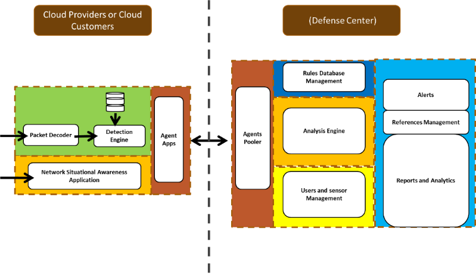
  

  

    The sensors or base modules are designed to run in the cloud computing
      environment and can be installed in the different networks from the core
      module (central defense system), as we can see in the system diagram.
      Defense centers will process and analyze reports generated by sensors.
      Figure 2 shows the recommended system architecture for the complete
      system, including the defense center, data source, and data
      serving.
  

  

  

    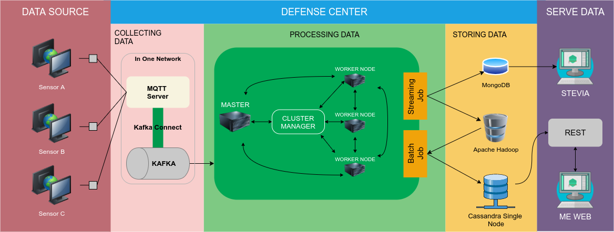
  

  

    Figure 2. System Architecture Diagram
  

  <ol class="c28 lst-kix_list_1-1" start="3">
    <li class="c37 li-bullet-0">
      <h2 id="h.2bn6wsx" style="display: inline">
        Data Source
      </h2>
    </li>
  </ol>
  

    The first component of the data source is the IDS sensor. In this
      version of Mata Elang, the sensor use Snort&trade; as the core IDS
      engine. Soon we plan to use various &nbsp; &nbsp;IDS engines e.g
      Suricata, Wazuh, etc. &nbsp;The output of the sensors sent to the
      defense center via some types of transmission protocol, which could
      transport data at the lowest latency as possible. A fast and efficient
      transmission protocol is also mandatory for carrying sensor
      outputs.
  

  <ol class="c28 lst-kix_list_1-1" start="4">
    <li class="c37 li-bullet-0">
      <h2 id="h.qsh70q" style="display: inline">
        Defense Center
      </h2>
    </li>
  </ol>
  

    The Defense Center is the part of the Mata Elang, the processing of
      which is maximized is the processing of data, from collecting data to
      storing data in a database. The central defense system is divided into
      three parts, namely collecting data, processing data, and storing
      data.
  

  <ol class="c28 lst-kix_list_1-2 start" start="1">
    <li class="c139 li-bullet-1">
      <h3 id="h.1pxezwc" style="display: inline">
        Collecting Data
      </h3>
    </li>
  </ol>
  

    The data collection process is a continuation stage after the sensor
      receives data attacks that occur on a network. In conducting data
      collection, the system uses Apache Kafka. Kafka here is a bridge between
      the sensor and spark as the primary data processors. In the process of
      Kafka, the data will be received and processed by the MQTT server. In
      MQTT the data will be processed by coding and simplification using Kafka
      Avro. Then it will be connected to the confluent so that the data is
      ready to proceed to spark via Apache Kafka.
  

  <ol class="c28 lst-kix_list_1-2" start="2">
    <li class="c139 li-bullet-2">
      <h3 id="h.49x2ik5" style="display: inline">
        Processing Data
      </h3>
    </li>
  </ol>
  

    Data processing in the Mata Elang system uses Apache Spark. The Apache
      Spark feature used in data processing is a streaming feature that can
      record and process data in live time. In streaming processing, a Spark
      will stream brokers to Kafka. The streaming process includes the
      following steps:
  

  <ul class="c28 lst-kix_list_12-0 start">
    <li class="c66 c43 li-bullet-3">
      It deserializes AVRO data with an existing registry scheme.
    </li>
    <li class="c66 c43 li-bullet-4">
      It converts data into data frames for Apache Spark&#39;s data
        abstraction using the map function.
    </li>
    <li class="c43 c66 li-bullet-3">
      It executes the existing data frame aggregation process using the
        subtraction function.
    </li>
    <li class="c66 c43 li-bullet-4">
      It writes to Apache Cassandra.
    </li>
  </ul>
  <ol class="c28 lst-kix_list_1-2 start" start="1">
    <li class="c139 li-bullet-1">
      <h3 id="h.2p2csry" style="display: inline">
        Storing Data
      </h3>
    </li>
  </ol>
  

    The first part of the defense center receiving data streams from remote
      sensors and then split these data into two types of flow process: stream
      job and batch job. The stream job process serves real-time monitoring
      information, while the batch job process is used for analytical data.
    
  

  <ol class="c28 lst-kix_list_1-2" start="2">
    <li class="c139 li-bullet-2">
      <h3 style="display: inline">
        Serving Data
      </h3>
    </li>
  </ol>
  

    There are two components in the serving data module: dashboards and the
      map.
  

  <ol class="c28 lst-kix_list_24-0 start" start="1">
    <li class="c30 c54 c43 li-bullet-4">Dashboard</li>
  </ol>
  

    For the dashboards, we refer to the popular standard metrics for
      network security applications by the SANS Institute. It consists of
      :
  

  <ul class="c28 lst-kix_list_28-0 start">
    <li class="c75 c43 li-bullet-3">
      Event Monitoring. It based on the result of streaming jobs
    </li>
    <li class="c75 c43 li-bullet-3">
      Event Statistics. It based on the result of streaming jobs
    </li>
    <li class="c75 c43 li-bullet-4">
      Top Signatures. It based on the result of batch jobs (the total
        number of &nbsp;event grouped by the signature&#39;s name)
    </li>
    <li class="c43 c75 li-bullet-3">
      Top Protocol. It based on the result of batch jobs (the total number
        of &nbsp;event grouped by the protocol)
    </li>
    <li class="c75 c43 li-bullet-3">
      Sensor Statistics. It based on the result of batch jobs (the total
        number of the event for each sensor)
    </li>
    <li class="c75 c43 li-bullet-5">
      Daily-monthly-annual report
    </li>
    <li class="c75 c43 li-bullet-3">
      User-role-profile-menu-management 
    </li>
  </ul>
  <ol class="c28 lst-kix_list_24-0" start="2">
    <li class="c30 c54 c43 li-bullet-4">Maps</li>
  </ol>
  

    A cyber threat map, also known as a cyber attack map, is a real-time
      map of the computer security attacks that are going on at any given
      time. Beams of light, represented by different colors showing where an
      attack comes from and where it is going
  

  <ol class="c28 lst-kix_list_1-0" start="3">
    <li class="c47 c121">
      <h1 style="display: inline">
        System Configuration
      </h1>
    </li>
  </ol>
  <ol class="c28 lst-kix_list_1-1 start" start="1">
    <li class="c37 li-bullet-0">
      <h2 id="h.eysnx4dpwebu" style="display: inline">
        Minimum configuration
      </h2>
    </li>
  </ol>
  

    The minimum configuration is a configuration with one sensor and one
      host of defense center.
    
  

  <ol class="c28 lst-kix_list_1-2" start="3">
    <li class="c139 li-bullet-1">
      <h3 id="h.2grqrue" style="display: inline">
        System configuration
      </h3>
    </li>
  </ol>
  

    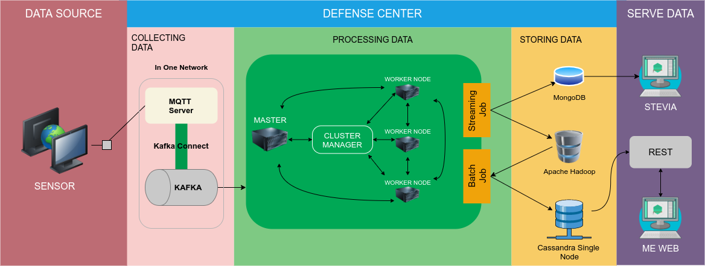
  

  

    Figure 3. System Architecture Diagram
  

  

    Figure 3 shows the minimum configuration for Mata Elang with one sensor
      and one monitored network.
  

  <ol class="c28 lst-kix_list_1-2" start="4">
    <li class="c139 li-bullet-2">
      <h3 id="h.er8kqxpzkk9c" style="display: inline">
        Network configuration
      </h3>
    </li>
  </ol>
  

    Figure 4. Network Topology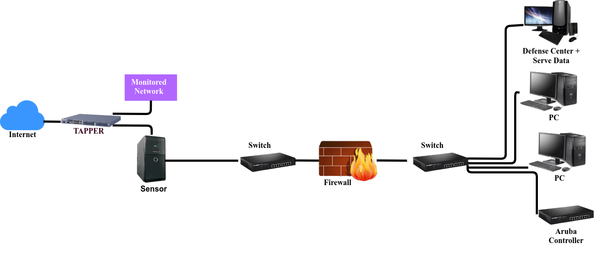
  

  

    Figure 4 shows the common topology with two switches and one PC for the
      defense center. At a minimum use of the configuration, we only use one
      sensor to monitor the private network. In this case, the sensor is
      placed in a different network address with the defense center.
  

  

  <ol class="c28 lst-kix_list_1-2" start="5">
    <li class="c139 li-bullet-1">
      <h3 id="h.jnu6liqyuy6w" style="display: inline">
        Prerequisite for the minimum configuration
      </h3>
    </li>
  </ol>
  <ol class="c28 lst-kix_list_1-3 start" start="1">
    <li class="c124 li-bullet-6">
      <h4 id="h.m0k2jr9xgyc5" style="display: inline">
        Data Source
      </h4>
    </li>
  </ol>
  
  <table class="c137 c196">
    <tbody>
      <tr class="c136">
        <td class="c175" colspan="1" rowspan="1">
          
Requirements

        </td>
        <td class="c197" colspan="1" rowspan="1">
          
Version/Model

        </td>
        <td class="c188" colspan="1" rowspan="1">
          
Quantity

        </td>
        <td class="c166" colspan="1" rowspan="1">
          
Notes

        </td>
      </tr>
      <tr class="c5">
        <td class="c55" colspan="4" rowspan="1">
          
Hardware

        </td>
      </tr>
      <tr class="c5">
        <td class="c144" colspan="1" rowspan="1">
          
CPU

        </td>
        <td class="c84" colspan="1" rowspan="1">
          
Intel Core 2 Duo or more

        </td>
        <td class="c106" colspan="1" rowspan="1">
          
1

        </td>
        <td class="c90" colspan="1" rowspan="1">
          

        </td>
      </tr>
      <tr class="c5">
        <td class="c144" colspan="1" rowspan="1">
          
LAN card interfaces

        </td>
        <td class="c84" colspan="1" rowspan="1">
          
1-gigabit ether or more

        </td>
        <td class="c106" colspan="1" rowspan="1">
          
2

        </td>
        <td class="c90" colspan="1" rowspan="1">
          

        </td>
      </tr>
      <tr class="c5">
        <td class="c144" colspan="1" rowspan="1">
          
RAM

        </td>
        <td class="c84" colspan="1" rowspan="1">
          
2GB or more

        </td>
        <td class="c106" colspan="1" rowspan="1">
          
1

        </td>
        <td class="c90" colspan="1" rowspan="1">
          

        </td>
      </tr>
      <tr class="c5">
        <td class="c144" colspan="1" rowspan="1">
          
Hardisk

        </td>
        <td class="c84" colspan="1" rowspan="1">
          
100GB

        </td>
        <td class="c106" colspan="1" rowspan="1">
          
1

        </td>
        <td class="c90" colspan="1" rowspan="1">
          

        </td>
      </tr>
      <tr class="c5">
        <td class="c55" colspan="4" rowspan="1">
          
Operating System

        </td>
      </tr>
      <tr class="c5">
        <td class="c144" colspan="1" rowspan="1">
          
Linux Ubuntu Server 

        </td>
        <td class="c84" colspan="1" rowspan="1">
          
18.04

        </td>
        <td class="c106" colspan="1" rowspan="1">
          
1

        </td>
        <td class="c90" colspan="1" rowspan="1">
          

        </td>
      </tr>
      <tr class="c157">
        <td class="c55" colspan="4" rowspan="1">
          
Software

        </td>
      </tr>
      <tr class="c5">
        <td class="c144" colspan="1" rowspan="1">
          
Git

        </td>
        <td class="c84" colspan="1" rowspan="1">
          
2.7

        </td>
        <td class="c106" colspan="1" rowspan="1">
          
1

        </td>
        <td class="c90" colspan="1" rowspan="1">
          

        </td>
      </tr>
      <tr class="c5">
        <td class="c144" colspan="1" rowspan="1">
          
Docker

        </td>
        <td class="c84" colspan="1" rowspan="1">
          
19.03

        </td>
        <td class="c106" colspan="1" rowspan="1">
          
1

        </td>
        <td class="c90" colspan="1" rowspan="1">
          

        </td>
      </tr>
    </tbody>
  </table>
  

    Minimum bandwidth: 10Mbps for installation
  

  

  <ol class="c28 lst-kix_list_1-3" start="2">
    <li class="c124 li-bullet-7">
      <h4 id="h.v6ctr9tipvnl" style="display: inline">
        Defense Center and Serving Data
      </h4>
    </li>
  </ol>
  
  <table class="c137 c160">
    <tbody>
      <tr class="c136">
        <td class="c155" colspan="1" rowspan="1">
          
Requirements

        </td>
        <td class="c85" colspan="1" rowspan="1">
          
&nbsp;Version/Model

        </td>
        <td class="c62" colspan="1" rowspan="1">
          
Quantity

        </td>
        <td class="c182" colspan="1" rowspan="1">
          
Notes

        </td>
      </tr>
      <tr class="c5">
        <td class="c126" colspan="4" rowspan="1">
          
Hardware

        </td>
      </tr>
      <tr class="c5">
        <td class="c104" colspan="1" rowspan="1">
          
CPU 

        </td>
        <td class="c82" colspan="1" rowspan="1">
          

            Intel Core i7 / Ryzen 7 or more
          

        </td>
        <td class="c11" colspan="1" rowspan="1">
          
1

        </td>
        <td class="c8" colspan="1" rowspan="1">
          

        </td>
      </tr>
      <tr class="c5">
        <td class="c104" colspan="1" rowspan="1">
          
LAN card interfaces

        </td>
        <td class="c82" colspan="1" rowspan="1">
          

            &nbsp;1-gigabit ether or more
          

        </td>
        <td class="c11" colspan="1" rowspan="1">
          
2

        </td>
        <td class="c8" colspan="1" rowspan="1">
          

        </td>
      </tr>
      <tr class="c5">
        <td class="c104" colspan="1" rowspan="1">
          
RAM

        </td>
        <td class="c82" colspan="1" rowspan="1">
          
32GB

        </td>
        <td class="c11" colspan="1" rowspan="1">
          
1

        </td>
        <td class="c8" colspan="1" rowspan="1">
          

        </td>
      </tr>
      <tr class="c5">
        <td class="c104" colspan="1" rowspan="1">
          
Hardisk

        </td>
        <td class="c82" colspan="1" rowspan="1">
          
500GB

        </td>
        <td class="c11" colspan="1" rowspan="1">
          
1

        </td>
        <td class="c8" colspan="1" rowspan="1">
          

        </td>
      </tr>
      <tr class="c5">
        <td class="c126" colspan="4" rowspan="1">
          
Operating System

        </td>
      </tr>
      <tr class="c5">
        <td class="c104" colspan="1" rowspan="1">
          
Linux Ubuntu Server

        </td>
        <td class="c82" colspan="1" rowspan="1">
          
18.04

        </td>
        <td class="c11" colspan="1" rowspan="1">
          
1

        </td>
        <td class="c8" colspan="1" rowspan="1">
          

        </td>
      </tr>
      <tr class="c157">
        <td class="c126" colspan="4" rowspan="1">
          
Software

        </td>
      </tr>
      <tr class="c5">
        <td class="c104" colspan="1" rowspan="1">
          
OpenJDK/Oracle Java

        </td>
        <td class="c82" colspan="1" rowspan="1">
          
8

        </td>
        <td class="c11" colspan="1" rowspan="1">
          
1

        </td>
        <td class="c8" colspan="1" rowspan="1">
          

        </td>
      </tr>
      <tr class="c5">
        <td class="c104" colspan="1" rowspan="1">
          
Scala

        </td>
        <td class="c82" colspan="1" rowspan="1">
          
2.11

        </td>
        <td class="c11" colspan="1" rowspan="1">
          
1

        </td>
        <td class="c8" colspan="1" rowspan="1">
          

        </td>
      </tr>
      <tr class="c5">
        <td class="c104" colspan="1" rowspan="1">
          
SBT

        </td>
        <td class="c82" colspan="1" rowspan="1">
          
1.3

        </td>
        <td class="c11" colspan="1" rowspan="1">
          
1

        </td>
        <td class="c8" colspan="1" rowspan="1">
          

        </td>
      </tr>
      <tr class="c5">
        <td class="c104" colspan="1" rowspan="1">
          
Git

        </td>
        <td class="c82" colspan="1" rowspan="1">
          
2.7

        </td>
        <td class="c11" colspan="1" rowspan="1">
          
1

        </td>
        <td class="c8" colspan="1" rowspan="1">
          

        </td>
      </tr>
      <tr class="c5">
        <td class="c104" colspan="1" rowspan="1">
          
Apache Cassandra

        </td>
        <td class="c82" colspan="1" rowspan="1">
          
3.11

        </td>
        <td class="c11" colspan="1" rowspan="1">
          
1

        </td>
        <td class="c8" colspan="1" rowspan="1">
          

        </td>
      </tr>
      <tr class="c5">
        <td class="c104" colspan="1" rowspan="1">
          
Apache Hadoop

        </td>
        <td class="c82" colspan="1" rowspan="1">
          
3.2

        </td>
        <td class="c11" colspan="1" rowspan="1">
          
1

        </td>
        <td class="c8" colspan="1" rowspan="1">
          

        </td>
      </tr>
      <tr class="c5">
        <td class="c104" colspan="1" rowspan="1">
          
MongoDB

        </td>
        <td class="c82" colspan="1" rowspan="1">
          
4.2

        </td>
        <td class="c11" colspan="1" rowspan="1">
          
1

        </td>
        <td class="c8" colspan="1" rowspan="1">
          

        </td>
      </tr>
      <tr class="c5">
        <td class="c104" colspan="1" rowspan="1">
          
Docker

        </td>
        <td class="c82" colspan="1" rowspan="1">
          
19.03

        </td>
        <td class="c11" colspan="1" rowspan="1">
          
1

        </td>
        <td class="c8" colspan="1" rowspan="1">
          

        </td>
      </tr>
      <tr class="c5">
        <td class="c104" colspan="1" rowspan="1">
          
NodeJS

        </td>
        <td class="c82" colspan="1" rowspan="1">
          
12.14 (LTS)

        </td>
        <td class="c11" colspan="1" rowspan="1">
          
1

        </td>
        <td class="c8" colspan="1" rowspan="1">
          

        </td>
      </tr>
      <tr class="c5">
        <td class="c104" colspan="1" rowspan="1">
          
Python

        </td>
        <td class="c82" colspan="1" rowspan="1">
          
3.5

        </td>
        <td class="c11" colspan="1" rowspan="1">
          
1

        </td>
        <td class="c8" colspan="1" rowspan="1">
          

        </td>
      </tr>
    </tbody>
  </table>
  

    Minimum bandwidth: 10Mbps for installation
  

  <ol class="c28 lst-kix_list_1-1" start="2">
    <li class="c37 li-bullet-0">
      <h2 id="h.3fwokq0" style="display: inline">
        Common configuration
      </h2>
    </li>
  </ol>
  

    Figure 5. System Architecture Diagram
  

  

    Figure 5 shows the basic system configuration where the Mata Elang can
      monitor more than one network.
    
  

  <h1 class="c97 c95 c161 c185" id="h.hm99vhplhrkk">
    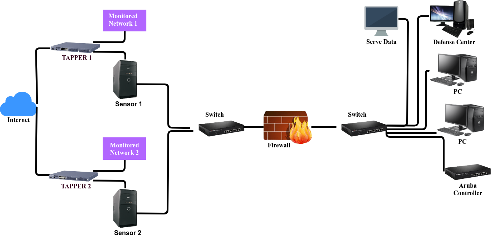
  </h1>
  
Figure 6. Network Topology

  

    Figure 6 shows the physical network configuration of the Mata Elang for
      multi-sensors &nbsp; containing: &nbsp;two tappers, two sensors, two
      switches, and one defense center
  

  <ol class="c28 lst-kix_list_1-0" start="4">
    <li class="c47 c121">
      <h1 id="h.19c6y18" style="display: inline">
        Version Control of Source Code 
      </h1>
    </li>
  </ol>
  

    We use &nbsp; GitHub as out application version control. Mata Elang
      Project is hosted on Github as a public organization for collaboration.
      (<a class="c17"
        href="https://www.google.com/url?q=https://github.com/mata-elang-pens&amp;sa=D&amp;source=editors&amp;ust=1613153648879000&amp;usg=AOvVaw1rkd9zaYjbieaVk1ZgPiLn">https://github.com/mata-elang-pens</a>)
  

  

    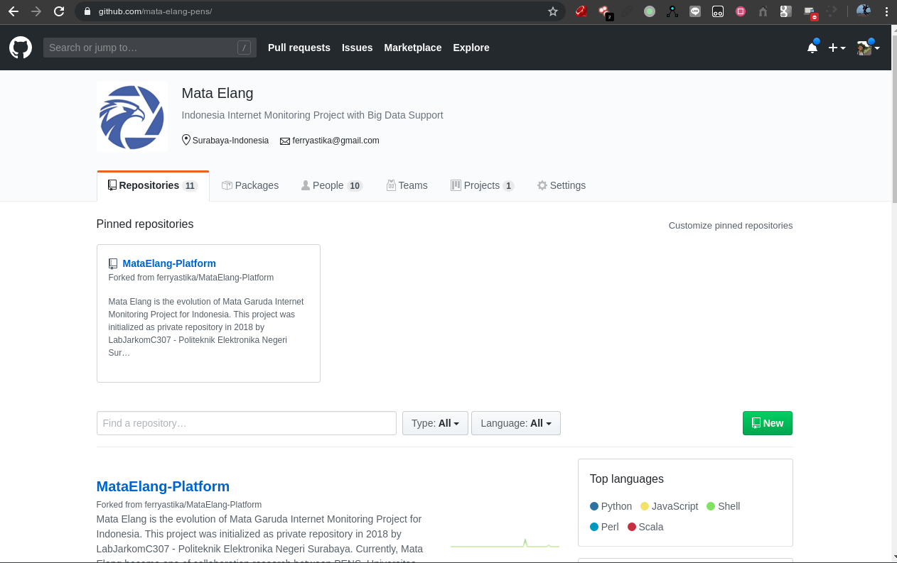
  

  

    Figure 7. Mata Elang Repositories
  

  

    The repository of Mata Elang is publicly accessible. Everyone can
      propose changes by forking the repository by using the pull request
      feature. Some sections in Mata Elang Architecture requires additional
      authorization by Mata Elang Founders to change as described in the Strategic Document
      section 5.
  

  <ol class="c28 lst-kix_list_1-1" start="3">
    <li class="c37 li-bullet-0">
      <h2 id="h.3tbugp1" style="display: inline">
        Mata Elang LTS (Long Term Support) Version 1.0
      </h2>
    </li>
  </ol>
  

    At present, Mata Elang is in version 1.0. It means we do not rule out
      the possibility that Mata Elang will make updates in various aspects.
      So, we will do Long Term Support with the conditions below:
  

  <ol class="c28 lst-kix_list_1-2" start="6">
    <li class="c139 li-bullet-2">
      <h3 id="h.28h4qwu" style="display: inline">
        Data Source
      </h3>
    </li>
  </ol>
  

    For the Long Term Support version, we do support according to the
      available versions of each requirement. Here is the Long Term Support
      Version for Data Source:
  

  <ul class="c28 lst-kix_list_6-0 start">
    <li class="c97 c54 c43 li-bullet-5">
      Linux Ubuntu Server version 18.04 
    </li>
    <li class="c97 c54 c43 li-bullet-8">
      Python version 3.8.2 
    </li>
    <li class="c97 c54 c43 li-bullet-4">
      Java version 8 
    </li>
    <li class="c97 c54 c43 li-bullet-5">
      Python-PIP version 3.8.2 
    </li>
    <li class="c97 c54 c43 li-bullet-8">
      Docker version 3 
    </li>
    <li class="c97 c54 c43 li-bullet-8">
      Snort version 2.9.15.1 
    </li>
  </ul>
  <ol class="c28 lst-kix_list_1-2 start" start="1">
    <li class="c139 li-bullet-1">
      <h3 id="h.nmf14n" style="display: inline">
        Defense Center
      </h3>
    </li>
  </ol>
  <ol class="c28 lst-kix_list_1-3 start" start="1">
    <li class="c124 li-bullet-9">
      <h4 id="h.37m2jsg" style="display: inline">
        Collecting Data
      </h4>
    </li>
  </ol>
  

    For the Long Term Support version, we do support according to the
      available versions of each requirement. Here is the Long Term Support
      Version for Collecting Data:
  

  <ul class="c28 lst-kix_list_13-0 start">
    <li class="c61 c43 li-bullet-3">
      Linux Ubuntu Server version 18.04 
    </li>
    <li class="c61 c43 li-bullet-4">
      Kafka version included in confluent
    </li>
    <li class="c61 c43 li-bullet-3">
      Zookeeper version included in confluent
    </li>
    <li class="c61 c43 li-bullet-8">
      Mosquitto version 1.6.9
    </li>
    <li class="c61 c43 li-bullet-4">
      Confluent version 5.4.0
    </li>
  </ul>
  <ol class="c28 lst-kix_list_1-3 start" start="1">
    <li class="c124 li-bullet-6">
      <h4 id="h.1mrcu09" style="display: inline">
        Processing Data
      </h4>
    </li>
  </ol>
  

    For the Long Term Support version, we do support according to the
      available versions of each requirement. Here is the Long Term Support
      Version for Processing Data:
  

  <ul class="c28 lst-kix_list_14-0 start">
    <li class="c61 c43 li-bullet-5">
      Linux Ubuntu Server version 18.04
    </li>
    <li class="c61 c43 li-bullet-5">
      Java version 8
    </li>
    <li class="c61 c43 li-bullet-4">
      Scala version 2.11
    </li>
    <li class="c61 c43 li-bullet-3">
      Apache Spark version 2.3.4
    </li>
    <li class="c61 c43 li-bullet-4">
      Apache Hadoop version 2.10.0
    </li>
  </ul>
  <ol class="c28 lst-kix_list_1-3 start" start="1">
    <li class="c124 li-bullet-10">
      <h4 id="h.46r0co2" style="display: inline">
        Storing Data
      </h4>
    </li>
  </ol>
  

    For the Long Term Support version, we do support according to the
      available versions of each requirement. Here is the Long Term Support
      Version for Storing Data:
  

  <ul class="c28 lst-kix_list_36-0 start">
    <li class="c61 c43 li-bullet-3">
      Linux Ubuntu Server version 18.04
    </li>
    <li class="c43 c61 li-bullet-4">
      MongoDB version 4.2.3
    </li>
  </ul>
  <ul class="c28 lst-kix_list_14-0">
    <li class="c61 c43 li-bullet-3">
      Java version 8
    </li>
  </ul>
  <ul class="c28 lst-kix_list_36-0">
    <li class="c61 c43 li-bullet-5">
      Apache Hadoop version 2.10.0
    </li>
    <li class="c61 c43 li-bullet-4">
      Apache Cassandra version 3.11.6
    </li>
  </ul>
  <ol class="c28 lst-kix_list_1-3 start" start="1">
    <li class="c124 li-bullet-11">
      <h4 id="h.2lwamvv" style="display: inline">
        Serving Data
      </h4>
    </li>
  </ol>
  

    For the Long Term Support version, we do support according to the
      available versions of each requirement. Here is the Long Term Support
      Version for Serving Data:
  

  <ul class="c28 lst-kix_list_20-0 start">
    <li class="c61 c43 li-bullet-8">
      Python version 3
    </li>
    <li class="c30 c43 c172 li-bullet-5">
      NodeJs version 12.16.1 LTS
    </li>
  </ul>
  <ol class="c28 lst-kix_list_1-1 start" start="1">
    <li class="c37 li-bullet-0">
      <h2 id="h.111kx3o" style="display: inline">
        License
      </h2>
    </li>
  </ol>
  

    We considered using GNU GPLv2. By using this license, we may charge a
      fee for the physical act of transferring a copy and there is a
      possibility to offer professional support and warranty protection in
      exchange for a fee.
  

  <ol class="c28 lst-kix_list_1-0" start="5">
    <li class="c47 c121">
      <h1 id="h.3l18frh" style="display: inline">
        Standard Coding
      </h1>
    </li>
  </ol>
  

    The Mata Elang source code consists of several programming and
      scripting languages. The scripting language is used for automating build
      and docker containers for sensors.
  

  

    For this reason, we standardized coding scheme for extensible
      development reasons:
  

  <ul class="c28 lst-kix_list_32-0 start">
    <li class="c30 c45 c43 li-bullet-8">
      No more than a single statement per line, for bash scripting, there
        might be a pipelining (||) or chaining (&amp;&amp;), so it is
        separated by a backslash and the new line between statements.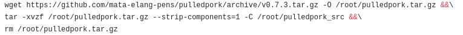
    </li>
    <li class="c30 c45 c43 li-bullet-8">
      Comments must be added for understandable reasons in every statement
        context.
    </li>
    <li class="c30 c45 c43 li-bullet-3">
      Use of the information before including the coding script
    </li>
    <li class="c30 c45 c43 li-bullet-4">
      Naming variables are adjusted globally for easy understand by others
      
    </li>
    <li class="c30 c45 c43 li-bullet-4">
      Error handling will be explained in the troubleshooting section in
        Appendix C
    </li>
  </ul>
  

  <ol class="c28 lst-kix_list_1-0" start="6">
    <li class="c47 c121">
      <h1 id="h.206ipza" style="display: inline">
        Development and Test Environment
      </h1>
    </li>
  </ol>
  <ol class="c28 lst-kix_list_1-1 start" start="1">
    <li class="c37 li-bullet-0">
      <h2 id="h.4k668n3" style="display: inline">
        &nbsp;Key areas to set up in Test Environment
      </h2>
    </li>
  </ol>
  <ol class="c28 lst-kix_list_7-0 start" start="1">
    <li class="c97 c45 c43 li-bullet-3">
      System and applications
    </li>
    <li class="c97 c45 c43 li-bullet-3">Test Data</li>
    <li class="c97 c45 c43 li-bullet-5">
      Database server
    </li>
    <li class="c97 c45 c43 li-bullet-8">
      Front-end running environment
    </li>
    <li class="c97 c45 c43 li-bullet-4">
      Client operating system
    </li>
    <li class="c97 c45 c43 li-bullet-4">Browser</li>
    <li class="c97 c45 c43 li-bullet-5">
      Hardware includes server operating system
    </li>
    <li class="c97 c45 c43 li-bullet-8">Network</li>
    <li class="c97 c45 c43 li-bullet-3">
      Document required for testing like reference documents/configuration
        guides/installation guides/user manuals
    </li>
  </ol>
  <ol class="c28 lst-kix_list_1-1 start" start="1">
    <li class="c37 li-bullet-0">
      <h2 id="h.2zbgiuw" style="display: inline">
        Process of Sensor Test Environment setup
      </h2>
    </li>
  </ol>
  <ol class="c28 lst-kix_list_9-0 start" start="1">
    <li class="c30 c50 c43 li-bullet-4">
      Setup of Test Server
    </li>
  </ol>
  <ol class="c28 lst-kix_list_9-1 start" start="1">
    <li class="c30 c54 c43 li-bullet-3">
      Install GNU Linux Operating System
    </li>
    <li class="c30 c54 c43 li-bullet-4">
      Install Python3, Python3-PIP, and Docker packages
    </li>
    <li class="c30 c54 c43 li-bullet-5">
      Install Mata Elang Sensors
    </li>
  </ol>
  <ol class="c28 lst-kix_list_9-0" start="2">
    <li class="c30 c50 c43 li-bullet-8">
      Setup of Network
    </li>
  </ol>
  <ol class="c28 lst-kix_list_9-1 start" start="1">
    <li class="c30 c54 c43 li-bullet-3">
      Internet Setup
    </li>
    <li class="c30 c54 c43 li-bullet-5">
      LAN/WIFI Setup
    </li>
    <li class="c30 c54 c43 li-bullet-4">
      Private Network Setup
    </li>
  </ol>
  <ol class="c28 lst-kix_list_9-0" start="3">
    <li class="c30 c50 c43 li-bullet-4">
      Test of Server Setup
    </li>
  </ol>
  <ol class="c28 lst-kix_list_9-1 start" start="1">
    <li class="c30 c54 c43 li-bullet-4">
      Check Python3, Python3-PIP, and Docker installation.
    </li>
    <li class="c30 c54 c43 li-bullet-5">
      Check whether the Mata Elang sensor service is working properly
    </li>
    <li class="c30 c54 c43 li-bullet-4">
      Checking the connection between Mata Elang sensor and Mata Elang
        Cloud System established
    </li>
    <li class="c30 c54 c43 li-bullet-5">
      I was checking whether the server can send data to MQTT Broker.
    </li>
  </ol>
  <ol class="c28 lst-kix_list_9-0" start="4">
    <li class="c30 c50 c43 li-bullet-5">
      Bug Reporting
    </li>
  </ol>
  <ol class="c28 lst-kix_list_1-1 start" start="1">
    <li class="c37 li-bullet-0">
      <h2 id="h.1egqt2p" style="display: inline">
        Process of Data Processing Test Environment setup
      </h2>
    </li>
  </ol>
  <ol class="c28 lst-kix_list_35-0 start" start="1">
    <li class="c30 c43 c50 li-bullet-5">
      Setup of Test Server
    </li>
  </ol>
  <ol class="c28 lst-kix_list_35-1 start" start="1">
    <li class="c30 c54 c43 li-bullet-5">
      Install GNU Linux Operating System
    </li>
    <li class="c30 c54 c43 li-bullet-5">
      Install Java 8 (JDK and JRE)
    </li>
    <li class="c30 c54 c43 li-bullet-3">
      Install Scala
    </li>
    <li class="c30 c54 c43 li-bullet-8">
      Install SBT
    </li>
    <li class="c30 c54 c43 li-bullet-5">
      Install Apache Hadoop
    </li>
    <li class="c30 c54 c43 li-bullet-4">
      Install Apache Spark
    </li>
  </ol>
  <ol class="c28 lst-kix_list_35-0" start="2">
    <li class="c30 c50 c43 li-bullet-4">
      Setup of Network
    </li>
  </ol>
  <ol class="c28 lst-kix_list_35-1 start" start="1">
    <li class="c30 c54 c43 li-bullet-8">
      Internet Setup
    </li>
    <li class="c30 c54 c43 li-bullet-4">
      LAN/WIFI Setup
    </li>
    <li class="c30 c54 c43 li-bullet-8">
      Private Network Setup
    </li>
  </ol>
  <ol class="c28 lst-kix_list_35-0" start="3">
    <li class="c30 c50 c43 li-bullet-4">
      Test of Server Setup
    </li>
  </ol>
  <ol class="c28 lst-kix_list_35-1 start" start="1">
    <li class="c30 c54 c43 li-bullet-3">
      Checking whether the Big Data platform is working properly
    </li>
  </ol>
  <ol class="c28 lst-kix_list_35-0" start="4">
    <li class="c30 c50 c43 li-bullet-3">
      Bug Reporting
    </li>
    <li class="c30 c50 c43 li-bullet-8">
      Creating/Collecting Test Data for the Test Environment
    </li>
  </ol>
  <ol class="c28 lst-kix_list_1-1 start" start="1">
    <li class="c37 li-bullet-0">
      <h2 id="h.3ygebqi" style="display: inline">
        Process of Data Serving Test Environment setup
      </h2>
    </li>
  </ol>
  <ol class="c28 lst-kix_list_10-0 start" start="1">
    <li class="c30 c50 c43 li-bullet-4">
      Setup of Test Server
    </li>
  </ol>
  <ol class="c28 lst-kix_list_10-1 start" start="1">
    <li class="c30 c54 c43 li-bullet-5">
      Install GNU Linux Operating System
    </li>
    <li class="c30 c54 c43 li-bullet-5">
      Install NodeJS and NPM packages
    </li>
    <li class="c30 c43 c54 li-bullet-4">
      Install NodeJS dependencies using `npm install`
    </li>
  </ol>
  <ol class="c28 lst-kix_list_10-0" start="2">
    <li class="c30 c50 c43 li-bullet-3">
      Setup of Network
    </li>
    <li class="c30 c50 c43 li-bullet-4">
      Test of Server Setup
    </li>
  </ol>
  <ol class="c28 lst-kix_list_10-1 start" start="1">
    <li class="c30 c54 c43 li-bullet-5">
      Checking whether rest API application can make a connection to
        database server
    </li>
    <li class="c30 c54 c43 li-bullet-5">
      Checking whether rest API is accessible by other client using Server
        IP
    </li>
  </ol>
  <ol class="c28 lst-kix_list_10-0" start="4">
    <li class="c30 c50 c43 li-bullet-5">
      Bug Reporting
    </li>
  </ol>
  <ol class="c28 lst-kix_list_1-1 start" start="1">
    <li class="c37 li-bullet-0">
      <h2 id="h.2dlolyb" style="display: inline">
        Test Environment Management
      </h2>
    </li>
  </ol>
  <ol class="c28 lst-kix_list_21-0 start" start="1">
    <li class="c30 c50 c43 li-bullet-3">
      Maintenance of the server with all the updated versions of test
        environments.
    </li>
    <li class="c30 c50 c43 li-bullet-4">
      Monitoring of the environment.
    </li>
    <li class="c30 c50 c43 li-bullet-8">
      Updating/deleting outdated test-environments.
    </li>
    <li class="c30 c50 c43 li-bullet-8">
      Investigation of issues on the environment.
    </li>
  </ol>
  <ol class="c28 lst-kix_list_1-1 start" start="1">
    <li class="c37 li-bullet-0">
      <h2 id="h.sqyw64" style="display: inline">
        Test Environment Checklist
      </h2>
    </li>
  </ol>
  <ol class="c28 lst-kix_list_26-0 start" start="1">
    <li class="c43 c73 li-bullet-8">
      Sensor Environment
    </li>
  </ol>
  
  <table class="c86">
    <tbody>
      <tr class="c5">
        <td class="c154" colspan="1" rowspan="2">
          
Requirements

        </td>
        <td class="c177" colspan="2" rowspan="1">
          
Status

        </td>
        <td class="c167" colspan="1" rowspan="2">
          
Command Check

        </td>
      </tr>
      <tr class="c5">
        <td class="c29" colspan="1" rowspan="1">
          
Yes

        </td>
        <td class="c21" colspan="1" rowspan="1">
          
No

        </td>
      </tr>
      <tr class="c74">
        <td class="c51" colspan="4" rowspan="1">
          
Hardware

        </td>
      </tr>
      <tr class="c5">
        <td class="c52" colspan="1" rowspan="1">
          
CPU Intel Core 2 Duo

        </td>
        <td class="c29" colspan="1" rowspan="1">
          

        </td>
        <td class="c21" colspan="1" rowspan="1">
          

        </td>
        <td class="c59" colspan="1" rowspan="1">
          

            lshw -short | grep processor
          

        </td>
      </tr>
      <tr class="c5">
        <td class="c52" colspan="1" rowspan="1">
          
LAN card interfaces

        </td>
        <td class="c29" colspan="1" rowspan="1">
          

        </td>
        <td class="c21" colspan="1" rowspan="1">
          

        </td>
        <td class="c59" colspan="1" rowspan="1">
          

            lshw -short | grep network
          

        </td>
      </tr>
      <tr class="c5">
        <td class="c52" colspan="1" rowspan="1">
          
RAM 2GB

        </td>
        <td class="c29" colspan="1" rowspan="1">
          

        </td>
        <td class="c21" colspan="1" rowspan="1">
          

        </td>
        <td class="c59" colspan="1" rowspan="1">
          
lshw -short | grep memory

        </td>
      </tr>
      <tr class="c5">
        <td class="c52" colspan="1" rowspan="1">
          
Hardisk 100GB

        </td>
        <td class="c29" colspan="1" rowspan="1">
          

        </td>
        <td class="c21" colspan="1" rowspan="1">
          

        </td>
        <td class="c59" colspan="1" rowspan="1">
          
lshw -short | grep disk

        </td>
      </tr>
      <tr class="c5">
        <td class="c51" colspan="4" rowspan="1">
          
Software

        </td>
      </tr>
      <tr class="c5">
        <td class="c52" colspan="1" rowspan="1">
          
Linux Ubuntu server 18.04

        </td>
        <td class="c29" colspan="1" rowspan="1">
          

        </td>
        <td class="c21" colspan="1" rowspan="1">
          

        </td>
        <td class="c59" colspan="1" rowspan="1">
          
cat /etc/os-release

        </td>
      </tr>
      <tr class="c5">
        <td class="c52" colspan="1" rowspan="1">
          
Git

        </td>
        <td class="c29" colspan="1" rowspan="1">
          

        </td>
        <td class="c21" colspan="1" rowspan="1">
          

        </td>
        <td class="c59" colspan="1" rowspan="1">
          
git --version

        </td>
      </tr>
      <tr class="c5">
        <td class="c52" colspan="1" rowspan="1">
          
Docker

        </td>
        <td class="c29" colspan="1" rowspan="1">
          

        </td>
        <td class="c21" colspan="1" rowspan="1">
          

        </td>
        <td class="c59" colspan="1" rowspan="1">
          
docker -v

        </td>
      </tr>
    </tbody>
  </table>
  

  <ol class="c28 lst-kix_list_26-0" start="2">
    <li class="c43 c111 li-bullet-5" id="h.gjdgxs">
      Data Processing Environment
    </li>
  </ol>
  
  <table class="c86">
    <tbody>
      <tr class="c5">
        <td class="c156" colspan="1" rowspan="2">
          
Requirements

        </td>
        <td class="c67" colspan="2" rowspan="1">
          
Status

        </td>
        <td class="c159" colspan="1" rowspan="2">
          
Command Check

        </td>
      </tr>
      <tr class="c5">
        <td class="c21" colspan="1" rowspan="1">
          
Yes

        </td>
        <td class="c21" colspan="1" rowspan="1">
          
No

        </td>
      </tr>
      <tr class="c74">
        <td class="c169" colspan="4" rowspan="1">
          
Hardware

        </td>
      </tr>
      <tr class="c5">
        <td class="c114" colspan="1" rowspan="1">
          

            CPU Intel Core i7 / Ryzen 7
          

        </td>
        <td class="c21" colspan="1" rowspan="1">
          

        </td>
        <td class="c21" colspan="1" rowspan="1">
          

        </td>
        <td class="c127" colspan="1" rowspan="1">
          

            lshw -short | grep processor
          

        </td>
      </tr>
      <tr class="c5">
        <td class="c114" colspan="1" rowspan="1">
          
LAN card interfaces

        </td>
        <td class="c21" colspan="1" rowspan="1">
          

        </td>
        <td class="c21" colspan="1" rowspan="1">
          

        </td>
        <td class="c127" colspan="1" rowspan="1">
          

            lshw -short | grep network
          

        </td>
      </tr>
      <tr class="c5">
        <td class="c114" colspan="1" rowspan="1">
          
RAM 16 GB

        </td>
        <td class="c21" colspan="1" rowspan="1">
          

        </td>
        <td class="c21" colspan="1" rowspan="1">
          

        </td>
        <td class="c127" colspan="1" rowspan="1">
          
lshw -short | grep memory

        </td>
      </tr>
      <tr class="c5">
        <td class="c114" colspan="1" rowspan="1">
          
Hardisk 500GB

        </td>
        <td class="c21" colspan="1" rowspan="1">
          

        </td>
        <td class="c21" colspan="1" rowspan="1">
          

        </td>
        <td class="c127" colspan="1" rowspan="1">
          
lshw -short | grep disk

        </td>
      </tr>
      <tr class="c5">
        <td class="c169" colspan="4" rowspan="1">
          
Software

        </td>
      </tr>
      <tr class="c5">
        <td class="c114" colspan="1" rowspan="1">
          
Linux ubuntu server 18.04

        </td>
        <td class="c21" colspan="1" rowspan="1">
          

        </td>
        <td class="c21" colspan="1" rowspan="1">
          

        </td>
        <td class="c127" colspan="1" rowspan="1">
          
cat /etc/os-release

        </td>
      </tr>
      <tr class="c5">
        <td class="c114" colspan="1" rowspan="1">
          
Java 8

        </td>
        <td class="c21" colspan="1" rowspan="1">
          

        </td>
        <td class="c21" colspan="1" rowspan="1">
          

        </td>
        <td class="c127" colspan="1" rowspan="1">
          
java -version

        </td>
      </tr>
      <tr class="c5">
        <td class="c114" colspan="1" rowspan="1">
          
Scala

        </td>
        <td class="c21" colspan="1" rowspan="1">
          

        </td>
        <td class="c21" colspan="1" rowspan="1">
          

        </td>
        <td class="c127" colspan="1" rowspan="1">
          
scala -version

        </td>
      </tr>
      <tr class="c5">
        <td class="c114" colspan="1" rowspan="1">
          
SBT

        </td>
        <td class="c21" colspan="1" rowspan="1">
          

        </td>
        <td class="c21" colspan="1" rowspan="1">
          

        </td>
        <td class="c127" colspan="1" rowspan="1">
          
sbt --version

        </td>
      </tr>
      <tr class="c5">
        <td class="c114" colspan="1" rowspan="1">
          
Git

        </td>
        <td class="c21" colspan="1" rowspan="1">
          

        </td>
        <td class="c21" colspan="1" rowspan="1">
          

        </td>
        <td class="c127" colspan="1" rowspan="1">
          
git --version

        </td>
      </tr>
    </tbody>
  </table>
  

  <ol class="c28 lst-kix_list_26-0" start="3">
    <li class="c111 c43 li-bullet-5">
      Data Storing Environment
    </li>
  </ol>
  
  <table class="c86">
    <tbody>
      <tr class="c5">
        <td class="c15" colspan="1" rowspan="2">
          
Requirements

        </td>
        <td class="c113" colspan="2" rowspan="1">
          
Status

        </td>
        <td class="c89" colspan="1" rowspan="2">
          
Command Check

        </td>
      </tr>
      <tr class="c5">
        <td class="c46" colspan="1" rowspan="1">
          
Yes

        </td>
        <td class="c27" colspan="1" rowspan="1">
          
No

        </td>
      </tr>
      <tr class="c74">
        <td class="c38" colspan="4" rowspan="1">
          
Hardware

        </td>
      </tr>
      <tr class="c5">
        <td class="c135" colspan="1" rowspan="1">
          
CPU Intel Core i3

        </td>
        <td class="c46" colspan="1" rowspan="1">
          

        </td>
        <td class="c27" colspan="1" rowspan="1">
          

        </td>
        <td class="c34" colspan="1" rowspan="1">
          

            lshw -short | grep processor
          

        </td>
      </tr>
      <tr class="c5">
        <td class="c135" colspan="1" rowspan="1">
          
LAN card interfaces

        </td>
        <td class="c46" colspan="1" rowspan="1">
          

        </td>
        <td class="c27" colspan="1" rowspan="1">
          

        </td>
        <td class="c34" colspan="1" rowspan="1">
          

            lshw -short | grep network
          

        </td>
      </tr>
      <tr class="c5">
        <td class="c135" colspan="1" rowspan="1">
          
RAM 4GB

        </td>
        <td class="c46" colspan="1" rowspan="1">
          

        </td>
        <td class="c27" colspan="1" rowspan="1">
          

        </td>
        <td class="c34" colspan="1" rowspan="1">
          
lshw -short | grep memory

        </td>
      </tr>
      <tr class="c5">
        <td class="c135" colspan="1" rowspan="1">
          
Hardisk 500 GB

        </td>
        <td class="c46" colspan="1" rowspan="1">
          

        </td>
        <td class="c27" colspan="1" rowspan="1">
          

        </td>
        <td class="c34" colspan="1" rowspan="1">
          
lshw -short | grep disk

        </td>
      </tr>
      <tr class="c5">
        <td class="c38" colspan="4" rowspan="1">
          
Software

        </td>
      </tr>
      <tr class="c5">
        <td class="c135" colspan="1" rowspan="1">
          
Linux ubuntu server 18.04

        </td>
        <td class="c46" colspan="1" rowspan="1">
          

        </td>
        <td class="c27" colspan="1" rowspan="1">
          

        </td>
        <td class="c34" colspan="1" rowspan="1">
          
cat /etc/os-release

        </td>
      </tr>
      <tr class="c5">
        <td class="c135" colspan="1" rowspan="1">
          
Mongodb

        </td>
        <td class="c46" colspan="1" rowspan="1">
          

        </td>
        <td class="c27" colspan="1" rowspan="1">
          

        </td>
        <td class="c34" colspan="1" rowspan="1">
          
mongod --version

        </td>
      </tr>
      <tr class="c5">
        <td class="c135" colspan="1" rowspan="1">
          
Apache Cassandra

        </td>
        <td class="c46" colspan="1" rowspan="1">
          

        </td>
        <td class="c27" colspan="1" rowspan="1">
          

        </td>
        <td class="c34" colspan="1" rowspan="1">
          
cqlsh

        </td>
      </tr>
      <tr class="c5">
        <td class="c135" colspan="1" rowspan="1">
          
Apache Hadoop

        </td>
        <td class="c46" colspan="1" rowspan="1">
          

        </td>
        <td class="c27" colspan="1" rowspan="1">
          

        </td>
        <td class="c34" colspan="1" rowspan="1">
          
hadoop version

        </td>
      </tr>
    </tbody>
  </table>
  

  

  <ol class="c28 lst-kix_list_26-0" start="4">
    <li class="c111 c43 li-bullet-3">
      Data Serving Environment
    </li>
  </ol>
  
  <table class="c86">
    <tbody>
      <tr class="c5">
        <td class="c15" colspan="1" rowspan="2">
          
Requirements

        </td>
        <td class="c90" colspan="2" rowspan="1">
          
Status

        </td>
        <td class="c112" colspan="1" rowspan="2">
          
Command Check

        </td>
      </tr>
      <tr class="c5">
        <td class="c70" colspan="1" rowspan="1">
          
Yes

        </td>
        <td class="c27" colspan="1" rowspan="1">
          
No

        </td>
      </tr>
      <tr class="c74">
        <td class="c80" colspan="4" rowspan="1">
          
Hardware

        </td>
      </tr>
      <tr class="c5">
        <td class="c135" colspan="1" rowspan="1">
          
CPU Intel Core 2 Duo

        </td>
        <td class="c70" colspan="1" rowspan="1">
          

        </td>
        <td class="c27" colspan="1" rowspan="1">
          

        </td>
        <td class="c68" colspan="1" rowspan="1">
          

            lshw -short | grep processor
          

        </td>
      </tr>
      <tr class="c5">
        <td class="c135" colspan="1" rowspan="1">
          
LAN card interfaces

        </td>
        <td class="c70" colspan="1" rowspan="1">
          

        </td>
        <td class="c27" colspan="1" rowspan="1">
          

        </td>
        <td class="c68" colspan="1" rowspan="1">
          

            lshw -short | grep network
          

        </td>
      </tr>
      <tr class="c5">
        <td class="c135" colspan="1" rowspan="1">
          
RAM 4GB

        </td>
        <td class="c70" colspan="1" rowspan="1">
          

        </td>
        <td class="c27" colspan="1" rowspan="1">
          

        </td>
        <td class="c68" colspan="1" rowspan="1">
          
lshw -short | grep memory

        </td>
      </tr>
      <tr class="c5">
        <td class="c135" colspan="1" rowspan="1">
          
Hardisk 500 GB

        </td>
        <td class="c70" colspan="1" rowspan="1">
          

        </td>
        <td class="c27" colspan="1" rowspan="1">
          

        </td>
        <td class="c68" colspan="1" rowspan="1">
          
lshw -short | grep disk

        </td>
      </tr>
      <tr class="c5">
        <td class="c80" colspan="4" rowspan="1">
          
Software

        </td>
      </tr>
      <tr class="c5">
        <td class="c135" colspan="1" rowspan="1">
          
Linux ubuntu server 18.04

        </td>
        <td class="c70" colspan="1" rowspan="1">
          

        </td>
        <td class="c27" colspan="1" rowspan="1">
          

        </td>
        <td class="c68" colspan="1" rowspan="1">
          
cat /etc/os-release

        </td>
      </tr>
      <tr class="c5">
        <td class="c135" colspan="1" rowspan="1">
          
Node JS

        </td>
        <td class="c70" colspan="1" rowspan="1">
          

        </td>
        <td class="c27" colspan="1" rowspan="1">
          

        </td>
        <td class="c68" colspan="1" rowspan="1">
          
node -v

        </td>
      </tr>
      <tr class="c5">
        <td class="c135" colspan="1" rowspan="1">
          
Git

        </td>
        <td class="c70" colspan="1" rowspan="1">
          

        </td>
        <td class="c27" colspan="1" rowspan="1">
          

        </td>
        <td class="c68" colspan="1" rowspan="1">
          
git --version

        </td>
      </tr>
    </tbody>
  </table>
  

  

  <ol class="c28 lst-kix_list_1-0" start="7">
    <li class="c47 c121">
      <h1 id="h.cbz6grohk6un" style="display: inline">
        Contact for Inquiry
      </h1>
    </li>
  </ol>
  

    Mata Elang Lead Developer Team, Mr. Ferry Astika Saputra, Department of
      Informatics and Computer Engineering, Politeknik Elektronika Negeri
      Surabaya (PENS), Email: ferryas@pens.ac.id, Phone +62-82139214988.
  

  <ol class="c28 lst-kix_list_1-0" start="8">
    <li class="c47 c121">
      <h1 id="h.1rvwp1q" style="display: inline">
        Revision History
      </h1>
    </li>
  </ol>
  
  <table class="c86">
    <tbody>
      <tr class="c5">
        <td class="c109" colspan="1" rowspan="1">
          
Version

        </td>
        <td class="c87" colspan="1" rowspan="1">
          
Date

        </td>
        <td class="c115" colspan="1" rowspan="1">
          
PIC

        </td>
        <td class="c125" colspan="1" rowspan="1">
          
ToC

        </td>
        <td class="c65" colspan="1" rowspan="1">
          
Revised content

        </td>
      </tr>
      <tr class="c5">
        <td class="c109" colspan="1" rowspan="1">
          
1

        </td>
        <td class="c87" colspan="1" rowspan="1">
          
14 Dec 2019

        </td>
        <td class="c115" colspan="1" rowspan="1">
          
PTI

        </td>
        <td class="c125" colspan="1" rowspan="1">
          
-

        </td>
        <td class="c65" colspan="1" rowspan="1">
          
-

        </td>
      </tr>
      <tr class="c5">
        <td class="c109" colspan="1" rowspan="1">
          
2

        </td>
        <td class="c87" colspan="1" rowspan="1">
          
20 Dec 2019

        </td>
        <td class="c115" colspan="1" rowspan="1">
          
PTI

        </td>
        <td class="c125" colspan="1" rowspan="1">
          
-

        </td>
        <td class="c65" colspan="1" rowspan="1">
          
-

        </td>
      </tr>
      <tr class="c5">
        <td class="c109" colspan="1" rowspan="1">
          
3

        </td>
        <td class="c87" colspan="1" rowspan="1">
          
26 Dec 2019

        </td>
        <td class="c115" colspan="1" rowspan="1">
          
PTI

        </td>
        <td class="c125" colspan="1" rowspan="1">
          
-

        </td>
        <td class="c65" colspan="1" rowspan="1">
          
-

        </td>
      </tr>
      <tr class="c5">
        <td class="c109" colspan="1" rowspan="1">
          
4

        </td>
        <td class="c87" colspan="1" rowspan="1">
          
31 Dec 2019

        </td>
        <td class="c115" colspan="1" rowspan="1">
          
PTI

        </td>
        <td class="c125" colspan="1" rowspan="1">
          
-

        </td>
        <td class="c65" colspan="1" rowspan="1">
          
-

        </td>
      </tr>
      <tr class="c5">
        <td class="c109" colspan="1" rowspan="1">
          
5

        </td>
        <td class="c87" colspan="1" rowspan="1">
          
10 Jan 2020

        </td>
        <td class="c115" colspan="1" rowspan="1">
          
PTI

        </td>
        <td class="c125" colspan="1" rowspan="1">
          
-

        </td>
        <td class="c65" colspan="1" rowspan="1">
          
-

        </td>
      </tr>
      <tr class="c5">
        <td class="c109" colspan="1" rowspan="1">
          
6

        </td>
        <td class="c87" colspan="1" rowspan="1">
          
21 Feb 2020

        </td>
        <td class="c115" colspan="1" rowspan="1">
          

        </td>
        <td class="c125" colspan="1" rowspan="1">
          
3,4

        </td>
        <td class="c65" colspan="1" rowspan="1">
          

            Added system configuration and long term support versions
          

        </td>
      </tr>
      <tr class="c5">
        <td class="c109" colspan="1" rowspan="1">
          

        </td>
        <td class="c87" colspan="1" rowspan="1">
          

        </td>
        <td class="c115" colspan="1" rowspan="1">
          

        </td>
        <td class="c125" colspan="1" rowspan="1">
          

        </td>
        <td class="c65" colspan="1" rowspan="1">
          

        </td>
      </tr>
      <tr class="c5">
        <td class="c109" colspan="1" rowspan="1">
          

        </td>
        <td class="c87" colspan="1" rowspan="1">
          

        </td>
        <td class="c115" colspan="1" rowspan="1">
          

        </td>
        <td class="c125" colspan="1" rowspan="1">
          

        </td>
        <td class="c65" colspan="1" rowspan="1">
          

        </td>
      </tr>
      <tr class="c5">
        <td class="c109" colspan="1" rowspan="1">
          

        </td>
        <td class="c87" colspan="1" rowspan="1">
          

        </td>
        <td class="c115" colspan="1" rowspan="1">
          

        </td>
        <td class="c125" colspan="1" rowspan="1">
          

        </td>
        <td class="c65" colspan="1" rowspan="1">
          

        </td>
      </tr>
    </tbody>
  </table>
  

  

  <h1 class="c81 c176" id="h.4bvk7pj"></h1>
  <h1 class="c81" id="h.wbqatkmb2nij">
    Appendix A: Installation manual
  </h1>
  <ol class="c28 lst-kix_list_11-0 start" start="1">
    <li class="c116 c71 c43 li-bullet-8">
      <h2 id="h.bcdkvvyvpnx0" style="display: inline">
        Install Data Source ( Sensor )
      </h2>
    </li>
  </ol>
  <ol class="c28 lst-kix_list_19-0 start" start="1">
    <li class="c97 c43 c120 li-bullet-4">
      Installing Docker <a class="c17"
          href="https://www.google.com/url?q=https://docs.docker.com/install/&amp;sa=D&amp;source=editors&amp;ust=1613153648966000&amp;usg=AOvVaw3XIQB6SFWp1xCRMMtH5v1e">https://docs.docker.com/install/</a>
    </li>
    <li class="c97 c44 c43 c120 li-bullet-8">
      Enable Docker Service
    </li>
  </ol>
  
  <table class="c9">
    <tbody>
      <tr class="c5">
        <td class="c103" colspan="1" rowspan="1">
          

            $ sudo systemctl enable docker
          

          

            $ sudo systemctl start docker
          

        </td>
      </tr>
    </tbody>
  </table>
  <ol class="c28 lst-kix_list_19-0" start="3">
    <li class="c32 c43 c120 li-bullet-3">
      Server preparation, configure the network interface to in promiscuous
        mode. Install ifupdown&nbsp;package. Then, edit
      /etc/network/interfaces&nbsp;file, add some line like the
        down below:
    </li>
  </ol>
  
  <table class="c9">
    <tbody>
      <tr class="c5">
        <td class="c103" colspan="1" rowspan="1">
          
auto eth1

          

            iface eth1 inet manual
          

          

            &nbsp; &nbsp;up ip address add 0/0 dev eth1
          

          

            &nbsp; &nbsp;up ip link set eth1 up
          

          

            &nbsp; &nbsp;up ip link set eth1 promisc on
          

          

            &nbsp; &nbsp;down ip link set eth1 promisc off
          

          

            &nbsp; &nbsp;down ip link set eth1 down
          

          

          
auto eth2

          
iface eth2 inet dhcp

        </td>
      </tr>
    </tbody>
  </table>
  

  
Note: 

  <ul class="c28 lst-kix_list_17-0 start">
    <li class="c97 c45 c43 li-bullet-4">
      Don&#39;t forget to change the eth1&nbsp;and eth2&nbsp;with your server network interface name
    </li>
    <li class="c97 c45 c43 li-bullet-8">
      eth1&nbsp;must be connected to the tapper port where the port is set for
        mirroring destination port
    </li>
  </ul>
  <ol class="c28 lst-kix_list_19-0" start="4">
    <li class="c32 c43 c120 li-bullet-4">
      Restart network service or restart your server
    </li>
  </ol>
  
  <table class="c9">
    <tbody>
      <tr class="c5">
        <td class="c103" colspan="1" rowspan="1">
          

            $ sudo systemctl restart networking
          

        </td>
      </tr>
    </tbody>
  </table>
  <ol class="c28 lst-kix_list_19-0" start="5">
    <li class="c97 c44 c43 c120 li-bullet-3">
      Download Sensor Installer from <a class="c17"
          href="https://www.google.com/url?q=https://github.com/mata-elang-pens/sensor-installer&amp;sa=D&amp;source=editors&amp;ust=1613153648973000&amp;usg=AOvVaw0wqsyXPbbQjjwQf4J2BjPc">mata-elang-pens/sensor-installer</a>&nbsp;GitHub repository
        (https://github.com/mata-elang-pens/sensor-installer)
    </li>
    <li class="c32 c43 c120 li-bullet-8">
      Add executable permission to setup.sh
    </li>
  </ol>
  
  <table class="c9">
    <tbody>
      <tr class="c5">
        <td class="c103" colspan="1" rowspan="1">
          

            $ sudo chmod +x setup.sh
          

          

            $ sudo chmod +x update-rule.sh
          

        </td>
      </tr>
    </tbody>
  </table>
  <ol class="c28 lst-kix_list_19-0" start="7">
    <li class="c97 c44 c43 c120 li-bullet-4">
      Run the setup.sh script with the following command and wait until the
        setup finished
    </li>
  </ol>
  
  <table class="c9">
    <tbody>
      <tr class="c5">
        <td class="c103" colspan="1" rowspan="1">
          
$ sudo ./setup.sh

        </td>
      </tr>
    </tbody>
  </table>
  

  <ol class="c28 lst-kix_list_19-0" start="8">
    <li class="c32 c43 c120 li-bullet-5">
      To Update Snort Rules use this command :
    </li>
  </ol>
  
  <table class="c9">
    <tbody>
      <tr class="c5">
        <td class="c103" colspan="1" rowspan="1">
          

            $ sudo ./update-rule.sh
          

        </td>
      </tr>
    </tbody>
  </table>
  

  <ol class="c28 lst-kix_list_11-0" start="2">
    <li class="c116 c71 c43 li-bullet-3">
      <h2 id="h.mjkhxabu0fom" style="display: inline">
        Install Mosquitto
      </h2>
    </li>
  </ol>
  <ol class="c28 lst-kix_list_2-0 start" start="1">
    <li class="c30 c50 c43 li-bullet-4">
      Update APT index and install the new Ubuntu Package Update
    </li>
  </ol>
  
  <table class="c39">
    <tbody>
      <tr class="c5">
        <td class="c36" colspan="1" rowspan="1">
          
$ sudo apt update

          
$ sudo apt upgrade

        </td>
      </tr>
    </tbody>
  </table>
  

  <ol class="c28 lst-kix_list_2-0" start="2">
    <li class="c30 c50 c43 li-bullet-4">
      Install mosquitto using APT
    </li>
  </ol>
  
  <table class="c137 c142">
    <tbody>
      <tr class="c5">
        <td class="c36" colspan="1" rowspan="1">
          

            $ sudo apt install mosquitto mosquitto-clients
          

        </td>
      </tr>
    </tbody>
  </table>
  

  <ol class="c28 lst-kix_list_2-0" start="3">
    <li class="c30 c50 c43 li-bullet-5">
      Enable mosquitto service
    </li>
  </ol>
  
  <table class="c137 c189">
    <tbody>
      <tr class="c5">
        <td class="c194" colspan="1" rowspan="1">
          

            $ sudo systemctl enable mosquitto.service
          

        </td>
      </tr>
    </tbody>
  </table>
  

  <ol class="c28 lst-kix_list_2-0" start="4">
    <li class="c30 c50 c43 li-bullet-5">
      Start mosquitto service
    </li>
  </ol>
  
  <table class="c137 c142">
    <tbody>
      <tr class="c5">
        <td class="c36" colspan="1" rowspan="1">
          

            $ sudo systemctl start mosquitto.service
          

        </td>
      </tr>
    </tbody>
  </table>
  <ol class="c28 lst-kix_list_11-0" start="3">
    <li class="c116 c71 c43 li-bullet-4">
      <h2 id="h.hn38e7k723ho" style="display: inline">
        Install Apache Cassandra
      </h2>
    </li>
  </ol>
  <ol class="c28 lst-kix_list_15-0 start" start="1">
    <li class="c30 c92 c43 li-bullet-8">
      Add Cassandra Debian Repository
    </li>
  </ol>
  
  <table class="c69">
    <tbody>
      <tr class="c5">
        <td class="c194" colspan="1" rowspan="1">
          

            $ echo &ldquo;deb <a class="c17"
                href="https://www.google.com/url?q=http://www.apache.org/dist/cassandra/debian&amp;sa=D&amp;source=editors&amp;ust=1613153648982000&amp;usg=AOvVaw1M4l4LghZFCPpJuslK7RFs">http://www.apache.org/dist/cassandra/debian</a>&nbsp;36x main&rdquo; | sudo tee -a
              /etc/apt/sources.list.d/cassandra.list
          

        </td>
      </tr>
    </tbody>
  </table>
  

  <ol class="c28 lst-kix_list_15-0" start="2">
    <li class="c30 c92 c43 li-bullet-8">
      Import the Cassandra Repository key
    </li>
  </ol>
  
  <table class="c137 c92">
    <tbody>
      <tr class="c5">
        <td class="c149" colspan="1" rowspan="1">
          

            $ curl https://downloads.apache.org/cassandra/KEYS | sudo
              apt-key add -
          

        </td>
      </tr>
    </tbody>
  </table>
  

  <ol class="c28 lst-kix_list_15-0" start="3">
    <li class="c30 c92 c43 li-bullet-5">
      Update the APT index
    </li>
  </ol>
  
  <table class="c39">
    <tbody>
      <tr class="c5">
        <td class="c36" colspan="1" rowspan="1">
          
$ sudo apt update

        </td>
      </tr>
    </tbody>
  </table>
  

  <ol class="c28 lst-kix_list_15-0" start="4">
    <li class="c30 c92 c43 li-bullet-4">
      If there&#39;s an error &quot;GPG error: <a class="c17"
          href="https://www.google.com/url?q=http://www.apache.org/&amp;sa=D&amp;source=editors&amp;ust=1613153648985000&amp;usg=AOvVaw1f-hV-I3UxW9JwEZ38hsxL">http://www.apache.org</a>&nbsp;36x InRelease: The following signatures couldn&#39;t be
        verified because the public key is not available: NO_PUBKEY
        A278B781FE4B2BDA&quot;
    </li>
  </ol>
  
  <table class="c92 c137">
    <tbody>
      <tr class="c5">
        <td class="c149" colspan="1" rowspan="1">
          

            $ sudo apt-key adv --keyserver pool.sks-keyservers.net
              --recv-key A278B781FE4B2BDA
          

          
$ sudo apt update

        </td>
      </tr>
    </tbody>
  </table>
  

  <ol class="c28 lst-kix_list_15-0" start="5">
    <li class="c30 c92 c43 li-bullet-8">
      Install Cassandra using APT
    </li>
  </ol>
  
  <table class="c39">
    <tbody>
      <tr class="c5">
        <td class="c36" colspan="1" rowspan="1">
          

            $ sudo apt install cassandra
          

        </td>
      </tr>
    </tbody>
  </table>
  

  <ol class="c28 lst-kix_list_15-0" start="6">
    <li class="c30 c92 c43 li-bullet-3">
      Enable Cassandra Service
    </li>
  </ol>
  
  <table class="c39">
    <tbody>
      <tr class="c5">
        <td class="c36" colspan="1" rowspan="1">
          

            $ sudo systemctl enable cassandra.service
          

        </td>
      </tr>
    </tbody>
  </table>
  

  <ol class="c28 lst-kix_list_15-0" start="7">
    <li class="c30 c92 c43 li-bullet-8">
      Start Cassandra Service
    </li>
  </ol>
  
  <table class="c39">
    <tbody>
      <tr class="c5">
        <td class="c36" colspan="1" rowspan="1">
          

            $ sudo systemctl start cassandra.service
          

        </td>
      </tr>
    </tbody>
  </table>
  

  <ol class="c28 lst-kix_list_15-0" start="8">
    <li class="c30 c92 c43 li-bullet-4">
      Configuring Apache Cassandra, edit /etc/cassandra/cassandra.yaml
        file, change the authenticator, rpc_address, and broadcast_rpc_address
        like the following value below:
    </li>
  </ol>
  
  <table class="c39">
    <tbody>
      <tr class="c5">
        <td class="c36" colspan="1" rowspan="1">
          

            authenticator: PasswordAuthenticator
          

          
...

          
rpc_address: 0.0.0.0

          
...

          

            broadcast_rpc_address: localhost
          

        </td>
      </tr>
    </tbody>
  </table>
  

  <ol class="c28 lst-kix_list_15-0" start="9">
    <li class="c30 c92 c43 li-bullet-4">
      Restart Cassandra Service
    </li>
  </ol>
  
  <table class="c39">
    <tbody>
      <tr class="c5">
        <td class="c36" colspan="1" rowspan="1">
          

            $ sudo systemctl restart cassandra.service
          

        </td>
      </tr>
    </tbody>
  </table>
  

  <ol class="c28 lst-kix_list_15-0" start="10">
    <li class="c30 c92 c43 li-bullet-3">
      Login to cassandra with default user
    </li>
  </ol>
  
  <table class="c39">
    <tbody>
      <tr class="c5">
        <td class="c36" colspan="1" rowspan="1">
          

            $ cqlsh -u cassandra -p cassandra
          

        </td>
      </tr>
    </tbody>
  </table>
  

  

    NB : When there is an error &quot;Connection error: (&#39;Unable to connect to any servers&#39;,
      {&#39;127.0.0.1&#39;: TypeError (&#39;ref () does not take keyword
      arguments&#39;,)})&quot;. Run the command below to
      resolve this problem. After that, run the
      cqlsh command again.
  

  
  <table class="c39">
    <tbody>
      <tr class="c5">
        <td class="c36" colspan="1" rowspan="1">
          

            $ sudo apt install python-pip
          

          

            $ pip install cassandra-driver
          

          

            $ export CQLSH_NO_BUNDLED=true
          

        </td>
      </tr>
    </tbody>
  </table>
  

  <ol class="c28 lst-kix_list_15-0" start="11">
    <li class="c30 c43 c92 li-bullet-4">
      Create a new Apache Cassandra user with the following command:
    </li>
  </ol>
  
  <table class="c39">
    <tbody>
      <tr class="c5">
        <td class="c36" colspan="1" rowspan="1">
          

            &gt; CREATE USER yourusername&nbsp;WITH PASSWORD &#39;yourpassword&#39; SUPERUSER;
          

        </td>
      </tr>
    </tbody>
  </table>
  

  <ol class="c28 lst-kix_list_15-0" start="12">
    <li class="c97 c92 c43 li-bullet-3">
      Import Apache Cassandra keyspace, copy file cassandraQueryScript.cql
        to defense center server
    </li>
    <li class="c30 c92 c43 li-bullet-3">
      Import the database keyspace with the following command:
    </li>
  </ol>
  
  <table class="c39">
    <tbody>
      <tr class="c5">
        <td class="c36" colspan="1" rowspan="1">
          

            $ cqlsh -u yourusername&nbsp;-f
              cassandraQueryScript.cql
          

        </td>
      </tr>
    </tbody>
  </table>
  

  <ol class="c28 lst-kix_list_15-0" start="14">
    <li class="c30 c92 c43 li-bullet-5">
      Login using admin
    </li>
  </ol>
  
  <table class="c39">
    <tbody>
      <tr class="c5">
        <td class="c36" colspan="1" rowspan="1">
          

            $ cqlsh -u yourusername
          

        </td>
      </tr>
    </tbody>
  </table>
  

  <ol class="c28 lst-kix_list_15-0" start="15">
    <li class="c30 c92 c43 li-bullet-8">
      Use kaspa keyspace
    </li>
  </ol>
  
  <table class="c39">
    <tbody>
      <tr class="c5">
        <td class="c36" colspan="1" rowspan="1">
          
&gt; use kaspa;

        </td>
      </tr>
    </tbody>
  </table>
  

  <ol class="c28 lst-kix_list_15-0" start="16">
    <li class="c30 c92 c43 li-bullet-4">
      Run this SQL script to create a new user. Change the red-colored text
        to match your configuration.
    </li>
  </ol>
  
  <table class="c39">
    <tbody>
      <tr class="c5">
        <td class="c36" colspan="1" rowspan="1">
          

            &gt; INSERT INTO kaspa.user (username, company, email,
              first_name, group, last_name, password_hash, time_joined) VALUES
              (&lsquo;yourusername&rsquo;, &lsquo;yourcompany&rsquo;, &lsquo;youremail@example.com&rsquo;, &lsquo;yourfirstname&rsquo;, &lsquo;yourgroup&rsquo;, &lsquo;yourlastname&rsquo;,
              &lsquo;$6$rounds=656000$aS2RFKm/fkVcHWi1$QaltqzL92qlShWP9hG2vWIHZ1qCzRnIXApavcCBvaewGQGZArBNvQRazfMabJonZaXzmwMwuodGFYAV3h5Pzw0&rsquo;,
              toTimeStamp(now()));
          

        </td>
      </tr>
    </tbody>
  </table>
  <ol class="c28 lst-kix_list_11-0" start="4">
    <li class="c116 c71 c43 li-bullet-5">
      <h2 id="h.yb3ld04l31kw" style="display: inline">
        Install MongoDB
      </h2>
    </li>
  </ol>
  <ol class="c28 lst-kix_list_29-0 start" start="1">
    <li class="c30 c43 c40 li-bullet-8">
      Import MongoDB Repository Key
    </li>
  </ol>
  
  <table class="c39">
    <tbody>
      <tr class="c5">
        <td class="c36" colspan="1" rowspan="1">
          

            $ wget -qO - https://www.mongodb.org/static/pgp/server-4.2.asc
              | sudo apt-key add -
          

        </td>
      </tr>
    </tbody>
  </table>
  

  <ol class="c28 lst-kix_list_29-0" start="2">
    <li class="c30 c43 c40 li-bullet-4">
      Add MongoDB Ubuntu Repository
    </li>
  </ol>
  
  <table class="c39">
    <tbody>
      <tr class="c5">
        <td class="c36" colspan="1" rowspan="1">
          

            $ echo &ldquo;deb
              https://repo.mongodb.org/apt/ubuntu bionic/mongodb-org/4.2
              multiverse&rdquo; | sudo tee -a
              /etc/apt/sources.list.d/mongodb-org-4.2.list
          

        </td>
      </tr>
    </tbody>
  </table>
  

  <ol class="c28 lst-kix_list_29-0" start="3">
    <li class="c30 c43 c40 li-bullet-3">
      Update APT index
    </li>
  </ol>
  
  <table class="c39">
    <tbody>
      <tr class="c5">
        <td class="c36" colspan="1" rowspan="1">
          
$ sudo apt update

        </td>
      </tr>
    </tbody>
  </table>
  

  <ol class="c28 lst-kix_list_29-0" start="4">
    <li class="c30 c43 c40 li-bullet-4">
      Install MongoDB
    </li>
  </ol>
  
  <table class="c39">
    <tbody>
      <tr class="c5">
        <td class="c36" colspan="1" rowspan="1">
          

            $ sudo apt install mongodb-org
          

        </td>
      </tr>
    </tbody>
  </table>
  

  <ol class="c28 lst-kix_list_29-0" start="5">
    <li class="c30 c43 c40 li-bullet-4">
      Edit /etc/mongod.conf to configure IP binding and replica set in
        order to enable access to the database from outside network and enable
        change stream which is essential for real-time application (such as
        STEVIA).
      
    </li>
  </ol>
  
  <table class="c39">
    <tbody>
      <tr class="c5">
        <td class="c36" colspan="1" rowspan="1">
          
net:

          
&nbsp; port: 27017

          

            &nbsp; bindIp: 0.0.0.0
          

          
... 

          
replication:

          

            &nbsp; replSetName: rs0
          

        </td>
      </tr>
    </tbody>
  </table>
  

  <ol class="c28 lst-kix_list_29-0" start="6">
    <li class="c30 c43 c40 li-bullet-4">
      Enable Mongo Service
    </li>
  </ol>
  
  <table class="c39">
    <tbody>
      <tr class="c5">
        <td class="c36" colspan="1" rowspan="1">
          

            $ sudo systemctl enable mongod.service
          

        </td>
      </tr>
    </tbody>
  </table>
  

  <ol class="c28 lst-kix_list_29-0" start="7">
    <li class="c30 c43 c40 li-bullet-4">
      Start Mongo Service
    </li>
  </ol>
  
  <table class="c39">
    <tbody>
      <tr class="c5">
        <td class="c36" colspan="1" rowspan="1">
          

            $ sudo systemctl start mongod.service
          

        </td>
      </tr>
    </tbody>
  </table>
  

  <ol class="c28 lst-kix_list_29-0" start="8">
    <li class="c30 c43 c40 li-bullet-3">
      Create an admin user for MongoDB and initiate the replica set using
        the following command inside mongo-shell:
    </li>
  </ol>
  
  <table class="c39">
    <tbody>
      <tr class="c5">
        <td class="c36" colspan="1" rowspan="1">
          
$ mongo

          
&gt; use admin

          

            &gt; db.createUser({user: &ldquo;yourusername&rdquo;, pwd: &ldquo;yourpassword&rdquo;, roles: [&ldquo;root&rdquo;]})
          

          
&gt; db.getUsers()

          
&gt; rs.initiate()

        </td>
      </tr>
    </tbody>
  </table>
  

  <ol class="c28 lst-kix_list_29-0" start="9">
    <li class="c0 c43 li-bullet-8">
      Edit /etc/mongod.conf file again to enable the authentication, change
        the following section like below:
    </li>
  </ol>
  
  <table class="c39">
    <tbody>
      <tr class="c5">
        <td class="c36" colspan="1" rowspan="1">
          
...

          
security:

          

            &nbsp; authorization: &#39;enabled&#39;
          

          
...

        </td>
      </tr>
    </tbody>
  </table>
  

    Note: admin user must be created while the authorization is
      disabled
  

  <ol class="c28 lst-kix_list_29-0" start="10">
    <li class="c30 c43 c40 li-bullet-3">
      Restart Mongo Service
    </li>
  </ol>
  
  <table class="c39">
    <tbody>
      <tr class="c5">
        <td class="c36" colspan="1" rowspan="1">
          

            $ sudo systemctl restart mongod.service
          

        </td>
      </tr>
    </tbody>
  </table>
  <ol class="c28 lst-kix_list_11-0" start="5">
    <li class="c71 c43 c116 li-bullet-3">
      <h2 id="h.lk8brjnfjaqq" style="display: inline">
        Install Apache Hadoop ( Single Node Cluster Installation )
      </h2>
    </li>
  </ol>
  <ol class="c28 lst-kix_list_22-0 start" start="1">
    <li class="c31 li-bullet-5">
      The required additional step before the Hadoop installation :
    </li>
  </ol>
  <ul class="c28 lst-kix_list_16-0 start">
    <li class="c63 c43 li-bullet-4">
      Java installation (minimum version 8) OpenJDK/Oracle
    </li>
    <li class="c43 c63 li-bullet-3">
      Set the JAVA_HOME environment variable
    </li>
  </ul>
  <ol class="c28 lst-kix_list_22-0" start="2">
    <li class="c30 c43 c40 li-bullet-4">
      Download Hadoop
    </li>
  </ol>
  
  <table class="c39">
    <tbody>
      <tr class="c5">
        <td class="c36" colspan="1" rowspan="1">
          

            $ wget
              https://www-eu.apache.org/dist/hadoop/common/hadoop-3.2.1/hadoop-3.2.1.tar.gz
          

        </td>
      </tr>
    </tbody>
  </table>
  

  <ol class="c28 lst-kix_list_22-0" start="3">
    <li class="c30 c43 c40 li-bullet-8">
      Extract the Hadoop archive
    </li>
  </ol>
  
  <table class="c39">
    <tbody>
      <tr class="c5">
        <td class="c36" colspan="1" rowspan="1">
          

            $ tar -xzf hadoop-3.2.1.tar.gz
          

        </td>
      </tr>
    </tbody>
  </table>
  

  <ol class="c28 lst-kix_list_22-0" start="4">
    <li class="c30 c43 c40 li-bullet-4">
      Rename the hadoop directory name
    </li>
  </ol>
  
  <table class="c39">
    <tbody>
      <tr class="c5">
        <td class="c36" colspan="1" rowspan="1">
          

            $ mv hadoop-3.2.1 hadoop
          

        </td>
      </tr>
    </tbody>
  </table>
  

  <ol class="c28 lst-kix_list_22-0" start="5">
    <li class="c32 c43 c40 li-bullet-5">
      (optional) Remove the downloaded archive to save space
    </li>
  </ol>
  
  <table class="c39">
    <tbody>
      <tr class="c5">
        <td class="c36" colspan="1" rowspan="1">
          

            $ rm -f hadoop-3.2.1.tar.gz
          

        </td>
      </tr>
    </tbody>
  </table>
  

  <ol class="c28 lst-kix_list_22-0" start="6">
    <li class="c32 c43 c40 li-bullet-3">
      Add Hadoop to user PATH, edit /home/yourusername/.bashrc with any
        text editor (ex: nano .bashrc), add this line at
        the bottom:
    </li>
  </ol>
  
  <table class="c39">
    <tbody>
      <tr class="c5">
        <td class="c36" colspan="1" rowspan="1">
          

            HADOOP_HOME=/home/yourusername/hadoop
          

          

            PATH=$PATH:$HADOOP_HOME/bin:$HADOOP_HOME/sbin
          

        </td>
      </tr>
    </tbody>
  </table>
  

  <ol class="c28 lst-kix_list_22-0" start="7">
    <li class="c32 c40 c43 li-bullet-4">
      Load the new environment:
    </li>
  </ol>
  
  <table class="c39">
    <tbody>
      <tr class="c5">
        <td class="c36" colspan="1" rowspan="1">
          
$ source ~/.bashrc

        </td>
      </tr>
    </tbody>
  </table>
  

  <ol class="c28 lst-kix_list_22-0" start="8">
    <li class="c32 c43 c191 li-bullet-4">
      Check the Hadoop version using these command:
    </li>
  </ol>
  
  <table class="c39">
    <tbody>
      <tr class="c5">
        <td class="c36" colspan="1" rowspan="1">
          
$ hadoop version

        </td>
      </tr>
    </tbody>
  </table>
  

  <ol class="c28 lst-kix_list_22-0" start="9">
    <li class="c32 c43 c40 li-bullet-4">
      Make sure you can connect using ssh to the localhost without a
        password. If ssh still asks the password run these command and then
        check again:
    </li>
  </ol>
  
  <table class="c39">
    <tbody>
      <tr class="c5">
        <td class="c36" colspan="1" rowspan="1">
          

            $ ssh-keygen -t rsa -P &#39;&#39; -f ~/.ssh/id_rsa
          

          

            $ cat ~/.ssh/id_rsa.pub &gt;&gt; ~/.ssh/authorized_keys
          

          

            $ chmod 0600 ~/.ssh/authorized_keys
          

        </td>
      </tr>
    </tbody>
  </table>
  

  <ol class="c28 lst-kix_list_22-0" start="10">
    <li class="c44 c43 c40 c56 li-bullet-8">
      Configure the Hadoop, edit the
        /home/yourusername/hadoop/etc/hadoop/core-site.xml file, add the
        following content with this between configuration tag:
    </li>
  </ol>
  
  <table class="c39">
    <tbody>
      <tr class="c5">
        <td class="c36" colspan="1" rowspan="1">
          

            &lt;configuration&gt;
          

          

            &nbsp; &nbsp; &lt;property&gt;
          

          

            &nbsp; &nbsp; &nbsp; &nbsp;
              &lt;name&gt;fs.defaultFS&lt;/name&gt;
          

          

            &nbsp; &nbsp; &nbsp; &nbsp;
              &lt;value&gt;hdfs://localhost:9000&lt;/value&gt;
          

          

            &nbsp; &nbsp; &lt;/property&gt;
          

          

            &lt;/configuration&gt;
          

        </td>
      </tr>
    </tbody>
  </table>
  

  

    Note: if you already have portainer or other app installed on port 9000
      change the hadoop port to other than 9000 or change the portainer port.
      Don&#39;t forget to change the KaspaCoreSystem application.conf
      too
  

  <ol class="c28 lst-kix_list_22-0" start="11">
    <li class="c32 c43 c40 li-bullet-3">
      Edit the /home/yourusername/hadoop/etc/hadoop/hdfs-site.xml file, add
        the following content with this between configuration tag:
    </li>
  </ol>
  
  <table class="c39">
    <tbody>
      <tr class="c5">
        <td class="c36" colspan="1" rowspan="1">
          

            &lt;configuration&gt;
          

          

            &nbsp; &nbsp; &lt;property&gt;
          

          

            &nbsp; &nbsp; &nbsp; &nbsp;
              &lt;name&gt;dfs.namenode.name.dir&lt;/name&gt;
          

          

            &nbsp; &nbsp; &nbsp; &nbsp;
              &lt;value&gt;/home/hduser/hadoop/dfs/name&lt;/value&gt;
          

          

            &nbsp; &nbsp; &lt;/property&gt;
          

          

            &nbsp; &nbsp; &lt;property&gt;
          

          

            &nbsp; &nbsp; &nbsp; &nbsp;
              &lt;name&gt;dfs.datanode.data.dir&lt;/name&gt;
          

          

            &nbsp; &nbsp; &nbsp; &nbsp;
              &lt;value&gt;/home/hduser/hadoop/dfs/data&lt;/value&gt;
          

          

            &nbsp; &nbsp; &lt;/property&gt;
          

          

            &nbsp; &nbsp; &lt;property&gt;
          

          

            &nbsp; &nbsp; &nbsp; &nbsp;
              &lt;name&gt;dfs.replication&lt;/name&gt;
          

          

            &nbsp; &nbsp; &nbsp; &nbsp; &lt;value&gt;1&lt;/value&gt;
          

          

            &nbsp; &nbsp; &lt;/property&gt;
          

          

            &nbsp; &nbsp; &lt;property&gt;
          

          

            &nbsp; &nbsp; &nbsp; &nbsp;
              &lt;name&gt;dfs.namenode.rpc-bind-host&lt;/name&gt;
          

          

            &nbsp; &nbsp; &nbsp; &nbsp;
              &lt;value&gt;0.0.0.0&lt;/value&gt;
          

          

            &nbsp; &nbsp; &lt;/property&gt;
          

          

            &lt;/configuration&gt;
          

        </td>
      </tr>
    </tbody>
  </table>
  

  <ol class="c28 lst-kix_list_22-0" start="12">
    <li class="c32 c43 c40 li-bullet-4">
      Edit the /home/yourusername/hadoop/etc/hadoop/mapred-site.xml file,
        add the following content with this between configuration tag:
    </li>
  </ol>
  
  <table class="c39">
    <tbody>
      <tr class="c5">
        <td class="c36" colspan="1" rowspan="1">
          

            &lt;configuration&gt;
          

          

            &nbsp; &nbsp; &lt;property&gt;
          

          

            &nbsp; &nbsp; &nbsp; &nbsp;
              &lt;name&gt;mapreduce.framework.name&lt;/name&gt;
          

          

            &nbsp; &nbsp; &nbsp; &nbsp;
              &lt;value&gt;yarn&lt;/value&gt;
          

          

            &nbsp; &nbsp; &lt;/property&gt;
          

          

            &nbsp; &nbsp; &lt;property&gt;
          

          

            &nbsp; &nbsp;&nbsp;&nbsp;&nbsp;&nbsp;&nbsp;&nbsp;&nbsp;&nbsp;
              &lt;name&gt;yarn.resourcemanager.address&lt;/name&gt;
          

          

            &nbsp; &nbsp;&nbsp;&nbsp;&nbsp;&nbsp;&nbsp;&nbsp;&nbsp;&nbsp;
              &lt;value&gt;localhost:8032&lt;/value&gt;
          

          

            &nbsp; &nbsp; &lt;/property&gt;
          

          

            &nbsp; &nbsp; &lt;property&gt;
          

          

            &nbsp; &nbsp; &nbsp; &nbsp;
              &lt;name&gt;mapreduce.application.classpath&lt;/name&gt;
          

          

            &nbsp; &nbsp; &nbsp; &nbsp;
              &lt;value&gt;$HADOOP_MAPRED_HOME/share/hadoop/mapreduce/*:$HADOOP_MAPRED_HOME/share/hadoop/mapreduce/lib/*&lt;/value&gt;
          

          

            &nbsp; &nbsp; &lt;/property&gt;
          

          

            &lt;/configuration&gt;
          

        </td>
      </tr>
    </tbody>
  </table>
  

  <ol class="c28 lst-kix_list_22-0" start="13">
    <li class="c32 c43 c40 li-bullet-4">
      Edit the /home/yourusername/hadoop/etc/hadoop/yarn-site.xml file, add
        the following content with this between configuration tag:
    </li>
  </ol>
  
  <table class="c39">
    <tbody>
      <tr class="c5">
        <td class="c36" colspan="1" rowspan="1">
          

            &lt;configuration&gt;
          

          

            &nbsp; &nbsp; &lt;property&gt;
          

          

            &nbsp; &nbsp; &nbsp; &nbsp;
              &lt;name&gt;yarn.nodemanager.aux-services&lt;/name&gt;
          

          

            &nbsp; &nbsp; &nbsp; &nbsp;
              &lt;value&gt;mapreduce_shuffle&lt;/value&gt;
          

          

            &nbsp; &nbsp; &lt;/property&gt;
          

          

            &nbsp; &nbsp; &lt;property&gt;
          

          

            &nbsp; &nbsp; &nbsp; &nbsp;
              &lt;name&gt;yarn.nodemanager.env-whitelist&lt;/name&gt;
          

          

            &nbsp; &nbsp; &nbsp; &nbsp;
              &lt;value&gt;JAVA_HOME,HADOOP_COMMON_HOME,HADOOP_HDFS_HOME,HADOOP_CONF_DIR,CLASSPATH_PREPEND_DISTCACHE,HADOOP_YARN_HOME,HADOOP_MAPRED_HOME&lt;/value&gt;
          

          

            &nbsp; &nbsp; &lt;/property&gt;
          

          

            &lt;/configuration&gt;
          

        </td>
      </tr>
    </tbody>
  </table>
  

  <ol class="c28 lst-kix_list_22-0" start="14">
    <li class="c32 c43 c40 li-bullet-4">
      Format Hadoop DFS
    </li>
  </ol>
  
  <table class="c39">
    <tbody>
      <tr class="c5">
        <td class="c36" colspan="1" rowspan="1">
          

            $ hdfs namenode -format
          

        </td>
      </tr>
    </tbody>
  </table>
  

  <ol class="c28 lst-kix_list_22-0" start="15">
    <li class="c32 c43 c40 li-bullet-8">
      Start the Hadoop Namenode and Yarn
    </li>
  </ol>
  
  <table class="c39">
    <tbody>
      <tr class="c5">
        <td class="c36" colspan="1" rowspan="1">
          
# To start:

          

            $ start-dfs.sh &amp;&amp; start-yarn.sh
          

          

          
# To stop it, run : 

          

            $ stop-yarn.sh &amp;&amp; stop-dfs.sh
          

        </td>
      </tr>
    </tbody>
  </table>
  

  <ol class="c28 lst-kix_list_22-0" start="16">
    <li class="c140 c44 c43 c40 c164 li-bullet-8">
      Create required directory
    </li>
  </ol>
  
  <table class="c39">
    <tbody>
      <tr class="c5">
        <td class="c36" colspan="1" rowspan="1">
          

            $ hdfs dfs -mkdir -p hdfs://localhost:9000/user/yourusername/job
          

          

            $ hdfs dfs -mkdir -p hdfs://localhost:9000/user/yourusername/kaspa
          

          

            $ hdfs dfs -mkdir -p hdfs://localhost:9000/user/yourusername/kafka-checkpoint
          

          

            $ hdfs dfs -mkdir -p hdfs://localhost:9000/user/yourusername/kaspa-checkpoint
          

          

            $ hdfs dfs -mkdir -p hdfs://localhost:9000/user/yourusername/schema/raw_kaspa
          

          

            $ hdfs dfs -mkdir -p hdfs://localhost:9000/user/yourusername/file/maxmind
          

        </td>
      </tr>
    </tbody>
  </table>
  

  <ol class="c28 lst-kix_list_11-0" start="6">
    <li class="c116 c71 c43 li-bullet-4">
      <h2 id="h.mq35fraz365v" style="display: inline">
        Install Confluent
      </h2>
    </li>
  </ol>
  <ol class="c28 lst-kix_list_18-0 start" start="1">
    <li class="c97 c44 c43 c120 li-bullet-5">
      Make sure you already installed Docker at the Defense Center
        environment, see <a class="c17"
          href="https://www.google.com/url?q=https://docs.docker.com/install/&amp;sa=D&amp;source=editors&amp;ust=1613153649029000&amp;usg=AOvVaw2XGWi1DhceTCfPCJbPFq-r">https://docs.docker.com/install/</a>&nbsp;for Docker installation tutorial.
    </li>
    <li class="c32 c43 c40 li-bullet-3">
      Edit docker-compose.yml&nbsp;file,
        find the line contain this :
    </li>
  </ol>
  
  <table class="c39">
    <tbody>
      <tr class="c5">
        <td class="c36" colspan="1" rowspan="1">
          

            KAFKA_ADVERTISED_LISTENERS:
              PLAINTEXT://broker:29092,PLAINTEXT_HOST://yourip:9092
          

        </td>
      </tr>
    </tbody>
  </table>
  

    Change &lt;your-ip&gt;&nbsp;with
      your host IP
  

  <ol class="c28 lst-kix_list_18-0" start="3">
    <li class="c64 c44 c43 c40 li-bullet-4">
      Pull the image
    </li>
  </ol>
  
  <table class="c39">
    <tbody>
      <tr class="c5">
        <td class="c36" colspan="1" rowspan="1">
          

            $ docker-compose pull
          

        </td>
      </tr>
    </tbody>
  </table>
  

  <ol class="c28 lst-kix_list_18-0" start="4">
    <li class="c18 li-bullet-4">
      Start Docker services in daemon mode using these command:
    </li>
  </ol>
  
  <table class="c39">
    <tbody>
      <tr class="c5">
        <td class="c36" colspan="1" rowspan="1">
          

            $ docker-compose up -d
          

        </td>
      </tr>
    </tbody>
  </table>
  

  <ol class="c28 lst-kix_list_18-0" start="5">
    <li class="c24 c140 c44 c43 c40 li-bullet-8">
      Make sure that all service running
    </li>
  </ol>
  
  <table class="c39">
    <tbody>
      <tr class="c5">
        <td class="c36" colspan="1" rowspan="1">
          
$ docker-compose ps

        </td>
      </tr>
    </tbody>
  </table>
  

  <ol class="c28 lst-kix_list_18-0" start="6">
    <li class="c18 li-bullet-5">
      Check if Kafka connector already deployed using these command make
        sure the output is [&quot;mqtt-source&quot;] :
    </li>
  </ol>
  
  <table class="c39">
    <tbody>
      <tr class="c5">
        <td class="c36" colspan="1" rowspan="1">
          

            $ curl http://localhost:8083/connectors
          

        </td>
      </tr>
    </tbody>
  </table>
  

  <ol class="c28 lst-kix_list_18-0" start="7">
    <li class="c24 c140 c44 c43 c40 li-bullet-5">
      If it is not, restart the connect-add service using these command and
        then try checking again:
    </li>
  </ol>
  
  <table class="c39">
    <tbody>
      <tr class="c5">
        <td class="c36" colspan="1" rowspan="1">
          

            $ docker-compose start connect-add
          

        </td>
      </tr>
    </tbody>
  </table>
  <ol class="c28 lst-kix_list_11-0" start="7">
    <li class="c116 c71 c43 li-bullet-4">
      <h2 id="h.q3tzra4v0b1a" style="display: inline">
        Install Apache Spark
      </h2>
    </li>
  </ol>
  <ol class="c28 lst-kix_list_25-0 start" start="1">
    <li class="c18 li-bullet-3">
      Make sure you already installed Docker at Defense Center environment,
        see <a class="c17"
          href="https://www.google.com/url?q=https://docs.docker.com/install/&amp;sa=D&amp;source=editors&amp;ust=1613153649036000&amp;usg=AOvVaw0sq-1eOQnQWM8vnRmJPAnm">https://docs.docker.com/install/</a>&nbsp;for Docker installation tutorial.
    </li>
  </ol>
  

  <ol class="c28 lst-kix_list_25-0" start="2">
    <li class="c18 li-bullet-5">
      Edit docker-compose.yml file, change &lt;your-ip&gt; with your host
        IP, and then save it.
    </li>
  </ol>
  

  <ol class="c28 lst-kix_list_25-0" start="3">
    <li class="c31 li-bullet-5">Pull the image</li>
  </ol>
  
  <table class="c39">
    <tbody>
      <tr class="c5">
        <td class="c36" colspan="1" rowspan="1">
          

            $ docker-compose pull
          

        </td>
      </tr>
    </tbody>
  </table>
  

  <ol class="c28 lst-kix_list_25-0" start="4">
    <li class="c30 c43 c40 li-bullet-4">
      Clone the KaspaCoreSystem repository, then navigate the terminal to
        that directory.
    </li>
  </ol>
  
  <table class="c39">
    <tbody>
      <tr class="c5">
        <td class="c36" colspan="1" rowspan="1">
          

            $ git clone
              https://github.com/mata-elang-pens/KaspaCoreSystem.git
              &amp;&amp; cd KaspaCoreSystem
          

        </td>
      </tr>
    </tbody>
  </table>
  

  <ol class="c28 lst-kix_list_25-0" start="5">
    <li class="c64 c44 c43 c40 li-bullet-5">
      Change the value in src/main/resources/application.conf to match your
        environment.
    </li>
  </ol>
  

  <ol class="c28 lst-kix_list_25-0" start="6">
    <li class="c18 li-bullet-3">
      Also change the MongoDB IP from 127.0.0.1 to your IP in
        src/main/scala/me/mamotis/kaspacore/jobs/DataStream.scala
    </li>
  </ol>
  

  <ol class="c28 lst-kix_list_25-0" start="7">
    <li class="c31 li-bullet-3">
      Run these command from KaspaCoreSystem directory:
    </li>
  </ol>
  
  <table class="c39">
    <tbody>
      <tr class="c5">
        <td class="c36" colspan="1" rowspan="1">
          
$ sbt assembly

        </td>
      </tr>
    </tbody>
  </table>
  

  <ol class="c28 lst-kix_list_25-0" start="8">
    <li class="c18 li-bullet-3">
      Copy target/scala-2.11/KaspaCore-assembly-0.1.jar file to defense
        center and place to this directory with docker-compose.yml and other
        files.
    </li>
  </ol>
  

  <ol class="c28 lst-kix_list_25-0" start="9">
    <li class="c31 li-bullet-4">
      Start Docker services in daemon mode using these command:
    </li>
  </ol>
  
  <table class="c39">
    <tbody>
      <tr class="c5">
        <td class="c36" colspan="1" rowspan="1">
          

            $ docker-compose up -d
          

        </td>
      </tr>
    </tbody>
  </table>
  

  <ol class="c28 lst-kix_list_25-0" start="10">
    <li class="c31 li-bullet-4">
      Make sure that all service running
    </li>
  </ol>
  
  <table class="c39">
    <tbody>
      <tr class="c5">
        <td class="c36" colspan="1" rowspan="1">
          
$ docker-compose ps

        </td>
      </tr>
    </tbody>
  </table>
  

  <ol class="c28 lst-kix_list_25-0" start="11">
    <li class="c31 li-bullet-3">
      Open the web browser, and navigate to http://your-server-ip:8080,
        check if there is still running app, if not, try restarting the
        spark-submit service and then check again :
    </li>
  </ol>
  
  <table class="c39">
    <tbody>
      <tr class="c5">
        <td class="c36" colspan="1" rowspan="1">
          

            $ docker-compose start spark-submit
          

        </td>
      </tr>
    </tbody>
  </table>
  

  <ol class="c28 lst-kix_list_25-0" start="12">
    <li class="c31 li-bullet-4">
      Next, we need to set up the scheduled batch job. First, create a
        directory to place the required files for the batch job.
    </li>
  </ol>
  
  <table class="c39">
    <tbody>
      <tr class="c5">
        <td class="c36" colspan="1" rowspan="1">
          

            $ sudo mkdir -p /etc/mataelang-spark
          

        </td>
      </tr>
    </tbody>
  </table>
  

  <ol class="c28 lst-kix_list_25-0" start="13">
    <li class="c30 c43 c40 li-bullet-3">
      Create a new file called spark.env
    </li>
  </ol>
  
  <table class="c39">
    <tbody>
      <tr class="c5">
        <td class="c36" colspan="1" rowspan="1">
          

            $ sudo nano /etc/mataelang-spark/spark.env
          

        </td>
      </tr>
    </tbody>
  </table>
  

     add the following lines to the spark.env file (just
      change the
      SPARK_MASTER_HOST with your server IP)
  

  
  <table class="c39">
    <tbody>
      <tr class="c5">
        <td class="c36" colspan="1" rowspan="1">
          

            SPARK_MASTER_HOST: yourip
          

          

            SPARK_MASTER_PORT: 7077
          

          

            SPARK_TOTAL_EXECUTOR_CORES: 1
          

          

            SPARK_CONF_FILE_PATH: /opt/spark.conf
          

          

            SPARK_SUBMIT_JAR: file:///opt/KaspaCore-assembly-0.1.jar
          

        </td>
      </tr>
    </tbody>
  </table>
  

     Next, create a new file called spark.conf
  

  
  <table class="c39">
    <tbody>
      <tr class="c5">
        <td class="c36" colspan="1" rowspan="1">
          

            $ sudo nano /etc/mataelang-spark/spark.conf
          

        </td>
      </tr>
    </tbody>
  </table>
  

     and then add the following lines to the spark.conf file
  

  
  <table class="c39">
    <tbody>
      <tr class="c5">
        <td class="c36" colspan="1" rowspan="1">
          

            spark.submit.deployMode=client
          

          

            spark.executor.cores=1
          

          

            spark.executor.memory=2g
          

        </td>
      </tr>
    </tbody>
  </table>
  

  <ol class="c28 lst-kix_list_25-0" start="14">
    <li class="c31 li-bullet-8">
      Copy application file (KaspaCore-assembly-0.1.jar) to the
        /etc/mataelang-spark/
    </li>
  </ol>
  
  <table class="c39">
    <tbody>
      <tr class="c5">
        <td class="c36" colspan="1" rowspan="1">
          

            $ sudo cp /path/to/KaspaCore-assembly-0.1.jar /etc/mataelang-spark/
          

        </td>
      </tr>
    </tbody>
  </table>
  

  <ol class="c28 lst-kix_list_25-0" start="15">
    <li class="c30 c43 c40 li-bullet-4">
      Add cronjob for the KaspaCoreSystem batch job. Run the following
        command to open the crontab file:
    </li>
  </ol>
  
  <table class="c39">
    <tbody>
      <tr class="c5">
        <td class="c36" colspan="1" rowspan="1">
          
$ sudo crontab -e

        </td>
      </tr>
    </tbody>
  </table>
  

  

    After the text editor opened, add the following line :
  

  
  <table class="c39">
    <tbody>
      <tr class="c5">
        <td class="c36" colspan="1" rowspan="1">
          

            0 0 * * * docker run --rm --name spark-submit-daily --network
              host -v /etc/localtime:/etc/localtime -v
              /etc/timezone:/etc/timezone -v
              /etc/mataelang-spark/spark.conf:/opt/spark.conf -v
              /etc/mataelang-spark/KaspaCore-assembly-0.1.jar:/opt/KaspaCore-assembly-0.1.jar
              --env-file /etc/mataelang-spark/spark.env -e
              SPARK_SUBMIT_CLASS=me.mamotis.kaspacore.jobs.DailyCount
              mfscy/me-spark-submit:latest
          

          

            0 0 1 * * docker run --rm --name spark-submit-monthly --network
              host -v /etc/localtime:/etc/localtime -v
              /etc/timezone:/etc/timezone -v
              /etc/mataelang-spark/spark.conf:/opt/spark.conf -v
              /etc/mataelang-spark/KaspaCore-assembly-0.1.jar:/opt/KaspaCore-assembly-0.1.jar
              --env-file /etc/mataelang-spark/spark.env -e
              SPARK_SUBMIT_CLASS=me.mamotis.kaspacore.jobs.MonthlyCount
              mfscy/me-spark-submit:latest
          

          

            0 0 1 1 * docker run --rm --name spark-submit-yearly --network
              host -v /etc/localtime:/etc/localtime -v
              /etc/timezone:/etc/timezone -v
              /etc/mataelang-spark/spark.conf:/opt/spark.conf -v
              /etc/mataelang-spark/KaspaCore-assembly-0.1.jar:/opt/KaspaCore-assembly-0.1.jar
              --env-file /etc/mataelang-spark/spark.env -e
              SPARK_SUBMIT_CLASS=me.mamotis.kaspacore.jobs.AnnuallyCount
              mfscy/me-spark-submit:latest
          

        </td>
      </tr>
    </tbody>
  </table>
  

  <ol class="c28 lst-kix_list_11-0" start="8">
    <li class="c116 c71 c43 li-bullet-3">
      <h2 id="h.5yv1azihd0dc" style="display: inline">
        Install Dashboard
      </h2>
    </li>
  </ol>
  <ol class="c28 lst-kix_list_31-0 start" start="1">
    <li class="c24 c140 c45 c44 c43 li-bullet-8">
      Make sure you already installed Docker at Defense Center environment,
        see <a class="c17"
          href="https://www.google.com/url?q=https://docs.docker.com/install/&amp;sa=D&amp;source=editors&amp;ust=1613153649049000&amp;usg=AOvVaw3igU842nU3p4CzAjHvRxMu">https://docs.docker.com/install/</a>&nbsp;for Docker installation tutorial.
    </li>
    <li class="c6 c43 li-bullet-5">
      Don&#39;t forget to fill the two files kaspaclient.env and
        kaspaservice.env
    </li>
  </ol>
  

    List form in the kaspaclient.env file :
  

  
  <table class="c39">
    <tbody>
      <tr class="c5">
        <td class="c36" colspan="1" rowspan="1">
          
API_HOST=

          
API_USER=

          
API_PASS=

          
SECRET_TOKEN=

          
SECRET_PASSWORD=

          
SECRET_KEY=

        </td>
      </tr>
    </tbody>
  </table>
  

  

    List form in the kaspaservice.env file
  

  
  <table class="c39">
    <tbody>
      <tr class="c5">
        <td class="c36" colspan="1" rowspan="1">
          
CASSANDRA_USERNAME=

          
CASSANDRA_PASSWORD=

          

            CASSANDRA_CLUSTER_HOST=
          

          
DEFAULT_OINKCODE=

          
SECRET_KEY=

        </td>
      </tr>
    </tbody>
  </table>
  

  <ol class="c28 lst-kix_list_31-0" start="3">
    <li class="c97 c45 c43 li-bullet-4">
      Pull the image
    </li>
  </ol>
  
  <table class="c39">
    <tbody>
      <tr class="c5">
        <td class="c36" colspan="1" rowspan="1">
          

            $ docker-compose pull
          

        </td>
      </tr>
    </tbody>
  </table>
  

  <ol class="c28 lst-kix_list_31-0" start="4">
    <li class="c97 c45 c43 li-bullet-4">
      Start Docker services in daemon mode using these command:
    </li>
  </ol>
  
  <table class="c39">
    <tbody>
      <tr class="c5">
        <td class="c36" colspan="1" rowspan="1">
          

            $ docker-compose up -d
          

        </td>
      </tr>
    </tbody>
  </table>
  

  <ol class="c28 lst-kix_list_31-0" start="5">
    <li class="c97 c45 c43 li-bullet-5">
      Make sure that all service running
    </li>
  </ol>
  
  <table class="c39">
    <tbody>
      <tr class="c5">
        <td class="c36" colspan="1" rowspan="1">
          
$ docker-compose ps

        </td>
      </tr>
    </tbody>
  </table>
  

  <ol class="c28 lst-kix_list_31-0" start="6">
    <li class="c56 c45 c44 c43 li-bullet-8">
      Open a web browser, and navigate to http://your-server-ip:8800
    </li>
  </ol>
  <ol class="c28 lst-kix_list_11-0" start="9">
    <li class="c116 c71 c43 li-bullet-8">
      <h2 id="h.p282qwd2zpnb" style="display: inline">
        Install Stevia Visualization
      </h2>
    </li>
  </ol>
  <ol class="c28 lst-kix_list_27-0 start" start="1">
    <li class="c30 c45 c43 li-bullet-3">
      The stevia repository clone from GitHub uses the following
        syntax:
    </li>
  </ol>
  
  <table class="c39">
    <tbody>
      <tr class="c5">
        <td class="c36" colspan="1" rowspan="1">
          

            $ git clone https://github.com/azlkiniue/stevia.git
          

        </td>
      </tr>
    </tbody>
  </table>
  

  <ol class="c28 lst-kix_list_27-0" start="2">
    <li class="c30 c45 c43 li-bullet-4">
      After the cloning process is complete, then enter into the stevia
        folder, and then edit the configuration file using the following
        syntax:
    </li>
  </ol>
  
  <table class="c39">
    <tbody>
      <tr class="c5">
        <td class="c36" colspan="1" rowspan="1">
          

            $ nano stevia/resources/values.js
          

        </td>
      </tr>
    </tbody>
  </table>
  

  

    then adjust the IP address and the main location with the display to be
      visualized.
  

  <ol class="c28 lst-kix_list_27-0" start="3">
    <li class="c30 c45 c43 li-bullet-8">
      Next, to install stevia, we use the npm command, which is:
    </li>
  </ol>
  
  <table class="c39">
    <tbody>
      <tr class="c5">
        <td class="c36" colspan="1" rowspan="1">
          
$ npm install

        </td>
      </tr>
    </tbody>
  </table>
  

  

    To run stevia in the background, use the following syntax:
  

  
  <table class="c39">
    <tbody>
      <tr class="c5">
        <td class="c36" colspan="1" rowspan="1">
          

            $ nohup npm start &amp;
          

        </td>
      </tr>
    </tbody>
  </table>
  

  

    Or, you can use other tools, such as <a class="c17"
        href="https://www.google.com/url?q=https://www.npmjs.com/package/forever&amp;sa=D&amp;source=editors&amp;ust=1613153649056000&amp;usg=AOvVaw0qQ5qcis_BW1wiJCrp2pcf">forever</a>&nbsp;and
    <a class="c17"
        href="https://www.google.com/url?q=https://www.npmjs.com/package/nodemon&amp;sa=D&amp;source=editors&amp;ust=1613153649057000&amp;usg=AOvVaw06DRD9FzEbEEwEaIVpmjGN">nodemon</a>.
  

  

    The application will be available at port 1228.
  

  <h1 class="c81" id="h.2r0uhxc">
    Appendix B: Low Bandwidth Installation Manual
  </h1>
  

    In installing Low Bandwidth, a new registration docker will be
      provided. so that it will be lighter to install on low bandwidth
      internet. for the installation steps will follow the installation manual
      that has been provided above.
  

  <h1 class="c47" id="h.1664s55">
    Appendix C: Troubleshooting
  </h1>
  <ol class="c28 lst-kix_list_34-0 start" start="1">
    <li class="c97 c71 c43 li-bullet-4">
      When installing Apache Cassandra
    </li>
  </ol>
  <ul class="c28 lst-kix_list_30-0 start">
    <li class="c30 c45 c43 li-bullet-8">
      If there&#39;s an error &quot;GPG error: <a class="c17"
          href="https://www.google.com/url?q=http://www.apache.org/&amp;sa=D&amp;source=editors&amp;ust=1613153649058000&amp;usg=AOvVaw0611tOxlalxNgYdSttiTXe">http://www.apache.org</a>&nbsp;36x InRelease: The following signatures couldn&#39;t be
        verified because the public key is not available: NO_PUBKEY
        A278B781FE4B2BDA&quot;
    </li>
  </ul>
  
  <table class="c39">
    <tbody>
      <tr class="c5">
        <td class="c36" colspan="1" rowspan="1">
          

            $ sudo apt-key adv --keyserver pool.sks-keyservers.net
              --recv-key A278B781FE4B2BDA &amp;&amp; sudo apt update
          

        </td>
      </tr>
    </tbody>
  </table>
  

  <ol class="c28 lst-kix_list_34-0" start="2">
    <li class="c97 c71 c43 li-bullet-3">
      When Installing Apache Hadoop
    </li>
  </ol>
  <ul class="c28 lst-kix_list_3-0 start">
    <li class="c97 c45 c44 c43 li-bullet-8">
      If you have a Portainer installed on port 9000 change the Hadoop port
        to other than 9000 or change the Portainer port. Don&#39;t forget to
        change the KaspaCoreSystem application.conf too
    </li>
    <li class="c45 c44 c43 c97 li-bullet-3">
      If you check the version of Hadoop, and there is an error $JAVA_HOME
        not found. Check whether java is installed or not. Make sure that the
        java in use is java version 8.
    </li>
  </ul>
  <ol class="c28 lst-kix_list_34-0" start="3">
    <li class="c97 c71 c43 li-bullet-8">
      When installing the Defense Center
    </li>
  </ol>
  <ul class="c28 lst-kix_list_5-0 start">
    <li class="c97 c45 c44 c43 li-bullet-8">
      If Kafka connector doesn&#39;t connect, please restart the connect-add&nbsp;service using these command and then try checking
        again:
    </li>
  </ul>
  
  <table class="c39">
    <tbody>
      <tr class="c5">
        <td class="c36" colspan="1" rowspan="1">
          

            $ docker-compose start connect-add
          

        </td>
      </tr>
    </tbody>
  </table>
  

  <ol class="c28 lst-kix_list_34-0" start="4">
    <li class="c30 c71 c43 li-bullet-8">
      When there is an error &quot;Connection error: (&#39;Unable to connect to any
        servers&#39;,
        {&#39;127.0.0.1&#39;: TypeError (&#39;ref () does not take keyword
        arguments&#39;,)})&quot; please use the following syntax:
    </li>
  </ol>
  
  <table class="c39">
    <tbody>
      <tr class="c5">
        <td class="c36" colspan="1" rowspan="1">
          

            $ sudo apt install python-pip
          

          

            $ pip install cassandra-driver
          

          

            $ export CQLSH_NO_BUNDLED=true
          

        </td>
      </tr>
    </tbody>
  </table>
  

  <ol class="c28 lst-kix_list_34-0" start="5">
    <li class="c30 c43 c71 li-bullet-3">
      When the Hadoop version didn&rsquo;t found after executing hadoop
        version command, run the following command :
      
    </li>
  </ol>
  
  <table class="c39">
    <tbody>
      <tr class="c5">
        <td class="c36" colspan="1" rowspan="1">
          

            $ export JAVA_HOME=/usr/lib/jvm/java-8-openjdk-amd64
          

        </td>
      </tr>
    </tbody>
  </table>
  

  <ol class="c28 lst-kix_list_34-0" start="6">
    <li class="c30 c71 c43 li-bullet-5">
      When error happened while starting Hadoop dfs because JAVA_HOME not
        set or not found, edit the hadoop.env file in $HADOOP_HOME/etc/hadoop/
        directory. And set the JAVA_HOME with the installed java directory.
        Example :
      
    </li>
  </ol>
  
  <table class="c39">
    <tbody>
      <tr class="c5">
        <td class="c36" colspan="1" rowspan="1">
          

            JAVA_HOME=/usr/lib/jvm/java-8-openjdk-amd64
          

        </td>
      </tr>
    </tbody>
  </table>
  <h1 class="c47" id="h.idp2g5u449zu">
    Appendix D: Use Case for Sensor Installation
  </h1>
  <ol class="c28 lst-kix_list_8-0 start" start="1">
    <li class="c97 c71 c43 li-bullet-5">
      Copy the Mata Elang sensor installation file. 
    </li>
    <li class="c30 c71 c43 li-bullet-5">
      Make sure we are in the sensor directory, then give permission to
        setup.sh and update rule.sh with the command as shown.
    </li>
  </ol>
  
  <table class="c39">
    <tbody>
      <tr class="c5">
        <td class="c36" colspan="1" rowspan="1">
          

            $ sudo chmod +x setup.sh update-rule.sh
          

        </td>
      </tr>
    </tbody>
  </table>
  

  
Example : 

  

    
  

  <ol class="c28 lst-kix_list_8-0" start="3">
    <li class="c30 c71 c43 li-bullet-4">
      Install setup.sh, using the sudo setup.sh command. When the command
        is run, several installation questions will be presented as shown
        below.
    </li>
  </ol>
  
  <table class="c39">
    <tbody>
      <tr class="c5">
        <td class="c36" colspan="1" rowspan="1">
          
$ sudo ./setup.sh

        </td>
      </tr>
    </tbody>
  </table>
  

  

    &nbsp;&nbsp;&nbsp;&nbsp;&nbsp;&nbsp;&nbsp;&nbsp;Example :
  

  

    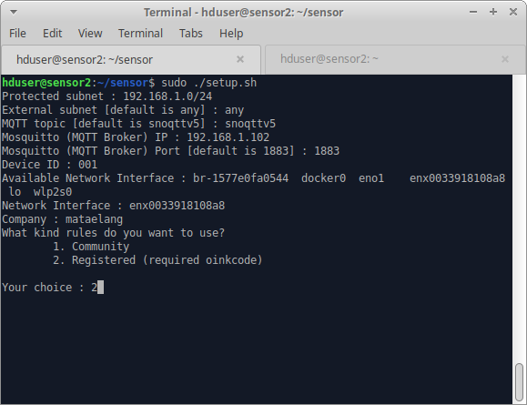
  

  

    some of these questions include :
  

  <ul class="c28 lst-kix_list_23-0 start">
    <li class="c30 c45 c43 li-bullet-3">
      Protected Subnet, here we give an example with 192.168.1.0/24.
    </li>
  </ul>
  

    
  

  <ul class="c28 lst-kix_list_23-0">
    <li class="c30 c45 c43 li-bullet-3">
      External Subnet, here we use the default setup, i.e. any.
    </li>
  </ul>
  

    
  

  <ul class="c28 lst-kix_list_23-0">
    <li class="c30 c45 c43 li-bullet-4">
      MQTT topic (default snoqttv5)
    </li>
  </ul>
  

    
  

  <ul class="c28 lst-kix_list_23-0">
    <li class="c30 c45 c43 li-bullet-8">
      Mosquitto (MQTT Broker), here we give an example IP 192.168.1.102
        (Mosquitto&#39;s IP in the defense center)
    </li>
  </ul>
  

    
  

  <ul class="c28 lst-kix_list_23-0">
    <li class="c30 c45 c43 li-bullet-8">
      Mosquitto (MQTT Broker) PORT, the default PORT is 1883.
    </li>
  </ul>
  

    
  

  <ul class="c28 lst-kix_list_23-0">
    <li class="c30 c45 c43 li-bullet-4">
      Device ID, device ID will be obtained when opening kaspa
        client.
    </li>
  </ul>
  

    
  

  

    Note: To edit Device ID, do the following command
  

  <ol class="c28 lst-kix_list_33-0 start" start="1">
    <li class="c30 c117 c43 li-bullet-8">
      First, open the information contained in the sensor directory, by
        typing the following command.
    </li>
  </ol>
  
  <table class="c88">
    <tbody>
      <tr class="c5">
        <td class="c130" colspan="1" rowspan="1">
          
$ sudo -i

        </td>
      </tr>
    </tbody>
  </table>
  

  

    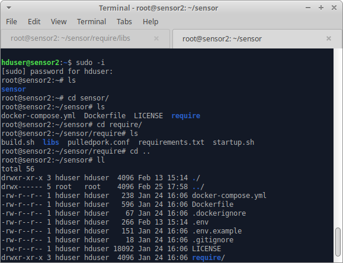
  

  <ol class="c28 lst-kix_list_33-0" start="2">
    <li class="c30 c117 c43 li-bullet-8">
      Navigate the directory to the sensor with the command
      
    </li>
  </ol>
  
  <table class="c88">
    <tbody>
      <tr class="c5">
        <td class="c130" colspan="1" rowspan="1">
          
# cd sensor

        </td>
      </tr>
    </tbody>
  </table>
  

  

    
  

  <ol class="c28 lst-kix_list_33-0" start="3">
    <li class="c30 c117 c43 li-bullet-3">
      Next, look at the contents of the sensor directory, including hidden
        files with the following command. Then there will be a .env file which
        will then be edited
    </li>
  </ol>
  
  <table class="c88">
    <tbody>
      <tr class="c5">
        <td class="c130" colspan="1" rowspan="1">
          
# ll

        </td>
      </tr>
    </tbody>
  </table>
  

  

    when the command is run will display as shown
  

  

    
  

  <ol class="c28 lst-kix_list_33-0" start="4">
    <li class="c30 c43 c117 li-bullet-4">
      Then edit the .env file with the following command
      
    </li>
  </ol>
  
  <table class="c88">
    <tbody>
      <tr class="c5">
        <td class="c130" colspan="1" rowspan="1">
          
# nano .env

        </td>
      </tr>
    </tbody>
  </table>
  

  

    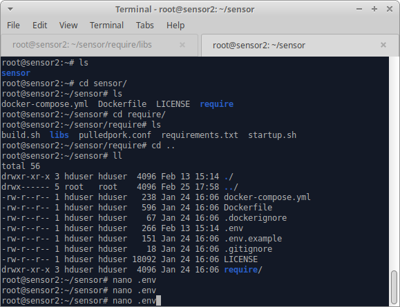
  

  <ol class="c28 lst-kix_list_33-0" start="5">
    <li class="c30 c117 c43 li-bullet-5">
      Change the value from each parameter to match with your
        configuration
    </li>
  </ol>
  

    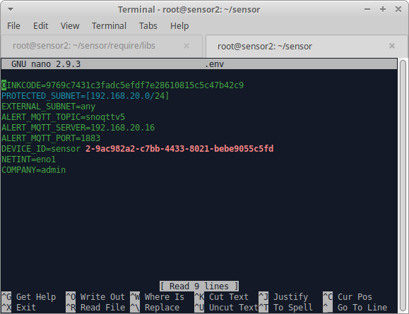
  

  <ul class="c28 lst-kix_list_23-0">
    <li class="c30 c45 c43 li-bullet-4">
      Enter the availability of network interfaces
    </li>
  </ul>
  

    
  

  <ul class="c28 lst-kix_list_23-0">
    <li class="c30 c45 c43 li-bullet-4">
      Network Interfaces: according to the network interfaces used for
        sensors. For example, using a LAN or Wifi, so an active interface will
        appear.
    </li>
  </ul>
  

    
  

  <ul class="c28 lst-kix_list_23-0">
    <li class="c30 c45 c43 li-bullet-3">
      Company (enter your company name)
    </li>
  </ul>
  

    
  

  <ul class="c28 lst-kix_list_23-0">
    <li class="c30 c45 c43 li-bullet-4">
      Your choice (choose according to your needs. Community / Registered
        rules. Here we exemplify by choosing 2 (registered)
    </li>
  </ul>
  

    
  

  <ul class="c28 lst-kix_list_23-0">
    <li class="c30 c45 c43 li-bullet-3">
      Enter the oinkcode you have.
    </li>
  </ul>
  

    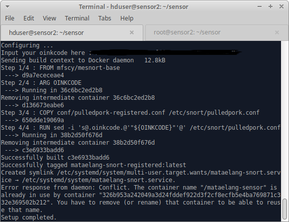
  

  <ol class="c28 lst-kix_list_8-0" start="4">
    <li class="c30 c71 c43 li-bullet-3">
      Turn on the Mata Elang sensor service with the command
    </li>
  </ol>
  
  <table class="c137 c71">
    <tbody>
      <tr class="c5">
        <td class="c145" colspan="1" rowspan="1">
          

            $ sudo systemctl start mataelang-snort
          

        </td>
      </tr>
    </tbody>
  </table>
  

  

    when the command is run will display as shown
  

  

    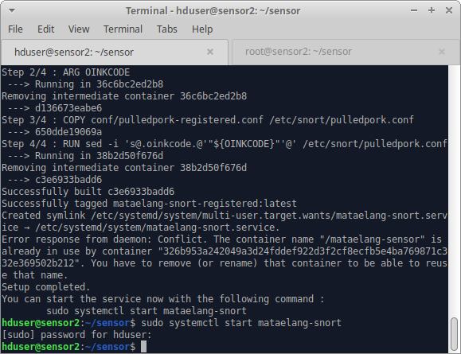
  

  <ol class="c28 lst-kix_list_8-0" start="5">
    <li class="c30 c71 c43 li-bullet-4">
      Installation completed. Now, we can wait for the sensor to download
        the rule while the sensor starting up.
    </li>
  </ol>
  

    

    

  

</body>

</html>