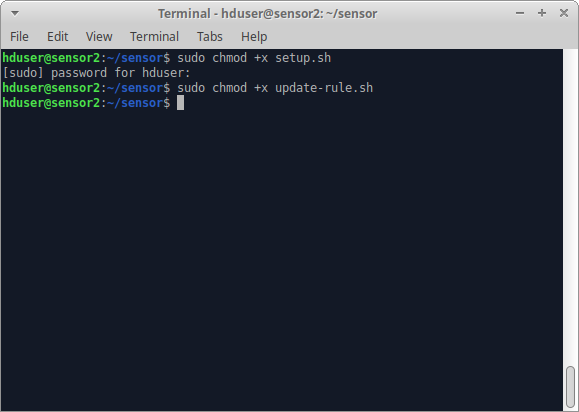

<h1>
  Developer Guide
</h1>
<h2 id="h.30j0zll">
  Mata Elang Intrusion Detection System
</h2>
<h2>Table of Contents</h2>

  <a href="#h.4i7ojhp">Overview of Mata
      Elang</a>&nbsp;&nbsp;&nbsp;&nbsp;&nbsp;&nbsp;&nbsp;&nbsp;<a
      href="#h.4i7ojhp">3</a>

  <a href="#h.2xcytpi">Mata Elang</a>&nbsp;&nbsp;&nbsp;&nbsp;&nbsp;&nbsp;&nbsp;&nbsp;<a
      href="#h.2xcytpi">3</a>

  <a href="#h.1ci93xb">Mata Elang
      Community</a>&nbsp;&nbsp;&nbsp;&nbsp;&nbsp;&nbsp;&nbsp;&nbsp;<a
      href="#h.1ci93xb">3</a>

  <a href="#h.3whwml4">System
      Architecture</a>&nbsp;&nbsp;&nbsp;&nbsp;&nbsp;&nbsp;&nbsp;&nbsp;<a
      href="#h.3whwml4">4</a>

  <a href="#h.2bn6wsx">Data Source</a>&nbsp;&nbsp;&nbsp;&nbsp;&nbsp;&nbsp;&nbsp;&nbsp;<a
      href="#h.2bn6wsx">5</a>

  <a href="#h.qsh70q">Defense
      Center</a>&nbsp;&nbsp;&nbsp;&nbsp;&nbsp;&nbsp;&nbsp;&nbsp;<a
      href="#h.qsh70q">5</a>

  <a href="#h.1pxezwc">Collecting
      Data</a>&nbsp;&nbsp;&nbsp;&nbsp;&nbsp;&nbsp;&nbsp;&nbsp;<a
      href="#h.1pxezwc">5</a>

  <a href="#h.49x2ik5">Processing
      Data</a>&nbsp;&nbsp;&nbsp;&nbsp;&nbsp;&nbsp;&nbsp;&nbsp;<a
      href="#h.49x2ik5">5</a>

  <a href="#h.2p2csry">Storing
      Data</a>&nbsp;&nbsp;&nbsp;&nbsp;&nbsp;&nbsp;&nbsp;&nbsp;<a
      href="#h.2p2csry">6</a>

  <a href="#h.147n2zr">Serving
      Data</a>&nbsp;&nbsp;&nbsp;&nbsp;&nbsp;&nbsp;&nbsp;&nbsp;<a
      href="#h.147n2zr">6</a>

  <a href="#h.3o7alnk">System
      Configuration</a>&nbsp;&nbsp;&nbsp;&nbsp;&nbsp;&nbsp;&nbsp;&nbsp;<a
      href="#h.3o7alnk">7</a>

  <a href="#h.eysnx4dpwebu">Minimum
      configuration</a>&nbsp;&nbsp;&nbsp;&nbsp;&nbsp;&nbsp;&nbsp;&nbsp;<a
      href="#h.eysnx4dpwebu">7</a>

  <a href="#h.2grqrue">System
      configuration</a>&nbsp;&nbsp;&nbsp;&nbsp;&nbsp;&nbsp;&nbsp;&nbsp;<a
      href="#h.2grqrue">7</a>

  <a href="#h.er8kqxpzkk9c">Network
      configuration</a>&nbsp;&nbsp;&nbsp;&nbsp;&nbsp;&nbsp;&nbsp;&nbsp;<a
      href="#h.er8kqxpzkk9c">7</a>

  <a href="#h.jnu6liqyuy6w">Prerequisite for the minimum
      configuration</a>&nbsp;&nbsp;&nbsp;&nbsp;&nbsp;&nbsp;&nbsp;&nbsp;<a
      href="#h.jnu6liqyuy6w">8</a>

  <a href="#h.m0k2jr9xgyc5">Data
      Source</a>&nbsp;&nbsp;&nbsp;&nbsp;&nbsp;&nbsp;&nbsp;&nbsp;<a
      href="#h.m0k2jr9xgyc5">8</a>

  <a href="#h.v6ctr9tipvnl">Defense Center and Serving
      Data</a>&nbsp;&nbsp;&nbsp;&nbsp;&nbsp;&nbsp;&nbsp;&nbsp;<a
      href="#h.v6ctr9tipvnl">8</a>

  <a href="#h.3fwokq0">Settings</a>&nbsp;&nbsp;&nbsp;&nbsp;&nbsp;&nbsp;&nbsp;&nbsp;<a
      href="#h.3fwokq0">9</a>

  <a href="#h.3fwokq0">Basic
      configuration</a>&nbsp;&nbsp;&nbsp;&nbsp;&nbsp;&nbsp;&nbsp;&nbsp;<a
      href="#h.3fwokq0">9</a>

  <a href="#h.x6622txijq3y">System
      configuration</a>&nbsp;&nbsp;&nbsp;&nbsp;&nbsp;&nbsp;&nbsp;&nbsp;<a
      href="#h.x6622txijq3y">10</a>

  <a href="#h.20stsxpug9pj">Network
      configuration</a>&nbsp;&nbsp;&nbsp;&nbsp;&nbsp;&nbsp;&nbsp;&nbsp;<a
      href="#h.20stsxpug9pj">10</a>

  <a href="#h.19c6y18">Settings</a>&nbsp;&nbsp;&nbsp;&nbsp;&nbsp;&nbsp;&nbsp;&nbsp;<a
      href="#h.19c6y18">11</a>

  <a href="#h.19c6y18">Version Control of Source
      Code</a>&nbsp;&nbsp;&nbsp;&nbsp;&nbsp;&nbsp;&nbsp;&nbsp;<a
      href="#h.19c6y18">11</a>

  <a href="#h.3tbugp1">Mata Elang LTS (Long Term Support) Version
      1.0</a>&nbsp;&nbsp;&nbsp;&nbsp;&nbsp;&nbsp;&nbsp;&nbsp;<a
      href="#h.3tbugp1">11</a>

  <a href="#h.28h4qwu">Data Source</a>&nbsp;&nbsp;&nbsp;&nbsp;&nbsp;&nbsp;&nbsp;&nbsp;<a
      href="#h.28h4qwu">12</a>

  <a href="#h.nmf14n">Defence
      Center</a>&nbsp;&nbsp;&nbsp;&nbsp;&nbsp;&nbsp;&nbsp;&nbsp;<a
      href="#h.nmf14n">12</a>

  <a href="#h.37m2jsg">Collecting
      Data</a>&nbsp;&nbsp;&nbsp;&nbsp;&nbsp;&nbsp;&nbsp;&nbsp;<a
      href="#h.37m2jsg">12</a>

  <a href="#h.1mrcu09">Processing
      Data</a>&nbsp;&nbsp;&nbsp;&nbsp;&nbsp;&nbsp;&nbsp;&nbsp;<a
      href="#h.1mrcu09">12</a>

  <a href="#h.46r0co2">Storing
      Data</a>&nbsp;&nbsp;&nbsp;&nbsp;&nbsp;&nbsp;&nbsp;&nbsp;<a
      href="#h.46r0co2">12</a>

  <a href="#h.2lwamvv">Serving
      Data</a>&nbsp;&nbsp;&nbsp;&nbsp;&nbsp;&nbsp;&nbsp;&nbsp;<a
      href="#h.2lwamvv">13</a>

  <a href="#h.111kx3o">License</a>&nbsp;&nbsp;&nbsp;&nbsp;&nbsp;&nbsp;&nbsp;&nbsp;<a
      href="#h.111kx3o">13</a>

  <a href="#h.3l18frh">Standard
      Coding</a>&nbsp;&nbsp;&nbsp;&nbsp;&nbsp;&nbsp;&nbsp;&nbsp;<a
      href="#h.3l18frh">13</a>

  <a href="#h.206ipza">Development and Test
      Environment</a>&nbsp;&nbsp;&nbsp;&nbsp;&nbsp;&nbsp;&nbsp;&nbsp;<a
      href="#h.206ipza">14</a>

  <a href="#h.4k668n3">Key areas to set up in Test
      Environment</a>&nbsp;&nbsp;&nbsp;&nbsp;&nbsp;&nbsp;&nbsp;&nbsp;<a
      href="#h.4k668n3">14</a>

  <a href="#h.2zbgiuw">Process of Sensor Test Environment
      setup</a>&nbsp;&nbsp;&nbsp;&nbsp;&nbsp;&nbsp;&nbsp;&nbsp;<a
      href="#h.2zbgiuw">14</a>

  <a href="#h.1egqt2p">Process of Data Processing Test Environment
      setup</a>&nbsp;&nbsp;&nbsp;&nbsp;&nbsp;&nbsp;&nbsp;&nbsp;<a
      href="#h.1egqt2p">14</a>

  <a href="#h.3ygebqi">Process of Data Serving Test Environment
      setup</a>&nbsp;&nbsp;&nbsp;&nbsp;&nbsp;&nbsp;&nbsp;&nbsp;<a
      href="#h.3ygebqi">15</a>

  <a href="#h.2dlolyb">Test Environment
      Management</a>&nbsp;&nbsp;&nbsp;&nbsp;&nbsp;&nbsp;&nbsp;&nbsp;<a
      href="#h.2dlolyb">15</a>

  <a href="#h.sqyw64">Test Environment
      Checklist</a>&nbsp;&nbsp;&nbsp;&nbsp;&nbsp;&nbsp;&nbsp;&nbsp;<a
      href="#h.sqyw64">16</a>

  <a href="#h.cbz6grohk6un">Contact for
      Inquiry</a>&nbsp;&nbsp;&nbsp;&nbsp;&nbsp;&nbsp;&nbsp;&nbsp;<a
      href="#h.cbz6grohk6un">19</a>

  <a href="#h.1rvwp1q">Revision
      History</a>&nbsp;&nbsp;&nbsp;&nbsp;&nbsp;&nbsp;&nbsp;&nbsp;<a
      href="#h.1rvwp1q">19</a>

  <a href="#h.wbqatkmb2nij">Appendix A: Installation
      manual</a>&nbsp;&nbsp;&nbsp;&nbsp;&nbsp;&nbsp;&nbsp;&nbsp;<a
      href="#h.wbqatkmb2nij">20</a>

  <a href="#h.bcdkvvyvpnx0">Install Data Source ( Sensor
      )</a>&nbsp;&nbsp;&nbsp;&nbsp;&nbsp;&nbsp;&nbsp;&nbsp;<a
      href="#h.bcdkvvyvpnx0">20</a>

  <a href="#h.mjkhxabu0fom">Install
      Mosquitto</a>&nbsp;&nbsp;&nbsp;&nbsp;&nbsp;&nbsp;&nbsp;&nbsp;<a
      href="#h.mjkhxabu0fom">21</a>

  <a href="#h.hn38e7k723ho">Install Apache
      Cassandra</a>&nbsp;&nbsp;&nbsp;&nbsp;&nbsp;&nbsp;&nbsp;&nbsp;<a
      href="#h.hn38e7k723ho">21</a>

  <a href="#h.yb3ld04l31kw">Install
      MongoDB</a>&nbsp;&nbsp;&nbsp;&nbsp;&nbsp;&nbsp;&nbsp;&nbsp;<a
      href="#h.yb3ld04l31kw">24</a>

  <a href="#h.lk8brjnfjaqq">Install Apache Hadoop ( Single Node Cluster Installation
      )</a>&nbsp;&nbsp;&nbsp;&nbsp;&nbsp;&nbsp;&nbsp;&nbsp;<a
      href="#h.lk8brjnfjaqq">25</a>

  <a href="#h.mq35fraz365v">Install
      Confluent</a>&nbsp;&nbsp;&nbsp;&nbsp;&nbsp;&nbsp;&nbsp;&nbsp;<a
      href="#h.mq35fraz365v">29</a>

  <a href="#h.q3tzra4v0b1a">Install Apache
      Spark</a>&nbsp;&nbsp;&nbsp;&nbsp;&nbsp;&nbsp;&nbsp;&nbsp;<a
      href="#h.q3tzra4v0b1a">30</a>

  <a href="#h.5yv1azihd0dc">Install
      Dashboard</a>&nbsp;&nbsp;&nbsp;&nbsp;&nbsp;&nbsp;&nbsp;&nbsp;<a
      href="#h.5yv1azihd0dc">33</a>

  <a href="#h.p282qwd2zpnb">Install Stevia
      Visualization</a>&nbsp;&nbsp;&nbsp;&nbsp;&nbsp;&nbsp;&nbsp;&nbsp;<a
      href="#h.p282qwd2zpnb">34</a>

  <a href="#h.2r0uhxc">Appendix B: Low Bandwidth Installation
      Manual</a>&nbsp;&nbsp;&nbsp;&nbsp;&nbsp;&nbsp;&nbsp;&nbsp;<a
      href="#h.2r0uhxc">34</a>

  <a href="#h.1664s55">Appendix C:
      Troubleshooting</a>&nbsp;&nbsp;&nbsp;&nbsp;&nbsp;&nbsp;&nbsp;&nbsp;<a
      href="#h.1664s55">34</a>

  <a href="#h.idp2g5u449zu">Appendix D: Use Case for Sensor
      Installation</a>&nbsp;&nbsp;&nbsp;&nbsp;&nbsp;&nbsp;&nbsp;&nbsp;<a
      href="#h.idp2g5u449zu">35</a>

<ol start="1">
  <li>
    <h1 id="h.4i7ojhp" style="display: inline">
      Overview of Mata Elang
    </h1>
  </li>
</ol>
<ol start="1">
  <li>
    <h2 id="h.2xcytpi" style="display: inline">
      Mata Elang
    </h2>
  </li>
</ol>

  &nbsp;&nbsp;&nbsp;&nbsp;&nbsp;&nbsp;&nbsp;&nbsp;Many applications are
    beginning to face the challenges of big data, not to mention apps for
    analyzing network traffic [1].
  

  Network Intrusion Detection System (NIDS) is an application that is
    time-sensitive and requires a solution to the big data. Big data
    challenges are usually using the concept of 4V (Volume, Velocity
    Variety, Value). However, in some cases, especially NIDS, it requires a
    deeper understanding of the idea to define it because the
    characteristics of NIDS data do not always meet the concept.[1].
  

  Snort is a signature-based NIDS application that is commonly used. The
    architecture and mechanism cannot be said to be able to face the
    challenges of big data efficiently.
  

  Mata Elang as one of the case studies implementing Snort NIDS as IDS
    uses the following architecture,
  

  &#9679; In existing architecture, sensor placement must be on the same
    physical network with a defense center so that the deployment cost can
    be enormous.
  

  &#9679; Data alert storage is still using a centralized database
    technology, where if the data stored is getting bigger in volume,
    scaling will be severe.
  

  &#9679; Analytic and data aggregation is also carried out using a
    centralized system, so if the data grows more prominent, scaling will be
    critical. Of course, this implementation is not ready when &nbsp;facing
    the challenges of big data.
  

  Therefore, research is needed to prepare Snort NIDS to face the big
    data challenges.

<ol start="2">
  <li>
    <h2 id="h.1ci93xb" style="display: inline">
      Mata Elang Community
    </h2>
  </li>
</ol>

  For ecosystems to work appropriately, communities of participants need
    to exist. These participants should be able to develop products and
    services based on platform resources (via APIs). Experts in the panel
    observed some critical considerations in developing an ecosystem
    community, which include the need, 1) to establish a fair and
    transparent intellectual property model whereby third party developers
    can fairly monetize their developments, 2) to open up the platform to a
    sufficient degree to allow and encourage innovation, 3) to &#39;create
    community&#39; in the sense of enabling the exchange of ideas and
    fostering collaboration, and, 4) to provide an open door for feedback
    from the community about the position and direction of the ecosystem in
    the market.

  By enabling people to invest and create new products and services on
    the platform, the ecosystem can provide a more productive set of options
    to end-users. Moreover, the faster an ecosystem develops a positive
    reputation among developers and thus more join the platform, the more
    difficult and tedious it becomes for others to replicate such a deed.
    This reflects market expectations driving network effects. As more
    developers are attracted to the ecosystem, more users are drawn to new
    products and better services offered.

<ol start="2">
  <li>
    <h1 id="h.3whwml4" style="display: inline">
      System Architecture
    </h1>
  </li>
</ol>

  We will develop a defense center system architecture for a cloud
    environment. The system block diagram for this concept, as shown in
    Figure 1:

  Figure 1. Cloud environment system concept for Snort-cloud-based IDS
    framework

  The sensors or base modules are designed to run in the cloud computing
    environment and can be installed in the different networks from the core
    module (central defense system), as we can see in the system diagram.
    Defense centers will process and analyze reports generated by sensors.
    Figure 2 shows the recommended system architecture for the complete
    system, including the defense center, data source, and data
    serving.

  

  Figure 2. System Architecture Diagram

<ol start="3">
  <li>
    <h2 id="h.2bn6wsx" style="display: inline">
      Data Source
    </h2>
  </li>
</ol>

  The first component of the data source is the IDS sensor. In this
    version of Mata Elang, the sensor use Snort&trade; as the core IDS
    engine. Soon we plan to use various &nbsp; &nbsp;IDS engines e.g
    Suricata, Wazuh, etc. &nbsp;The output of the sensors sent to the
    defense center via some types of transmission protocol, which could
    transport data at the lowest latency as possible. A fast and efficient
    transmission protocol is also mandatory for carrying sensor
    outputs.

<ol start="4">
  <li>
    <h2 id="h.qsh70q" style="display: inline">
      Defense Center
    </h2>
  </li>
</ol>

  The Defense Center is the part of the Mata Elang, the processing of
    which is maximized is the processing of data, from collecting data to
    storing data in a database. The central defense system is divided into
    three parts, namely collecting data, processing data, and storing
    data.

<ol start="1">
  <li>
    <h3 id="h.1pxezwc" style="display: inline">
      Collecting Data
    </h3>
  </li>
</ol>

  The data collection process is a continuation stage after the sensor
    receives data attacks that occur on a network. In conducting data
    collection, the system uses Apache Kafka. Kafka here is a bridge between
    the sensor and spark as the primary data processors. In the process of
    Kafka, the data will be received and processed by the MQTT server. In
    MQTT the data will be processed by coding and simplification using Kafka
    Avro. Then it will be connected to the confluent so that the data is
    ready to proceed to spark via Apache Kafka.

<ol start="2">
  <li>
    <h3 id="h.49x2ik5" style="display: inline">
      Processing Data
    </h3>
  </li>
</ol>

  Data processing in the Mata Elang system uses Apache Spark. The Apache
    Spark feature used in data processing is a streaming feature that can
    record and process data in live time. In streaming processing, a Spark
    will stream brokers to Kafka. The streaming process includes the
    following steps:

<ul>
  <li>
    It deserializes AVRO data with an existing registry scheme.
  </li>
  <li>
    It converts data into data frames for Apache Spark&#39;s data
      abstraction using the map function.
  </li>
  <li>
    It executes the existing data frame aggregation process using the
      subtraction function.
  </li>
  <li>
    It writes to Apache Cassandra.
  </li>
</ul>
<ol start="1">
  <li>
    <h3 id="h.2p2csry" style="display: inline">
      Storing Data
    </h3>
  </li>
</ol>

  The first part of the defense center receiving data streams from remote
    sensors and then split these data into two types of flow process: stream
    job and batch job. The stream job process serves real-time monitoring
    information, while the batch job process is used for analytical data.
  

<ol start="2">
  <li>
    <h3 style="display: inline">
      Serving Data
    </h3>
  </li>
</ol>

  There are two components in the serving data module: dashboards and the
    map.

<ol start="1">
  <li>Dashboard</li>
</ol>

  For the dashboards, we refer to the popular standard metrics for
    network security applications by the SANS Institute. It consists of
    :

<ul>
  <li>
    Event Monitoring. It based on the result of streaming jobs
  </li>
  <li>
    Event Statistics. It based on the result of streaming jobs
  </li>
  <li>
    Top Signatures. It based on the result of batch jobs (the total
      number of &nbsp;event grouped by the signature&#39;s name)
  </li>
  <li>
    Top Protocol. It based on the result of batch jobs (the total number
      of &nbsp;event grouped by the protocol)
  </li>
  <li>
    Sensor Statistics. It based on the result of batch jobs (the total
      number of the event for each sensor)
  </li>
  <li>
    Daily-monthly-annual report
  </li>
  <li>
    User-role-profile-menu-management 
  </li>
</ul>
<ol start="2">
  <li>Maps</li>
</ol>

  A cyber threat map, also known as a cyber attack map, is a real-time
    map of the computer security attacks that are going on at any given
    time. Beams of light, represented by different colors showing where an
    attack comes from and where it is going

<ol start="3">
  <li>
    <h1 style="display: inline">
      System Configuration
    </h1>
  </li>
</ol>
<ol start="1">
  <li>
    <h2 id="h.eysnx4dpwebu" style="display: inline">
      Minimum configuration
    </h2>
  </li>
</ol>

  The minimum configuration is a configuration with one sensor and one
    host of defense center.
  

<ol start="3">
  <li>
    <h3 id="h.2grqrue" style="display: inline">
      System configuration
    </h3>
  </li>
</ol>

  

  Figure 3. System Architecture Diagram

  Figure 3 shows the minimum configuration for Mata Elang with one sensor
    and one monitored network.

<ol start="4">
  <li>
    <h3 id="h.er8kqxpzkk9c" style="display: inline">
      Network configuration
    </h3>
  </li>
</ol>

  Figure 4. Network Topology

  Figure 4 shows the common topology with two switches and one PC for the
    defense center. At a minimum use of the configuration, we only use one
    sensor to monitor the private network. In this case, the sensor is
    placed in a different network address with the defense center.

<ol start="5">
  <li>
    <h3 id="h.jnu6liqyuy6w" style="display: inline">
      Prerequisite for the minimum configuration
    </h3>
  </li>
</ol>
<ol start="1">
  <li>
    <h4 id="h.m0k2jr9xgyc5" style="display: inline">
      Data Source
    </h4>
  </li>
</ol>

<table>
  <tbody>
    <tr>
      <td colspan="1" rowspan="1">
        
Requirements

      </td>
      <td colspan="1" rowspan="1">
        
Version/Model

      </td>
      <td colspan="1" rowspan="1">
        
Quantity

      </td>
      <td colspan="1" rowspan="1">
        
Notes

      </td>
    </tr>
    <tr>
      <td colspan="4" rowspan="1">
        
Hardware

      </td>
    </tr>
    <tr>
      <td colspan="1" rowspan="1">
        
CPU

      </td>
      <td colspan="1" rowspan="1">
        
Intel Core 2 Duo or more

      </td>
      <td colspan="1" rowspan="1">
        
1

      </td>
      <td colspan="1" rowspan="1">
        

      </td>
    </tr>
    <tr>
      <td colspan="1" rowspan="1">
        
LAN card interfaces

      </td>
      <td colspan="1" rowspan="1">
        
1-gigabit ether or more

      </td>
      <td colspan="1" rowspan="1">
        
2

      </td>
      <td colspan="1" rowspan="1">
        

      </td>
    </tr>
    <tr>
      <td colspan="1" rowspan="1">
        
RAM

      </td>
      <td colspan="1" rowspan="1">
        
2GB or more

      </td>
      <td colspan="1" rowspan="1">
        
1

      </td>
      <td colspan="1" rowspan="1">
        

      </td>
    </tr>
    <tr>
      <td colspan="1" rowspan="1">
        
Hardisk

      </td>
      <td colspan="1" rowspan="1">
        
100GB

      </td>
      <td colspan="1" rowspan="1">
        
1

      </td>
      <td colspan="1" rowspan="1">
        

      </td>
    </tr>
    <tr>
      <td colspan="4" rowspan="1">
        
Operating System

      </td>
    </tr>
    <tr>
      <td colspan="1" rowspan="1">
        
Linux Ubuntu Server 

      </td>
      <td colspan="1" rowspan="1">
        
18.04

      </td>
      <td colspan="1" rowspan="1">
        
1

      </td>
      <td colspan="1" rowspan="1">
        

      </td>
    </tr>
    <tr>
      <td colspan="4" rowspan="1">
        
Software

      </td>
    </tr>
    <tr>
      <td colspan="1" rowspan="1">
        
Git

      </td>
      <td colspan="1" rowspan="1">
        
2.7

      </td>
      <td colspan="1" rowspan="1">
        
1

      </td>
      <td colspan="1" rowspan="1">
        

      </td>
    </tr>
    <tr>
      <td colspan="1" rowspan="1">
        
Docker

      </td>
      <td colspan="1" rowspan="1">
        
19.03

      </td>
      <td colspan="1" rowspan="1">
        
1

      </td>
      <td colspan="1" rowspan="1">
        

      </td>
    </tr>
  </tbody>
</table>

  Minimum bandwidth: 10Mbps for installation

<ol start="2">
  <li>
    <h4 id="h.v6ctr9tipvnl" style="display: inline">
      Defense Center and Serving Data
    </h4>
  </li>
</ol>

<table>
  <tbody>
    <tr>
      <td colspan="1" rowspan="1">
        
Requirements

      </td>
      <td colspan="1" rowspan="1">
        
&nbsp;Version/Model

      </td>
      <td colspan="1" rowspan="1">
        
Quantity

      </td>
      <td colspan="1" rowspan="1">
        
Notes

      </td>
    </tr>
    <tr>
      <td colspan="4" rowspan="1">
        
Hardware

      </td>
    </tr>
    <tr>
      <td colspan="1" rowspan="1">
        
CPU 

      </td>
      <td colspan="1" rowspan="1">
        

          Intel Core i7 / Ryzen 7 or more
        

      </td>
      <td colspan="1" rowspan="1">
        
1

      </td>
      <td colspan="1" rowspan="1">
        

      </td>
    </tr>
    <tr>
      <td colspan="1" rowspan="1">
        
LAN card interfaces

      </td>
      <td colspan="1" rowspan="1">
        

          &nbsp;1-gigabit ether or more
        

      </td>
      <td colspan="1" rowspan="1">
        
2

      </td>
      <td colspan="1" rowspan="1">
        

      </td>
    </tr>
    <tr>
      <td colspan="1" rowspan="1">
        
RAM

      </td>
      <td colspan="1" rowspan="1">
        
32GB

      </td>
      <td colspan="1" rowspan="1">
        
1

      </td>
      <td colspan="1" rowspan="1">
        

      </td>
    </tr>
    <tr>
      <td colspan="1" rowspan="1">
        
Hardisk

      </td>
      <td colspan="1" rowspan="1">
        
500GB

      </td>
      <td colspan="1" rowspan="1">
        
1

      </td>
      <td colspan="1" rowspan="1">
        

      </td>
    </tr>
    <tr>
      <td colspan="4" rowspan="1">
        
Operating System

      </td>
    </tr>
    <tr>
      <td colspan="1" rowspan="1">
        
Linux Ubuntu Server

      </td>
      <td colspan="1" rowspan="1">
        
18.04

      </td>
      <td colspan="1" rowspan="1">
        
1

      </td>
      <td colspan="1" rowspan="1">
        

      </td>
    </tr>
    <tr>
      <td colspan="4" rowspan="1">
        
Software

      </td>
    </tr>
    <tr>
      <td colspan="1" rowspan="1">
        
OpenJDK/Oracle Java

      </td>
      <td colspan="1" rowspan="1">
        
8

      </td>
      <td colspan="1" rowspan="1">
        
1

      </td>
      <td colspan="1" rowspan="1">
        

      </td>
    </tr>
    <tr>
      <td colspan="1" rowspan="1">
        
Scala

      </td>
      <td colspan="1" rowspan="1">
        
2.11

      </td>
      <td colspan="1" rowspan="1">
        
1

      </td>
      <td colspan="1" rowspan="1">
        

      </td>
    </tr>
    <tr>
      <td colspan="1" rowspan="1">
        
SBT

      </td>
      <td colspan="1" rowspan="1">
        
1.3

      </td>
      <td colspan="1" rowspan="1">
        
1

      </td>
      <td colspan="1" rowspan="1">
        

      </td>
    </tr>
    <tr>
      <td colspan="1" rowspan="1">
        
Git

      </td>
      <td colspan="1" rowspan="1">
        
2.7

      </td>
      <td colspan="1" rowspan="1">
        
1

      </td>
      <td colspan="1" rowspan="1">
        

      </td>
    </tr>
    <tr>
      <td colspan="1" rowspan="1">
        
Apache Cassandra

      </td>
      <td colspan="1" rowspan="1">
        
3.11

      </td>
      <td colspan="1" rowspan="1">
        
1

      </td>
      <td colspan="1" rowspan="1">
        

      </td>
    </tr>
    <tr>
      <td colspan="1" rowspan="1">
        
Apache Hadoop

      </td>
      <td colspan="1" rowspan="1">
        
3.2

      </td>
      <td colspan="1" rowspan="1">
        
1

      </td>
      <td colspan="1" rowspan="1">
        

      </td>
    </tr>
    <tr>
      <td colspan="1" rowspan="1">
        
MongoDB

      </td>
      <td colspan="1" rowspan="1">
        
4.2

      </td>
      <td colspan="1" rowspan="1">
        
1

      </td>
      <td colspan="1" rowspan="1">
        

      </td>
    </tr>
    <tr>
      <td colspan="1" rowspan="1">
        
Docker

      </td>
      <td colspan="1" rowspan="1">
        
19.03

      </td>
      <td colspan="1" rowspan="1">
        
1

      </td>
      <td colspan="1" rowspan="1">
        

      </td>
    </tr>
    <tr>
      <td colspan="1" rowspan="1">
        
NodeJS

      </td>
      <td colspan="1" rowspan="1">
        
12.14 (LTS)

      </td>
      <td colspan="1" rowspan="1">
        
1

      </td>
      <td colspan="1" rowspan="1">
        

      </td>
    </tr>
    <tr>
      <td colspan="1" rowspan="1">
        
Python

      </td>
      <td colspan="1" rowspan="1">
        
3.5

      </td>
      <td colspan="1" rowspan="1">
        
1

      </td>
      <td colspan="1" rowspan="1">
        

      </td>
    </tr>
  </tbody>
</table>

  Minimum bandwidth: 10Mbps for installation

<ol start="2">
  <li>
    <h2 id="h.3fwokq0" style="display: inline">
      Common configuration
    </h2>
  </li>
</ol>

  Figure 5. System Architecture Diagram

  Figure 5 shows the basic system configuration where the Mata Elang can
    monitor more than one network.
  

<h1 id="h.hm99vhplhrkk">
  
</h1>

Figure 6. Network Topology

  Figure 6 shows the physical network configuration of the Mata Elang for
    multi-sensors &nbsp; containing: &nbsp;two tappers, two sensors, two
    switches, and one defense center

<ol start="4">
  <li>
    <h1 id="h.19c6y18" style="display: inline">
      Version Control of Source Code 
    </h1>
  </li>
</ol>

  We use &nbsp; GitHub as out application version control. Mata Elang
    Project is hosted on Github as a public organization for collaboration.
    (<a
      href="https://www.google.com/url?q=https://github.com/mata-elang-pens&amp;sa=D&amp;source=editors&amp;ust=1613153648879000&amp;usg=AOvVaw1rkd9zaYjbieaVk1ZgPiLn">https://github.com/mata-elang-pens</a>)

  

  Figure 7. Mata Elang Repositories

  The repository of Mata Elang is publicly accessible. Everyone can
    propose changes by forking the repository by using the pull request
    feature. Some sections in Mata Elang Architecture requires additional
    authorization by Mata Elang Founders to change as described in the Strategic Document
    section 5.

<ol start="3">
  <li>
    <h2 id="h.3tbugp1" style="display: inline">
      Mata Elang LTS (Long Term Support) Version 1.0
    </h2>
  </li>
</ol>

  At present, Mata Elang is in version 1.0. It means we do not rule out
    the possibility that Mata Elang will make updates in various aspects.
    So, we will do Long Term Support with the conditions below:

<ol start="6">
  <li>
    <h3 id="h.28h4qwu" style="display: inline">
      Data Source
    </h3>
  </li>
</ol>

  For the Long Term Support version, we do support according to the
    available versions of each requirement. Here is the Long Term Support
    Version for Data Source:

<ul>
  <li>
    Linux Ubuntu Server version 18.04 
  </li>
  <li>
    Python version 3.8.2 
  </li>
  <li>
    Java version 8 
  </li>
  <li>
    Python-PIP version 3.8.2 
  </li>
  <li>
    Docker version 3 
  </li>
  <li>
    Snort version 2.9.15.1 
  </li>
</ul>
<ol start="1">
  <li>
    <h3 id="h.nmf14n" style="display: inline">
      Defense Center
    </h3>
  </li>
</ol>
<ol start="1">
  <li>
    <h4 id="h.37m2jsg" style="display: inline">
      Collecting Data
    </h4>
  </li>
</ol>

  For the Long Term Support version, we do support according to the
    available versions of each requirement. Here is the Long Term Support
    Version for Collecting Data:

<ul>
  <li>
    Linux Ubuntu Server version 18.04 
  </li>
  <li>
    Kafka version included in confluent
  </li>
  <li>
    Zookeeper version included in confluent
  </li>
  <li>
    Mosquitto version 1.6.9
  </li>
  <li>
    Confluent version 5.4.0
  </li>
</ul>
<ol start="1">
  <li>
    <h4 id="h.1mrcu09" style="display: inline">
      Processing Data
    </h4>
  </li>
</ol>

  For the Long Term Support version, we do support according to the
    available versions of each requirement. Here is the Long Term Support
    Version for Processing Data:

<ul>
  <li>
    Linux Ubuntu Server version 18.04
  </li>
  <li>
    Java version 8
  </li>
  <li>
    Scala version 2.11
  </li>
  <li>
    Apache Spark version 2.3.4
  </li>
  <li>
    Apache Hadoop version 2.10.0
  </li>
</ul>
<ol start="1">
  <li>
    <h4 id="h.46r0co2" style="display: inline">
      Storing Data
    </h4>
  </li>
</ol>

  For the Long Term Support version, we do support according to the
    available versions of each requirement. Here is the Long Term Support
    Version for Storing Data:

<ul>
  <li>
    Linux Ubuntu Server version 18.04
  </li>
  <li>
    MongoDB version 4.2.3
  </li>
</ul>
<ul>
  <li>
    Java version 8
  </li>
</ul>
<ul>
  <li>
    Apache Hadoop version 2.10.0
  </li>
  <li>
    Apache Cassandra version 3.11.6
  </li>
</ul>
<ol start="1">
  <li>
    <h4 id="h.2lwamvv" style="display: inline">
      Serving Data
    </h4>
  </li>
</ol>

  For the Long Term Support version, we do support according to the
    available versions of each requirement. Here is the Long Term Support
    Version for Serving Data:

<ul>
  <li>
    Python version 3
  </li>
  <li>
    NodeJs version 12.16.1 LTS
  </li>
</ul>
<ol start="1">
  <li>
    <h2 id="h.111kx3o" style="display: inline">
      License
    </h2>
  </li>
</ol>

  We considered using GNU GPLv2. By using this license, we may charge a
    fee for the physical act of transferring a copy and there is a
    possibility to offer professional support and warranty protection in
    exchange for a fee.

<ol start="5">
  <li>
    <h1 id="h.3l18frh" style="display: inline">
      Standard Coding
    </h1>
  </li>
</ol>

  The Mata Elang source code consists of several programming and
    scripting languages. The scripting language is used for automating build
    and docker containers for sensors.

  For this reason, we standardized coding scheme for extensible
    development reasons:

<ul>
  <li>
    No more than a single statement per line, for bash scripting, there
      might be a pipelining (||) or chaining (&amp;&amp;), so it is
      separated by a backslash and the new line between statements.
  </li>
  <li>
    Comments must be added for understandable reasons in every statement
      context.
  </li>
  <li>
    Use of the information before including the coding script
  </li>
  <li>
    Naming variables are adjusted globally for easy understand by others
    
  </li>
  <li>
    Error handling will be explained in the troubleshooting section in
      Appendix C
  </li>
</ul>

<ol start="6">
  <li>
    <h1 id="h.206ipza" style="display: inline">
      Development and Test Environment
    </h1>
  </li>
</ol>
<ol start="1">
  <li>
    <h2 id="h.4k668n3" style="display: inline">
      &nbsp;Key areas to set up in Test Environment
    </h2>
  </li>
</ol>
<ol start="1">
  <li>
    System and applications
  </li>
  <li>Test Data</li>
  <li>
    Database server
  </li>
  <li>
    Front-end running environment
  </li>
  <li>
    Client operating system
  </li>
  <li>Browser</li>
  <li>
    Hardware includes server operating system
  </li>
  <li>Network</li>
  <li>
    Document required for testing like reference documents/configuration
      guides/installation guides/user manuals
  </li>
</ol>
<ol start="1">
  <li>
    <h2 id="h.2zbgiuw" style="display: inline">
      Process of Sensor Test Environment setup
    </h2>
  </li>
</ol>
<ol start="1">
  <li>
    Setup of Test Server
  </li>
</ol>
<ol start="1">
  <li>
    Install GNU Linux Operating System
  </li>
  <li>
    Install Python3, Python3-PIP, and Docker packages
  </li>
  <li>
    Install Mata Elang Sensors
  </li>
</ol>
<ol start="2">
  <li>
    Setup of Network
  </li>
</ol>
<ol start="1">
  <li>
    Internet Setup
  </li>
  <li>
    LAN/WIFI Setup
  </li>
  <li>
    Private Network Setup
  </li>
</ol>
<ol start="3">
  <li>
    Test of Server Setup
  </li>
</ol>
<ol start="1">
  <li>
    Check Python3, Python3-PIP, and Docker installation.
  </li>
  <li>
    Check whether the Mata Elang sensor service is working properly
  </li>
  <li>
    Checking the connection between Mata Elang sensor and Mata Elang
      Cloud System established
  </li>
  <li>
    I was checking whether the server can send data to MQTT Broker.
  </li>
</ol>
<ol start="4">
  <li>
    Bug Reporting
  </li>
</ol>
<ol start="1">
  <li>
    <h2 id="h.1egqt2p" style="display: inline">
      Process of Data Processing Test Environment setup
    </h2>
  </li>
</ol>
<ol start="1">
  <li>
    Setup of Test Server
  </li>
</ol>
<ol start="1">
  <li>
    Install GNU Linux Operating System
  </li>
  <li>
    Install Java 8 (JDK and JRE)
  </li>
  <li>
    Install Scala
  </li>
  <li>
    Install SBT
  </li>
  <li>
    Install Apache Hadoop
  </li>
  <li>
    Install Apache Spark
  </li>
</ol>
<ol start="2">
  <li>
    Setup of Network
  </li>
</ol>
<ol start="1">
  <li>
    Internet Setup
  </li>
  <li>
    LAN/WIFI Setup
  </li>
  <li>
    Private Network Setup
  </li>
</ol>
<ol start="3">
  <li>
    Test of Server Setup
  </li>
</ol>
<ol start="1">
  <li>
    Checking whether the Big Data platform is working properly
  </li>
</ol>
<ol start="4">
  <li>
    Bug Reporting
  </li>
  <li>
    Creating/Collecting Test Data for the Test Environment
  </li>
</ol>
<ol start="1">
  <li>
    <h2 id="h.3ygebqi" style="display: inline">
      Process of Data Serving Test Environment setup
    </h2>
  </li>
</ol>
<ol start="1">
  <li>
    Setup of Test Server
  </li>
</ol>
<ol start="1">
  <li>
    Install GNU Linux Operating System
  </li>
  <li>
    Install NodeJS and NPM packages
  </li>
  <li>
    Install NodeJS dependencies using `npm install`
  </li>
</ol>
<ol start="2">
  <li>
    Setup of Network
  </li>
  <li>
    Test of Server Setup
  </li>
</ol>
<ol start="1">
  <li>
    Checking whether rest API application can make a connection to
      database server
  </li>
  <li>
    Checking whether rest API is accessible by other client using Server
      IP
  </li>
</ol>
<ol start="4">
  <li>
    Bug Reporting
  </li>
</ol>
<ol start="1">
  <li>
    <h2 id="h.2dlolyb" style="display: inline">
      Test Environment Management
    </h2>
  </li>
</ol>
<ol start="1">
  <li>
    Maintenance of the server with all the updated versions of test
      environments.
  </li>
  <li>
    Monitoring of the environment.
  </li>
  <li>
    Updating/deleting outdated test-environments.
  </li>
  <li>
    Investigation of issues on the environment.
  </li>
</ol>
<ol start="1">
  <li>
    <h2 id="h.sqyw64" style="display: inline">
      Test Environment Checklist
    </h2>
  </li>
</ol>
<ol start="1">
  <li>
    Sensor Environment
  </li>
</ol>

<table>
  <tbody>
    <tr>
      <td colspan="1" rowspan="2">
        
Requirements

      </td>
      <td colspan="2" rowspan="1">
        
Status

      </td>
      <td colspan="1" rowspan="2">
        
Command Check

      </td>
    </tr>
    <tr>
      <td colspan="1" rowspan="1">
        
Yes

      </td>
      <td colspan="1" rowspan="1">
        
No

      </td>
    </tr>
    <tr>
      <td colspan="4" rowspan="1">
        
Hardware

      </td>
    </tr>
    <tr>
      <td colspan="1" rowspan="1">
        
CPU Intel Core 2 Duo

      </td>
      <td colspan="1" rowspan="1">
        

      </td>
      <td colspan="1" rowspan="1">
        

      </td>
      <td colspan="1" rowspan="1">
        

          lshw -short | grep processor
        

      </td>
    </tr>
    <tr>
      <td colspan="1" rowspan="1">
        
LAN card interfaces

      </td>
      <td colspan="1" rowspan="1">
        

      </td>
      <td colspan="1" rowspan="1">
        

      </td>
      <td colspan="1" rowspan="1">
        

          lshw -short | grep network
        

      </td>
    </tr>
    <tr>
      <td colspan="1" rowspan="1">
        
RAM 2GB

      </td>
      <td colspan="1" rowspan="1">
        

      </td>
      <td colspan="1" rowspan="1">
        

      </td>
      <td colspan="1" rowspan="1">
        
lshw -short | grep memory

      </td>
    </tr>
    <tr>
      <td colspan="1" rowspan="1">
        
Hardisk 100GB

      </td>
      <td colspan="1" rowspan="1">
        

      </td>
      <td colspan="1" rowspan="1">
        

      </td>
      <td colspan="1" rowspan="1">
        
lshw -short | grep disk

      </td>
    </tr>
    <tr>
      <td colspan="4" rowspan="1">
        
Software

      </td>
    </tr>
    <tr>
      <td colspan="1" rowspan="1">
        
Linux Ubuntu server 18.04

      </td>
      <td colspan="1" rowspan="1">
        

      </td>
      <td colspan="1" rowspan="1">
        

      </td>
      <td colspan="1" rowspan="1">
        
cat /etc/os-release

      </td>
    </tr>
    <tr>
      <td colspan="1" rowspan="1">
        
Git

      </td>
      <td colspan="1" rowspan="1">
        

      </td>
      <td colspan="1" rowspan="1">
        

      </td>
      <td colspan="1" rowspan="1">
        
git --version

      </td>
    </tr>
    <tr>
      <td colspan="1" rowspan="1">
        
Docker

      </td>
      <td colspan="1" rowspan="1">
        

      </td>
      <td colspan="1" rowspan="1">
        

      </td>
      <td colspan="1" rowspan="1">
        
docker -v

      </td>
    </tr>
  </tbody>
</table>

<ol start="2">
  <li id="h.gjdgxs">
    Data Processing Environment
  </li>
</ol>

<table>
  <tbody>
    <tr>
      <td colspan="1" rowspan="2">
        
Requirements

      </td>
      <td colspan="2" rowspan="1">
        
Status

      </td>
      <td colspan="1" rowspan="2">
        
Command Check

      </td>
    </tr>
    <tr>
      <td colspan="1" rowspan="1">
        
Yes

      </td>
      <td colspan="1" rowspan="1">
        
No

      </td>
    </tr>
    <tr>
      <td colspan="4" rowspan="1">
        
Hardware

      </td>
    </tr>
    <tr>
      <td colspan="1" rowspan="1">
        

          CPU Intel Core i7 / Ryzen 7
        

      </td>
      <td colspan="1" rowspan="1">
        

      </td>
      <td colspan="1" rowspan="1">
        

      </td>
      <td colspan="1" rowspan="1">
        

          lshw -short | grep processor
        

      </td>
    </tr>
    <tr>
      <td colspan="1" rowspan="1">
        
LAN card interfaces

      </td>
      <td colspan="1" rowspan="1">
        

      </td>
      <td colspan="1" rowspan="1">
        

      </td>
      <td colspan="1" rowspan="1">
        

          lshw -short | grep network
        

      </td>
    </tr>
    <tr>
      <td colspan="1" rowspan="1">
        
RAM 16 GB

      </td>
      <td colspan="1" rowspan="1">
        

      </td>
      <td colspan="1" rowspan="1">
        

      </td>
      <td colspan="1" rowspan="1">
        
lshw -short | grep memory

      </td>
    </tr>
    <tr>
      <td colspan="1" rowspan="1">
        
Hardisk 500GB

      </td>
      <td colspan="1" rowspan="1">
        

      </td>
      <td colspan="1" rowspan="1">
        

      </td>
      <td colspan="1" rowspan="1">
        
lshw -short | grep disk

      </td>
    </tr>
    <tr>
      <td colspan="4" rowspan="1">
        
Software

      </td>
    </tr>
    <tr>
      <td colspan="1" rowspan="1">
        
Linux ubuntu server 18.04

      </td>
      <td colspan="1" rowspan="1">
        

      </td>
      <td colspan="1" rowspan="1">
        

      </td>
      <td colspan="1" rowspan="1">
        
cat /etc/os-release

      </td>
    </tr>
    <tr>
      <td colspan="1" rowspan="1">
        
Java 8

      </td>
      <td colspan="1" rowspan="1">
        

      </td>
      <td colspan="1" rowspan="1">
        

      </td>
      <td colspan="1" rowspan="1">
        
java -version

      </td>
    </tr>
    <tr>
      <td colspan="1" rowspan="1">
        
Scala

      </td>
      <td colspan="1" rowspan="1">
        

      </td>
      <td colspan="1" rowspan="1">
        

      </td>
      <td colspan="1" rowspan="1">
        
scala -version

      </td>
    </tr>
    <tr>
      <td colspan="1" rowspan="1">
        
SBT

      </td>
      <td colspan="1" rowspan="1">
        

      </td>
      <td colspan="1" rowspan="1">
        

      </td>
      <td colspan="1" rowspan="1">
        
sbt --version

      </td>
    </tr>
    <tr>
      <td colspan="1" rowspan="1">
        
Git

      </td>
      <td colspan="1" rowspan="1">
        

      </td>
      <td colspan="1" rowspan="1">
        

      </td>
      <td colspan="1" rowspan="1">
        
git --version

      </td>
    </tr>
  </tbody>
</table>

<ol start="3">
  <li>
    Data Storing Environment
  </li>
</ol>

<table>
  <tbody>
    <tr>
      <td colspan="1" rowspan="2">
        
Requirements

      </td>
      <td colspan="2" rowspan="1">
        
Status

      </td>
      <td colspan="1" rowspan="2">
        
Command Check

      </td>
    </tr>
    <tr>
      <td colspan="1" rowspan="1">
        
Yes

      </td>
      <td colspan="1" rowspan="1">
        
No

      </td>
    </tr>
    <tr>
      <td colspan="4" rowspan="1">
        
Hardware

      </td>
    </tr>
    <tr>
      <td colspan="1" rowspan="1">
        
CPU Intel Core i3

      </td>
      <td colspan="1" rowspan="1">
        

      </td>
      <td colspan="1" rowspan="1">
        

      </td>
      <td colspan="1" rowspan="1">
        

          lshw -short | grep processor
        

      </td>
    </tr>
    <tr>
      <td colspan="1" rowspan="1">
        
LAN card interfaces

      </td>
      <td colspan="1" rowspan="1">
        

      </td>
      <td colspan="1" rowspan="1">
        

      </td>
      <td colspan="1" rowspan="1">
        

          lshw -short | grep network
        

      </td>
    </tr>
    <tr>
      <td colspan="1" rowspan="1">
        
RAM 4GB

      </td>
      <td colspan="1" rowspan="1">
        

      </td>
      <td colspan="1" rowspan="1">
        

      </td>
      <td colspan="1" rowspan="1">
        
lshw -short | grep memory

      </td>
    </tr>
    <tr>
      <td colspan="1" rowspan="1">
        
Hardisk 500 GB

      </td>
      <td colspan="1" rowspan="1">
        

      </td>
      <td colspan="1" rowspan="1">
        

      </td>
      <td colspan="1" rowspan="1">
        
lshw -short | grep disk

      </td>
    </tr>
    <tr>
      <td colspan="4" rowspan="1">
        
Software

      </td>
    </tr>
    <tr>
      <td colspan="1" rowspan="1">
        
Linux ubuntu server 18.04

      </td>
      <td colspan="1" rowspan="1">
        

      </td>
      <td colspan="1" rowspan="1">
        

      </td>
      <td colspan="1" rowspan="1">
        
cat /etc/os-release

      </td>
    </tr>
    <tr>
      <td colspan="1" rowspan="1">
        
Mongodb

      </td>
      <td colspan="1" rowspan="1">
        

      </td>
      <td colspan="1" rowspan="1">
        

      </td>
      <td colspan="1" rowspan="1">
        
mongod --version

      </td>
    </tr>
    <tr>
      <td colspan="1" rowspan="1">
        
Apache Cassandra

      </td>
      <td colspan="1" rowspan="1">
        

      </td>
      <td colspan="1" rowspan="1">
        

      </td>
      <td colspan="1" rowspan="1">
        
cqlsh

      </td>
    </tr>
    <tr>
      <td colspan="1" rowspan="1">
        
Apache Hadoop

      </td>
      <td colspan="1" rowspan="1">
        

      </td>
      <td colspan="1" rowspan="1">
        

      </td>
      <td colspan="1" rowspan="1">
        
hadoop version

      </td>
    </tr>
  </tbody>
</table>

<ol start="4">
  <li>
    Data Serving Environment
  </li>
</ol>

<table>
  <tbody>
    <tr>
      <td colspan="1" rowspan="2">
        
Requirements

      </td>
      <td colspan="2" rowspan="1">
        
Status

      </td>
      <td colspan="1" rowspan="2">
        
Command Check

      </td>
    </tr>
    <tr>
      <td colspan="1" rowspan="1">
        
Yes

      </td>
      <td colspan="1" rowspan="1">
        
No

      </td>
    </tr>
    <tr>
      <td colspan="4" rowspan="1">
        
Hardware

      </td>
    </tr>
    <tr>
      <td colspan="1" rowspan="1">
        
CPU Intel Core 2 Duo

      </td>
      <td colspan="1" rowspan="1">
        

      </td>
      <td colspan="1" rowspan="1">
        

      </td>
      <td colspan="1" rowspan="1">
        

          lshw -short | grep processor
        

      </td>
    </tr>
    <tr>
      <td colspan="1" rowspan="1">
        
LAN card interfaces

      </td>
      <td colspan="1" rowspan="1">
        

      </td>
      <td colspan="1" rowspan="1">
        

      </td>
      <td colspan="1" rowspan="1">
        

          lshw -short | grep network
        

      </td>
    </tr>
    <tr>
      <td colspan="1" rowspan="1">
        
RAM 4GB

      </td>
      <td colspan="1" rowspan="1">
        

      </td>
      <td colspan="1" rowspan="1">
        

      </td>
      <td colspan="1" rowspan="1">
        
lshw -short | grep memory

      </td>
    </tr>
    <tr>
      <td colspan="1" rowspan="1">
        
Hardisk 500 GB

      </td>
      <td colspan="1" rowspan="1">
        

      </td>
      <td colspan="1" rowspan="1">
        

      </td>
      <td colspan="1" rowspan="1">
        
lshw -short | grep disk

      </td>
    </tr>
    <tr>
      <td colspan="4" rowspan="1">
        
Software

      </td>
    </tr>
    <tr>
      <td colspan="1" rowspan="1">
        
Linux ubuntu server 18.04

      </td>
      <td colspan="1" rowspan="1">
        

      </td>
      <td colspan="1" rowspan="1">
        

      </td>
      <td colspan="1" rowspan="1">
        
cat /etc/os-release

      </td>
    </tr>
    <tr>
      <td colspan="1" rowspan="1">
        
Node JS

      </td>
      <td colspan="1" rowspan="1">
        

      </td>
      <td colspan="1" rowspan="1">
        

      </td>
      <td colspan="1" rowspan="1">
        
node -v

      </td>
    </tr>
    <tr>
      <td colspan="1" rowspan="1">
        
Git

      </td>
      <td colspan="1" rowspan="1">
        

      </td>
      <td colspan="1" rowspan="1">
        

      </td>
      <td colspan="1" rowspan="1">
        
git --version

      </td>
    </tr>
  </tbody>
</table>

<ol start="7">
  <li>
    <h1 id="h.cbz6grohk6un" style="display: inline">
      Contact for Inquiry
    </h1>
  </li>
</ol>

  Mata Elang Lead Developer Team, Mr. Ferry Astika Saputra, Department of
    Informatics and Computer Engineering, Politeknik Elektronika Negeri
    Surabaya (PENS), Email: ferryas@pens.ac.id, Phone +62-82139214988.

<ol start="8">
  <li>
    <h1 id="h.1rvwp1q" style="display: inline">
      Revision History
    </h1>
  </li>
</ol>

<table>
  <tbody>
    <tr>
      <td colspan="1" rowspan="1">
        
Version

      </td>
      <td colspan="1" rowspan="1">
        
Date

      </td>
      <td colspan="1" rowspan="1">
        
PIC

      </td>
      <td colspan="1" rowspan="1">
        
ToC

      </td>
      <td colspan="1" rowspan="1">
        
Revised content

      </td>
    </tr>
    <tr>
      <td colspan="1" rowspan="1">
        
1

      </td>
      <td colspan="1" rowspan="1">
        
14 Dec 2019

      </td>
      <td colspan="1" rowspan="1">
        
PTI

      </td>
      <td colspan="1" rowspan="1">
        
-

      </td>
      <td colspan="1" rowspan="1">
        
-

      </td>
    </tr>
    <tr>
      <td colspan="1" rowspan="1">
        
2

      </td>
      <td colspan="1" rowspan="1">
        
20 Dec 2019

      </td>
      <td colspan="1" rowspan="1">
        
PTI

      </td>
      <td colspan="1" rowspan="1">
        
-

      </td>
      <td colspan="1" rowspan="1">
        
-

      </td>
    </tr>
    <tr>
      <td colspan="1" rowspan="1">
        
3

      </td>
      <td colspan="1" rowspan="1">
        
26 Dec 2019

      </td>
      <td colspan="1" rowspan="1">
        
PTI

      </td>
      <td colspan="1" rowspan="1">
        
-

      </td>
      <td colspan="1" rowspan="1">
        
-

      </td>
    </tr>
    <tr>
      <td colspan="1" rowspan="1">
        
4

      </td>
      <td colspan="1" rowspan="1">
        
31 Dec 2019

      </td>
      <td colspan="1" rowspan="1">
        
PTI

      </td>
      <td colspan="1" rowspan="1">
        
-

      </td>
      <td colspan="1" rowspan="1">
        
-

      </td>
    </tr>
    <tr>
      <td colspan="1" rowspan="1">
        
5

      </td>
      <td colspan="1" rowspan="1">
        
10 Jan 2020

      </td>
      <td colspan="1" rowspan="1">
        
PTI

      </td>
      <td colspan="1" rowspan="1">
        
-

      </td>
      <td colspan="1" rowspan="1">
        
-

      </td>
    </tr>
    <tr>
      <td colspan="1" rowspan="1">
        
6

      </td>
      <td colspan="1" rowspan="1">
        
21 Feb 2020

      </td>
      <td colspan="1" rowspan="1">
        

      </td>
      <td colspan="1" rowspan="1">
        
3,4

      </td>
      <td colspan="1" rowspan="1">
        

          Added system configuration and long term support versions
        

      </td>
    </tr>
    <tr>
      <td colspan="1" rowspan="1">
        

      </td>
      <td colspan="1" rowspan="1">
        

      </td>
      <td colspan="1" rowspan="1">
        

      </td>
      <td colspan="1" rowspan="1">
        

      </td>
      <td colspan="1" rowspan="1">
        

      </td>
    </tr>
    <tr>
      <td colspan="1" rowspan="1">
        

      </td>
      <td colspan="1" rowspan="1">
        

      </td>
      <td colspan="1" rowspan="1">
        

      </td>
      <td colspan="1" rowspan="1">
        

      </td>
      <td colspan="1" rowspan="1">
        

      </td>
    </tr>
    <tr>
      <td colspan="1" rowspan="1">
        

      </td>
      <td colspan="1" rowspan="1">
        

      </td>
      <td colspan="1" rowspan="1">
        

      </td>
      <td colspan="1" rowspan="1">
        

      </td>
      <td colspan="1" rowspan="1">
        

      </td>
    </tr>
  </tbody>
</table>

<h1 id="h.4bvk7pj"></h1>
<h1 id="h.wbqatkmb2nij">
  Appendix A: Installation manual
</h1>
<ol start="1">
  <li>
    <h2 id="h.bcdkvvyvpnx0" style="display: inline">
      Install Data Source ( Sensor )
    </h2>
  </li>
</ol>
<ol start="1">
  <li>
    Installing Docker <a
        href="https://www.google.com/url?q=https://docs.docker.com/install/&amp;sa=D&amp;source=editors&amp;ust=1613153648966000&amp;usg=AOvVaw3XIQB6SFWp1xCRMMtH5v1e">https://docs.docker.com/install/</a>
  </li>
  <li>
    Enable Docker Service
  </li>
</ol>

<table>
  <tbody>
    <tr>
      <td colspan="1" rowspan="1">
        

          $ sudo systemctl enable docker
        

        

          $ sudo systemctl start docker
        

      </td>
    </tr>
  </tbody>
</table>
<ol start="3">
  <li>
    Server preparation, configure the network interface to in promiscuous
      mode. Install ifupdown&nbsp;package. Then, edit
    /etc/network/interfaces&nbsp;file, add some line like the
      down below:
  </li>
</ol>

<table>
  <tbody>
    <tr>
      <td colspan="1" rowspan="1">
        
auto eth1

        

          iface eth1 inet manual
        

        

          &nbsp; &nbsp;up ip address add 0/0 dev eth1
        

        

          &nbsp; &nbsp;up ip link set eth1 up
        

        

          &nbsp; &nbsp;up ip link set eth1 promisc on
        

        

          &nbsp; &nbsp;down ip link set eth1 promisc off
        

        

          &nbsp; &nbsp;down ip link set eth1 down
        

        

        
auto eth2

        
iface eth2 inet dhcp

      </td>
    </tr>
  </tbody>
</table>

Note: 

<ul>
  <li>
    Don&#39;t forget to change the eth1&nbsp;and
    eth2&nbsp;with your server network interface name
  </li>
  <li>
    eth1&nbsp;must be connected to the tapper port where the port is set for
      mirroring destination port
  </li>
</ul>
<ol start="4">
  <li>
    Restart network service or restart your server
  </li>
</ol>

<table>
  <tbody>
    <tr>
      <td colspan="1" rowspan="1">
        

          $ sudo systemctl restart networking
        

      </td>
    </tr>
  </tbody>
</table>
<ol start="5">
  <li>
    Download Sensor Installer from <a
        href="https://www.google.com/url?q=https://github.com/mata-elang-pens/sensor-installer&amp;sa=D&amp;source=editors&amp;ust=1613153648973000&amp;usg=AOvVaw0wqsyXPbbQjjwQf4J2BjPc">mata-elang-pens/sensor-installer</a>&nbsp;GitHub
      repository
      (https://github.com/mata-elang-pens/sensor-installer)
  </li>
  <li>
    Add executable permission to setup.sh
  </li>
</ol>

<table>
  <tbody>
    <tr>
      <td colspan="1" rowspan="1">
        

          $ sudo chmod +x setup.sh
        

        

          $ sudo chmod +x update-rule.sh
        

      </td>
    </tr>
  </tbody>
</table>
<ol start="7">
  <li>
    Run the setup.sh script with the following command and wait until the
      setup finished
  </li>
</ol>

<table>
  <tbody>
    <tr>
      <td colspan="1" rowspan="1">
        
$ sudo ./setup.sh

      </td>
    </tr>
  </tbody>
</table>

<ol start="8">
  <li>
    To Update Snort Rules use this command :
  </li>
</ol>

<table>
  <tbody>
    <tr>
      <td colspan="1" rowspan="1">
        

          $ sudo ./update-rule.sh
        

      </td>
    </tr>
  </tbody>
</table>

<ol start="2">
  <li>
    <h2 id="h.mjkhxabu0fom" style="display: inline">
      Install Mosquitto
    </h2>
  </li>
</ol>
<ol start="1">
  <li>
    Update APT index and install the new Ubuntu Package Update
  </li>
</ol>

<table>
  <tbody>
    <tr>
      <td colspan="1" rowspan="1">
        
$ sudo apt update

        
$ sudo apt upgrade

      </td>
    </tr>
  </tbody>
</table>

<ol start="2">
  <li>
    Install mosquitto using APT
  </li>
</ol>

<table>
  <tbody>
    <tr>
      <td colspan="1" rowspan="1">
        

          $ sudo apt install mosquitto mosquitto-clients
        

      </td>
    </tr>
  </tbody>
</table>

<ol start="3">
  <li>
    Enable mosquitto service
  </li>
</ol>

<table>
  <tbody>
    <tr>
      <td colspan="1" rowspan="1">
        

          $ sudo systemctl enable mosquitto.service
        

      </td>
    </tr>
  </tbody>
</table>

<ol start="4">
  <li>
    Start mosquitto service
  </li>
</ol>

<table>
  <tbody>
    <tr>
      <td colspan="1" rowspan="1">
        

          $ sudo systemctl start mosquitto.service
        

      </td>
    </tr>
  </tbody>
</table>
<ol start="3">
  <li>
    <h2 id="h.hn38e7k723ho" style="display: inline">
      Install Apache Cassandra
    </h2>
  </li>
</ol>
<ol start="1">
  <li>
    Add Cassandra Debian Repository
  </li>
</ol>

<table>
  <tbody>
    <tr>
      <td colspan="1" rowspan="1">
        

          $ echo &ldquo;deb <a
              href="https://www.google.com/url?q=http://www.apache.org/dist/cassandra/debian&amp;sa=D&amp;source=editors&amp;ust=1613153648982000&amp;usg=AOvVaw1M4l4LghZFCPpJuslK7RFs">http://www.apache.org/dist/cassandra/debian</a>&nbsp;36x
            main&rdquo; | sudo tee -a
            /etc/apt/sources.list.d/cassandra.list
        

      </td>
    </tr>
  </tbody>
</table>

<ol start="2">
  <li>
    Import the Cassandra Repository key
  </li>
</ol>

<table>
  <tbody>
    <tr>
      <td colspan="1" rowspan="1">
        

          $ curl https://downloads.apache.org/cassandra/KEYS | sudo
            apt-key add -
        

      </td>
    </tr>
  </tbody>
</table>

<ol start="3">
  <li>
    Update the APT index
  </li>
</ol>

<table>
  <tbody>
    <tr>
      <td colspan="1" rowspan="1">
        
$ sudo apt update

      </td>
    </tr>
  </tbody>
</table>

<ol start="4">
  <li>
    If there&#39;s an error &quot;GPG error: <a
        href="https://www.google.com/url?q=http://www.apache.org/&amp;sa=D&amp;source=editors&amp;ust=1613153648985000&amp;usg=AOvVaw1f-hV-I3UxW9JwEZ38hsxL">http://www.apache.org</a>&nbsp;36x
      InRelease: The following signatures couldn&#39;t be
      verified because the public key is not available: NO_PUBKEY
      A278B781FE4B2BDA&quot;
  </li>
</ol>

<table>
  <tbody>
    <tr>
      <td colspan="1" rowspan="1">
        

          $ sudo apt-key adv --keyserver pool.sks-keyservers.net
            --recv-key A278B781FE4B2BDA
        

        
$ sudo apt update

      </td>
    </tr>
  </tbody>
</table>

<ol start="5">
  <li>
    Install Cassandra using APT
  </li>
</ol>

<table>
  <tbody>
    <tr>
      <td colspan="1" rowspan="1">
        

          $ sudo apt install cassandra
        

      </td>
    </tr>
  </tbody>
</table>

<ol start="6">
  <li>
    Enable Cassandra Service
  </li>
</ol>

<table>
  <tbody>
    <tr>
      <td colspan="1" rowspan="1">
        

          $ sudo systemctl enable cassandra.service
        

      </td>
    </tr>
  </tbody>
</table>

<ol start="7">
  <li>
    Start Cassandra Service
  </li>
</ol>

<table>
  <tbody>
    <tr>
      <td colspan="1" rowspan="1">
        

          $ sudo systemctl start cassandra.service
        

      </td>
    </tr>
  </tbody>
</table>

<ol start="8">
  <li>
    Configuring Apache Cassandra, edit /etc/cassandra/cassandra.yaml
      file, change the authenticator, rpc_address, and broadcast_rpc_address
      like the following value below:
  </li>
</ol>

<table>
  <tbody>
    <tr>
      <td colspan="1" rowspan="1">
        

          authenticator: PasswordAuthenticator
        

        
...

        
rpc_address: 0.0.0.0

        
...

        

          broadcast_rpc_address: localhost
        

      </td>
    </tr>
  </tbody>
</table>

<ol start="9">
  <li>
    Restart Cassandra Service
  </li>
</ol>

<table>
  <tbody>
    <tr>
      <td colspan="1" rowspan="1">
        

          $ sudo systemctl restart cassandra.service
        

      </td>
    </tr>
  </tbody>
</table>

<ol start="10">
  <li>
    Login to cassandra with default user
  </li>
</ol>

<table>
  <tbody>
    <tr>
      <td colspan="1" rowspan="1">
        

          $ cqlsh -u cassandra -p cassandra
        

      </td>
    </tr>
  </tbody>
</table>

  NB : When there is an error &quot;Connection error: (&#39;Unable to connect to any
    servers&#39;,
    {&#39;127.0.0.1&#39;: TypeError (&#39;ref () does not take keyword
    arguments&#39;,)})&quot;. Run the command below to
    resolve this problem. After that, run the
    cqlsh command again.

<table>
  <tbody>
    <tr>
      <td colspan="1" rowspan="1">
        

          $ sudo apt install python-pip
        

        

          $ pip install cassandra-driver
        

        

          $ export CQLSH_NO_BUNDLED=true
        

      </td>
    </tr>
  </tbody>
</table>

<ol start="11">
  <li>
    Create a new Apache Cassandra user with the following command:
  </li>
</ol>

<table>
  <tbody>
    <tr>
      <td colspan="1" rowspan="1">
        

          &gt; CREATE USER yourusername&nbsp;WITH PASSWORD
            &#39;yourpassword&#39; SUPERUSER;
        

      </td>
    </tr>
  </tbody>
</table>

<ol start="12">
  <li>
    Import Apache Cassandra keyspace, copy file cassandraQueryScript.cql
      to defense center server
  </li>
  <li>
    Import the database keyspace with the following command:
  </li>
</ol>

<table>
  <tbody>
    <tr>
      <td colspan="1" rowspan="1">
        

          $ cqlsh -u yourusername&nbsp;-f
            cassandraQueryScript.cql
        

      </td>
    </tr>
  </tbody>
</table>

<ol start="14">
  <li>
    Login using admin
  </li>
</ol>

<table>
  <tbody>
    <tr>
      <td colspan="1" rowspan="1">
        

          $ cqlsh -u yourusername
        

      </td>
    </tr>
  </tbody>
</table>

<ol start="15">
  <li>
    Use kaspa keyspace
  </li>
</ol>

<table>
  <tbody>
    <tr>
      <td colspan="1" rowspan="1">
        
&gt; use kaspa;

      </td>
    </tr>
  </tbody>
</table>

<ol start="16">
  <li>
    Run this SQL script to create a new user. Change the red-colored text
      to match your configuration.
  </li>
</ol>

<table>
  <tbody>
    <tr>
      <td colspan="1" rowspan="1">
        

          &gt; INSERT INTO kaspa.user (username, company, email,
            first_name, group, last_name, password_hash, time_joined) VALUES
            (&lsquo;yourusername&rsquo;,
          &lsquo;yourcompany&rsquo;,
            &lsquo;youremail@example.com&rsquo;,
            &lsquo;yourfirstname&rsquo;, &lsquo;yourgroup&rsquo;,
            &lsquo;yourlastname&rsquo;,
            &lsquo;$6$rounds=656000$aS2RFKm/fkVcHWi1$QaltqzL92qlShWP9hG2vWIHZ1qCzRnIXApavcCBvaewGQGZArBNvQRazfMabJonZaXzmwMwuodGFYAV3h5Pzw0&rsquo;,
            toTimeStamp(now()));
        

      </td>
    </tr>
  </tbody>
</table>
<ol start="4">
  <li>
    <h2 id="h.yb3ld04l31kw" style="display: inline">
      Install MongoDB
    </h2>
  </li>
</ol>
<ol start="1">
  <li>
    Import MongoDB Repository Key
  </li>
</ol>

<table>
  <tbody>
    <tr>
      <td colspan="1" rowspan="1">
        

          $ wget -qO - https://www.mongodb.org/static/pgp/server-4.2.asc
            | sudo apt-key add -
        

      </td>
    </tr>
  </tbody>
</table>

<ol start="2">
  <li>
    Add MongoDB Ubuntu Repository
  </li>
</ol>

<table>
  <tbody>
    <tr>
      <td colspan="1" rowspan="1">
        

          $ echo &ldquo;deb
            https://repo.mongodb.org/apt/ubuntu bionic/mongodb-org/4.2
            multiverse&rdquo; | sudo tee -a
            /etc/apt/sources.list.d/mongodb-org-4.2.list
        

      </td>
    </tr>
  </tbody>
</table>

<ol start="3">
  <li>
    Update APT index
  </li>
</ol>

<table>
  <tbody>
    <tr>
      <td colspan="1" rowspan="1">
        
$ sudo apt update

      </td>
    </tr>
  </tbody>
</table>

<ol start="4">
  <li>
    Install MongoDB
  </li>
</ol>

<table>
  <tbody>
    <tr>
      <td colspan="1" rowspan="1">
        

          $ sudo apt install mongodb-org
        

      </td>
    </tr>
  </tbody>
</table>

<ol start="5">
  <li>
    Edit /etc/mongod.conf to configure IP binding and replica set in
      order to enable access to the database from outside network and enable
      change stream which is essential for real-time application (such as
      STEVIA).
    
  </li>
</ol>

<table>
  <tbody>
    <tr>
      <td colspan="1" rowspan="1">
        
net:

        
&nbsp; port: 27017

        

          &nbsp; bindIp: 0.0.0.0
        

        
... 

        
replication:

        

          &nbsp; replSetName: rs0
        

      </td>
    </tr>
  </tbody>
</table>

<ol start="6">
  <li>
    Enable Mongo Service
  </li>
</ol>

<table>
  <tbody>
    <tr>
      <td colspan="1" rowspan="1">
        

          $ sudo systemctl enable mongod.service
        

      </td>
    </tr>
  </tbody>
</table>

<ol start="7">
  <li>
    Start Mongo Service
  </li>
</ol>

<table>
  <tbody>
    <tr>
      <td colspan="1" rowspan="1">
        

          $ sudo systemctl start mongod.service
        

      </td>
    </tr>
  </tbody>
</table>

<ol start="8">
  <li>
    Create an admin user for MongoDB and initiate the replica set using
      the following command inside mongo-shell:
  </li>
</ol>

<table>
  <tbody>
    <tr>
      <td colspan="1" rowspan="1">
        
$ mongo

        
&gt; use admin

        

          &gt; db.createUser({user: &ldquo;yourusername&rdquo;, pwd:
            &ldquo;yourpassword&rdquo;, roles: [&ldquo;root&rdquo;]})
        

        
&gt; db.getUsers()

        
&gt; rs.initiate()

      </td>
    </tr>
  </tbody>
</table>

<ol start="9">
  <li>
    Edit /etc/mongod.conf file again to enable the authentication, change
      the following section like below:
  </li>
</ol>

<table>
  <tbody>
    <tr>
      <td colspan="1" rowspan="1">
        
...

        
security:

        

          &nbsp; authorization: &#39;enabled&#39;
        

        
...

      </td>
    </tr>
  </tbody>
</table>

  Note: admin user must be created while the authorization is
    disabled

<ol start="10">
  <li>
    Restart Mongo Service
  </li>
</ol>

<table>
  <tbody>
    <tr>
      <td colspan="1" rowspan="1">
        

          $ sudo systemctl restart mongod.service
        

      </td>
    </tr>
  </tbody>
</table>
<ol start="5">
  <li>
    <h2 id="h.lk8brjnfjaqq" style="display: inline">
      Install Apache Hadoop ( Single Node Cluster Installation )
    </h2>
  </li>
</ol>
<ol start="1">
  <li>
    The required additional step before the Hadoop installation :
  </li>
</ol>
<ul>
  <li>
    Java installation (minimum version 8) OpenJDK/Oracle
  </li>
  <li>
    Set the JAVA_HOME environment variable
  </li>
</ul>
<ol start="2">
  <li>
    Download Hadoop
  </li>
</ol>

<table>
  <tbody>
    <tr>
      <td colspan="1" rowspan="1">
        

          $ wget
            https://www-eu.apache.org/dist/hadoop/common/hadoop-3.2.1/hadoop-3.2.1.tar.gz
        

      </td>
    </tr>
  </tbody>
</table>

<ol start="3">
  <li>
    Extract the Hadoop archive
  </li>
</ol>

<table>
  <tbody>
    <tr>
      <td colspan="1" rowspan="1">
        

          $ tar -xzf hadoop-3.2.1.tar.gz
        

      </td>
    </tr>
  </tbody>
</table>

<ol start="4">
  <li>
    Rename the hadoop directory name
  </li>
</ol>

<table>
  <tbody>
    <tr>
      <td colspan="1" rowspan="1">
        

          $ mv hadoop-3.2.1 hadoop
        

      </td>
    </tr>
  </tbody>
</table>

<ol start="5">
  <li>
    (optional) Remove the downloaded archive to save space
  </li>
</ol>

<table>
  <tbody>
    <tr>
      <td colspan="1" rowspan="1">
        

          $ rm -f hadoop-3.2.1.tar.gz
        

      </td>
    </tr>
  </tbody>
</table>

<ol start="6">
  <li>
    Add Hadoop to user PATH, edit /home/yourusername/.bashrc with any
      text editor (ex: nano .bashrc), add this line at
      the bottom:
  </li>
</ol>

<table>
  <tbody>
    <tr>
      <td colspan="1" rowspan="1">
        

          HADOOP_HOME=/home/yourusername/hadoop
        

        

          PATH=$PATH:$HADOOP_HOME/bin:$HADOOP_HOME/sbin
        

      </td>
    </tr>
  </tbody>
</table>

<ol start="7">
  <li>
    Load the new environment:
  </li>
</ol>

<table>
  <tbody>
    <tr>
      <td colspan="1" rowspan="1">
        
$ source ~/.bashrc

      </td>
    </tr>
  </tbody>
</table>

<ol start="8">
  <li>
    Check the Hadoop version using these command:
  </li>
</ol>

<table>
  <tbody>
    <tr>
      <td colspan="1" rowspan="1">
        
$ hadoop version

      </td>
    </tr>
  </tbody>
</table>

<ol start="9">
  <li>
    Make sure you can connect using ssh to the localhost without a
      password. If ssh still asks the password run these command and then
      check again:
  </li>
</ol>

<table>
  <tbody>
    <tr>
      <td colspan="1" rowspan="1">
        

          $ ssh-keygen -t rsa -P &#39;&#39; -f ~/.ssh/id_rsa
        

        

          $ cat ~/.ssh/id_rsa.pub &gt;&gt; ~/.ssh/authorized_keys
        

        

          $ chmod 0600 ~/.ssh/authorized_keys
        

      </td>
    </tr>
  </tbody>
</table>

<ol start="10">
  <li>
    Configure the Hadoop, edit the
      /home/yourusername/hadoop/etc/hadoop/core-site.xml file, add the
      following content with this between configuration tag:
  </li>
</ol>

<table>
  <tbody>
    <tr>
      <td colspan="1" rowspan="1">
        

          &lt;configuration&gt;
        

        

          &nbsp; &nbsp; &lt;property&gt;
        

        

          &nbsp; &nbsp; &nbsp; &nbsp;
            &lt;name&gt;fs.defaultFS&lt;/name&gt;
        

        

          &nbsp; &nbsp; &nbsp; &nbsp;
            &lt;value&gt;hdfs://localhost:9000&lt;/value&gt;
        

        

          &nbsp; &nbsp; &lt;/property&gt;
        

        

          &lt;/configuration&gt;
        

      </td>
    </tr>
  </tbody>
</table>

  Note: if you already have portainer or other app installed on port 9000
    change the hadoop port to other than 9000 or change the portainer port.
    Don&#39;t forget to change the KaspaCoreSystem application.conf
    too

<ol start="11">
  <li>
    Edit the /home/yourusername/hadoop/etc/hadoop/hdfs-site.xml file, add
      the following content with this between configuration tag:
  </li>
</ol>

<table>
  <tbody>
    <tr>
      <td colspan="1" rowspan="1">
        

          &lt;configuration&gt;
        

        

          &nbsp; &nbsp; &lt;property&gt;
        

        

          &nbsp; &nbsp; &nbsp; &nbsp;
            &lt;name&gt;dfs.namenode.name.dir&lt;/name&gt;
        

        

          &nbsp; &nbsp; &nbsp; &nbsp;
            &lt;value&gt;/home/hduser/hadoop/dfs/name&lt;/value&gt;
        

        

          &nbsp; &nbsp; &lt;/property&gt;
        

        

          &nbsp; &nbsp; &lt;property&gt;
        

        

          &nbsp; &nbsp; &nbsp; &nbsp;
            &lt;name&gt;dfs.datanode.data.dir&lt;/name&gt;
        

        

          &nbsp; &nbsp; &nbsp; &nbsp;
            &lt;value&gt;/home/hduser/hadoop/dfs/data&lt;/value&gt;
        

        

          &nbsp; &nbsp; &lt;/property&gt;
        

        

          &nbsp; &nbsp; &lt;property&gt;
        

        

          &nbsp; &nbsp; &nbsp; &nbsp;
            &lt;name&gt;dfs.replication&lt;/name&gt;
        

        

          &nbsp; &nbsp; &nbsp; &nbsp; &lt;value&gt;1&lt;/value&gt;
        

        

          &nbsp; &nbsp; &lt;/property&gt;
        

        

          &nbsp; &nbsp; &lt;property&gt;
        

        

          &nbsp; &nbsp; &nbsp; &nbsp;
            &lt;name&gt;dfs.namenode.rpc-bind-host&lt;/name&gt;
        

        

          &nbsp; &nbsp; &nbsp; &nbsp;
            &lt;value&gt;0.0.0.0&lt;/value&gt;
        

        

          &nbsp; &nbsp; &lt;/property&gt;
        

        

          &lt;/configuration&gt;
        

      </td>
    </tr>
  </tbody>
</table>

<ol start="12">
  <li>
    Edit the /home/yourusername/hadoop/etc/hadoop/mapred-site.xml file,
      add the following content with this between configuration tag:
  </li>
</ol>

<table>
  <tbody>
    <tr>
      <td colspan="1" rowspan="1">
        

          &lt;configuration&gt;
        

        

          &nbsp; &nbsp; &lt;property&gt;
        

        

          &nbsp; &nbsp; &nbsp; &nbsp;
            &lt;name&gt;mapreduce.framework.name&lt;/name&gt;
        

        

          &nbsp; &nbsp; &nbsp; &nbsp;
            &lt;value&gt;yarn&lt;/value&gt;
        

        

          &nbsp; &nbsp; &lt;/property&gt;
        

        

          &nbsp; &nbsp; &lt;property&gt;
        

        

          &nbsp; &nbsp;&nbsp;&nbsp;&nbsp;&nbsp;&nbsp;&nbsp;&nbsp;&nbsp;
            &lt;name&gt;yarn.resourcemanager.address&lt;/name&gt;
        

        

          &nbsp; &nbsp;&nbsp;&nbsp;&nbsp;&nbsp;&nbsp;&nbsp;&nbsp;&nbsp;
            &lt;value&gt;localhost:8032&lt;/value&gt;
        

        

          &nbsp; &nbsp; &lt;/property&gt;
        

        

          &nbsp; &nbsp; &lt;property&gt;
        

        

          &nbsp; &nbsp; &nbsp; &nbsp;
            &lt;name&gt;mapreduce.application.classpath&lt;/name&gt;
        

        

          &nbsp; &nbsp; &nbsp; &nbsp;
            &lt;value&gt;$HADOOP_MAPRED_HOME/share/hadoop/mapreduce/*:$HADOOP_MAPRED_HOME/share/hadoop/mapreduce/lib/*&lt;/value&gt;
        

        

          &nbsp; &nbsp; &lt;/property&gt;
        

        

          &lt;/configuration&gt;
        

      </td>
    </tr>
  </tbody>
</table>

<ol start="13">
  <li>
    Edit the /home/yourusername/hadoop/etc/hadoop/yarn-site.xml file, add
      the following content with this between configuration tag:
  </li>
</ol>

<table>
  <tbody>
    <tr>
      <td colspan="1" rowspan="1">
        

          &lt;configuration&gt;
        

        

          &nbsp; &nbsp; &lt;property&gt;
        

        

          &nbsp; &nbsp; &nbsp; &nbsp;
            &lt;name&gt;yarn.nodemanager.aux-services&lt;/name&gt;
        

        

          &nbsp; &nbsp; &nbsp; &nbsp;
            &lt;value&gt;mapreduce_shuffle&lt;/value&gt;
        

        

          &nbsp; &nbsp; &lt;/property&gt;
        

        

          &nbsp; &nbsp; &lt;property&gt;
        

        

          &nbsp; &nbsp; &nbsp; &nbsp;
            &lt;name&gt;yarn.nodemanager.env-whitelist&lt;/name&gt;
        

        

          &nbsp; &nbsp; &nbsp; &nbsp;
            &lt;value&gt;JAVA_HOME,HADOOP_COMMON_HOME,HADOOP_HDFS_HOME,HADOOP_CONF_DIR,CLASSPATH_PREPEND_DISTCACHE,HADOOP_YARN_HOME,HADOOP_MAPRED_HOME&lt;/value&gt;
        

        

          &nbsp; &nbsp; &lt;/property&gt;
        

        

          &lt;/configuration&gt;
        

      </td>
    </tr>
  </tbody>
</table>

<ol start="14">
  <li>
    Format Hadoop DFS
  </li>
</ol>

<table>
  <tbody>
    <tr>
      <td colspan="1" rowspan="1">
        

          $ hdfs namenode -format
        

      </td>
    </tr>
  </tbody>
</table>

<ol start="15">
  <li>
    Start the Hadoop Namenode and Yarn
  </li>
</ol>

<table>
  <tbody>
    <tr>
      <td colspan="1" rowspan="1">
        
# To start:

        

          $ start-dfs.sh &amp;&amp; start-yarn.sh
        

        

        
# To stop it, run : 

        

          $ stop-yarn.sh &amp;&amp; stop-dfs.sh
        

      </td>
    </tr>
  </tbody>
</table>

<ol start="16">
  <li>
    Create required directory
  </li>
</ol>

<table>
  <tbody>
    <tr>
      <td colspan="1" rowspan="1">
        

          $ hdfs dfs -mkdir -p hdfs://localhost:9000/user/yourusername/job
        

        

          $ hdfs dfs -mkdir -p hdfs://localhost:9000/user/yourusername/kaspa
        

        

          $ hdfs dfs -mkdir -p
            hdfs://localhost:9000/user/yourusername/kafka-checkpoint
        

        

          $ hdfs dfs -mkdir -p
            hdfs://localhost:9000/user/yourusername/kaspa-checkpoint
        

        

          $ hdfs dfs -mkdir -p
            hdfs://localhost:9000/user/yourusername/schema/raw_kaspa
        

        

          $ hdfs dfs -mkdir -p
            hdfs://localhost:9000/user/yourusername/file/maxmind
        

      </td>
    </tr>
  </tbody>
</table>

<ol start="6">
  <li>
    <h2 id="h.mq35fraz365v" style="display: inline">
      Install Confluent
    </h2>
  </li>
</ol>
<ol start="1">
  <li>
    Make sure you already installed Docker at the Defense Center
      environment, see <a
        href="https://www.google.com/url?q=https://docs.docker.com/install/&amp;sa=D&amp;source=editors&amp;ust=1613153649029000&amp;usg=AOvVaw2XGWi1DhceTCfPCJbPFq-r">https://docs.docker.com/install/</a>&nbsp;for
      Docker installation tutorial.
  </li>
  <li>
    Edit docker-compose.yml&nbsp;file,
      find the line contain this :
  </li>
</ol>

<table>
  <tbody>
    <tr>
      <td colspan="1" rowspan="1">
        

          KAFKA_ADVERTISED_LISTENERS:
            PLAINTEXT://broker:29092,PLAINTEXT_HOST://yourip:9092
        

      </td>
    </tr>
  </tbody>
</table>

  Change &lt;your-ip&gt;&nbsp;with
    your host IP

<ol start="3">
  <li>
    Pull the image
  </li>
</ol>

<table>
  <tbody>
    <tr>
      <td colspan="1" rowspan="1">
        

          $ docker-compose pull
        

      </td>
    </tr>
  </tbody>
</table>

<ol start="4">
  <li>
    Start Docker services in daemon mode using these command:
  </li>
</ol>

<table>
  <tbody>
    <tr>
      <td colspan="1" rowspan="1">
        

          $ docker-compose up -d
        

      </td>
    </tr>
  </tbody>
</table>

<ol start="5">
  <li>
    Make sure that all service running
  </li>
</ol>

<table>
  <tbody>
    <tr>
      <td colspan="1" rowspan="1">
        
$ docker-compose ps

      </td>
    </tr>
  </tbody>
</table>

<ol start="6">
  <li>
    Check if Kafka connector already deployed using these command make
      sure the output is [&quot;mqtt-source&quot;] :
  </li>
</ol>

<table>
  <tbody>
    <tr>
      <td colspan="1" rowspan="1">
        

          $ curl http://localhost:8083/connectors
        

      </td>
    </tr>
  </tbody>
</table>

<ol start="7">
  <li>
    If it is not, restart the connect-add service using these command and
      then try checking again:
  </li>
</ol>

<table>
  <tbody>
    <tr>
      <td colspan="1" rowspan="1">
        

          $ docker-compose start connect-add
        

      </td>
    </tr>
  </tbody>
</table>
<ol start="7">
  <li>
    <h2 id="h.q3tzra4v0b1a" style="display: inline">
      Install Apache Spark
    </h2>
  </li>
</ol>
<ol start="1">
  <li>
    Make sure you already installed Docker at Defense Center environment,
      see <a
        href="https://www.google.com/url?q=https://docs.docker.com/install/&amp;sa=D&amp;source=editors&amp;ust=1613153649036000&amp;usg=AOvVaw0sq-1eOQnQWM8vnRmJPAnm">https://docs.docker.com/install/</a>&nbsp;for
      Docker installation tutorial.
  </li>
</ol>

<ol start="2">
  <li>
    Edit docker-compose.yml file, change &lt;your-ip&gt; with your host
      IP, and then save it.
  </li>
</ol>

<ol start="3">
  <li>Pull the image</li>
</ol>

<table>
  <tbody>
    <tr>
      <td colspan="1" rowspan="1">
        

          $ docker-compose pull
        

      </td>
    </tr>
  </tbody>
</table>

<ol start="4">
  <li>
    Clone the KaspaCoreSystem repository, then navigate the terminal to
      that directory.
  </li>
</ol>

<table>
  <tbody>
    <tr>
      <td colspan="1" rowspan="1">
        

          $ git clone
            https://github.com/mata-elang-pens/KaspaCoreSystem.git
            &amp;&amp; cd KaspaCoreSystem
        

      </td>
    </tr>
  </tbody>
</table>

<ol start="5">
  <li>
    Change the value in src/main/resources/application.conf to match your
      environment.
  </li>
</ol>

<ol start="6">
  <li>
    Also change the MongoDB IP from 127.0.0.1 to your IP in
      src/main/scala/me/mamotis/kaspacore/jobs/DataStream.scala
  </li>
</ol>

<ol start="7">
  <li>
    Run these command from KaspaCoreSystem directory:
  </li>
</ol>

<table>
  <tbody>
    <tr>
      <td colspan="1" rowspan="1">
        
$ sbt assembly

      </td>
    </tr>
  </tbody>
</table>

<ol start="8">
  <li>
    Copy target/scala-2.11/KaspaCore-assembly-0.1.jar file to defense
      center and place to this directory with docker-compose.yml and other
      files.
  </li>
</ol>

<ol start="9">
  <li>
    Start Docker services in daemon mode using these command:
  </li>
</ol>

<table>
  <tbody>
    <tr>
      <td colspan="1" rowspan="1">
        

          $ docker-compose up -d
        

      </td>
    </tr>
  </tbody>
</table>

<ol start="10">
  <li>
    Make sure that all service running
  </li>
</ol>

<table>
  <tbody>
    <tr>
      <td colspan="1" rowspan="1">
        
$ docker-compose ps

      </td>
    </tr>
  </tbody>
</table>

<ol start="11">
  <li>
    Open the web browser, and navigate to http://your-server-ip:8080,
      check if there is still running app, if not, try restarting the
      spark-submit service and then check again :
  </li>
</ol>

<table>
  <tbody>
    <tr>
      <td colspan="1" rowspan="1">
        

          $ docker-compose start spark-submit
        

      </td>
    </tr>
  </tbody>
</table>

<ol start="12">
  <li>
    Next, we need to set up the scheduled batch job. First, create a
      directory to place the required files for the batch job.
  </li>
</ol>

<table>
  <tbody>
    <tr>
      <td colspan="1" rowspan="1">
        

          $ sudo mkdir -p /etc/mataelang-spark
        

      </td>
    </tr>
  </tbody>
</table>

<ol start="13">
  <li>
    Create a new file called spark.env
  </li>
</ol>

<table>
  <tbody>
    <tr>
      <td colspan="1" rowspan="1">
        

          $ sudo nano /etc/mataelang-spark/spark.env
        

      </td>
    </tr>
  </tbody>
</table>

   add the following lines to the spark.env file (just
    change the
    SPARK_MASTER_HOST with your server IP)

<table>
  <tbody>
    <tr>
      <td colspan="1" rowspan="1">
        

          SPARK_MASTER_HOST: yourip
        

        

          SPARK_MASTER_PORT: 7077
        

        

          SPARK_TOTAL_EXECUTOR_CORES: 1
        

        

          SPARK_CONF_FILE_PATH: /opt/spark.conf
        

        

          SPARK_SUBMIT_JAR: file:///opt/KaspaCore-assembly-0.1.jar
        

      </td>
    </tr>
  </tbody>
</table>

   Next, create a new file called spark.conf

<table>
  <tbody>
    <tr>
      <td colspan="1" rowspan="1">
        

          $ sudo nano /etc/mataelang-spark/spark.conf
        

      </td>
    </tr>
  </tbody>
</table>

   and then add the following lines to the spark.conf file

<table>
  <tbody>
    <tr>
      <td colspan="1" rowspan="1">
        

          spark.submit.deployMode=client
        

        

          spark.executor.cores=1
        

        

          spark.executor.memory=2g
        

      </td>
    </tr>
  </tbody>
</table>

<ol start="14">
  <li>
    Copy application file (KaspaCore-assembly-0.1.jar) to the
      /etc/mataelang-spark/
  </li>
</ol>

<table>
  <tbody>
    <tr>
      <td colspan="1" rowspan="1">
        

          $ sudo cp /path/to/KaspaCore-assembly-0.1.jar /etc/mataelang-spark/
        

      </td>
    </tr>
  </tbody>
</table>

<ol start="15">
  <li>
    Add cronjob for the KaspaCoreSystem batch job. Run the following
      command to open the crontab file:
  </li>
</ol>

<table>
  <tbody>
    <tr>
      <td colspan="1" rowspan="1">
        
$ sudo crontab -e

      </td>
    </tr>
  </tbody>
</table>

  After the text editor opened, add the following line :

<table>
  <tbody>
    <tr>
      <td colspan="1" rowspan="1">
        

          0 0 * * * docker run --rm --name spark-submit-daily --network
            host -v /etc/localtime:/etc/localtime -v
            /etc/timezone:/etc/timezone -v
            /etc/mataelang-spark/spark.conf:/opt/spark.conf -v
            /etc/mataelang-spark/KaspaCore-assembly-0.1.jar:/opt/KaspaCore-assembly-0.1.jar
            --env-file /etc/mataelang-spark/spark.env -e
            SPARK_SUBMIT_CLASS=me.mamotis.kaspacore.jobs.DailyCount
            mfscy/me-spark-submit:latest
        

        

          0 0 1 * * docker run --rm --name spark-submit-monthly --network
            host -v /etc/localtime:/etc/localtime -v
            /etc/timezone:/etc/timezone -v
            /etc/mataelang-spark/spark.conf:/opt/spark.conf -v
            /etc/mataelang-spark/KaspaCore-assembly-0.1.jar:/opt/KaspaCore-assembly-0.1.jar
            --env-file /etc/mataelang-spark/spark.env -e
            SPARK_SUBMIT_CLASS=me.mamotis.kaspacore.jobs.MonthlyCount
            mfscy/me-spark-submit:latest
        

        

          0 0 1 1 * docker run --rm --name spark-submit-yearly --network
            host -v /etc/localtime:/etc/localtime -v
            /etc/timezone:/etc/timezone -v
            /etc/mataelang-spark/spark.conf:/opt/spark.conf -v
            /etc/mataelang-spark/KaspaCore-assembly-0.1.jar:/opt/KaspaCore-assembly-0.1.jar
            --env-file /etc/mataelang-spark/spark.env -e
            SPARK_SUBMIT_CLASS=me.mamotis.kaspacore.jobs.AnnuallyCount
            mfscy/me-spark-submit:latest
        

      </td>
    </tr>
  </tbody>
</table>

<ol start="8">
  <li>
    <h2 id="h.5yv1azihd0dc" style="display: inline">
      Install Dashboard
    </h2>
  </li>
</ol>
<ol start="1">
  <li>
    Make sure you already installed Docker at Defense Center environment,
      see <a
        href="https://www.google.com/url?q=https://docs.docker.com/install/&amp;sa=D&amp;source=editors&amp;ust=1613153649049000&amp;usg=AOvVaw3igU842nU3p4CzAjHvRxMu">https://docs.docker.com/install/</a>&nbsp;for
      Docker installation tutorial.
  </li>
  <li>
    Don&#39;t forget to fill the two files kaspaclient.env and
      kaspaservice.env
  </li>
</ol>

  List form in the kaspaclient.env file :

<table>
  <tbody>
    <tr>
      <td colspan="1" rowspan="1">
        
API_HOST=

        
API_USER=

        
API_PASS=

        
SECRET_TOKEN=

        
SECRET_PASSWORD=

        
SECRET_KEY=

      </td>
    </tr>
  </tbody>
</table>

  List form in the kaspaservice.env file

<table>
  <tbody>
    <tr>
      <td colspan="1" rowspan="1">
        
CASSANDRA_USERNAME=

        
CASSANDRA_PASSWORD=

        

          CASSANDRA_CLUSTER_HOST=
        

        
DEFAULT_OINKCODE=

        
SECRET_KEY=

      </td>
    </tr>
  </tbody>
</table>

<ol start="3">
  <li>
    Pull the image
  </li>
</ol>

<table>
  <tbody>
    <tr>
      <td colspan="1" rowspan="1">
        

          $ docker-compose pull
        

      </td>
    </tr>
  </tbody>
</table>

<ol start="4">
  <li>
    Start Docker services in daemon mode using these command:
  </li>
</ol>

<table>
  <tbody>
    <tr>
      <td colspan="1" rowspan="1">
        

          $ docker-compose up -d
        

      </td>
    </tr>
  </tbody>
</table>

<ol start="5">
  <li>
    Make sure that all service running
  </li>
</ol>

<table>
  <tbody>
    <tr>
      <td colspan="1" rowspan="1">
        
$ docker-compose ps

      </td>
    </tr>
  </tbody>
</table>

<ol start="6">
  <li>
    Open a web browser, and navigate to http://your-server-ip:8800
  </li>
</ol>
<ol start="9">
  <li>
    <h2 id="h.p282qwd2zpnb" style="display: inline">
      Install Stevia Visualization
    </h2>
  </li>
</ol>
<ol start="1">
  <li>
    The stevia repository clone from GitHub uses the following
      syntax:
  </li>
</ol>

<table>
  <tbody>
    <tr>
      <td colspan="1" rowspan="1">
        

          $ git clone https://github.com/azlkiniue/stevia.git
        

      </td>
    </tr>
  </tbody>
</table>

<ol start="2">
  <li>
    After the cloning process is complete, then enter into the stevia
      folder, and then edit the configuration file using the following
      syntax:
  </li>
</ol>

<table>
  <tbody>
    <tr>
      <td colspan="1" rowspan="1">
        

          $ nano stevia/resources/values.js
        

      </td>
    </tr>
  </tbody>
</table>

  then adjust the IP address and the main location with the display to be
    visualized.

<ol start="3">
  <li>
    Next, to install stevia, we use the npm command, which is:
  </li>
</ol>

<table>
  <tbody>
    <tr>
      <td colspan="1" rowspan="1">
        
$ npm install

      </td>
    </tr>
  </tbody>
</table>

  To run stevia in the background, use the following syntax:

<table>
  <tbody>
    <tr>
      <td colspan="1" rowspan="1">
        

          $ nohup npm start &amp;
        

      </td>
    </tr>
  </tbody>
</table>

  Or, you can use other tools, such as <a
      href="https://www.google.com/url?q=https://www.npmjs.com/package/forever&amp;sa=D&amp;source=editors&amp;ust=1613153649056000&amp;usg=AOvVaw0qQ5qcis_BW1wiJCrp2pcf">forever</a>&nbsp;and
  <a
      href="https://www.google.com/url?q=https://www.npmjs.com/package/nodemon&amp;sa=D&amp;source=editors&amp;ust=1613153649057000&amp;usg=AOvVaw06DRD9FzEbEEwEaIVpmjGN">nodemon</a>.

  The application will be available at port 1228.

<h1 id="h.2r0uhxc">
  Appendix B: Low Bandwidth Installation Manual
</h1>

  In installing Low Bandwidth, a new registration docker will be
    provided. so that it will be lighter to install on low bandwidth
    internet. for the installation steps will follow the installation manual
    that has been provided above.

<h1 id="h.1664s55">
  Appendix C: Troubleshooting
</h1>
<ol start="1">
  <li>
    When installing Apache Cassandra
  </li>
</ol>
<ul>
  <li>
    If there&#39;s an error &quot;GPG error: <a
        href="https://www.google.com/url?q=http://www.apache.org/&amp;sa=D&amp;source=editors&amp;ust=1613153649058000&amp;usg=AOvVaw0611tOxlalxNgYdSttiTXe">http://www.apache.org</a>&nbsp;36x
      InRelease: The following signatures couldn&#39;t be
      verified because the public key is not available: NO_PUBKEY
      A278B781FE4B2BDA&quot;
  </li>
</ul>

<table>
  <tbody>
    <tr>
      <td colspan="1" rowspan="1">
        

          $ sudo apt-key adv --keyserver pool.sks-keyservers.net
            --recv-key A278B781FE4B2BDA &amp;&amp; sudo apt update
        

      </td>
    </tr>
  </tbody>
</table>

<ol start="2">
  <li>
    When Installing Apache Hadoop
  </li>
</ol>
<ul>
  <li>
    If you have a Portainer installed on port 9000 change the Hadoop port
      to other than 9000 or change the Portainer port. Don&#39;t forget to
      change the KaspaCoreSystem application.conf too
  </li>
  <li>
    If you check the version of Hadoop, and there is an error $JAVA_HOME
      not found. Check whether java is installed or not. Make sure that the
      java in use is java version 8.
  </li>
</ul>
<ol start="3">
  <li>
    When installing the Defense Center
  </li>
</ol>
<ul>
  <li>
    If Kafka connector doesn&#39;t connect, please restart the connect-add&nbsp;service
      using these command and then try checking
      again:
  </li>
</ul>

<table>
  <tbody>
    <tr>
      <td colspan="1" rowspan="1">
        

          $ docker-compose start connect-add
        

      </td>
    </tr>
  </tbody>
</table>

<ol start="4">
  <li>
    When there is an error &quot;Connection error: (&#39;Unable to connect to any
      servers&#39;,
      {&#39;127.0.0.1&#39;: TypeError (&#39;ref () does not take keyword
      arguments&#39;,)})&quot; please use the following syntax:
  </li>
</ol>

<table>
  <tbody>
    <tr>
      <td colspan="1" rowspan="1">
        

          $ sudo apt install python-pip
        

        

          $ pip install cassandra-driver
        

        

          $ export CQLSH_NO_BUNDLED=true
        

      </td>
    </tr>
  </tbody>
</table>

<ol start="5">
  <li>
    When the Hadoop version didn&rsquo;t found after executing hadoop
      version command, run the following command :
    
  </li>
</ol>

<table>
  <tbody>
    <tr>
      <td colspan="1" rowspan="1">
        

          $ export JAVA_HOME=/usr/lib/jvm/java-8-openjdk-amd64
        

      </td>
    </tr>
  </tbody>
</table>

<ol start="6">
  <li>
    When error happened while starting Hadoop dfs because JAVA_HOME not
      set or not found, edit the hadoop.env file in $HADOOP_HOME/etc/hadoop/
      directory. And set the JAVA_HOME with the installed java directory.
      Example :
    
  </li>
</ol>

<table>
  <tbody>
    <tr>
      <td colspan="1" rowspan="1">
        

          JAVA_HOME=/usr/lib/jvm/java-8-openjdk-amd64
        

      </td>
    </tr>
  </tbody>
</table>
<h1 id="h.idp2g5u449zu">
  Appendix D: Use Case for Sensor Installation
</h1>
<ol start="1">
  <li>
    Copy the Mata Elang sensor installation file. 
  </li>
  <li>
    Make sure we are in the sensor directory, then give permission to
      setup.sh and update rule.sh with the command as shown.
  </li>
</ol>

<table>
  <tbody>
    <tr>
      <td colspan="1" rowspan="1">
        

          $ sudo chmod +x setup.sh update-rule.sh
        

      </td>
    </tr>
  </tbody>
</table>

Example : 

  

<ol start="3">
  <li>
    Install setup.sh, using the sudo setup.sh command. When the command
      is run, several installation questions will be presented as shown
      below.
  </li>
</ol>

<table>
  <tbody>
    <tr>
      <td colspan="1" rowspan="1">
        
$ sudo ./setup.sh

      </td>
    </tr>
  </tbody>
</table>

  &nbsp;&nbsp;&nbsp;&nbsp;&nbsp;&nbsp;&nbsp;&nbsp;Example :

  

  some of these questions include :

<ul>
  <li>
    Protected Subnet, here we give an example with 192.168.1.0/24.
  </li>
</ul>

  

<ul>
  <li>
    External Subnet, here we use the default setup, i.e. any.
  </li>
</ul>

  

<ul>
  <li>
    MQTT topic (default snoqttv5)
  </li>
</ul>

  

<ul>
  <li>
    Mosquitto (MQTT Broker), here we give an example IP 192.168.1.102
      (Mosquitto&#39;s IP in the defense center)
  </li>
</ul>

  

<ul>
  <li>
    Mosquitto (MQTT Broker) PORT, the default PORT is 1883.
  </li>
</ul>

  

<ul>
  <li>
    Device ID, device ID will be obtained when opening kaspa
      client.
  </li>
</ul>

  

  Note: To edit Device ID, do the following command

<ol start="1">
  <li>
    First, open the information contained in the sensor directory, by
      typing the following command.
  </li>
</ol>

<table>
  <tbody>
    <tr>
      <td colspan="1" rowspan="1">
        
$ sudo -i

      </td>
    </tr>
  </tbody>
</table>

  

<ol start="2">
  <li>
    Navigate the directory to the sensor with the command
    
  </li>
</ol>

<table>
  <tbody>
    <tr>
      <td colspan="1" rowspan="1">
        
# cd sensor

      </td>
    </tr>
  </tbody>
</table>

  

<ol start="3">
  <li>
    Next, look at the contents of the sensor directory, including hidden
      files with the following command. Then there will be a .env file which
      will then be edited
  </li>
</ol>

<table>
  <tbody>
    <tr>
      <td colspan="1" rowspan="1">
        
# ll

      </td>
    </tr>
  </tbody>
</table>

  when the command is run will display as shown

  

<ol start="4">
  <li>
    Then edit the .env file with the following command
    
  </li>
</ol>

<table>
  <tbody>
    <tr>
      <td colspan="1" rowspan="1">
        
# nano .env

      </td>
    </tr>
  </tbody>
</table>

  

<ol start="5">
  <li>
    Change the value from each parameter to match with your
      configuration
  </li>
</ol>

  

<ul>
  <li>
    Enter the availability of network interfaces
  </li>
</ul>

  

<ul>
  <li>
    Network Interfaces: according to the network interfaces used for
      sensors. For example, using a LAN or Wifi, so an active interface will
      appear.
  </li>
</ul>

  

<ul>
  <li>
    Company (enter your company name)
  </li>
</ul>

  

<ul>
  <li>
    Your choice (choose according to your needs. Community / Registered
      rules. Here we exemplify by choosing 2 (registered)
  </li>
</ul>

  

<ul>
  <li>
    Enter the oinkcode you have.
  </li>
</ul>

  

<ol start="4">
  <li>
    Turn on the Mata Elang sensor service with the command
  </li>
</ol>

<table>
  <tbody>
    <tr>
      <td colspan="1" rowspan="1">
        

          $ sudo systemctl start mataelang-snort
        

      </td>
    </tr>
  </tbody>
</table>

  when the command is run will display as shown

  

<ol start="5">
  <li>
    Installation completed. Now, we can wait for the sensor to download
      the rule while the sensor starting up.
  </li>
</ol>

  

  

</body>

</html>